概述
====

★★★★★"=="和equals方法有什么区别？
----------------------------------

==
它的作用是判断两个对象的地址是不是相等。即，判断两个对象是不是同一个对象。(基本数据类型==比较的是值，引用数据类型==比较的是内存地址)

equals() : 它的作用也是判断两个对象是否相等。但它一般有两种使用情况：

情况1：类没有覆盖 equals() 方法。则通过 equals()
比较该类的两个对象时，等价于通过“==”比较这两个对象。

情况2：类覆盖了 equals() 方法。一般，我们都覆盖 equals()
方法来两个对象的内容相等；若它们的内容相等，则返回 true
(即，认为这两个对象相等)。

举个例子：

| public class test1 { public static void main(String[] args) { String a = new String("ab"); // a 为一个引用 String b = new String("ab"); // b为另一个引用,对象的内容一样 String aa = "ab"; // 放在常量池中 String bb = "ab"; // 从常量池中查找 if (aa == bb) // true System.out.println("aa==bb"); if (a == b) // false，非同一对象 System.out.println("a==b"); if (a.equals(b)) // true System.out.println("aEQb"); if (42 == 42.0) { // true System.out.println("true"); } } } |
|---------------------------------------------------------------------------------------------------------------------------------------------------------------------------------------------------------------------------------------------------------------------------------------------------------------------------------------------------------------------------------------------------------------------------------------------------------------------------------|

说明：

String 中的 equals 方法是被重写过的，因为 object 的 equals
方法是比较的对象的内存地址，而 String 的equals 方法比较的是对象的值。

当创建 String
类型的对象时，虚拟机会在常量池中查找有没有已经存在的值和要创建的值相同的对象，如果有就把它赋给当前引用。如果没有就在常量池中重新创建一个
String 对象。

值类型（int,char,long,boolean等）都是用==判断相等性。对象引用的话，==判断引用所指的对象是否是同一个。equals是Object的成员函数，有些类会覆盖（override）这个方法，用于判断对象的等价性。例如String类，两个引用所指向的String都是”abc”，但可能出现他们实际对应的对象并不是同一个（和jvm实现方式有关），因此用==判断他们可能不相等，但用equals判断一定是相等的。

**==操作符专门用来比较两个变量的值是否相等，**也就是用于比较变量所对应的内存中所存储的数值是否相同，要比较两个基本类型的数据或两个引用变量是否相等，只能用==操作符。

如果一个变量指向的数据是对象类型的，那么，这时候涉及了两块内存，对象本身占用一块内存（堆内存），变量也占用一块内存，例如Objetobj=newObject();变量obj是一个内存，newObject()是另一个内存，此时，变量obj所对应的内存中存储的数值就是对象占用的那块内存的首地址。对于指向对象类型的变量，如果要比较两个变量是否指向同一个对象，即要看这两个变量所对应的内存中的数值是否相等，这时候就需要用==操作符进行比较。

**equals方法是用于比较两个独立对象的内容是否相同，**就好比去比较两个人的长相是否相同，它比较的两个对象是独立的。例如，对于下面的代码：

String a = new String("foo");

String b = new String("foo");

两条new语句创建了两个对象，然后用a,b这两个变量分别指向了其中一个对象，这是两个不同的对象，它们的首地址是不同的，即a和b中存储的数值是不相同的，所以，表达式a==b将返回false，而这两个对象中的内容是相同的，所以，表达式a.equals(b)将返回true。

在实际开发中，我们经常要比较传递进行来的字符串内容是否等，例如，String
input=…;input.equals(“quit”)，如果一个类没有自己定义equals方法，那么它将继承Object类的equals方法，Object类的equals方法的实现代码如下：

boolean equals(Objecto){

return this == o;

}

这说明，如果一个类没有自己定义equals方法，它默认的equals方法（从Object类继承的）就是使用==操作符，也是在比较两个变量指向的对象是否是同一对象，这时候使用equals和使用==会得到同样的结果，如果比较的是两个独立的对象则总返回false。如果你编写的类希望能够比较该类创建的两个实例对象的内容是否相同，那么你必须覆盖equals方法，由你自己写代码来决定在什么情况即可认为两个对象的内容是相同的。

int和Integer有什么区别
----------------------

int是基本数据类型

Integer是其包装类，注意是一个类。

为什么要提供包装类呢？？？

一是为了在各种类型间转化，通过各种方法的调用。否则你无法直接通过变量转化。

比如，现在int要转为String

int a = 0;

String result = Integer.toString(a);

在java中包装类，比较多的用途是用在于各种数据类型的转化中。

我写几个demo

//通过包装类来实现转化的

intnum = Integer.valueOf("12");

intnum 2= Integer.parseInt("12");

double num3 = Double.valueOf("12.2");

double num4 = Double.parseDouble("12.2");

//其他的类似。通过基本数据类型的包装来的valueOf和parseXX来实现String转为XX

String a= String.valueOf("1234");//这里括号中几乎可以是任何类型

String b= String.valueOf(true);

String c= newInteger(12).toString();//通过包装类的toString()也可以

String d= newDouble(2.3).toString();

再举例下。比如我现在要用泛型

List\<Integer\> nums;

这里\<\>需要包装类。如果你用int。它会报错的。

父类的静态方法能否被子类重写
----------------------------

不能。重写只适用于实例方法,不能用于静态方法，而子类当中含有和父类相同签名的静态方法，我们一般称之为隐藏。

什么是不可变对象
----------------

不可变对象指对象一旦被创建，状态就不能再改变。任何修改都会创建一个新的对象，如
String、Integer 及其它包装类。

静态变量和实例变量的区别?
-------------------------

静态变量存储在方法区，属于类所有。实例变量存储在堆当中，其引用存在当前线程栈。

MVC设计思想
-----------

MVC就是

M:Model模型

V:View视图

C:Controller控制器

模型就是封装业务逻辑和数据的一个一个的模块,控制器就是调用这些模块的(java中通常是用Servlet来实现,框架的话很多是用Struts2来实现这一层),视图就主要是你看到的,比如JSP等.

当用户发出请求的时候,控制器根据请求来选择要处理的业务逻辑和要选择的数据,再返回去把结果输出到视图层,这里可能是进行重定向或转发等.

能否创建一个包含可变对象的不可变对象?

当然可以创建一个包含可变对象的不可变对象的，你只需要谨慎一点，不要共享可变对象的
引用就可以了，如果需要变化时，就返回原对象的一个拷贝。最常见的例子就是对象中包含
一个日期对象的引用。

java 创建对象的几种方式
-----------------------

采用 new

通过反射

采用 clone

通过序列化机制

前 2
者都需要显式地调用构造方法。造成耦合性最高的恰好是第一种，因此你发现无论什么
框架，只要涉及到解耦必先减少 new 的使用。

switch 中能否使用 string 做参数
-------------------------------

在 idk 1.7 之前，switch 只能支持 byte, short, char, int 或者其对应的封装类以及
Enum 类型。 从 idk 1.7 之后 switch 开始支持 String。

switch 能否作用在 byte, long 上?
--------------------------------

可以用在 byte 上，但是不能用在 long 上。

String s1=”ab”, String s2=”a”+”b”, String s3=”a”, String

s4=”b”, s5=s3+s4 请问 s5==s2 返回什么？

返回 false。在编译过程中，编译器会将 s2
直接优化为”ab”，会将其放置在常量池当中，s5则是被创建在堆区，相当于 s5=new
String(“ab”);

你对 String 对象的 intern()熟悉么?
----------------------------------

intern()方法会首先从常量池中查找是否存在该常量值，如果常量池中不存在则现在常量池
中创建，如果已经存在则直接返回。

比如

String s1=”aa”; String s2=s1.intern();

System.out.print(s1==s2);//返回 true

.foreach和while的区别(编译之后)
-------------------------------

while会读一行输入，把它存入某个变量并执行循环体然后再找其他行的输入，适用于不确定循环次数的情况。

foreach是增强for循环，它是逐条读取，在循环开始前会将所有输入全部读入，适用于，数组、集合等确定长度的情况。当输入内容非常大的时候foreach会非常占内存。

Object 中有哪些公共方法?
------------------------

equals()

clone()

getClass()

notify(),notifyAll(),wait()

toString

WeakReference 与 SoftReference 的区别?
--------------------------------------

这点在四种引用类型中已经做了解释,这里简单说明一下即可: 虽 然 WeakReference 与
SoftReference 都 有 利 于 提 高 GC 和 内 存 的 效 率 ， 但 是

WeakReference ，一旦失去最后一个强引用，就会被 GC 回收，而软引用虽然不能阻止被
回收，但是可以延迟到 JVM 内存不足的时候。

为什么要有不同的引用类型
------------------------

不像 C 语言，我们可以控制内存的申请和释放，在 Java
中有时候我们需要适当的控制对象
被回收的时机，因此就诞生了不同的引用类型，可以说不同的引用类型实则是对 GC 回收时
机不可控的妥协。有以下几个使用场景可以充分的说明：

利用软引用和弱引用解决 OOM 问题：用一个 HashMap 来保存图片的路径和相应图
片对象关联的软引用之间的映射关系，在内存不足时，JVM 会自动回收这些缓存图
片对象所占用的空间，从而有效地避免了 OOM 的问题.

通过软引用实现 Java 对象的高速缓存:比如我们创建了一 Person 的类，如果每次需
要查询一个人的信息,哪怕是几秒中之前刚刚查询过的，都要重新构建一个实例，这
将引起大量 Person 对象的消耗，并且由于这些对象的生命周期相对较短，会引起多 次 GC
影响性能。此时，通过软引用和 HashMap 的结合可以构建高速缓存，提供性 能。

java 中==和 eqauls()的区别,equals()和\`hashcode 的区别
------------------------------------------------------

==是运算符，用于比较两个变量是否相等，而 equals 是 Object
类的方法，用于比较两个对 象是否相等。默认 Object 类的 equals
方法是比较两个对象的地址，此时和==的结果一样。
换句话说：基本类型比较用==，比较的是他们的值。默认下，对象用==比较时，比较的是内
存地址，如果需要比较对象内容，需要重写 equal 方法。

equals()和 hashcode()的联系
---------------------------

hashCode()是 Object 类的一个方法，返回一个哈希值。如果两个对象根据
equal()方法比较 相等，那么调用这两个对象中任意一个对象的
hashCode()方法必须产生相同的哈希值。 如果两个对象根据
eqaul()方法比较不相等，那么产生的哈希值不一定相等(碰撞的情况下还 是会相等的。)

a.hashCode()有什么用?与 a.equals(b)有什么关系
---------------------------------------------

hashCode() 方法是相应对象整型的 hash 值。它常用于基于 hash 的集合类，如
Hashtable、 HashMap、LinkedHashMap 等等。它与 equals() 方法关系特别紧密。根据
Java 规范，使用 equal() 方法来判断两个相等的对象，必须具有相同的 hashcode。

将对象放入到集合中时，首先判断要放入对象的 hashcode 是否已经在集合中存在，不存在
则直接放入集合。如果 hashcode 相等，然后通过
equal()方法判断要放入对象与集合中的任 意对象是否相等：如果
equal()判断不相等，直接将该元素放入集合中，否则不放入。

有没有可能两个不相等的对象有相同的 hashcode
-------------------------------------------

有可能，两个不相等的对象可能会有相同的 hashcode 值，这就是为什么在 hashmap 中会
有冲突。如果两个对象相等，必须有相同的 hashcode 值，反之不成立。

可以在 hashcode 中使用随机数字吗?

不行，因为同一对象的 hashcode 值必须是相同的

a==b 与 a.equals(b)有什么区别

如果 都是对象，则 a==b 是比较两个对象的引用，只有当 a 和 b 指向的是堆中的

同一个对象才会返回 true，而 a.equals(b)
是进行逻辑比较，所以通常需要重写该方法来提 供逻辑一致性的比较。例如，String
类重写 equals() 方法，所以可以用于两个不同对象， 但是包含的字母相同的比较。

3\*0.1==0.3 返回值是什么
------------------------

false，因为有些浮点数不能完全精确的表示出来。

a=a+b 与 a+=b 有什么区别吗?

\+=操作符会进行隐式自动类型转换，此处 a+=b
隐式的将加操作的结果类型强制转换为持有 结果的类型，而 a=a+b
则不会自动进行类型转换。如：

byte a = 127; byte b = 127;

b = a + b; // error : cannot convert from int to byte b += a; // ok

（译者注：这个地方应该表述的有误，其实无论 a+b 的值为多少，编译器都会报错，因为
a+b

操作会将

提升为 int 类型，所以将 int 类型赋值给 byte 就会编译出错）

short s1= 1; s1 = s1 + 1; 该段代码是否有错,有的话怎么改？
---------------------------------------------------------

有错误，short 类型在进行运算时会自动提升为 int 类型，也就是说 s1+1 的运算结果是
int 类型。

short s1= 1; s1 += 1; 该段代码是否有错，有的话怎么改？

\+=操作符会自动对右边的表达式结果强转匹配左边的数据类型，所以没错。

两个对象值相同(x.equals(y)==true)，但却可有不同的hashcode，这句话对不对?
------------------------------------------------------------------------

对。

如果对象要保存在HashSet或HashMap中，它们的equals相等，那么，它们的hashcode值就必须相等。

如果不是要保存在HashSet或HashMap，则与hashcode没有什么关系了，这时候hashcode不等是可以的，例如arrayList存储的对象就不用实现hashcode方法。

字节流与字符流的区别
--------------------

要把一片二进制数据数据逐一输出到某个设备中，或者从某个设备中逐一读取一片二进制数据，不管输入输出设备是什么，我们要用统一的方式来完成这些操作，用一种抽象的方式进行描述，这个抽象描述方式起名为IO流，对应的抽象类为OutputStream和InputStream，不同的实现类就代表不同的输入和输出设备，它们都是针对字节进行操作的。

在应用中，经常要完全是字符的一段文本输出去或读进来，用字节流可以吗？计算机中的一切最终都是二进制的字节形式存在。对于“中国”这些字符，首先要得到其对应的字节，然后将字节写入到输出流。读取时，首先读到的是字节，可是我们要把它显示为字符，我们需要将字节转换成字符。由于这样的需求很广泛，人家专门提供了字符流的包装类。

底层设备永远只接受字节数据，有时候要写字符串到底层设备，需要将字符串转成字节再进行写入。字符流是字节流的包装，字符流则是直接接受字符串，它内部将串转成字节，再写入底层设备，这为我们向IO设别写入或读取字符串提供了一点点方便。

字符向字节转换时，要注意编码的问题，因为字符串转成字节数组，

其实是转成该字符的某种编码的字节形式，读取也是反之的道理。

>   讲解字节流与字符流关系的代码案例：

importjava.io.BufferedReader;

importjava.io.FileInputStream;

importjava.io.FileOutputStream;

importjava.io.FileReader;

importjava.io.FileWriter;

importjava.io.InputStreamReader;

importjava.io.PrintWriter;

publicclassIOTest{

publicstaticvoidmain(String[]args)throwsException{

Stringstr="中国人";

/\*FileOutputStreamfos=newFileOutputStream("1.txt");

fos.write(str.getBytes("UTF-8"));

fos.close();\*/

/\*FileWriterfw=newFileWriter("1.txt");

fw.write(str);

fw.close();\*/

PrintWriterpw=newPrintWriter("1.txt","utf-8");

pw.write(str);

pw.close();

/\*FileReaderfr=newFileReader("1.txt");

char[]buf=newchar[1024];

intlen=fr.read(buf);

StringmyStr=newString(buf,0,len);

System.out.println(myStr);\*/

/\*FileInputStreamfr=newFileInputStream("1.txt");

byte[]buf=newbyte[1024];

intlen=fr.read(buf);

StringmyStr=newString(buf,0,len,"UTF-8");

System.out.println(myStr);\*/

BufferedReaderbr=newBufferedReader(

newInputStreamReader(

newFileInputStream("1.txt"),"UTF-8"

)

);

StringmyStr=br.readLine();

br.close();

System.out.println(myStr);

}

}

java里面的io跟nio有什么区别
---------------------------

1、JavaNIO和IO之间第一个最大的区别是，IO是面向流的，NIO是面向缓冲区的。

2、JavaIO的各种流是阻塞的。而JavaNIO的非阻塞模式，使一个线程从某通道发送请求读取数据，但是它仅能得到目前可用的数据，如果目前没有数据可用时，就什么都不会获取。而不是保持线程阻塞，所以直至数据变的可以读取之前，该线程可以继续做其他的事情。

3、选择器上，JavaIO无选择器，而NIO有选择器，JavaNIO的选择器允许一个单独的线程来监视多个输入通道，你可以注册多个通道使用一个选择器，然后使用一个单独的线程来“选择”通道：这些通道里已经有可以处理的输入，或者选择已准备写入的通道。

Java中会存在内存泄漏吗，请简单描述。
------------------------------------

所谓内存泄露就是指一个不再被程序使用的对象或变量一直被占据在内存中。java中有垃圾回收机制，它可以保证一对象不再被引用的时候，即对象变成了孤儿的时候，对象将自动被垃圾回收器从内存中清除掉。由于Java使用有向图的方式进行垃圾回收管理，可以消除引用循环的问题，例如有两个对象，相互引用，只要它们和根进程不可达的，那么GC也是可以回收它们的，例如下面的代码可以看到这种情况的内存回收：

packagecom.huawei.interview;

importjava.io.IOException;

publicclassGarbageTest{

/\*\*

\*\@paramargs

\*\@throwsIOException

\*/

publicstaticvoidmain(String[]args)throwsIOException{

//TODOAuto-generatedmethodstub

try{

gcTest();

}catch(IOExceptione){

//TODOAuto-generatedcatchblock

e.printStackTrace();

}

System.*out*.println("hasexitedgcTest!");

System.*in*.read();

System.*in*.read();

System.*out*.println("outbegingc!");

for(inti=0;i\<100;i++)

{

System.gc();

System.*in*.read();

System.*in*.read();

}

}

privatestaticvoidgcTest()throwsIOException{

System.*in*.read();

System.*in*.read();

Personp1=newPerson();

System.*in*.read();

System.*in*.read();

Personp2=newPerson();

p1.setMate(p2);

p2.setMate(p1);

System.*out*.println("beforeexitgctest!");

System.*in*.read();

System.*in*.read();

System.gc();

System.*out*.println("exitgctest!");

}

privatestaticclassPerson

{

byte[]data=newbyte[20000000];

Personmate=null;

publicvoidsetMate(Personother)

{

mate=other;

}

}

}

java中的内存泄露的情况：长生命周期的对象持有短生命周期对象的引用就很可能发生内存泄露，尽管短生命周期对象已经不再需要，但是因为长生命周期对象持有它的引用而导致不能被回收，这就是java中内存泄露的发生场景，通俗地说，就是程序员可能创建了一个对象，以后一直不再使用这个对象，这个对象却一直被引用，即这个对象无用但是却无法被垃圾回收器回收的，这就是java中可能出现内存泄露的情况，例如，缓存系统，我们加载了一个对象放在缓存中(例如放在一个全局map对象中)，然后一直不再使用它，这个对象一直被缓存引用，但却不再被使用。

检查java中的内存泄露，一定要让程序将各种分支情况都完整执行到程序结束，然后看某个对象是否被使用过，如果没有，则才能判定这个对象属于内存泄露。

如果一个外部类的实例对象的方法返回了一个内部类的实例对象，这个内部类对象被长期引用了，即使那个外部类实例对象不再被使用，但由于内部类持久外部类的实例对象，这个外部类对象将不会被垃圾回收，这也会造成内存泄露。

[]是对象已不可到达，而内存又没有回收，真正的内存黑洞。

而Java的泄漏，则是因为各种原因，对象对应用已经无用，但一直被持有，一直可到达。

总结原因无外乎几方面：

1.  被生命周期极长的集合类不当持有，号称是Java内存泄漏的首因。

2.  这些集合类的生命周期通常极长，而且是一个辅助管理性质的对象，在一个业务事务运行完后，如果没有将某个业务对象主动的从中清除的话，这个集合就会吃越来越多内存，可以用WeakReference，如WeakHashMap，使得它持有的对象不增加对象的引用数。

3.  Scope定义不对，这个很简单了，方法的局部变量定义成类的变量，类的静态变量等。

4.  异常时没有加finally{}来释放某些资源，JDBC时代也是很普遍的事情。

5.  另外一些我了解不深的原因，如：Swing里的Listener没有显式remove；内部类持有外部对象的隐式引用；Finalizers造成关联对象没有被及时清空等。

内存泄漏的检测

有不少工具辅助做这个事情的，如果手上一个工具也没有，可以用JDK自带的小工具：

-   看看谁占满了Heap？

-   用JDK6的jmap可以显示运行程序中对象的类型，个数与所占的大小

-   先用jps找到进程号，然后jmap-histopid显示或jmap-dump:file=heap_file_namepid导出heap文件

-   为什么这些对象仍然可以到达？

-   用jhat(JavaHeapAnalysisTool)分析刚才导出的heap文件。

-   先jhatheap_file_name，然后打开浏览器<http://localhost:7000/>浏览。

Hashcode和Equals的联系
----------------------

首先equals()和hashcode()这两个方法都是从object类中继承过来的，主要用来比较对象时进行调用。在object类中定义如下：

1.  、如果两个对象相同，那么它们的hashCode值一定要相同；

2.  、如果两个对象的hashCode相同，它们并不一定相同上面说的对象相同指的是用eqauls方法比较。

作用域public等写不写的区别？【北京永中软件面试题】
--------------------------------------------------

作用域不写将采用默认的作用域,默认作用域的访问权限是包的权限，也就是除本包中的所有类能访问，不同包只有子类能访问。

Static方法和static字段有什么用处？可以被重载吗？
------------------------------------------------

用static修饰的方法叫类方法，被所有实例共享；static修饰的字段为类变量，被所有实例共享，在使用类变量时，一般会结合final一起使用定义类常量，不允许被其它的类实例修改。

可以被重载，重载只是参数类型、顺序和个数不同。

列举出JAVA中6个比较常用的包【天威诚信面试题】
---------------------------------------------

java.lang;java.util;java.io;java.sql;java.awt;java.net;javax.swing

JDK中哪些类是不能继承的？【信雅达面试题】
-----------------------------------------

不能继承的是类是那些用final关键字修饰的类。一般比较基本的类型或防止扩展类无意间破坏原来方法的实现的类型都应该是final的。

shorts1=1;s1=s1+1;有什么错?shorts1=1;s1+=1;有什么错?【博炎科技面试题】
----------------------------------------------------------------------

对于shorts1=1;s1=s1+1;由于s1+1运算时会自动提升表达式的类型，所以结果是int型，再赋值给short类型s1时，编译器会提示错误，需要强制转换类型。

对于shorts1=1;s1+=1;由于+=是java语言规定的运算符，Java编译器会对它进行特殊处理，因此可以正确编译。

主要考查几种基本数据类型在运算时的，由低到高会自动转换，而由高到低时会强制转换。

Java对象初始化顺序？【腾鹏科技】
--------------------------------

分为两种，**一种是本类的初始化，一种是含有父类的初始化顺序**。这里分开来说，

**本类的初始化顺序是：静态变量、静态初始化块、变量、初始化块、构造函数**

**继承类的初始化顺序是：父类静态变量、父类静态初始化块、子类静态变量、子类静态初始块、父类变量、父类初始化块、父类构造函数、子类变量、子类初始化块、子类构造函数。**

static{

System.out.println("静态块");

}

{

System.out.println("初始化模块");}

publicClassName(){

System.out.println("构造方法");

}

>   **说明：**

>   原则上回答全面的话，应该是完整的说出带有继承的这种类的初始化过程，下面有个步骤可以参考：

1.  装载程序的时候首先找到的是它的基（父）类,如果有多层基（父）类则会一级一级的往上找最后找到根基（父）类。

2.  执行根基础（父）类中的static初始化,再执行下一个衍生类中的static,依此类推,一直保持这个顺序。

3.  此时类已经装载完毕,开始创建对象,所有的基本数据类型都会设成它们的默认值,对象句柄设为null

4.  调用基础（父）类的构造方法,基础（父）类的构建采用与衍生类构造方法完全相同的处理过程。

5.  构造方法初始完之后,进行变量的初始化。

6.  执行构造方法中剩余的部分。

构造器的名能不能和类的名字相同？
--------------------------------

构造器的名称必须与类名相同。

构造器或构造函数（有些书这样叫）主要用来对类的成员变量进行初始化，当类创建实例时调用。

在一个主方法类可不可以调用一个非静态的方法？
--------------------------------------------

可以调用。因为Java的主方法（main）方法本身也是static类型方法，一个static类型方法，发起对另一个static方法的调用没有问题。

静态方法可以调用其它的静态方法，但是不能调用非静态方法，这个好比Java中的类变量与实例变量的关系。类变量是被所有类成员共享，而实例变量只被该实例共享，

一个类中可不可以有2个公共的方法？
---------------------------------

>   可以。Java中对公共方法的个数没有约束，但是对公共的类有约束，一个Java源文件中只能定义一个public类型的类。

switch语句能否作用在byte上，能否作用在long上，能否作用在String上?
-----------------------------------------------------------------

**（小的数据类型可以转成大数据类型大不能转小）**

**(比int小的数据类型都可以用在switch语句上)**

在switch（表达式）中，括号表达式只能是一个整数表达式或者枚举常量（更大字体），整数表达式可以是int基本类型或Integer包装类型，由于，byte,short,char都可以隐含转换为int，所以，这些类型以及这些类型的包装类型也是可以的。显然，long和String类型都不符合switch的语法规定，并且不能被隐式转换成int类型，所以，它们不能作用于swtich语句中。

Integer与int的区别？
--------------------

**int是java提供的8种原始数据类型之一，**另外Java为每个原始类型提供了封装类，Integer是java为int提供的封装类。int的默认值为0，而Integer的默认值为null，即Integer可以区分出未赋值和值为0的区别，int则无法表达出未赋值的情况。

自动装箱与拆箱
--------------

装箱：将基本类型用它们对应的引用类型包装起来；

拆箱：将包装类型转换为基本数据类型；

写几个java.lang.Object类中的方法名称。
--------------------------------------

主要有equals()、toString()、getClass()、hashCode()、clone()、notify()、wait()、notify()方法。

| public final native Class\<?\> getClass()//native方法，用于返回当前运行时对象的Class对象，使用了 final关键字修饰，故不允许子类重写。 public native int hashCode() //native方法，用于返回对象的哈希码，主要使用在哈希表中，比如JDK中的 HashMap。 public boolean equals(Object obj)//用于比较2个对象的内存地址是否相等，String类对该方法进行了重写用 户比较字符串的值是否相等。 protected native Object clone() throws CloneNotSupportedException//naitive方法，用于创建并返 回当前对象的一份拷贝。一般情况下，对于任何对象 x，表达式 x.clone() != x 为true， x.clone().getClass() == x.getClass() 为true。Object本身没有实现Cloneable接口，所以不重写clone 方法并且进行调用的话会发生CloneNotSupportedException异常。 public String toString()//返回类的名字\@实例的哈希码的16进制的字符串。建议Object所有的子类都重写这个 方法。 public final native void notify()//native方法，并且不能重写。唤醒一个在此对象监视器上等待的线程(监 视器相当于就是锁的概念)。如果有多个线程在等待只会任意唤醒一个。 public final native void notifyAll()//native方法，并且不能重写。跟notify一样，唯一的区别就是会唤 醒在此对象监视器上等待的所有线程，而不是一个线程。 public final native void wait(long timeout) throws InterruptedException//native方法，并且不 能重写。暂停线程的执行。注意：sleep方法没有释放锁，而wait方法释放了锁 。timeout是等待时间。 public final void wait(long timeout, int nanos) throws InterruptedException//多了nanos参 数，这个参数表示额外时间（以毫微秒为单位，范围是 0-999999）。 所以超时的时间还需要加上nanos毫秒。 public final void wait() throws InterruptedException//跟之前的2个wait方法一样，只不过该方法一直 等待，没有超时时间这个概念 protected void finalize() throws Throwable { }//实例被垃圾回收器回收的时候触发的操作 |
|------------------------------------------------------------------------------------------------------------------------------------------------------------------------------------------------------------------------------------------------------------------------------------------------------------------------------------------------------------------------------------------------------------------------------------------------------------------------------------------------------------------------------------------------------------------------------------------------------------------------------------------------------------------------------------------------------------------------------------------------------------------------------------------------------------------------------------------------------------------------------------------------------------------------------------------------------------------------------------------------------------------------------------------------------------------------------------------------------------------------------------------------------------------------------------------------------------------------------------------------------------------------------------------------------------------------------------------------------------------------------------------------------------------------------------------------------------------------------------------------------------------------------------------------------------------------------------------------------------------------------------------------------------------------------------------------------------------------------------------------------------|

&和&&的区别？
-------------

&和&&都可以用作逻辑与的运算符，表示逻辑与（and），当运算符两边的表达式的结果都为true时，整个运算结果才为true，否则，只要有一方为false，则结果为false。

&&还具有短路的功能，即如果第一个表达式为false，则不再计算第二个表达式。

&还可以用作位运算符，任何时候都全计算，所有为真，则返回真。当&操作符两边的表达式不是boolean类型时，&表示按位与操作，我们通常使用0x0f来与一个整数进行&运算，来获取该整数的最低4个bit位。

>   先说分别说两者的作用，再说出&&和&各自的不同之处。

能不能自己写个类，也叫java.lang.String？
----------------------------------------

可以，但在应用的时候，需要用自己的类加载器去加载，否则，系统的类加载器永远只是去加载jre.jar包中的那个java.lang.String。由于在tomcat的web应用程序中，都是由webapp自己的类加载器先自己加载WEB-INF/classess目录中的类，然后才委托上级的类加载器加载，如果我们在tomcat的web应用程序中写一个java.lang.String，这时候Servlet程序加载的就是我们自己写的java.lang.String，但是这么干就会出很多潜在的问题，原来所有用了java.lang.String类的都将出现问题。

虽然java提供了endorsed技术，可以覆盖jdk中的某些类，具体做法是….。但是，能够被覆盖的类是有限制范围，反正不包括java.lang这样的包中的类。

例如，运行下面的程序：

packagejava.lang;

publicclassString{

/\*\*

\*\@paramargs

\*/

publicstaticvoidmain(String[]args){

//TODOAuto-generatedmethodstub

System.*out*.println("string");

}

}

报告的错误如下：

java.lang.NoSuchMethodError:main

Exceptioninthread"main"

这是因为加载了jre自带的java.lang.String，而该类中没有main方法。

用JDBC来实现访问数据库记录可以采用下面的几个步骤：
--------------------------------------------------

1、通过驱动器管理器获取连接接口（Connection）。

2、获得Statement或它的子类。

3、指定Statement中的参数。

4、通过Statement发送SQL语句。

5、检查并处理返回的结果。

6、关闭Statement。

7、关闭连接接

这道题的难点在Error很多时候由于我们无法重现这种Error导致很多同学甚至不知道Error到底是什么，所以很容易把题目中的两种错误划上等号。

面向对象的特征有哪些方面？
--------------------------

面向对象的编程语言有封装、继承、多态等3个主要的特征。

-   **封装**

-   将其具体的属性和方法的实现隐藏起来只提供方法的调用）

封装是保证软件部件具有优良的模块性的基础，封装的目标就是要实现软件部件的“高内聚、低耦合”，防止程序相互依赖性而带来的变动影响。面向对象的封装就是把描述一个对象的属性和行为的代码封装在一个“模块”中，也就是一个类中，属性用变量定义，行为用方法进行定义，方法可以直接访问同一个对象中的属性。

-   **继承**

-   将已有的方法和属性和方法保留再加上自己特有的的属性和方法形成一个新类即继承

在定义和实现一个类的时候，可以在一个已经存在的类的基础之上来进行，把这个已经存在的类所定义的内容作为自己的内容，并可以加入若干新的内容，或修改原来的方法使之更适合特殊的需要，这就是继承。继承是子类自动共享父类数据和方法的机制，这是类之间的一种关系，提高了软件的可重用性和可扩展性。

-   **多态（分为重写和重载）**

-   重写：子类和父类具有相同的方法名和参数返回值类型，即子类重写父类的方法

-   重载：在同一类中方法名相同方法的参数类型或个数不同

多态是指程序中定义的引用变量所指向的具体类型和通过该引用变量发出的方法调用在编程时并不确定，而是在程序运行期间才确定，即一个引用变量倒底会指向哪个类的实例对象，该引用变量发出的方法调用到底是哪个类中实现的方法，必须在由程序运行期间才能决定。因为在程序运行时才确定具体的类，这样，不用修改源程序代码，就可以让引用变量绑定到各种不同的类实现上，从而导致该引用调用的具体方法随之改变，即不修改程序代码就可以改变程序运行时所绑定的具体代码，让程序可以选择多个运行状态，这就是多态性。多态性增强了软件的灵活性和扩展性。

Extends和Implement的不同？
--------------------------

extends是继承父类，只要那个类不是声明为final或者那个类定义为abstract的就能继承，JAVA中不支持多重继承，但是可以用接口来实现，这样就要用到implements，继承只能继承一个类，但implements可以实现多个接口，用逗号分开。

比如classAextendsBimplementsC,D,E

1. 接口的方法默认是 public，所有方法在接口中不能有实现(Java 8
开始接口方法可以有默认实现），抽象类可以有非抽象的方法。

2. 接口中的实例变量默认是 final 类型的，而抽象类中则不一定。

3. 一个类可以实现多个接口，但最多只能实现一个抽象类。

4. 一个类实现接口的话要实现接口的所有方法，而抽象类不一定。

5. 接口不能用 new 实例化，但可以声明，但是必须引用一个实现该接口的对象
从设计层面来说，抽象是对类的抽象，是一种模板设计，接口是行为的抽象，是一种行为的规范。

备注:在JDK8中，接口也可以定义静态方法，可以直接用接口名调用。实现类和实现是不可以调用的。如果同时实现两个接口，接口中定义了一样的默认方法，必须重写，不然会报错。(issue:https://github.com/Snailclimb/JavaGuide/issues/146)

抽象类是否可以没有抽象方法？为什么？
------------------------------------

可以在java中用abstract关键字来修饰一个类时，这个类叫做抽象类。

抽象类中不一定要包含abstract方法，但一个类中包含了abstract方法，则这个类必须声明为abstract类。

静态的多态和动态的多态的区别？
------------------------------

静态的多态:即为重载；方法名相同，参数个数或类型不相同。(overloading)

动态的多态:即为重写；子类覆盖父类的方法，将子类的实例传与父类的引用调用的是子类的方法实现接口的实例传与接口的引用调用的实现类的方法。

说出一些常用的类，包，接口，请各举5个?
--------------------------------------

常用的类：String、StringBuffer、Integer、Vector、ArrayList、Hashtable等

常用的包：java.langjava.iojava.util、java.sql。

常用的接口：集合中的List、Set、Map接口；与ServletAPI相关的Servlet接口、HttpServletRequest,HttpServletResponse,HttpSession接口等。

Socket如何获取本地ip地址？
--------------------------

InetAddress类提供的API来访问。InetAddress.getLocalAddress()

接口是否可继承接口?抽象类是否可实现(implements)接口?抽象类是否可继承具体类【天威诚信面试题】
--------------------------------------------------------------------------------------------

接口可以继承接口。抽象类可以实现(implements)接口，抽象类是否可继承具体类。抽象类中可以有静态的main方法。

备注：只要明白了接口和抽象类的本质和作用，这些问题都很好回答，你想想，如果你是java语言的设计者，你是否会提供这样的支持，如果不提供的话，有什么理由吗？如果你没有道理不提供，那答案就是肯定的了。

只有记住抽象类与普通类的唯一区别就是不能创建实例对象和允许有abstract方法。

用最有效率的方法算出2乘以8等於几?
---------------------------------

2\<\<3

因为将一个数左移n位，就相当于乘以了2的n次方，那么，一个数乘以8只要将其左移3位即可，而位运算cpu直接支持的，效率最高，所以2乘以8等於几的最效率的方法是2\<\<3。

char型变量中能不能存贮一个中文汉字?为什么?
------------------------------------------

char型变量是用来存储Unicode编码的字符的，unicode编码字符集中包含了汉字，所以，char型变量中当然可以存储汉字啦。不过，如果某个特殊的汉字没有被包含在unicode编码字符集中，那么，这个char型变量中就不能存储这个特殊汉字。补充说明：unicode编码占用两个字节，所以，char类型的变量也是占用两个字节。

写clone()方法时，通常都有一行代码，是什么？
-------------------------------------------

clone有缺省行为，super.clone();因为首先要把父类中的成员复制到位，然后才是复制自己的成员。

说说常用集合类有哪些？有哪些方法？
----------------------------------

通常我们使用的集合类都大多是由List、Set、Map这三类接口派生出来的类，例如：

ArrayList、Vector、LinkedList、Stack、TreeSet、Hashtable、HashMap等

集合类的大部分方法都是由Collection接口定义的，主要包括有：

add(E　e)、remove(Objecte)、addAll(),remove()、**contains(Objectobj)**、clear()等

请说出作用域public，private，protected，以及不写时的区别?【天威诚信面试题】
---------------------------------------------------------------------------

这四个作用域的可见范围如下表所示。

**这些作用域也称介词**

说明：如果在修饰的元素上面没有写任何访问修饰符，则表示friendly。

作用域同一类同一package子孙类其他package

Public（公共的）√√√√

protected（受保护的）√√√×

default（默认的）√√××

private（私有的）√×××

备注：只要记住了有4种访问权限，4个访问范围，然后将全选和范围在水平和垂直方向上分别按排从小到大或从大到小的顺序排列，就很容易画出上面的图了。

构造器Constructor是否可被override?【亿阳通讯面试题】
----------------------------------------------------

构造器Constructor不能被继承，因此不能重写Override，但可以被重载Overload。

是否可以从一个static方法内部发出对非static方法的调用？【世承软件面试题】
------------------------------------------------------------------------

不可以。因为非static方法是要与对象关联在一起的，必须创建一个对象后，才可以在该对象上进行方法调用，而static方法调用时不需要创建对象，可以直接调用。

Math.round(11.5)等於多少?Math.round(-11.5)等於多少?【雾隐美地传媒】
-------------------------------------------------------------------

Math类中提供了三个与取整有关的方法：ceil、floor、round，这些方法的作用与它们的英文名称的含义相对应，例如，**ceil**的英文意义是天花板**，该方法就表示向上取整**，所以，Math.ceil(11.3)的结果为12,Math.ceil(-11.3)的结果是-11；**floor**的英文意义是地板，**该方法就表示向下取整**，所以，Math.floor(11.6)的结果为11,Math.floor(-11.6)的结果是-12；最难掌握的是**round方法，它表示“四舍五入”**，算法为Math.floor(x+0.5)，即将原来的数字加上0.5后再向下取整，所以，Math.round(11.5)的结果为12，Math.round(-11.5)的结果为-11。

abstractclass（抽象类）和interface（接口）有什么区别? 【百度应用】
------------------------------------------------------------------

含有abstract修饰符的class即为抽象类，abstract类不能创建的实例对象。含有abstract方法的类必须定义为abstractclass，abstractclass类中的方法不必是抽象的。abstractclass类中定义抽象方法必须在具体(Concrete)子类中实现，所以，不能有抽象构造方法或抽象静态方法。如果的子类没有实现抽象父类中的所有抽象方法，那么子类也必须定义为abstract类型。

接口（interface）可以说成是抽象类的一种特例，接口中的所有方法都必须是抽象的。接口中的方法定义默认为publicabstract类型，接口中的成员变量类型默认为publicstaticfinal。

**共同点：都不能new对象**

**下面比较一下两者的语法区别：**

>   1.抽象类可以有构造方法，接口中不能有构造方法。

>   2.抽象类中可以有普通成员变量，接口中没有普通成员变量

>   3.抽象类中可以包含非抽象的普通方法，接口中的所有方法必须都是抽象的，不能有非抽象的普通方法。

>   4.一个类可以实现多个借口但只能继承一个抽象类

>   5.抽象类中可以包含静态方法，接口中不能包含静态方法

4.抽象类中的抽象方法的访问类型可以是public，protected和（默认类型,虽然

eclipse下不报错，但应该也不行），但接口中的抽象方法只能是public类型的，并且默认即为publicabstract类型。

>   5.抽象类中可以包含静态方法，接口中不能包含静态方法

>   6.抽象类和接口中都可以包含静态成员变量，抽象类中的静态成员变量的访问类型可以任意，但接口中定义的变量只能是publicstaticfinal类型，并且默认即为publicstaticfinal类型。

>   7.一个类可以实现多个接口，但只能继承一个抽象类。

下面接着再说说两者在应用上的区别：

这道题的思路是先从总体解释抽象类和接口的基本概念，然后再比较两者的语法细节，最后再说两者的应用区别。比较两者语法细节区别的条理是：先从一个类中的构造方法、普通成员变量和方法（包括抽象方法），静态变量和方法，继承性等方面来回答。

Collection框架中实现比较要实现什么接口?
---------------------------------------

Comparable、Comparator接口

是否可以继承String类?
---------------------

String类是final类故不可以继承。

多线程有几种实现方法?同步有几种实现方法?
----------------------------------------

多线程有两种实现方法，分别是继承Thread类与实现Runnable接口。

同步的实现方面有两种，分别是synchronized,wait与notify。

1.  wait():使一个线程处于等待状态，并且释放所持有的对象的lock。

2.  sleep():使一个正在运行的线程处于睡眠状态，是一个静态方法，调用此方法要捕捉InterruptedException异常。

3.  notify():唤醒一个处于等待状态的线程，注意的是在调用此方法的时候，并不能确切的唤醒某一个等待状态的线程，而是由JVM确定唤醒哪个线程，而且不是按优先级。

4.  allnotity():唤醒所有处入等待状态的线程，注意并不是给所有唤醒线程一个对象的锁，而是让它们竞争。

内部类可以引用外部类的成员吗？有没有什么限制？
----------------------------------------------

完全可以。如果不是静态内部类，那没有什么限制！

如果你把静态嵌套类当作内部类的一种特例，那在这种情况下不可以访问外部类的普通成员变量，而只能访问外部类中的静态成员。

heap和stack有什么区别。
-----------------------

Java的内存分为两类，一类是栈内存，一类是堆内存。栈内存是指程序进入一个方法时，会为这个方法单独分配一块私属存储空间，用于存储这个方法内部的局部变量，当这个方法结束时，分配给这个方法的栈会释放，这个栈中的变量也将随之释放。

>   堆是与栈作用不同的内存，一般用于存放不放在当前方法栈中的那些数据，例如，使用

>   new创建的对象都放在堆里，所以，它不会随方法的结束而消失。方法中的局部变量使

>   用final修饰后，放在堆中，而不是栈中。

Java类实现序列化的方法（二种）？如在collection框架中实现排序，要实现什么样的接口
--------------------------------------------------------------------------------

java.io.Serializable接口或实现Externalizable接口。

Collection框架中实现比较要实现Comparable接口或Comparator接口，并实现比较方法

JAVA实现向数据库添加一列。
--------------------------

Connectioncon=null;

ResultSetrs=null;

Class.forName("com.microsoft.jdbc.sqlserver.SQLServerDriver");

Stringurl="jdbc:microsoft:sqlserver://localhost:1433;DatabaseName=db_name";

Connectioncon=DriverManager.getConnection(url,"","");

StateManagersm=con.createStateMent();

Stringsql="altertablestudentaddageint;";

rs=sm.excute(sql);

什么是Java序列化，如何实现java序列化？或者请解释Serializable接口的作用。【东软国际】
------------------------------------------------------------------------------------

序列化就是一种用来处理对象流的机制，所谓对象流也就是将对象的内容进行流化。可以对流化后的对象进行读写操作，也可将流化后的对象传输于网络之间。序列化是为了解决在对对象流进行读写操作时所引发的问题。

序列化的实现：将需要被序列化的类实现Serializable接口，该接口没有需要实现的方法，implementsSerializable只是为了标注该对象是可被序列化的，然后使用一个输出流(如：FileOutputStream)来构造一个ObjectOutputStream(对象流)对象，使用ObjectOutputStream对象的writeObject(Objectobj)方法就可以将参数为obj的对象写出,那么在另一端，通过ObjectInputStream对象的readObject(Objectobj)获取到字节流数据后，要将字节流转换成原对象，这叫反序列化,以便将数据存储在文件中或在网络传输。

Serializable接口描述启用其序列化功能，未实现此接口的类将无法使其任何状态序列化或反序列化。Serializable接口没有方法或字段，仅用于标识可序列化的语义，标识实现了该接口的对象属性可被序列化。

Java中有几种类型的流？JDK为每种类型的流提供了一些抽象类以供继承，请说出他们分别是哪些类？
-----------------------------------------------------------------------------------------

字节流，字符流两种类型流。字节流继承于InputStream、OutputStream；字符流继承于Reader**、**Writer。其它与IO操作相关的类都是派生至上述4个抽象类，如字节相关的：FileInputStream、FileOutputStream类；字符相关的：BufferedReader、BufferedWriter类

用JDBC如何调用存储过程
----------------------

通过JDBC组件中的CallableStatement接口实现调用存储过程。

核心代码如下：

Class.forName("com.mysql.jdbc.Driver");

Connectionconn=

>   DriverManager.*getConnection*("jdbc:mysql:///test","root","root");

CallableStatementcstmt=cn.prepareCall("{callinsert_Student(?,?,?)}");

cstmt.registerOutParameter(3,Types.*INTEGER*);

cstmt.setString(1,"wangwu");

cstmt.setInt(2,25);

cstmt.execute();

JAVA事件有哪些模式？
--------------------

1、事件直接驱动模式。它的特点是直接而且快，是必须经常使用的，主要适合于迅速处理前台的命令，通常就是我们说的command（命令）模式。。2.监控式事件模式。主要借助第三者来监控和触发事件，就是通常我们说的观察者模式。特点是：有一个观察者置身事外在定期独立运行着，我们将我们要监听的事件向这个观察者注册，这样观察者就代替我们来监听这个事件，应用客户端通过观察者来获得事件状况。

SOCKET中有几中连接方式，各有什么区别？
--------------------------------------

Sockets有两种主要的操作方式:面向连接(TCP/IP)的和无连接(UDP)的。无连接的操作使用数据报协议，无连接的操作是快速的和高效的,但是数据安全性不佳.面向连接的操作使用TCP协议.面向连接的操作比无连接的操作效率更低,但是数据的安全性更高

抽象类能否被实例化？抽象类的作用是什么？
----------------------------------------

抽象类一般不能被实例化；抽象类通常不是由程序员定义的，而是由项目经理或模块设计人设计抽象类的原因通常是为了规范方法名抽象类必须要继承，不然没法用，作为模块设计者，可以把让底层程序员直接用得方法直接调用，而一些需要让程序员覆盖后自己做得方法则定义称抽象方法

JDBC中的PreparedStatement相比Statement的好处？
----------------------------------------------

预编译语句[java](javascript:;).sql.PreparedStatement,扩展自Statement,不但具有Statement的所有能力而且具有更强大的功能。不同的是，PreparedStatement是在创建语句对象的同时给出要执行的sql语句。这样，sql语句就会被系统进行预编译，执行的速度会有所增加，尤其是在执行大语句的时候，效果更加理想

（网上的答案：sleep是线程类（Thread）的方法，导致此线程暂停执行指定时间，给执行机会给其他线程，但是监控状态依然保持，到时后会自动恢复。调用sleep不会释放对象锁。wait是Object类的方法，对此对象调用wait方法导致本线程放弃对象锁，进入等待此对象的等待锁定池，只有针对此对象发出notify方法（或notifyAll）后本线程才进入对象锁定池准备获得对象锁进入运行状态。）

sleep就是正在执行的线程主动让出cpu，cpu去执行其他线程，在sleep指定的时间过后，cpu才会回到这个线程上继续往下执行，如果当前线程进入了同步锁，sleep方法并不会释放锁，即使当前线程使用sleep方法让出了cpu，但其他被同步锁挡住了的线程也无法得到执行。wait是指在一个已经进入了同步锁的线程内，让自己暂时让出同步锁，以便其他正在等待此锁的线程可以得到同步锁并运行，只有其他线程调用了notify方法（notify并不释放锁，只是告诉调用过wait方法的线程可以去参与获得锁的竞争了，但不是马上得到锁，因为锁还在别人手里，别人还没释放。如果notify方法后面的代码还有很多，需要这些代码执行完后才会释放锁，可以在notfiy方法后增加一个等待和一些代码，看看效果），调用wait方法的线程就会解除wait状态和程序可以再次得到锁后继续向下运行。对于wait的讲解一定要配合例子代码来说明，才显得自己真明白。

packagecom.huawei.interview;

publicclassMultiThread{

/\*\*

\*\@paramargs

\*/

publicstaticvoidmain(String[]args){

//TODOAuto-generatedmethodstub

newThread(newThread1()).start();

try{

Thread.*sleep*(10);

}catch(InterruptedExceptione){

//TODOAuto-generatedcatchblock

e.printStackTrace();

}

newThread(newThread2()).start();

}

privatestaticclassThread1implementsRunnable

{

\@Override

publicvoidrun(){

//TODOAuto-generatedmethodstub

//由于这里的Thread1和下面的Thread2内部run方法要用同一对象作为监视器，我们这里不能用this，因为在Thread2里面的this和这个Thread1的this不是同一个对象。我们用MultiThread.class这个字节码对象，当前虚拟机里引用这个变量时，指向的都是同一个对象。

synchronized(MultiThread.class){

System.*out*.println("enterthread1...");

System.*out*.println("thread1iswaiting");

try{

//释放锁有两种方式，第一种方式是程序自然离开监视器的范围，也就是离开了synchronized关键字管辖的代码范围，另一种方式就是在synchronized关键字管辖的代码内部调用监视器对象的wait方法。这里，使用wait方法释放锁。

MultiThread.class.wait();

}catch(InterruptedExceptione){

//TODOAuto-generatedcatchblock

e.printStackTrace();

}

System.*out*.println("thread1isgoingon...");

System.*out*.println("thread1isbeingover!");

}

}

}

privatestaticclassThread2implementsRunnable

{

\@Override

publicvoidrun(){

//TODOAuto-generatedmethodstub

synchronized(MultiThread.class){

System.*out*.println("enterthread2...");

System.*out*.println("thread2notifyotherthreadcanreleasewaitstatus..");

//由于notify方法并不释放锁，即使thread2调用下面的sleep方法休息了10毫秒，但thread1仍然不会执行，因为thread2没有释放锁，所以Thread1无法得不到锁。

MultiThread.class.notify();

System.*out*.println("thread2issleepingtenmillisecond...");

try{

Thread.*sleep*(10);

}catch(InterruptedExceptione){

//TODOAuto-generatedcatchblock

e.printStackTrace();

}

System.*out*.println("thread2isgoingon...");

System.*out*.println("thread2isbeingover!");

}

}

}

}）

Java中实现多态的机制是什么?（同31题一样）
-----------------------------------------

重写，重载

方法的重写Overriding和重载Overloading是Java多态性的不同表现。

重写Overriding是父类与子类之间多态性的一种表现，重载Overloading是一个类中多态性的一种表现。如果在子类中定义某方法与其父类有相同的名称和参数，我们说该方法被重写(Overriding)。子类的对象使用这个方法时，将调用子类中的定义，对它而言，父类中的定义如同被“屏蔽”了。

果在一个类中定义了多个同名的方法，它们或有不同的参数个数或有不同的参数类型，则称为方法的重载(Overloading)。Overloaded的方法是可以改变返回值的类型。

Overload和Override的区别？Overloaded的方法是否可以改变返回值的类型?【软通动力】（同31题一样）
---------------------------------------------------------------------------------------------

Overload是重载的意思，Override是覆盖的意思，也就是重写。

重载Overload表示同一个类中可以有多个名称相同的方法，但这些方法的参数列表各不相同（即参数个数或类型不同）。

重写Override表示子类中的方法可以与父类中的某个方法的名称和参数完全相同，通过子类创建的实例对象调用这个方法时，将调用子类中的定义方法，这相当于把父类中定义的那个完全相同的方法给覆盖了，这也是面向对象编程的多态性的一种表现。子类覆盖父类的方法时，只能比父类抛出更少的异常，或者是抛出父类抛出的异常的子异常，因为子类可以解决父类的一些问题，不能比父类有更多的问题。子类方法的访问权限只能比父类的更大，不能更小。如果父类的方法是private类型，那么，子类则不存在覆盖的限制，相当于子类中增加了一个全新的方法。

是否可以改变返回值类型，在重载的定义中，与方法是什么类型返回值无关。

override可以翻译为覆盖，从字面就可以知道，它是覆盖了一个方法并且对其重写，以求达到不同的作用。对我们来说最熟悉的覆盖就是对接口方法的实现，在接口中一般只是对方法进行了声明，而我们在实现时，就需要实现接口声明的所有方法。除了这个典型的用法以外，我们在继承中也可能会在子类覆盖父类中的方法。在覆盖要注意以下的几点：

1、覆盖的方法的标志必须要和被覆盖的方法的标志完全匹配，才能达到覆盖的效果；

2、覆盖的方法的返回值必须和被覆盖的方法的返回一致；

3、覆盖的方法所抛出的异常必须和被覆盖方法的所抛出的异常一致，或者是其子类；

4、被覆盖的方法不能为private，否则在其子类中只是新定义了一个方法，并没有对其进行覆盖。

overload对我们来说可能比较熟悉，可以翻译为重载，它是指我们可以定义一些名称相同的方法，通过定义不同的输入参数来区分这些方法，然后再调用时，VM就会根据不同的参数样式，来选择合适的方法执行。在使用重载要注意以下的几点：

1、在使用重载时只能通过不同的参数样式。例如，不同的参数类型，不同的参数个数，不同的参数顺序（当然，同一方法内的几个参数类型必须不一样，例如可以是fun(int,float)，但是不能为fun(int,int)）；

2、不能通过访问权限、返回类型、抛出的异常进行重载；

3、方法的异常类型和数目不会对重载造成影响；

4、对于继承来说，如果某一方法在父类中是访问权限是priavte，那么就不能在子类对其进行重载，如果定义的话，也只是定义了一个新方法，而不会达到重载的效果。

hashCode方法的作用？
--------------------

hashcode这个方法是用来鉴定2个对象是否相等的。hashcode方法一般用户不会去调用，比如在hashmap中，由于key是不可以重复的，他在判断key是不是重复的时候就判断了hashcode这个方法，而且也用到了equals方法。这里不可以重复是说equals和hashcode只要有一个不等就可以了！所以简单来讲，hashcode相当于是一个对象的编码。我们一般在覆盖equals的同时也要覆盖hashcode，让他们的逻辑一致。

abstract的method是否可同时是static,是否可同时是native，是否可同时是synchronized?
--------------------------------------------------------------------------------

abstract的method不可以是static的，因为抽象的方法是要被子类实现的，而static与子类扯不上关系！

native方法表示该方法要用另外一种依赖平台的编程语言实现的，不存在着被子类实现的问题，所以，它也不能是抽象的，不能与abstract混用。例如，FileOutputSteam类要硬件打交道，底层的实现用的是操作系统相关的api实现，例如，在windows用c语言实现的，所以，查看jdk的源代码，可以发现FileOutputStream的open方法的定义如下：

privatenativevoidopen(Stringname)throwsFileNotFoundException;

如果我们要用java调用别人写的c语言函数，我们是无法直接调用的，我们需要按照java的要求写一个c语言的函数，又我们的这个c语言函数去调用别人的c语言函数。由于我们的c语言函数是按java的要求来写的，我们这个c语言函数就可以与java对接上，java那边的对接方式就是定义出与我们这个c函数相对应的方法，java中对应的方法不需要写具体的代码，但需要在前面声明native。

关于synchronized与abstract合用的问题，我觉得也不行，因为在我几年的学习和开发中，从来没见到过这种情况，并且我觉得synchronized应该是作用在一个具体的方法上才有意义。而且，方法上的synchronized同步所使用的同步锁对象是this，而抽象方法上无法确定this是什么。

AnonymousInnerClass(匿名内部类)是否可以extends(继承)其它类，是否可以implements(实现)interface(接口)?
----------------------------------------------------------------------------------------------------

可以继承其他类或实现其他接口。不仅是可以，而是必须!

什么是数据交换格式？
--------------------

**客户端与服务器常用数据交换格式xml、json、html**

数据交换格式用场景
------------------

**移动端(安卓、IOS)通讯方式采用http协议+JSON格式 走restful风格。**

**很多互联网项目都采用Http协议+JSON**

**因为xml比较重WebService服务采用http+xml格式 银行项目使用比较多**

**同学们可以思考下？移动端和PC端服务器是接口是怎么设计的？**

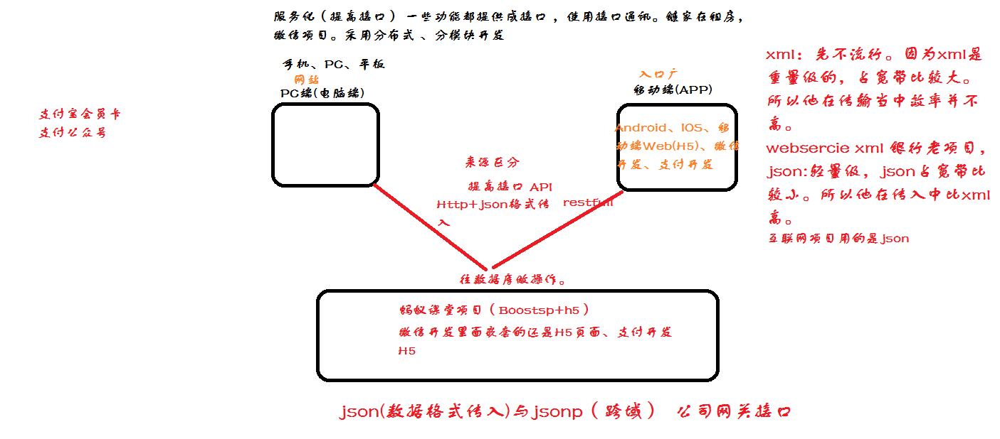

JSON解析框架有哪些？
--------------------

**fastjson(阿里)、gson(谷歌)、jackson(SpringMVC自带)**

XML解析方式？
-------------

**Dom4j、Sax、Pull**

Dom4j与Sax区别
--------------

dom4j不适合大文件的解析，因为它是一下子将文件加载到内存中，所以有可能出现内存溢出，sax是基于事件来对xml进行解析的，所以他可以解析大文件的xml，也正是因为如此，所以dom4j可以对xml进行灵活的增删改查和导航，而sax没有这么强的灵活性，所以sax经常是用来解析大型xml文件，而要对xml文件进行一些灵活（crud）操作就用dom4j。

XML与JSON区别
-------------

Xml是重量级数据交换格式，占宽带比较大。

JSON是轻量级交换格式，xml占宽带小。

所有很多互联网公司都会使用json作为数据交换格式

很多银行项目，大多数还是在使用xml。

面向对象
========

面向对象的三个特征
------------------

封装，继承，多态，这个应该是人人皆知，有时候也会加上抽象。

你对面向对象思想的理解？
------------------------

面向对象编程（Object-OrientedProgramming）简称OOP技术，是开发计算机应用程序的一种新方法、新思想。过去的面向过程编程中常常会导致所有的代码都包含在几个模块中，使程序难以阅读和维护，在做一些修改时常常牵一动百，使以后的开发和维护难以为继。而使用OOP技术，使用许多代码模块，每个模块都只提供特定的功能，它们是彼此独立的，可以增加代码重用的几率，更加有利于软件的开发、维护和升级。另外OOP的三大核心特性：继承、封装、多态的特性，使得在面对象编上能够设计出高内聚、低耦合的系统结构，使得系统更灵活、更容易扩展，而且成本较低，所以这一编程思想是目前一种应用最为普遍的软件设计思想。

接口的意义
----------

接口的意义用三个词就可以概括：规范，扩展，回调。

抽象类和接口有什么区别
----------------------

接口是公开的，里面不能有私有的方法或变量，是用于让别人使用的，而抽象类是可以有私有方法或私有变量的，

另外，实现接口的一定要实现接口里定义的所有方法，而实现抽象类可以有选择地重写需要用到的方法，一般的应用里，最顶级的是接口，然后是抽象类实现接口，最后才到具体类实现。

还有，接口可以实现多重继承，而一个类只能继承一个超类，但可以通过继承多个接口实现多重继承，接口还有标识（里面没有任何方法，如Remote接口）和数据共享（里面的变量全是常量）的作用。

抽象类的意义
------------

抽象类的意义可以用三句话来概括： 为其他子类提供一个公共的类型

封装子类中重复定义的内容

定义抽象方法,子类虽然有不同的实现，但是定义时一致的

面向对象特征
------------

封装，继承，多态和抽象

封装

封装给对象提供了隐藏内部特性和行为的能力。对象提供一些能被其他对象访问的方法来改变它内部的数据。在Java当中，有3种修饰符：public，private和protected。每一种修饰符给其他的位于同一个包或者不同包下面对象赋予了不同的访问权限。

下面列出了使用封装的一些好处：

-   通过隐藏对象的属性来保护对象内部的状态。

-   提高了代码的可用性和可维护性，因为对象的行为可以被单独的改变或者是扩展。

-   禁止对象之间的不良交互提高模块化

继承

继承给对象提供了从基类获取字段和方法的能力。继承提供了代码的重用行，也可以在不修改类的情况下给现存的类添加新特性。

多态

多态是编程语言给不同的底层数据类型做相同的接口展示的一种能力。一个多态类型上的操作可以应用到其他类型的值上面。

抽象

抽象是把想法从具体的实例中分离出来的步骤，因此，要根据他们的功能而不是实现细节来创建类。Java支持创建只暴漏接口而不包含方法实现的抽象的类。这种抽象技术的主要目的是把类的行为和实现细节分离开。

封装:★★★★★  
------------

**概念:是指隐藏对象的属性和实现细节，仅对外提供公共访问方式。 **

**好处：将变化隔离；便于使用；提高重用性；安全性。 **

**原则：将不需要对外提供的内容都隐藏起来，把属性都隐藏，提供公共方法对其访问。**

**继承 **★★★★★  

**好处：** 

1：提高了代码的复用性。 

2：让类与类之间产生了关系，提供了另一个特征多态的前提。  

注意： 

子类中所有的构造函数都会默认访问父类中的空参数的构造函数，因为每一个子类构造内第一行都有默认的语句super();  

如果父类中没有空参数的构造函数，那么子类的构造函数内，必须通过super语句指定要访问的父类中的构造函数。 

如果子类构造函数中用this来指定调用子类自己的构造函数，那么被调用的构造函数也一样会访问父类中的构造函数。 

final特点： 
------------

1：这个关键字是一个修饰符，可以修饰类，方法，变量。

2：被final修饰的类是一个最终类，不可以被继承。 

3：被final修饰的方法是一个最终方法，不可以被覆盖。

4：被final修饰的变量是一个常量，只能赋值一次。 

抽象类的特点： 
---------------

1：抽象方法只能定义在抽象类中，抽象类和抽象方法必须由abstract关键字修饰（可以描述类和方法，不可以描述变量）。 

2：抽象方法只定义方法声明，并不定义方法实现。 

3：抽象类不可以被创建对象(实例化)。 

4：只有通过子类继承抽象类并覆盖了抽象类中的所有抽象方法后，该子类才可以实例化。否则，该子类还是一个抽象类。 

5: 抽象类只能单继承。 

抽象类的细节： 
---------------

1：抽象类中是否有构造函数？有，用于给子类对象进行初始化。

2：抽象类中是否可以定义非抽象方法？ 

可以。其实，抽象类和一般类没有太大的区别，都是在描述事物，只不过抽象类在描述事物时，有些功能不具体。所以抽象类和一般类在定义上，都是需要定义属性和行为的。只不过，比一般类多了一个抽象函数。而且比一般类少了一个创建对象的部分。 

3：抽象关键字abstract和哪些不可以共存？final , private , static  

4：抽象类中可不可以不定义抽象方法？可以。抽象方法目的仅仅为了不让该类创建对象。

接 口：
-------

### ★★★★★   抽象类和接口的区别：

**1：抽象类只能被继承，而且只能单继承。 **

**接口需要被实现，而且可以多实现。  **

**2：抽象类中可以定义非抽象方法，子类可以直接继承使用。 **

**接口中都有抽象方法，需要子类去实现。**

**3：抽象类使用的是  is a 关系。 **

**接口使用的 like a 关系。 **

**4：抽象类的成员修饰符可以自定义。 **

**接口中的成员修饰符是固定的。全都是public的。    **

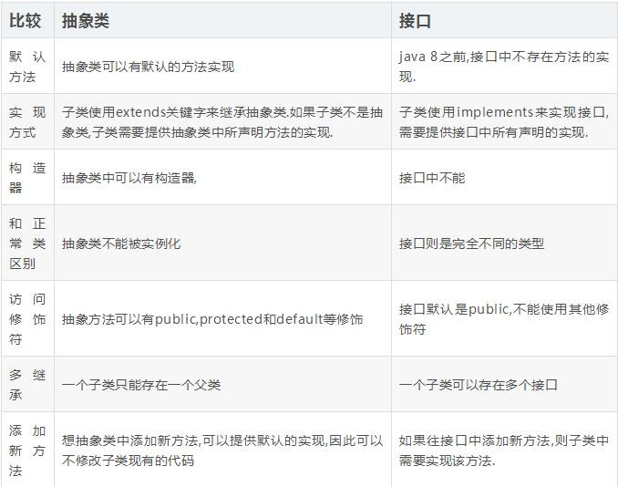

多态
----

多 态★★★★★

**函数本身就具备多态性，某一种事物有不同的具体的体现。** 

### 体现：

父类引用或者接口的引用指向了自己的子类对象。//Animal a = new Cat(); 

### 多态的好处：

提高了程序的扩展性。 灵活性 简化性

允许不同类对象对同一消息做出响应 ，即同一消 息可以根据发送对象的不同而采用多
种不同的行为方式(发送消息就是函数调用)。主要有以下优点：

可替换性：多态对已存在代码具有可替换性

可扩充性：增加新的子类不影响已经存在的类结构

接口性： 多态是超类通过方法签名,向子类提供一个公共接口,由子类来完善或者重写
它来实现的。

### 多态的弊端：

当父类引用指向子类对象时，虽然提高了扩展性，但是只能访问父类中具备的方法，不可以访问子类中特有的方法。(前期不能使用后期产生的功能，即访问的局限性) 

### 多态的前提： 

1：必须要有关系，比如继承、或者实现。

2：通常会有覆盖操作。 重写 

### 代码中如何实现多态

### 实现多态主要有以下三种方式：

1. 接口实现

2. 继承父类重写方法

3. 同一类中进行方法重载

### 虚拟机是如何实现多态的

动态绑定技术(dynamic
binding)，执行期间判断所引用对象的实际类型，根据实际类型调用对应的方法。

匿名内部类
----------

没有名字的内部类。就是内部类的简化形式。一般只用一次就可以用

这种形式。匿名内部类其实就是一个匿名子类对象。想要定义匿名内部类：需要前提，内部类必须继承一个类或者实现接口。 

**匿名内部类的格式：**new 父类名&接口名(){ 定义子类成员或者覆盖父类方法 }.方法。

**匿名内部类的使用场景：** 

当函数的参数是接口类型引用时，如果接口中的方法不超过3个。可以通过匿名内部类来完成参数的传递。 

其实就是在创建匿名内部类时，该类中的封装的方法不要过多，最好两个或者两个以内。  

重载和重写的区别
----------------

override（重写）

>   1.方法名、参数、返回值相同。

>   2.子类方法不能缩小父类方法的访问权限。

>   3.子类方法不能抛出比父类方法更多的异常(但子类方法可以不抛出异常)。

>   4.存在于父类和子类之间。

>   5.方法被定义为final不能被重写。

overload（重载）

>   1.参数类型、个数、顺序至少有一个不相同。

>   2.不能重载只有返回值不同的方法名。

>   3.存在于父类和子类、同类中。

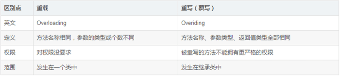

泛型
----

**泛型：**jdk1.5版本以后出现的一个安全机制。表现格式：\< \> 

**好处：** 

1：将运行时期的问题ClassCastException问题转换成了编译失败，体现在编译时期，程序员就可以解决问题。 

2：避免了强制转换的麻烦。 

只要带有\<\>的类或者接口，都属于带有类型参数的类或者接口，在使用这些类或者接口时，必须给\<\>中传递一个具体的引用数据类型。 

**泛型技术：**其实应用在编译时期，是给编译器使用的技术，到了运行时期，泛型就不存在了。 为什么? 因为

**泛型的擦除：**也就是说，编辑器检查了泛型的类型正确后，在生成的类文件中是没有泛型的。 

**在运行时，如何知道获取的元素类型而不用强转呢？ **

**泛型的补偿：**因为存储的时候，类型已经确定了是同一个类型的元素，所以在运行时，只要获取到该元素的类型，在内部进行一次转换即可，所以使用者不用再做转换动作了。 什么时候用泛型类呢？ 

当类中的操作的引用数据类型不确定的时候，以前用的Object来进行扩展的，现在可以用泛型来表示。这样可以避免强转的麻烦，而且将运行问题转移到的编译时期。

\----------------------------------------------------------

**泛型在程序定义上的体现： **

**//泛型类：将泛型定义在类上。 **

>   **class Tool\<Q\> { **

>   **private Q obj; **

>   **public  void setObject(Q obj) { **

>   **this.obj = obj; } **

>   **public Q getObject() { r**

>   **eturn obj; **

>   **} **

>   **} **

**//当方法操作的引用数据类型不确定的时候，可以将泛型定义在方法上。**

**public \<W\> void method(W w) { **

**System.out.println("method:"+w); **

**}**

**//静态方法上的泛型：静态方法无法访问类上定义的泛型。如果静态方法操作的引用数据类型不确定的时候，必须要将泛型定义在方法上。**

**public static \<Q\> void function(Q t) { **

**System.out.println("function:"+t); **

**} **

**//泛型接口. **

**interface Inter\<T\> { void show(T t); } **

**class InterImpl\<R\> implements Inter\<R\> { **

**public void show(R r) { **

**System.out.println("show:"+r); **

**}**

**} **

**------------------------------------------------------------ **

**泛型中的通配符：**可以解决当具体类型不确定的时候，这个通配符就是 ?  ；当操作类型时，不需要使用类型的具体功能时，只使用Object类中的功能。那么可以用 ? 通配符来表未知类型。 

**泛型限定：** 

**上限：**？extends E：可以接收E类型或者E的子类型对象。 

**下限：**？super E：可以接收E类型或者E的父类型对象。 

**上限什么时候用：**往集合中添加元素时，既可以添加E类型对象，又可以添加E的子类型对象。为什么？因为取的时候，E类型既可以接收E类对象，又可以接收E的子类型对象。 

**下限什么时候用：**当从集合中获取元素进行操作的时候，可以用当前元素的类型接收，也可以用当前元素的父类型接收。

### 泛型的细节：

1）、泛型到底代表什么类型取决于调用者传入的类型，如果没传，默认是Object类型； 

1.  、使用带泛型的类创建对象时，等式两边指定的泛型必须一致； 原因：编译器检查对象调用方法时只看变量，然而程序运行期间调用方法时就要考虑对象具体类型了；

2.  3）、等式两边可以在任意一边使用泛型，在另一边不使用(考虑向后兼容)；

ArrayList\<String\> al = new ArrayList\<Object\>(); ** //错 **

**//要保证左右两边的泛型具体类型一致就可以了，这样不容易出错。** 

ArrayList\<? extends Object\> al = new ArrayList\<String\>(); al.add("aa");  **//错 **

//因为集合具体对象中既可存储String，也可以存储Object的其他子类，所以添加具体的类型对象不合适，类型检查会出现安全问题。 ？extends Object 代表Object的子类型不确定，怎么能添加具体类型的对象呢？ 

public static void method(ArrayList\<? extends Object\> al) { 

al.add("abc");  **//错 **

**//只能对al集合中的元素调用Object类中的方法，具体子类型的方法都不能用，因为子类型不确定。 } **

数据类型
========

int包装类型的范围
-----------------

哪些方法要注意界限问题
----------------------

Integer哪些方法会缓存数据。
---------------------------

valueOf

java 中 int char,long 各占多少字节?
-----------------------------------

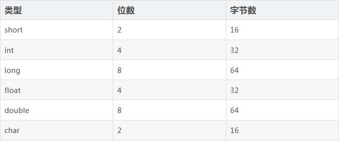

64 位的 JVM 当中,int 的长度是多少?
----------------------------------

Java 中，int 类型变量的长度是一个固定值，与平台无关，都是 32 位。意思就是说，在
32 位 和 64 位 的 Java 虚拟机中，int 类型的长度是相同的。

int 和 Integer 的区别
---------------------

Integer 是 int 的包装类型，在拆箱和装箱中，二者自动转换。int
是基本类型，直接存数值， 而 integer 是对象，用一个引用指向这个对象。

int 和 Integer 谁占用的内存更多?
--------------------------------

Integer 对象会占用更多的内存。Integer 是一个对象，需要存储对象的元数据。但是
一个原始类型的数据，所以占用的空间更少。

String, StringBuffer 和 StringBuilder 区别
------------------------------------------

String 是字符串常量，final 修饰：StringBuffer 字符串变量(线程安全)；
StringBuilder 字符串变量(线程不安全)。

String 和 StringBuffer
----------------------

String 和 StringBuffer 主要区别是性能：String 是不可变对象，每次对 String
类型进行操作都 等同于产生了一个新的 String 对象，然后指向新的 String
对象。所以尽量不在对 String 进行 大量的拼接操作，否则会产生很多临时对象，导致 GC
开始工作，影响系统性能。

StringBuffer
是对对象本身操作，而不是产生新的对象，因此在有大量拼接的情况下，我们 建议使用
StringBuffer。

但是需要注意现在 JVM 会对 String 拼接做一定的优化：

String s=“This is only

simple”+”test”会被虚拟机直接优化成 String s=“This

is only simple test”，此时就不存在拼接过程。

StringBuffer 和 StringBuilder

StringBuffer 是线程安全的可变字符串，其内部实现是可变数组。StringBuilder 是 jdk
1.5 新增 的，其功能和 StringBuffer
类似，但是非线程安全。因此，在没有多线程问题的前提下，使 用 StringBuilder
会取得更好的性能。

什么是编译器常量？使用它有什么风险？
------------------------------------

公共静态不可变（public static final ）变量也就是我们所说的编译期常量，这里的
public 可
选的。实际上这些变量在编译时会被替换掉，因为编译器知道这些变量的值，并且知道这些
变量在运行时不能改变。这种方式存在的一个问题是你使用了一个内部的或第三方库中的公
有编译时常量，但是这个值后面被其他人改变了，但是你的客户端仍然在使用老的值，甚至
你已经部署了一个新的 jar。为了避免这种情况，当你在更新依赖 JAR
文件时，确保重新编 译你的程序。

java 当中使用什么类型表示价格比较好?
------------------------------------

如果不是特别关心内存和性能的话，使用 BigDecimal，否则使用预定义精度的 double
类型。

如何将 byte 转为 String
-----------------------

可以使用 String 接收 byte[]
参数的构造器来进行转换，需要注意的点是要使用的正确的编
码，否则会使用平台默认编码，这个编码可能跟原来的编码相同，也可能不同。

可以将 int 强转为 byte 类型么?会产生什么问题?
---------------------------------------------

我们可以做强制转换，但是 Java 中 int 是 32 位的而 byte 是 8
位的，所以,如果强制转化 int 类型的高 24 位将会被丢弃，byte 类型的范围是从-128 到
128

String
======

数组有没有length()这个方法，String有没有length()这个方法。
----------------------------------------------------------

数组没有length()方法，但有length属性。

String有length()方法。

考查平时使用数组和字符串的一些细节，一般在使用

String s=new String(“xyz”)创建了几个对象
----------------------------------------

2个string对象,一个是=null的s，一个是=“xyz”的string

两个或一个”xyz”对应一个对象，这个对象放在字符串常量缓冲区，常量”xyz”不管出现多少遍，都是缓冲区中的那一个。NewString每写一遍，就创建一个新的对象，它一句那个常量”xyz”对象的内容来创建出一个新String对象。如果以前就用过’xyz’，这句代表就不会创建”xyz”自己了，直接从缓冲区拿。

String 和 StringBuffer、StringBuilder 的区别是什么？String 为什么是不可变的？
-----------------------------------------------------------------------------

可变性

简单的来说：String 类中使用 final 关键字字符数组保存字符串， private final char
value[] ，所以 String对象是不可变的。而StringBuilder 与 StringBuffer 都继承自
AbstractStringBuilder 类，在 AbstractStringBuilder中也是使用字符数组保存字符串
char[]value 但是没有用 final 关键字修饰，所以这两种对象都是可变的。

StringBuilder 与 StringBuffer 的构造方法都是调用父类构造方法也就是
AbstractStringBuilder 实现的，自行查阅源码。

AbstractStringBuilder.java

| abstract class AbstractStringBuilder implements Appendable, CharSequence { char[] value; int count; AbstractStringBuilder() { } AbstractStringBuilder(int capacity) { value = new char[capacity]; } |
|-----------------------------------------------------------------------------------------------------------------------------------------------------------------------------------------------------|

线程安全性

String 中的对象是不可变的，也就可以理解为常量，线程安全。AbstractStringBuilder
是 StringBuilder 与StringBuffer 的公共父类，定义了一些字符串的基本操作，如
expandCapacity、append、insert、indexOf 等公共方法。

StringBuffer 对方法加了同步锁或者对调用的方法加了同步锁，所以是线程安全的。

StringBuilder 并没有对方法进行加同步锁，所以是非线程安全的。

性能

每次对 String 类型进行改变的时候，都会生成一个新的 String
对象，然后将指针指向新的 String 对象。

StringBuffer 每次都会对 StringBuffer
对象本身进行操作，而不是生成新的对象并改变对象引用。相同情况下使用StirngBuilder
相比使用 StringBuffer 仅能获得 10%\~15%
左右的性能提升，但却要冒多线程不安全的风险。

对于三者使用的总结：

1. 操作少量的数据 = String

2. 单线程操作字符串缓冲区下操作大量数据 = StringBuilder

3. 多线程操作字符串缓冲区下操作大量数据 = StringBuffer

String和StringBuffer的区别（华为）
----------------------------------

JAVA平台提供了两个类：String和StringBuffer，它们可以储存和操作字符串，即包含多个字符的字符数据。

String类表示内容不可改变的字符串。

而StringBuffer类表示内容可以被修改的字符串。当你知道字符数据要改变的时候你就可以使用StringBuffer。典型地，你可以使用StringBuffers来动态构造字符数据。另外，String实现了equals方法，newString(“abc”).equals(newString(“abc”)的结果为true,而StringBuffer没有实现equals方法，所以，newStringBuffer(“abc”).equals(newStringBuffer(“abc”)的结果为false。

String覆盖了equals方法和hashCode方法，而StringBuffer没有覆盖equals方法和hashCode方法，所以，将StringBuffer对象存储进Java集合类中时会出现问题。

StringBuffer与StringBuilder的区别
---------------------------------

StringBuffer和StringBuilder类都表示内容可以被修改的字符串，StringBuilder是线程不安全的，运行效率高，如果一个字符串变量是在方法里面定义，这种情况只可能有一个线程访问它，不存在不安全的因素了，则用StringBuilder。如果要在类里面定义成员变量，并且这个类的实例对象会在多线程环境下使用，那么最好用StringBuffer。

String是最基本的数据类型吗?
---------------------------

基本数据类型包括byte、int、char、long、float、double、boolean和short。

所以String不属于基本数据类型范畴内，但String属于最常见一种引用类型。

Strings="Hello";s=s+"world!";这两行代码执行后，原始的String对象中的内容到底变了没有？
-------------------------------------------------------------------------------------

没有。因为String被设计成不可变(immutable)类，所以它的所有对象都是不可变对象。在这段代码中，s原先指向一个String对象，内容是"Hello"，然后我们对s进行了+操作，那么s所指向的那个对象是否发生了改变呢？答案是没有。这时，s不指向原来那个对象了，而指向了另一个String对象，内容为"Helloworld!"，原来那个对象还存在于内存之中，只是s这个引用变量不再指向它了。

通过上面的说明，我们很容易导出另一个结论，如果经常对字符串进行各种各样的修改，或者说，不可预见的修改，那么使用String来代表字符串的话会引起很大的内存开销。因为String对象建立之后不能再改变，所以对于每一个不同的字符串，都需要一个String对象来表示。这时，应该考虑使用StringBuffer类，它允许修改，而不是每个不同的字符串都要生成一个新的对象。并且，这两种类的对象转换十分容易。

同时，我们还可以知道，如果要使用内容相同的字符串，不必每次都new一个String。例如我们要在构造器中对一个名叫s的String引用变量进行初始化，把它设置为初始值，应当这样做：

publicclassDemo{

privateStrings;

...

publicDemo{

s="InitialValue";

}

...

}

而非

s=newString("InitialValue");

后者每次都会调用构造器，生成新对象，性能低下且内存开销大，并且没有意义，因为String对象不可改变，所以对于内容相同的字符串，只要一个String对象来表示就可以了。也就说，多次调用上面的构造器创建多个对象，他们的String类型属性s都指向同一个对象。

上面的结论还基于这样一个事实：对于字符串常量，如果内容相同，Java认为它们代表同一个String对象。而用关键字new调用构造器，总是会创建一个新的对象，无论内容是否相同。

至于为什么要把String类设计成不可变类，是它的用途决定的。其实不只String，很多Java标准类库中的类都是不可变的。在开发一个系统的时候，我们有时候也需要设计不可变类，来传递一组相关的值，这也是面向对象思想的体现。不可变类有一些优点，比如因为它的对象是只读的，所以多线程并发访问也不会有任何问题。当然也有一些缺点，比如每个不同的状态都要一个对象来代表，可能会造成性能上的问题。所以Java标准类库还提供了一个可变版本，即StringBuffer。

数组集合
========

简述集合框架。
--------------

集合

单列集合java.util.Collection存储一系列符合某种规则的元素

>   List元素有序、元素可重复。

>   java.util.ArrayList

>   java.util.LinkedList，

>   Set元素无序，而且不可重复。

>   java.util.HashSet

>   java.util.TreeSet。

双列集合java.util.Map。

集合框架底层数据结构总结
------------------------

2:Set集合(理解)

(1)Set集合的特点

无序,唯一

(2)HashSet集合(掌握)

A:底层数据结构是哈希表(是一个元素为链表的数组)

B:哈希表底层依赖两个方法：hashCode()和equals()

执行顺序：

首先比较哈希值是否相同

相同：继续执行equals()方法

返回true：元素重复了，不添加

返回false：直接把元素添加到集合

不同：就直接把元素添加到集合

C:如何保证元素唯一性的呢?

由hashCode()和equals()保证的

D:开发的时候，代码非常的简单，自动生成即可。

E:HashSet存储字符串并遍历

F:HashSet存储自定义对象并遍历(对象的成员变量值相同即为同一个元素)

(3)TreeSet集合

A:底层数据结构是红黑树(是一个自平衡的二叉树)

B:保证元素的排序方式

a:自然排序(元素具备比较性)

让元素所属的类实现Comparable接口

b:比较器排序(集合具备比较性)

让集合构造方法接收Comparator的实现类对象

C:把我们讲过的代码看一遍即可

(4)案例：

A:获取无重复的随机数

B:键盘录入学生按照总分从高到底输出

3:Collection集合总结(掌握)

Collection

\|--List 有序,可重复

>   \|--ArrayList

>   底层数据结构是数组，查询快，增删慢。

>   线程不安全，效率高

>   \|--Vector

>   底层数据结构是数组，查询快，增删慢。

>   线程安全，效率低

>   \|--LinkedList

>   底层数据结构是链表，查询慢，增删快。

>   线程不安全，效率高

\|--Set 无序,唯一

>   \|--HashSet

>   底层数据结构是哈希表。

>   如何保证元素唯一性的呢?

>   依赖两个方法：hashCode()和equals()

>   开发中自动生成这两个方法即可

>   \|--LinkedHashSet

>   底层数据结构是链表和哈希表

>   由链表保证元素有序

>   由哈希表保证元素唯一

>   \|--TreeSet

>   底层数据结构是红黑树。

>   如何保证元素排序的呢?

>   自然排序

>   比较器排序

>   如何保证元素唯一性的呢?

>   根据比较的返回值是否是0来决定

4:针对Collection集合我们到底使用谁呢?(掌握)

>   唯一吗?

>   是：Set

>   排序吗?

>   是：TreeSet

>   否：HashSet

>   如果你知道是Set，但是不知道是哪个Set，就用HashSet。

>   否：List

>   要安全吗?

>   是：Vector

>   否：ArrayList或者LinkedList

>   查询多：ArrayList

>   增删多：LinkedList

>   如果你知道是List，但是不知道是哪个List，就用ArrayList。

>   如果你知道是Collection集合，但是不知道使用谁，就用ArrayList。

>   如果你知道用集合，就用ArrayList。

5:在集合中常见的数据结构(掌握)

ArrayXxx:底层数据结构是数组，查询快，增删慢

LinkedXxx:底层数据结构是链表，查询慢，增删快

HashXxx:底层数据结构是哈希表。依赖两个方法：hashCode()和equals()

TreeXxx:底层数据结构是二叉树。两种方式排序：自然排序和比较器排序

### Collection

1. List

Arraylist： Object数组

Vector： Object数组

LinkedList： 双向链表(JDK1.6之前为循环链表，JDK1.7取消了循环)
详细可阅读JDK1.7-LinkedList循环链表优化

2. Set

HashSet（无序，唯一）: 基于 HashMap 实现的，底层采用 HashMap 来保存元素

LinkedHashSet： LinkedHashSet 继承与 HashSet，并且其内部是通过LinkedHashMap
来实现的。有点类似于我们之前说的LinkedHashMap 其内部是基于 Hashmap
实现一样，不过还是有一点点区别的。

TreeSet（有序，唯一）： 红黑树(自平衡的排序二叉树。)

### Map

HashMap：
JDK1.8之前HashMap由数组+链表组成的，数组是HashMap的主体，链表则是主要为了解决哈希冲突而存在的（“拉链法”解决冲突）.JDK1.8以后在解决哈希冲突时有了较大的变化，当链表长度大于阈值（默认为8）时，将链表转化为红黑树，以减少搜索时间

LinkedHashMap: LinkedHashMap 继承自
HashMap，所以它的底层仍然是基于拉链式散列结构即由数组和链表或红黑树组成。另外，LinkedHashMap
在上面结构的基础上，增加了一条双向链表，使得上面的结构可以保持键值对的插入顺序。同时通过对链表进行相应的操作，实现了访问顺序相关逻辑。详细可以查看：

[《LinkedHashMap 源码详细分析（JDK1.8）》](https://www.imooc.com/article/22931)

HashTable: 数组+链表组成的，数组是 HashMap
的主体，链表则是主要为了解决哈希冲突而存在的TreeMap:
红黑树（自平衡的排序二叉树）

集合和数组的区别：
------------------

1：数组是固定长度的；集合可变长度的。

2：数组可以存储基本数据类型，也可以存储引用数据类型；集合只能存储引用数据类型。

3：数组存储的元素必须是同一个数据类型；集合存储的对象可以是不同数据类型。

List和Map区别【软通动力】
-------------------------

一个是存储单列数据的集合，另一个是存储键和值这样的双列数据的集合，List中存储的数据是有顺序，并且允许重复；Map中存储的数据是没有顺序的，其键是不能重复的，它的值是可以有重复的。

List是对象集合，允许对象重复。

Map是键值对的集合，不允许key重复。

List和Set区别
-------------

List,Set都是继承自Collection接口

List特点：元素有放入顺序，元素可重复

Set特点：元素无放入顺序，元素不可重复，重复元素会覆盖掉

（注意：元素虽然无放入顺序，但是元素在set中的位置是有该元素的HashCode决定的，其位置其实是固定的，加入Set的Object必须定义equals()方法，另外list支持for循环，也就是通过下标来遍历，也可以用迭代器，但是set只能用迭代，因为他无序，无法用下标来取得想要的值。）

Set和List对比：

Set：检索元素效率低下，删除和插入效率高，插入和删除不会引起元素位置改变。

List：和数组类似，List可以动态增长，查找元素效率高，插入删除元素效率低，因为会引起其他元素位置改变。

List、Map、Set三个接口，存取元素时，各有什么特点？
--------------------------------------------------

首先，List与Set具有相似性，它们都是单列元素的集合，所以，它们有一个功共同的父接口Collection接口。Set里面不允许有重复的元素，即不能有两个相等的对象。

List表示有先后顺序的集合，当我们多次调用add(Obje)方法时，每次加入的对象就像火车站买票有排队顺序一样，按先来后到的顺序排序。

Map与List和Set不同，它是双列的集合每次存储时，要存储一对key/value，不能存储重复的key，这个重复的规则也是按equals比较相等。取则可以根据key获得相应的value，即get(Objectkey)返回值为key所对应的value。另外，也可以获得所有的key的结合。

总结：List以特定次序来持有元素，可有重复元素。Set无法拥有重复元素,内部排序。Map保存key-value值，value可多值。上面是大致不同，另外上述3个只是接口，而具体实现类中，用法大同小异，只是实现的数据结构不同，例如List接口下的LinkedList主要实现了双链表的存储特点，Vector是线程安全的集合类。

List、Set、Map是否继承自Collection接口?
---------------------------------------

List、Set是，Map不是；Map接口定义的是Key-Value存储的特性，与List和Set不同，Map在存储对象时，先要定义这个对象的key的值，再存入与这个key相对应的Object，Map集合的取值时根据存入的key（关键字）来获取与这个关键字对应的对象。

Set里的元素是不能重复的，那么用什么方法来区分重复与否呢?是用==还是equals()?它们有何区别?
----------------------------------------------------------------------------------------

Set里的元素是不能重复的，元素重复与否是使用equals()方法进行判断的。

说出ArrayList,Vector,LinkedList的存储性能和特性。【大唐动力面试题】
-------------------------------------------------------------------

ArrayList和Vector都是使用数组方式存储数据，此数组元素数大于实际存储的数据以便增加和插入元素，它们都允许直接按序号索引元素，但是插入元素要涉及数组元素移动等内存操作，所以索引数据快而插入数据慢，Vector由于使用了synchronized方法（线程安全），通常性能上较ArrayList差，而LinkedList使用双向链表实现存储，按序号索引数据需要进行前向或后向遍历，但是插入数据时只需要记录本项的前后项即可，所以插入速度较快。

LinkedList也是线程不安全的，LinkedList提供了一些方法，使得LinkedList可以被当作堆栈和队列来使用。

如何去掉一个Vector集合中重复的元素
----------------------------------

VectornewVector=newVector();

for(inti=0;i\<vector.size();i++){

Objectobj=vector.get(i);

if(!newVector.contains(obj);

newVector.add(obj);

}

还有一种简单的方式，HashSetset=newHashSet(vector);

Arraylist与LinkedList区别
-------------------------

ArrayList是基于动态数组，LinkList是基于链表的数据结构，查询arraylist好，新增删除linklist好。

线程都不同步，也就是线程不安全。

Arraylist：

优点：ArrayList是实现了基于动态数组的数据结构,因为地址连续，一旦数据存储好了，查询操作效率会比较高（在内存里是连着放的）。

缺点：因为地址连续，ArrayList要移动数据,所以插入和删除操作效率比较低。

LinkedList：

优点：LinkedList基于链表的数据结构,地址是任意的，所以在开辟内存空间的时候不需要等一个连续的地址，对于新增和删除操作add和remove，LinedList比较占优势。LinkedList适用于要头尾操作或插入指定位置的场景

缺点：因为LinkedList要移动指针,所以查询操作性能比较低。

适用场景分析：

当需要对数据进行对此访问的情况下选用ArrayList，当需要对数据进行多次增加删除修改时采用LinkedList。

整理

1. 是否保证线程安全： ArrayList 和 LinkedList
都是不同步的，也就是不保证线程安全；

2. 底层数据结构： Arraylist 底层使用的是Object数组；LinkedList
底层使用的是双向链表数据结构（JDK1.6之前为循环链表，JDK1.7取消了循环。注意双向链表和双向循环链表的区别：）；
详细可阅读[JDK1.7-LinkedList循环链表优化](https://www.cnblogs.com/xingele0917/p/3696593.html)

3. 插入和删除是否受元素位置的影响：

① ArrayList 采用数组存储，所以插入和删除元素的时间复杂度受元素位置的影响。
比如：执行 add(E e) 方法的时候， ArrayList
会默认在将指定的元素追加到此列表的末尾，这种情况时间复杂度就是O(1)。但是如果要在指定位置
i 插入和删除元素的话（ add(int index, E element) ）时间复杂度就为
O(n-i)。因为在进行上述操作的时候集合中第 i 和第 i
个元素之后的(n-i)个元素都要执行向后位/向前移一位的操作。 ② LinkedList
采用链表存储，所以插入，删除元素时间复杂度不受元素位置的影响，都是近似
O（1）而数组为近似 O（n）。

4. 是否支持快速随机访问： LinkedList 不支持高效的随机元素访问，而 ArrayList
支持。快速随机访问就是通过元素的序号快速获取元素对象(对应于 get(int index)
方法)。

5. 内存空间占用： ArrayList的空
间浪费主要体现在在list列表的结尾会预留一定的容量空间，而LinkedList的空间花费则体现在它的每一个元素都需要消耗比ArrayList更多的空间（因为要存放直接后继和直接前驱以及数据）。
-\*\*

6. 发

补充内容:RandomAccess接口

public interface RandomAccess {

}

查看源码我们发现实际上 RandomAccess 接口中什么都没有定义。所以，在我看来
RandomAccess 接口不过是一个标识罢了。标识什么？
标识实现这个接口的类具有随机访问功能。

在binarySearch（）方法中，它要判断传入的list
是否RamdomAccess的实例，如果是，调用indexedBinarySearch（）方法，如果不是，那么调用iteratorBinarySearch（）方法

Scanner input = new Scanner(System.in);

String s  = input.nextLine();

input.close();

BufferedReader input = new BufferedReader(new InputStreamReader(System.in));

String s = input.readLine();

ArrayList 实现了 RandomAccess 接口， 而 LinkedList
没有实现。为什么呢？我觉得还是和底层数据结构有关！

ArrayList 底层是数组，而 LinkedList
底层是链表。数组天然支持随机访问，时间复杂度为
O（1），所以称为快速随机访问。链表需要遍历到特定位置才能访问特定位置的元素，时间复杂度为
O（n），所以不支持快速随机访问。，

ArrayList 实现了 RandomAccess 接口，就表明了他具有快速随机访问功能。
RandomAccess 接口只是标识，并不是说 ArrayList 实现 RandomAccess
接口才具有快速随机访问功能的！

下面再总结一下 list 的遍历方式选择：

实现了RandomAccess接口的list，优先选择普通for循环 ，其次foreach,

未实现RandomAccess接口的list，
优先选择iterator遍历（foreach遍历底层也是通过iterator实现的），大size的数据，千万不要使用普通for循环

补充：数据结构基础之双向链表

双向链表也叫双链表，是链表的一种，它的每个数据结点中都有两个指针，分别指向直接后继和直接前驱。所以，从双向链表中的任意一个结点开始，都可以很方便地访问它的前驱结点和后继结点。一般我们都构造双向循环链表，如下图所示，同时下图也是LinkedList
底层使用的是双向循环链表数据结构。

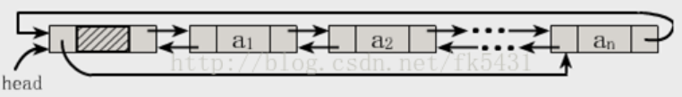

ArrayList和Vector的区别【博炎科技】
-----------------------------------

这两个类都实现了List接口（List接口继承了Collection接口），他们都是有序集合，即存储在这两个集合中的元素的位置都是有顺序的，相当于一种动态的数组，我们以后可以按位置索引号取出某个元素，并且其中的数据是允许重复的。并且都是以数组的方式存储数据的

接着说ArrayList与Vector的区别，这主要包括两个方面：

1、同步性：

Vector是线程安全的，也就是说是它的方法之间是线程同步的，而ArrayList是线程序不安全的，它的方法之间是线程不同步的。如果只有一个线程会访问到集合，那最好是使用ArrayList，因为它不考虑线程安全，效率会高些；如果有多个线程会访问到集合，那最好是使用Vector，因为不需要我们自己再去考虑和编写线程安全的代码。

备注：对于Vector&ArrayList、Hashtable&HashMap，要记住线程安全的问题，记住Vector与Hashtable是旧的，是java一诞生就提供了的，它们是线程安全的，ArrayList与HashMap是java2时才提供的，它们是线程不安全的。

2、数据增长：

ArrayList与Vector都有一个初始的容量大小，当存储进它们里面的元素的个数超过了容量时，就需要增加ArrayList与Vector的存储空间，每次要增加存储空间时，不是只增加一个存储单元，而是增加多个存储单元，每次增加的存储单元的个数在内存空间利用与程序效率之间要取得一定的平衡。Vector默认增长为原来两倍，而ArrayList的增长为原来的1.5倍。ArrayList与Vector都可以设置初始的空间大小，Vector还可以设置增长的空间大小，而ArrayList没有提供设置增长空间的方法。

publicArrayList(intinitialCapacity)//构造一个具有指定初始容量的空列表。

publicArrayList()//构造一个初始容量为10的空列表。

publicArrayList(Collection\<?extendsE\>c)//构造一个包含指定collection的元素的列表

Vector有四个构造方法：

publicVector()//使用指定的初始容量和等于零的容量增量构造一个空向量。

publicVector(intinitialCapacity)//构造一个空向量，使其内部数据数组的大小，其标准容量增量为零。

publicVector(Collection\<?extendsE\>c)//构造一个包含指定collection中的元素的向量

publicVector(intinitialCapacity,intcapacityIncrement)//使用指定的初始容量和容量增量构造一个空的向量

ArrayList和Vector都是用数组实现的，主要有这么三个区别：
-------------------------------------------------------

Vector是多线程安全的，线程安全就是说多线程访问同一代码，不会产生不确定的结果。而ArrayList不是，这个可以从源码中看出，Vector类中的方法很多有synchronized进行修饰，这样就导致了Vector在效率上无法与ArrayList相比；

两个都是采用的线性连续空间存储元素，但是当空间不足的时候，两个类的增加方式是不同。

Vector可以设置增长因子，而ArrayList不可以。

Vector是一种老的动态数组，是线程同步的，效率很低，一般不赞成使用。

适用场景分析：

Vector是线程同步的，所以它也是线程安全的，而ArrayList是线程异步的，是不安全的。如果不考虑到线程的安全因素，一般用ArrayList效率比较高。

如果集合中的元素的数目大于目前集合数组的长度时，在集合中使用数据量比较大的数据，用Vector有一定的优势。

HashMap的理解
-------------

链表+数组

外层是一个链表，而一个链表中又是一个数组，存储时先通过key获取hashcode并计算出value存储的链表位置，如果不存在hash碰撞则value存在该链表中数组的第一个位置，如果发生hash碰撞则存在在该链表的数组的最后一个位置。

HashMap是怎么实现key是唯一的
----------------------------

1 对于 HashMap HashSet 的实现是：

维护了一张 HashTable 。容器中的元素全部存储在Hashtable
中，每次添加元素都会先判断是否有重复的元素，hashcode()方法进行比较，若一样再equals()方法比较，他们的底层数据结构如果也相同的话，JVM就认为数据已经存在了，就不会添加数据！

2 对于 TreeMap TreeSet

他们底层是数据结构的实现是：维护了一棵二叉树。
容器中添加元素的时候，他们有是怎么判断是否有相同元素的？我们都直到 TreeMap
TreeSet 她们 都是 有序的存储数据。 为了维护 数据的唯一性。
再存入数据的时候，他们会调用元素中 实现的 Comparable 的 compareTo()
方法（代码1）。 或者 集合本身创建的时候 传入了 迭代器（代码2）.
具体的实现是：调用比较方法，返回-1 的时候，添加到左子树，返回1 的时候 添加到
右子树。返回0 有相同数据 不添加该元素！

Map和Set都是不重复的，对于带tree的还有顺序

HashMap的工作原理及代码实现
---------------------------

JDK1.8之前

JDK1.8 之前 HashMap 底层是 数组和链表 结合在一起使用也就是 链表散列。HashMap
通过 key 的 hashCode 经过扰动函数处理过后得到 hash 值，然后通过 (n - 1) & hash
判断当前元素存放的位置（这里的 n
指的是数组的长度），如果当前位置存在元素的话，就判断该元素与要存入的元素的 hash
值以及 key 是否相同，如果相同的话，直接覆盖，不相同就通过拉链法解决冲突。

所谓扰动函数指的就是 HashMap 的 hash 方法。使用 hash
方法也就是扰动函数是为了防止一些实现比较差的hashCode() 方法
换句话说使用扰动函数之后可以减少碰撞。

JDK 1.8 HashMap 的 hash 方法源码:

JDK 1.8 的 hash方法 相比于 JDK 1.7 hash 方法更加简化，但是原理不变。

static final int hash(Object key) {

   int h;

   // key.hashCode()：返回散列值也就是hashcode

   // \^ ：按位异或

   // \>\>\>:无符号右移，忽略符号位，空位都以0补齐

   return (key == null) ? 0 : (h = key.hashCode()) \^ (h \>\>\> 16);

}

对比一下 JDK1.7的 HashMap 的 hash 方法源码.

static int hash(int h) {

 // This function ensures that hashCodes that differ only by

 // constant multiples at each bit position have a bounded

 // number of collisions (approximately 8 at default load factor).

 h \^= (h \>\>\> 20) \^ (h \>\>\> 12);

 return h \^ (h \>\>\> 7) \^ (h \>\>\> 4);

}

相比于 JDK1.8 的 hash 方法 ，JDK 1.7 的 hash
方法的性能会稍差一点点，因为毕竟扰动了 4 次。

所谓 “拉链法”
就是：将链表和数组相结合。也就是说创建一个链表数组，数组中每一格就是一个链表。若遇到哈希冲突，则将冲突的值加到链表中即可。

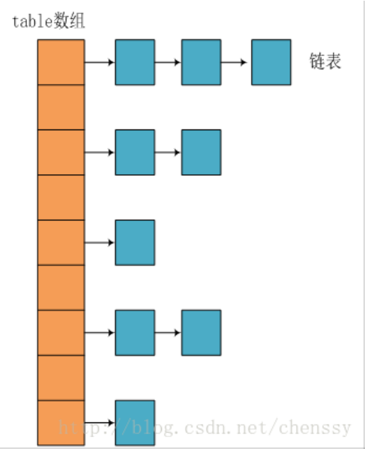

JDK1.8之后

相比于之前的版本，
JDK1.8之后在解决哈希冲突时有了较大的变化，当链表长度大于阈值（默认为8）时，将链表转化为红黑树，以减少搜索时间。

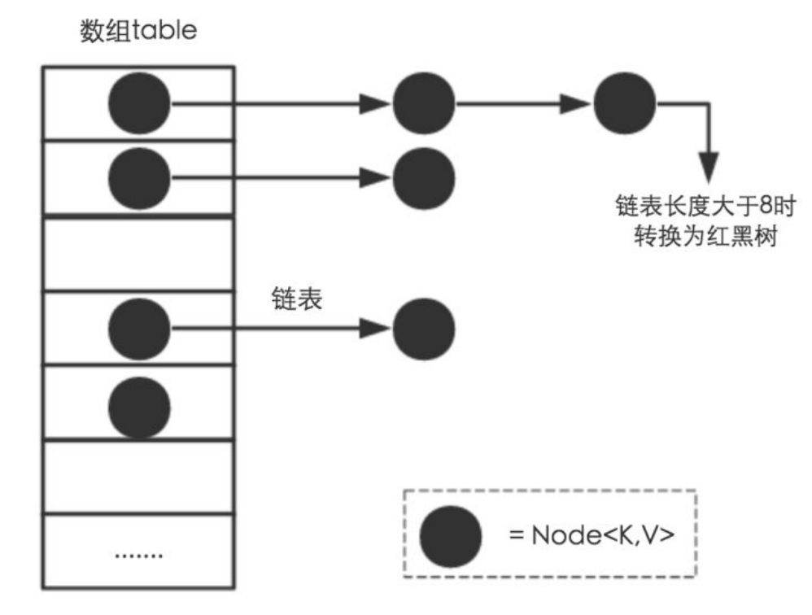

TreeMap、TreeSet以及JDK1.8之后的HashMap底层都用到了红黑树。红黑树就是为了解决二叉查找树的缺陷，因为二叉查找树在某些情况下会退化成一个线性结构。

推荐阅读：

《Java 8系列之重新认识HashMap》 ：<https://zhuanlan.zhihu.com/p/21673805>

HashMap和Hashtable的区别
------------------------

HashMap是Hashtable的轻量级实现（非线程安全的实现），他们都实现Map接口，主要区别在于HashMap允许空（null）键值（key）,由于非线程安全，在只有一个线程访问的情况下，效率要高于Hashtable。

HashMap允许将null作为一个entry的key或者value，而Hashtable不允许。

HashMap把Hashtable的contains方法去掉了，改成containsvalue和containsKey。因为contains方法容易让人引起误解。

Hashtable继承自Dictionary类，而HashMap是Java1.2引进的Mapinterface的一个实现。

最大的不同是，Hashtable的方法是synchronized的，而HashMap不是，在多个线程访问Hashtable时，不需要自己为它的方法实现同步，而HashMap就必须为之提供外同步。

Hashtable和HashMap采用的hash/rehash算法都大概一样，所以性能不会有很大的差异。

1. 线程是否安全： HashMap 是非线程安全的，HashTable 是线程安全的；HashTable
内部的方法基本都经过synchronized
修饰。（如果你要保证线程安全的话就使用ConcurrentHashMap吧！）；

2.效率： 因为线程安全的问题，HashMap 要比 HashTable 效率高一点。另外，HashTable
基本被淘汰，不要在代码中使用它；

3. 对Null key 和Null value的支持： HashMap 中，null
可以作为键，这样的键只有一个，可以有一个或多个键所对应的值为 null。。但是在
HashTable 中 put 进的键值只要有一个 null，直接抛出 NulPointerException。

4. 初始容量大小和每次扩充容量大小的不同 ：
①创建时如果不指定容量初始值，Hashtable
默认的初始大小为11，之后每次扩充，容量变为原来的2n+1。HashMap
默认的初始化大小为16。之后每次扩充，容量变为原来的2倍。②创建时如果给定了容量初始值，那么
Hashtable 会直接使用你给定的大小，而 HashMap 会将其扩充为2的幂次方大小（HashMap
中的 tableSizeFor() 方法保证，下面给出了源代码）。也就是说 HashMap
总是使用2的幂作为哈希表的大小,后面会介绍到为什么是2的幂次方。

5. 底层数据结构： JDK1.8 以后的 HashMap
在解决哈希冲突时有了较大的变化，当链表长度大于阈值（默认为8）时，将链表转化为红黑树，以减少搜索时间。Hashtable
没有这样的机制。

HasMap 中带有初始容量的构造函数：

public HashMap(int initialCapacity, float loadFactor) {

   if (initialCapacity \< 0)

     throw new IllegalArgumentException("Illegal initial capacity: " +

                      initialCapacity);

   if (initialCapacity \> MAXIMUM_CAPACITY)

     initialCapacity = MAXIMUM_CAPACITY;

   if (loadFactor \<= 0 \|\| Float.isNaN(loadFactor))

     throw new IllegalArgumentException("Illegal load factor: " + loadFactor);

   this.loadFactor = loadFactor;

   this.threshold = tableSizeFor(initialCapacity);

}

 public HashMap(int initialCapacity) {

   this(initialCapacity, DEFAULT_LOAD_FACTOR);

}

下面这个方法保证了 HashMap 总是使用2的幂作为哈希表的大小。

/\*\*

 \* Returns a power of two size for the given target capacity.

 \*/

 static final int tableSizeFor(int cap) {

   int n = cap - 1;

   n \|= n \>\>\> 1;

   n \|= n \>\>\> 2;

   n \|= n \>\>\> 4;

   n \|= n \>\>\> 8;

   n \|= n \>\>\> 16;

   return (n \< 0) ? 1 : (n \>= MAXIMUM_CAPACITY) ? MAXIMUM_CAPACITY : n + 1;

}

参考：[http://blog.csdn.net/qq_22118507/article/details/51576319](https://link.jianshu.com/?t=http%3A%2F%2Fblog.csdn.net%2Fqq_22118507%2Farticle%2Fdetails%2F51576319)

HashSet和HashMap区别
--------------------

HashSet 底层就是基于 HashMap 实现的。（HashSet 的源码非常非常少，因为除了
clone() 方法、writeObject()方法、readObject()方法是 HashSet
自己不得不实现之外，其他方法都是直接调用 HashMap 中的方法。）

set是线性结构，set中的值不能重复，hashset是set的hash实现，hashset中值不能重复是用hashmap的key来实现的。

map是键值对映射，可以空键空值。HashMap是Map接口的hash实现，key的唯一性是通过key值hash值的唯一来确定，value值是则是链表结构。

他们的共同点都是hash算法实现的唯一性，他们都不能持有基本类型，只能持有对象

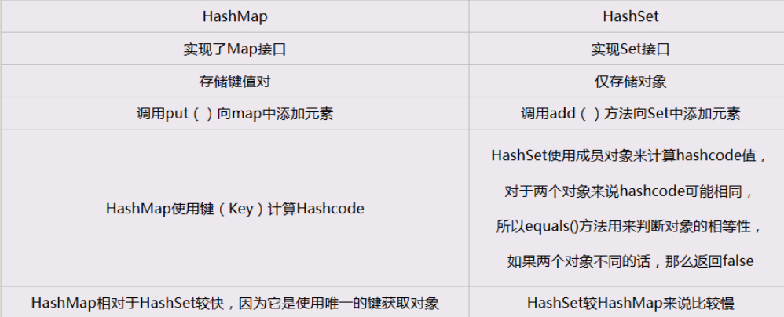

HashMap 的长度为什么是2的幂次方
-------------------------------

为了能让 HashMap
存取高效，尽量较少碰撞，也就是要尽量把数据分配均匀。我们上面也讲到了过了，Hash
值的范围值-2147483648到2147483647，前后加起来大概40亿的映射空间，只要哈希函数映射得比较均匀松散，一般应用是很难出现碰撞的。但问题是一个40亿长度的数组，内存是放不下的。所以这个散列值是不能直接拿来用的。用之前还要先做对数组的长度取模运算，得到的余数才能用来要存放的位置也就是对应的数组下标。这个数组下标的计算方法是“
(n - 1) & hash ”。（n代表数组长度）。这也就解释了 HashMap
的长度为什么是2的幂次方。

这个算法应该如何设计呢？

我们首先可能会想到采用%取余的操作来实现。但是，重点来了：“取余(%)操作中如果除数是2的幂次则等价于与其除数减一的与(&)操作（也就是说
hash%length==hash&(length-1)的前提是 length 是2的 n 次方；）。” 并且
采用二进制位操作 &，相对于%能够提高运算效率，这就解释了 HashMap
的长度为什么是2的幂次方。

HashMap和ConcurrentHashMap的区别
--------------------------------

ConcurrentHashMap是线程安全的HashMap的实现。

（1）ConcurrentHashMap对整个桶数组进行了分割分段(Segment)，然后在每一个分段上都用lock锁进行保护，相对于HashTable的syn关键字锁的粒度更精细了一些，并发性能更好，而HashMap没有锁机制，不是线程安全的。

（2）HashMap的键值对允许有null，但是ConCurrentHashMap都不允许。

HashMap 多线程操作导致死循环问题
--------------------------------

在多线程下，进行 put 操作会导致 HashMap 死循环，原因在于 HashMap 的扩容
resize()方法。由于扩容是新建一个数组，复制原数据到数组。由于数组下标挂有链表，所以需要复制链表，但是多线程操作有可能导致环形链表。复制链表过程如下:

以下模拟2个线程同时扩容。假设，当前 HashMap 的空间为2（临界值为1），hashcode
分别为 0 和 1，在散列地址 0 处有元素 A 和 B，这时候要添加元素 C，C 经过 hash
运算，得到散列地址为 1，这时候由于超过了临界值，空间不够，需要调用 resize
方法进行扩容，那么在多线程条件下，会出现条件竞争，模拟过程如下：

线程一：读取到当前的 HashMap 情况，在准备扩容时，线程二介入

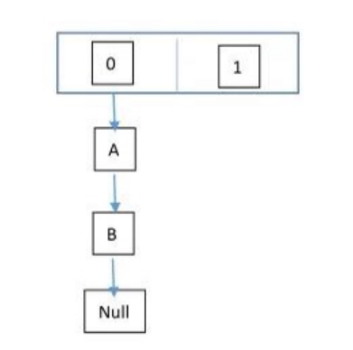

线程二：读取 HashMap，进行扩容

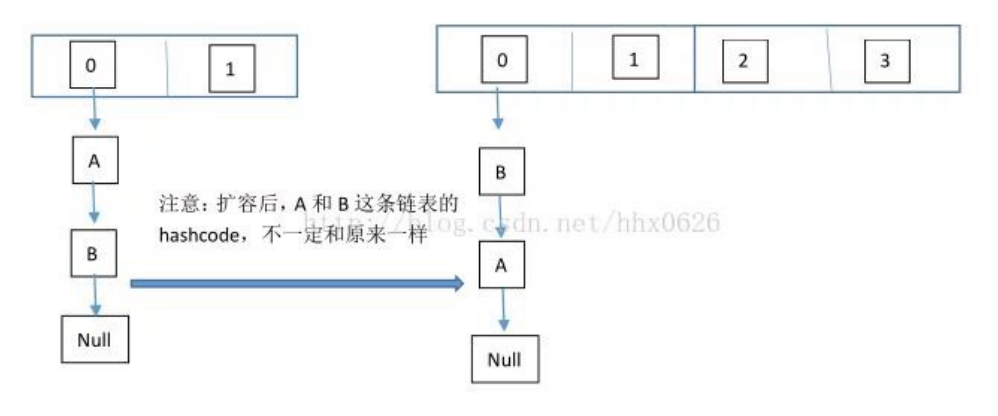

线程一：继续执行

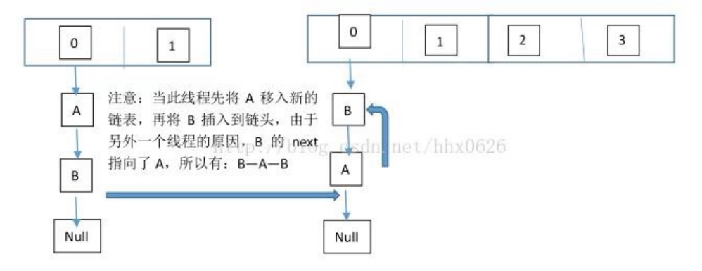

这个过程为，先将 A 复制到新的 hash 表中，然后接着复制 B 到链头（A
的前边：B.next=A），本来
B.next=null，到此也就结束了（跟线程二一样的过程），但是，由于线程二扩容的原因，将
B.next=A，所以，这里继续复制A，让A.next=B，由此，环形链表出现：B.next=A;
A.next=B

注意：jdk1.8已经解决了死循环的问题。

ConcurrentHashMap原理（中高级）
-------------------------------

分段

ConcurrentHashMap 和 Hashtable 的区别
-------------------------------------

当HashTable增加到一定数量时性能会急剧降低，因为迭代时会锁很长时间。

而ConcurrentHashMap使用了分割，无论数量多大，都只需要锁map的某一个部分。

ConcurrentHashMap 和 Hashtable 的区别主要体现在实现线程安全的方式上不同。

底层数据结构： JDK1.7的 ConcurrentHashMap 底层采用 分段的数组+链表 实现，JDK1.8
采用的数据结构跟HashMap1.8的结构一样，数组+链表/红黑二叉树。Hashtable 和 JDK1.8
之前的 HashMap 的底层数据结构类似都是采用 数组+链表 的形式，数组是 HashMap
的主体，链表则是主要为了解决哈希冲突而存在的；

实现线程安全的方式（重要）： ① 在JDK1.7的时候，ConcurrentHashMap（分段锁）
对整个桶数组进行了分割分段(Segment)，每一把锁只锁容器其中一部分数据，多线程访问容器里不同数据段的数据，就不会存在锁竞争，提高并发访问率。
到了 JDK1.8 的时候已经摒弃了Segment的概念，而是直接用 Node
数组+链表+红黑树的数据结构来实现，并发控制使用 synchronized 和 CAS
来操作。（JDK1.6以后 对 synchronized锁做了很多优化）
整个看起来就像是优化过且线程安全的 HashMap，虽然在JDK1.8中还能看到 Segment
的数据结构，但是已经简化了属性，只是为了兼容旧版本；② Hashtable(同一把锁) :使用
synchronized
来保证线程安全，效率非常低下。当一个线程访问同步方法时，其他线程也访问同步方法，可能会进入阻塞或轮询状态，如使用put
添加元素，另一个线程不能使用 put 添加元素，也不能使用
get，竞争会越来越激烈效率越低。

两者的对比图：

图片来源：http://www.cnblogs.com/chengxiao/p/6842045.html

HashTable:

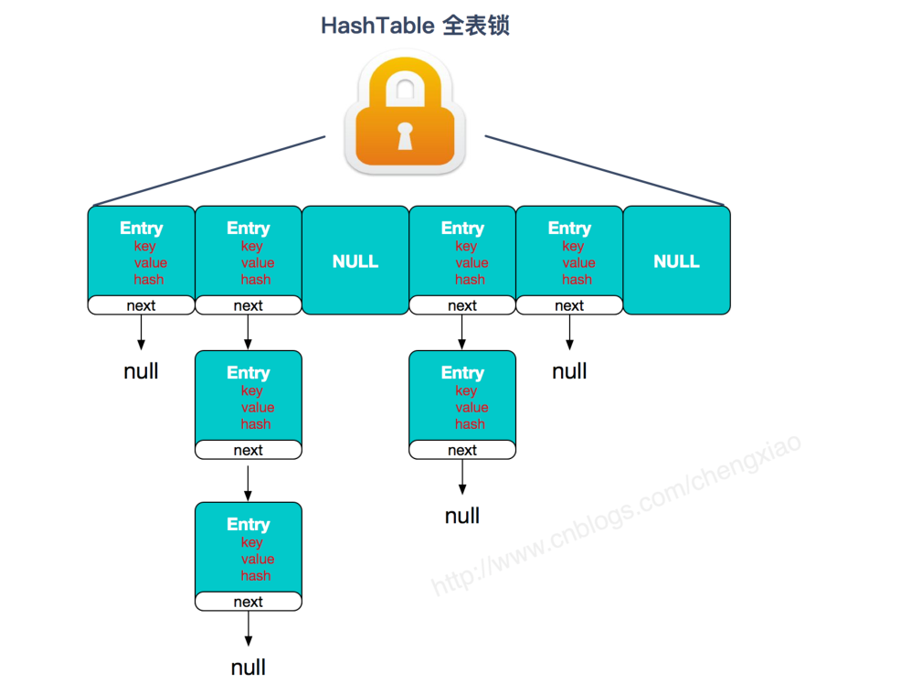

JDK1.7的ConcurrentHashMap：

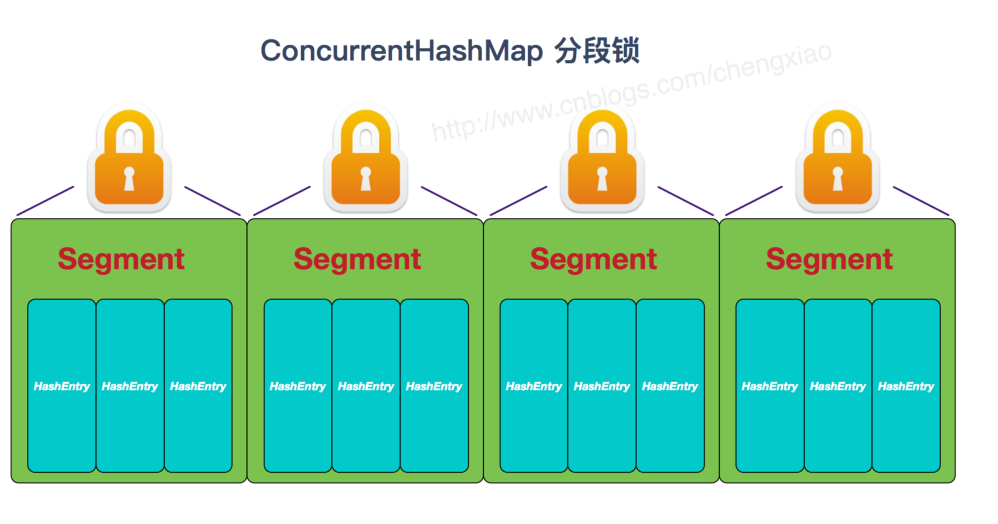

JDK1.8的ConcurrentHashMap（TreeBin: 红黑二叉树节点 Node: 链表节点）：

ConcurrentHashMap的工作原理及代码实现
-------------------------------------

JDK1.7（上面有示意图）

首先将数据分为一段一段的存储，然后给每一段数据配一把锁，当一个线程占用锁访问其中一个段数据时，其他段的数据也能被其他线程访问。

ConcurrentHashMap 是由 Segment 数组结构和 HashEntry 数组结构组成。

Segment 实现了 ReentrantLock,所以 Segment
是一种可重入锁，扮演锁的角色。HashEntry 用于存储键值对数据。

static class Segment\<K,V\> extends ReentrantLock implements Serializable {

}

一个 ConcurrentHashMap 里包含一个 Segment 数组。Segment
的结构和HashMap类似，是一种数组和链表结构，一个 Segment 包含一个 HashEntry
数组，每个 HashEntry 是一个链表结构的元素，每个 Segment
守护着一个HashEntry数组里的元素，当对 HashEntry
数组的数据进行修改时，必须首先获得对应的 Segment的锁。

JDK1.8 （上面有示意图）

ConcurrentHashMap取消了Segment分段锁，采用CAS和synchronized来保证并发安全。数据结构跟HashMap1.8的结构类似，数组+链表/红黑二叉树。

synchronized只锁定当前链表或红黑二叉树的首节点，这样只要hash不冲突，就不会产生并发，效率又提升N倍。

Hashtable的原理
---------------

通过节点的关键码确定节点的存储位置,即给定节点的关键码k,通过一定的函数关系H(散列函数),得到函数值H(k),将此值解释为该节点的存储地址。

Linkedlist、Arraylist内部是如何实现的（更深入的问了LinkedList与ArrayList的区别）【天威诚信面试题】
--------------------------------------------------------------------------------------------------

ArrayList的内部实现是基于内部数组Object[]，它更像是对数组实现的一种封装，所以在向ArrayList的前面或中间插入数据时，必须将其后的所有数据相应的后移，这样必然要花费较多时间。

而LinkedList的内部实现是基于一组双向链表实现的存储特性，所以提供了链表一样访问的API接口，它们在性能上有很大的差别。当你访问Linkedlist链表中的某个元素时，就必须从链表的一端开始沿着连接方向一个一个元素地去查找，直到找到所需的元素为止，所以，当你的操作是在一列数据的前面或中间添加或删除数据，并且按照顺序访问其中的元素时，就应该使用LinkedList了。

而当你的操作是在一列数据的后面添加数据而不是在前面或中间，并且需要随机地访问其中的元素时，使用ArrayList会提供比较好的性能。

Collections和Collection的区别【天晟科技】
-----------------------------------------

>   Collection是个java.util下的接口，它是各种集合结构的父接口，定义了集合对象的基本操作方法。

>   Collections是个java.util下的工具类，它包含有各种有关集合操作的静态方法，主要是针对集合类的一个帮助类或者叫包装类，它提供一系列对各种集合的搜索，排序，线程安全化等操作方法。

ArrayList如何实现插入的数据按自定义的方式有序存放
-------------------------------------------------

实现Comparable比较接口，并实现compareTo方法。排序的方法，取决于compareTo方法中的比较定义的返回值,一般有3个返回值：1、-1、0表示不同的比较结果。

程序示例：

classMyBeanimplementsComparable{

publicintcompareTo(Objectobj){

if(!objinstanceofMyBean)

thrownewClassCastException();

MyBeanother=(MyBean)obj;

returnage\>other.age?1:age==other.age?0:-1;

}

}

classMyTreeSet{

privateArrayListdatas=newArrayList();

publicvoidadd(Objectobj){

for(inti=0;i\<datas.size();i++){

if(obj.compareTo(datas.get(i)!=1){

datas.add(i,obj);

}

}

}

}

Arrays.sort实现原理和Collection实现原理
---------------------------------------

Collection.sort()底层会调用Arrays.sort()

Array.sout()底层实现是TimeSort,TimeSort的算法就是先找到已经排好序数据的子序列，然后对剩余部分数据进行排序，然后再合并起来。

Collection集合统计元素出现次数
------------------------------

>   给定以下代码，请定义方法listTest()统计集合中指定元素出现的次数，如"a":
>   2,"b": 2,"c" :1, "xxx":0。

Collection\<String\> list = new ArrayList\<\>();

list.add("a");

list.add("a");

list.add("b");

list.add("b");

list.add("c");

System.out.println("a:"+listTest(list, "a"));

System.out.println("b:"+listTest(list, "b"));

System.out.println("c:"+listTest(list, "c"));

System.out.println("xxx:"+listTest(list, "xxx"));

**public class** CollectionTest01{  
**public static void** main(String[] args) {  
Collection\<String\> list = **new** ArrayList\<\>();  
list.add(**"a"**);  
list.add(**"a"**);  
list.add(**"b"**);  
list.add(**"b"**);  
list.add(**"c"**);  
System.**out**.println(**"a:"**+listTest(list, **"a"**));  
System.**out**.println(**"b:"**+listTest(list, **"b"**));  
System.**out**.println(**"c:"**+listTest(list, **"c"**));  
System.**out**.println(**"xxx:"**+listTest(list, **"xxx"**));  
}  

//定义方法统计集合中指定元素出现的次数  
**public static int** listTest(Collection\<String\> list,String s){  
//定义计数器，初始化为0  
**int** count = 0;  
//增强for遍历集合  
**for** (String string : list) {  
//判断传入方法的字符与遍历集合的是否一致  
**if** (s.equals(string)) {  
//如果一致，加1  
count++;  
}  
}  
**return** count;  
}  
}

Collection集合数组转集合
------------------------

>   定义一个方法，要求此方法把int数组转成存有相同元素的集合(集合里面的元素是Integer)，并返回。()

**public class** CollectionTest02 {  
**public static void** main(String[] args) {  
//定义int数组  
**int**[] arr = {1,2,3,4,5};  
ArrayList\<Integer\> list = listTest(arr);  
System.**out**.println(list);  
}  

**public static** ArrayList\<Integer\> listTest(**int**[] arr) {  
//定义集合  
ArrayList\<Integer\> list = **new** ArrayList\<Integer\>();  
//遍历数组，把元素依次添加到集合当中  
**for** (**int** a : arr) {  
list.add(a);  
}  
**return** list;  
}  
}

Collection集合集合转数组
------------------------

1.  定义一个集合，并把集合(集合里面的元素是Integer)转成存有相同元素的数组，并将结果输出在控制台。（可以使用Object[]数组类型接收转换的数组）

**public class** CollectionTest03 {  
**public static void** main(String[] args) {  
//定义集合,添加数据  
ArrayList\<Integer\> list = **new** ArrayList\<Integer\>();  
list.add(100);  
list.add(200);  
list.add(300);  
//Object[] toArray()转换成一个Object数组  
Object[] obj = list.toArray();  
// 遍历数组  
**for** (**int** i = 0; i \< obj.**length**; i++) {  
System.**out**.println(obj[i]);  
}  
}  
}

Collection集合contains()方法使用
--------------------------------

>   定义一个方法listTest(ArrayList\<String\> al, String
>   s),要求使用contains()方法判断al集合里面是否包含s。

public class CollectionTest04 {  
public static void main(String[] args) {  
//定义集合，添加数据  
ArrayList\<String\> list = new ArrayList\<String\>();  
list.add("itcast");  
list.add("itheima");  
list.add("java");  
System.out.println(listTest(list,"java"));  
}  

public static boolean listTest(ArrayList\<String\> al, String s) {  
//判断s是否在集合中存在,存在返回true，不存在返回false  
if (al.contains(s)) {  
return true;  
}  
return false;  
}  
}

Collection集合isEmpty()方法的使用
---------------------------------

>   定义一个方法listTest(ArrayList\<String\> al),
>   要求使用isEmpty()判断al里面是否有元素。

public class CollectionTest05 {  
public static void main(String[] args) {  
//定义集合，添加数据  
ArrayList\<String\> list = new ArrayList\<String\>();  
list.add("1");  
System.out.println(listTest(list));  
}  

public static boolean listTest(ArrayList\<String\> al) {  
//判断al集合是否为空,为空返回true，不为空返回false  
if(al.isEmpty()){  
return true;  
}  
return false;  
}  
}

简述迭代器的实现原理
--------------------

1.  请简述迭代器的实现原理

    当遍历集合时，首先通过调用集合的iterator()方法获得迭代器对象，然后使用hashNext()方法判断集合中是否存在下一个元素，如果存在，则调用next()方法将元素取出，否则说明已到达了集合末尾，停止遍历元素。

    Iterator迭代器对象在遍历集合时，内部采用指针的方式来跟踪集合中的元素，在调用Iterator的next()方法之前，迭代器的索引位于第一个元素之前，不指向任何元素，当第一次调用迭代器的next方法后，迭代器的索引会向后移动一位，指向第一个元素并将该元素返回，当再次调用next方法时，迭代器的索引会指向第二个元素并将该元素返回，依此类推，直到hasNext方法返回false，表示到达了集合的末尾，终止对元素的遍历。

Collection集合返回首次出现索引
------------------------------

1.  定义一个方法listTest(ArrayList\<Integer\> al, Integer
    s)，要求返回s在al里面第一次出现的索引，如果s没出现过返回-1。

**public class** CollectionTest06 {  
**public static void** main(String[] args) {  
//定义集合，添加数据  
ArrayList\<Integer\> list = **new** ArrayList\<Integer\>();  
list.add(1);  
list.add(2);  
list.add(3);  
list.add(4);  
list.add(5);  
System.**out**.println(listTest(list, 5));  
}  

**public static int** listTest(ArrayList\<Integer\> al, Integer s) {  
//遍历集合，获取元素，判断元素是否与s相等，相等返回索引  
**for** (**int** i = 0; i \< al.size(); i++) {  
**if** (al.get(i).equals(s)) {  
**return** i;  
}  
}  
**return** -1;  
}  
}

Exception
=========

**异 常：**★★★  

异常处理原则：功能抛出几个异常，功能调用如果进行try处理，需要与之对应的catch处理代码块，这样的处理有针对性，抛几个就处理几个。 

特殊情况：try对应多个catch时，如果有父类的catch语句块，一定要放在下面。

throw 和throws关键字的区别： 
-----------------------------

throw用于抛出异常对象，后面跟的是异常对象；throw用在函数内。 

throws用于抛出异常类，后面跟的异常类名，可以跟多个，用逗号隔开。throws用在函数上。

final,finally,finalize的区别
----------------------------

final用于声明属性，方法和类，分别表示属性不可变，方法不可覆盖，类不可继承。

内部类要访问局部变量，局部变量必须定义成final类型，例如，一段代码……

finally是异常处理语句结构的一部分，表示总是执行。

finalize是Object类的一个方法，在垃圾收集器执行的时候会调用被回收对象的此方法，可以覆盖此方法提供垃圾收集的方法时的其他资源回收，例如关闭文件等。JVM不保证此方法总被调用。

1、对于一个final变量，如果是基本数据类型的变量，则其数值一旦在初始化之后便不能更改；如果是引用类型的变量，则在对其初始化之后便不能再让其指向另一个对象。

2、当用final修饰一个类时，表明这个类不能被继承。final类中的所有成员方法都会被隐式地指定为final方法。

3、使用final方法的原因有两个。第一个原因是把方法锁定，以防任何继承类修改它的含义；第二个原因是效率。

在早期的Java实现版本中，会将final方法转为内嵌调用。但是如果方法过于庞大，可能看不到内嵌调用带来的任何性能提升（现在的Java版本已经不需要使用final方法进行这些优化了）。类中所有的private方法都隐式地指定为fianl

最常见的runtimeexception运行时异常？
------------------------------------

ClassCastException（类型转换异常）、NumberFormatException（格式化异常）、ArrayIndexOutOfBoundsException（数组越界异常）、ArithmeticException（算术异常）、NullPointerException（空指针异常）等等

这道题主要考查大家平时在项目开发过程中经常遇到的一些异常类型信息，通过这些异常来考查大家的项目经验与项目排错能力。

try{}里有一个return语句，那么紧跟在这个try后的finally{}里的code会不会被执行，什么时候被执行，在return前还是后?【杭州天眼科技】
------------------------------------------------------------------------------------------------------------------------------

答案是在return之前。

程序代码的运行结果：

publicclassTest{

publicstaticvoidmain(String[]args){

//TODOAuto-generatedmethodstub

System.*out*.println(newTest().test());;

}

staticinttest()

{

intx=1;

try

{

returnx;

}

finally

{

\++x;

}

}

}

\---------执行结果---------

1

运行结果是1，为什么呢？主函数调用子函数并得到结果的过程，好比主函数准备一个空罐子，当子函数要返回结果时，先把结果放在罐子里，然后再将程序逻辑返回到主函数。所谓返回，就是子函数说，我不运行了，你主函数继续运行吧，这没什么结果可言，结果是在说这话之前放进罐子里的。

下面的程序代码输出的结果是多少？

publicclasssmallT{

publicstaticvoidmain(Stringargs[]){

smallTt=newsmallT();

intb=t.get();

System.out.println(b);

}

publicintget(){

try

{

return1;

}

finally

{

return2;

}

}

}

返回的结果是2。

我可以通过下面一个例子程序来帮助我解释这个答案，从下面例子的运行结果中可以发现，try中的return语句调用的函数先于finally中调用的函数执行，也就是说return语句先执行，finally语句后执行，所以，返回的结果是2。Return并不是让函数马上返回，而是return语句执行后，将把返回结果放置进函数栈中，此时函数并不是马上返回，它要执行finally语句后才真正开始返回。

在讲解答案时可以用下面的程序来帮助分析：

publicclassTest{

/\*\*

\*\@paramargsaddbyzxx,Dec9,2008

\*/

publicstaticvoidmain(String[]args){

//TODOAuto-generatedmethodstub

System.*out*.println(newTest().test());;

}

inttest()

{

try

{

returnfunc1();

}

finally

{

returnfunc2();

}

}

intfunc1()

{

System.*out*.println("func1");

return1;

}

intfunc2()

{

System.*out*.println("func2");

return2;

}

}

\-----------执行结果-----------------

func1

func2

2

结论：finally中的代码比return和break语句后执行。

Java的异常有哪几种，有什么区别？
--------------------------------

两大类，一般异常和运行时异常。

一般异常，这些异常是在定义方法时声明抛出的，这些异常必需用trycatch抛出，或throws处理，如果不处理，程序将编译失败。比如：IOException、FileNotFoundException、SQLException等。

**运行时异常是程序运行时可能报出的异常。可以用trycatch抓取，也可以不做任何处理。例如：NullPointerException异常就是一种比较常见的运行时异常。**

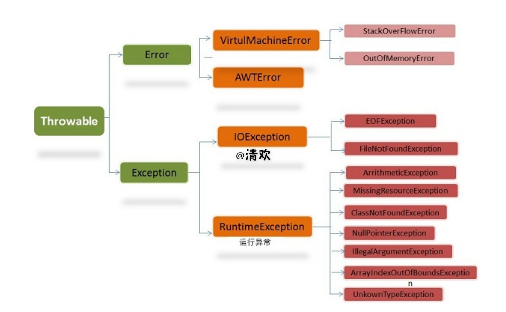

在 Java 中，所有的异常都有一个共同的祖先java.lang包中的 Throwable类。Throwable：
有两个重要的子类：

Exception（异常） 和 Error（错误） ，二者都是 Java
异常处理的重要子类，各自都包含大量子类。

Error（错误）:是程序无法处理的错误，表示运行应用程序中较严重问题。大多数错误与代码编写者执行的操作无关，而表示代码运行时
JVM（Java 虚拟机）出现的问题。例如，Java虚拟机运行错误（Virtual
MachineError），当JVM 不再有继续执行操作所需的内存资源时，将出现
OutOfMemoryError。这些异常发生时，Java虚拟机（JVM）一

般会选择线程终止。

这些错误表示故障发生于虚拟机自身、或者发生在虚拟机试图执行应用时，如Java虚拟机运行错误（VirtualMachineError）、类定义错误（NoClassDefFoundError）等。这些错误是不可查的，因为它们在应用程序的控制和处理能力之
外，而且绝大多数是程序运行时不允许出现的状况。对于设计合理的应用程序来说，即使确实发生了错误，本质上也不应该试图去处理它所引起的异常状况。在
Java中，错误通过Error的子类描述。

Exception（异常）:是程序本身可以处理的异常。Exception 类有一个重要的子类
RuntimeException。

RuntimeException
异常由Java虚拟机抛出。NullPointerException（要访问的变量没有引用任何对象时，抛出该异常）、ArithmeticException（算术运算异常，一个整数除以0时，抛出该异常）和ArrayIndexOutOfBoundsException
（下标越界异常）。

注意：异常和错误的区别：异常能被程序本身可以处理，错误是无法处理。

Throwable类常用方法

public string getMessage():返回异常发生时的详细信息

public string toString():返回异常发生时的简要描述

public string
getLocalizedMessage():返回异常对象的本地化信息。使用Throwable的子类覆盖这个方法，可

以声称本地化信息。如果子类没有覆盖该方法，则该方法返回的信息与getMessage（）返回的结果相同

public void printStackTrace():在控制台上打印Throwable对象封装的异常信息

异常处理总结

try
块：用于捕获异常。其后可接零个或多个catch块，如果没有catch块，则必须跟一个finally块。

catch 块：用于处理try捕获到的异常。

inally
块：无论是否捕获或处理异常，finally块里的语句都会被执行。当在try块或catch块中遇到return语句时，finally语句块将在方法返回之前被执行。

在以下4种特殊情况下，finally块不会被执行：

1. 在finally语句块中发生了异常。

2. 在前面的代码中用了System.exit()退出程序。

3. 程序所在的线程死亡。

4. 关闭CPU。

JAVA语言如何进行异常处理，关键字：throws,throw,try,catch,finally分别代表什么意义？在try块中可以抛出异常吗？
-----------------------------------------------------------------------------------------------------------

Java使用面向对象的方式来处理异常，它把程序中发生的每个异常也都分别封装到一个对象来表示的，该对象中包含有异常的信息。而throws\\throw\\try、catch、finally就是Java中用来对异常进行处理的几个关键字，在Java编程中规容Java编译器强制普通异常必须try..catch处理或用throws声明继续抛给上层调用方法处理，一般异常必须要求被捕获和处理，而系统异常可以处理也可以不处理，所以编译器不强制用try..catch处理或用throws、throw声明异常。而finally一般与try或try\\catch一起使用做为异常的最后处理出口。

Java中的异常处理机制的简单原理和应用。
--------------------------------------

异常是指java程序运行时（非编译）所发生的非正常情况或错误，与现实生活中的事件很相似，现实生活中的事件可以包含事件发生的时间、地点、人物、情节等信息，可以用一个对象来表示，Java使用面向对象的方式来处理异常，它把程序中发生的每个异常也都分别封装到一个对象来表示的，该对象中包含有异常的信息。

Java对异常进行了分类，不同类型的异常分别用不同的Java类表示，所有异常的根类为java.lang.Throwable，Throwable下面又派生了两个子类：Error和Exception，Error表示应用程序本身无法克服和恢复的一种严重问题，程序只有死的份了，例如，说内存溢出和线程死锁等系统问题。Exception表示程序还能够克服和恢复的问题，其中又分为系统异常和普通异常，系统异常是软件本身缺陷所导致的问题，也就是软件开发人员考虑不周所导致的问题，软件使用者无法克服和恢复这种问题，但在这种问题下还可以让软件系统继续运行或者让软件死掉，例如，数组脚本越界（ArrayIndexOutOfBoundsException），空指针异常（NullPointerException）、类转换异常（ClassCastException）；普通异常是运行环境的变化或异常所导致的问题，是用户能够克服的问题，例如，网络断线，硬盘空间不够，发生这样的异常后，程序不应该死掉。

java为系统异常和普通异常提供了不同的解决方案，编译器强制普通异常必须try..catch处理或用throws声明继续抛给上层调用方法处理，所以普通异常也称为checked异常，而系统异常可以处理也可以不处理，所以，编译器不强制用try..catch处理或用throws声明，所以系统异常也称为unchecked异常。

Error和exception的区别与联系？
------------------------------

error表示恢复不是不可能,但很困难的情况下的一种严重问题。比如说内存溢,网络故障等，不可能指望程序能处理的一类错误。

Exception表示一种由程序设计或实现问题，表示程序运行时异常，如空指针异常数组下标越界。像我们常说的异常处理，就是属于这类，一般程序可以捕获和处理这些异常。

线程
====

关于 Java多线程，在面试的时候，问的比较多的就是

1.  悲观锁和乐观锁（ 具体：面试必备之乐观锁与悲观锁）、

②synchronized和lock区别以及volatile和synchronized的区别，

③可重入锁与非可重入锁的区别、

④多线程是解决什么问题的、⑤线程池解决什么问题、⑥线程池的原理、⑦线程池使用时的注意事项、⑧AQS原理、⑨ReentranLock源码，设计原理，整体过程
等等问题。

面试官在多线程这一部分很可能会问你有没有在项目中实际使用多线程的经历。所以，如果你在你的项目中有实际使用Java多线程的经历
的话，会为你加分不少哦！

多线程和并发的区别
------------------

多线程是为了提高程序的运行效率。

并发是同一时刻同时访问。

在静态方法上使用同步时会发生什么事？
------------------------------------

同步静态方法时会获取该类的“Class”对象，所以当一个线程进入同步的静态方法中时，

线程监视器获取类本身的对象锁，其它线程不能进入这个类的任何静态同步方法。

它不像实例方法，因为多个线程可以同时访问不同实例同步实例方法。

当一个同步方法已经执行，线程能够调用对象上的非同步实例方法吗？
--------------------------------------------------------------

可以，一个非同步方法总是可以被调用而不会有任何问题。

实际上，Java
没有为非同步方法做任何检查，锁对象仅仅在同步方法或者同步代码块中检查。

如果一个方法没有声明为同步，即使你在使用共享数据Java照样会调用，而不会做检查是否安全，

所以在这种情况下要特别小心。一个方法是否声明为同步取决于临界区访问(critial
section access)，

如果方法不访问临界区(共享资源或者数据结构)就没必要声明为同步的。

在一个对象上两个线程可以调用两个不同的同步实例方法吗？
------------------------------------------------------

不能，因为一个对象已经同步了实例方法，线程获取了对象的对象锁。

所以只有执行完该方法释放对象锁后才能执行其它同步方法。

什么是线程饿死，什么是活锁？
----------------------------

线程饿死和活锁虽然不像死锁一样是常见的问题，但是对于并发编程的设计者来说就像一次邂逅一样。

当所有线程阻塞，或者由于需要的资源无效而不能处理，不存在非阻塞线程使资源可用。

JavaAPI 中线程活锁可能发生在以下情形：

当所有线程在程序中执行 Object.wait (0)，参数为 0 的 wait 方法。

程序将发生活锁直到在相应的对象上有线程调用 Object.notify ()或者 Object.notifyAll
()。

当所有线程卡在无限循环中。

多线程安全问题的原因： 
-----------------------

通过图解：发现一个线程在执行多条语句时，并运算同一个数据时，在执行过程中，其他线程参与进来，并操作了这个数据。导致到了错误数据的产生。

**涉及到两个因素： **

1，多个线程在操作共享数据。 

2，有多条语句对共享数据进行运算。 

原因：这多条语句，在某一个时刻被一个线程执行时，还没有执行完，就被其他线程执行了。 

解决安全问题的原理： 
---------------------

只要将操作共享数据的语句在某一时段让一个线程执行完，在执行过程中，其他线程不能进来执行就可以解决这个问题。 

如何进行多句操作共享数据代码的封装呢？ 

**java中提供了一个解决方式：就是同步代码块。 **

格式： 

**synchronized**(对象) {  **// 任意对象都可以。这个对象就是锁。 **

**需要被同步的代码；**

} 

**Synchronized**(自己得会写得出)  

什么时候产生死锁,该怎么办? 
---------------------------

sleep()和wait()区别
-------------------

分析这两个方法：从执行权和锁上来分析：

wait：

sleep：

wait：

Sleep：

\-------------------------------

sleep方法（Tread类）：

必须指定时间，时间到自动从冻结状态转成运行状态(临时阻塞状态)。

线程主动放弃CPU，使得线程在指定的时间内进入阻塞状态，不能得到CPU时间，指定的时间一过，线程重新进入可执行状态。典型地，sleep()被用在等待某个资源就绪的情形：测试发现条件不满足后，让线程阻塞一段时间后重新测试，直到条件满足为止。

sleep线程会释放执行权，但不是不释放锁。

wait方法（Object类）：

使线程进入阻塞状态，它有两种形式，

一种允许指定以毫秒为单位的一段时间作为参数，

另一种没有参数，当指定时间参数时对应的notify()被调用或者超出指定时间时线程重新进入可执行状态，后者则必须对应的notify()被调用。

wait线程会释放执行权，而且线程会释放锁。

进入等待此对象的等待锁定池，只有针对此对象调用notify()方法后本线程才进入对象锁定池准备获取对象锁进入运行状态。

Wait()与Notify ()区别?
----------------------

**Wait让当前线程有运行状态变为等待状态，和同步一起使用**

**Notify 唤醒现在正在等待的状态,和同步一起使用**

创建线程的方式及实现（必问）
----------------------------

Java中创建线程主要有三种方式：

### 继承Thread类创建线程类

继承Thread ，由子类复写run方法。

（1）定义Thread类的子类，并重写该类的run方法，该run方法的方法体就代表了线程要完成的任务。因此把run()方法称为执行体。

（2）创建Thread子类的实例，即创建了线程对象。

（3）调用线程对象的start()方法来启动该线程。并执行run方法

上述代码中Thread.currentThread()方法返回当前正在执行的线程对象。getName()方法返回调用该方法的线程的名字。

线程状态：

新建：start()

运行：具备执行资格，同时具备执行权；

冻结：sleep(time),wait()—notify()唤醒；线程释放了执行权，同时释放执行资格；

临时阻塞状态：线程具备cpu的执行资格，没有cpu的执行权；

消亡：stop()

### 通过Runnable接口创建线程类

步骤：

（1）定义runnable接口的实现类，并重写该接口的run()方法，该run()方法的方法体同样是该线程的线程执行体。

（2）创建Runnable实现类的实例，并依此实例作为Thread的target来创建Thread对象，该Thread对象才是真正的线程对象。

将实现了Runnable接口的子类对象作为实际参数传递给Thread类中的构造函数。
为什么要传递呢？因为要让线程对象明确要运行的run方法所属的对象。

（3）调用线程对象的start()方法来启动该线程。并运行Runnable接口子类中的run方法。

| package com.thread; class RunnableThreadTest implements Runnable { private int i; \@Override public void run() { for (i = 0; i \< 100; i++) { System.out.println(Thread.currentThread().getName() + "" + i); } } public static void main(String[] args) { for (int i = 0; i \< 100; i++) { System.out.println(Thread.currentThread().getName() + "" + i); if (i == 20) { RunnableThreadTest rtt = new RunnableThreadTest(); new Thread(rtt, "新线程1").start(); new Thread(rtt, "新线程2").start(); } } } } |
|-------------------------------------------------------------------------------------------------------------------------------------------------------------------------------------------------------------------------------------------------------------------------------------------------------------------------------------------------------------------------------------------------------------------------------------------------------------------------------------------------------------|

### 通过Callable和Future创建线程

（1）创建Callable接口的实现类，并实现call()方法，该call()方法将作为线程执行体，并且有返回值。

（2）创建Callable实现类的实例，使用FutureTask类来包装Callable对象，该FutureTask对象封装了该Callable对象的call()方法的返回值。

（3）使用FutureTask对象作为Thread对象的target创建并启动新线程。

（4）调用FutureTask对象的get()方法来获得子线程执行结束后的返回值

packagecom.thread;

importjava.util.concurrent.Callable;

importjava.util.concurrent.ExecutionException;

importjava.util.concurrent.FutureTask;

publicclassCallableThreadTestimplementsCallable\<Integer\>

{

publicstaticvoidmain(String[]args)

{

CallableThreadTestctt=newCallableThreadTest();

FutureTask\<Integer\>ft=newFutureTask\<\>(ctt);

for(inti=0;i\<100;i++)

{

System.out.println(Thread.currentThread().getName()+"的循环变量i的值"+i);

if(i==20)

{

newThread(ft,"有返回值的线程").start();

}

}

try

{

System.out.println("子线程的返回值："+ft.get());

}catch(InterruptedExceptione)

{

e.printStackTrace();

}catch(ExecutionExceptione)

{

e.printStackTrace();

}

}

\@Override

publicIntegercall()throwsException

{

inti=0;

for(;i\<100;i++)

{

System.out.println(Thread.currentThread().getName()+""+i);

}

returni;

}

}

### 创建线程的三种方式的对比

采用实现Runnable、Callable接口的方式创见多线程时，优势是：

线程类只是实现了Runnable接口或Callable接口，还可以继承其他类。

在这种方式下，多个线程可以共享同一个target对象，所以非常适合多个相同线程来处理同一份资源的情况，从而可以将CPU、代码和数据分开，形成清晰的模型，较好地体现了面向对象的思想。

劣势是：

编程稍微复杂，如果要访问当前线程，则必须使用Thread.currentThread()方法。

使用继承Thread类的方式创建多线程时优势是：

编写简单，如果需要访问当前线程，则无需使用Thread.currentThread()方法，直接使用this即可获得当前线程。

劣势是：

线程类已经继承了Thread类，所以不能再继承其他父类。

启动一个线程用什么方法？【北京永中】
------------------------------------

使用Thread类的start()方法来启动一个线程，使线程进入就绪状态。如果自定义的类是Thread类的子类的话，可以直接使用Start()来启，如果是实现的Runnable接口的话，还要将该类的实例作为参数传入到Thread对象中来启动。

synchronized
------------

### 对于 synchronized 关键字的了解

synchronized关键字解决的是多个线程之间访问资源的同步性，synchronized关键字可以保证被它修饰的方法或者代码块在任意时刻只能有一个线程执行。

另外，在 Java
早期版本中，synchronized属于重量级锁，效率低下，因为监视器锁（monitor）是依赖于底层的操作系统的
Mutex Lock 来实现的，Java
的线程是映射到操作系统的原生线程之上的。如果要挂起或者唤醒一个线程，都需要操作系统帮忙完成，而操作系统实现线程之间的切换时需要从用户态转换到内核态，这个状态之间的转换需要相对比较长的时间，时间成本相对较高，这也是为什么早期的
synchronized 效率低的原因。庆幸的是在 Java 6 之后

Java 官方对从 JVM 层面对synchronized 较大优化，所以现在的 synchronized
锁效率也优化得很不错了。JDK1.6对锁的实现引入了大量的优化，如自旋锁、适应性自旋锁、锁消除、锁粗化、偏向锁、轻量级锁等技术来减少锁操作的开销。

### 说说自己是怎么使用 synchronized 关键字，在项目中用到了吗

synchronized关键字最主要的三种使用方式：

修饰实例方法，作用于当前对象实例加锁，进入同步代码前要获得当前对象实例的锁

修饰静态方法，作用于当前类对象加锁，进入同步代码前要获得当前类对象的锁
。也就是给当前类加锁，会作用于类的所有对象实例，因为静态成员不属于任何一个实例对象，是类成员（static
表明这是该类的一个静态资源，不管new了多少个对象，只有一份，所以对该类的所有对象都加了锁）。所以如果一个线程A调用一个实例对象的非静态
synchronized 方法，而线程B需要调用这个实例对象所属类的静态 synchronized
方法，是允许的，不会发生互斥现象，因为访问静态 synchronized
方法占用的锁是当前类的锁，而访问非静态synchronized
方法占用的锁是当前实例对象锁。

修饰代码块，指定加锁对象，对给定对象加锁，进入同步代码库前要获得给定对象的锁。
和 synchronized
方法一样，synchronized(this)代码块也是锁定当前对象的。synchronized 关键字加到
static 静态方法和synchronized(class)代码块上都是是给 Class
类上锁。这里再提一下：synchronized关键字加到非 static
静态方法上是给对象实例上锁。另外需要注意的是：尽量不要使用 synchronized(String
a) 因为JVM中，字符串常量池具有缓冲功能！

下面我已一个常见的面试题为例讲解一下 synchronized 关键字的具体使用。

面试中面试官经常会说：“单例模式了解吗？来给我手写一下！给我解释一下双重检验锁方式实现单例模式的原理呗！”

双重校验锁实现对象单例（线程安全）

public class Singleton {

private volatile static Singleton uniqueInstance;

private Singleton() {

}

public static Singleton getUniqueInstance() {

//先判断对象是否已经实例过，没有实例化过才进入加锁代码

if (uniqueInstance == null) {

//类对象加锁

synchronized (Singleton.class) {

if (uniqueInstance == null) {

uniqueInstance = new Singleton();

}

}

}

return uniqueInstance;

}

}

另外，需要注意 uniqueInstance 采用 volatile 关键字修饰也是很有必要。

uniqueInstance 采用 volatile 关键字修饰也是很有必要的， uniqueInstance = new
Singleton(); 这段代码其实是分为三步执行：

1. 为 uniqueInstance 分配内存空间

2. 初始化 uniqueInstance

3. 将 uniqueInstance 指向分配的内存地址

但是由于 JVM 具有指令重排的特性，执行顺序有可能变成
1-\>3-\>2。指令重排在单线程环境下不会出先问题，但是在多线程环境下会导致一个线程获得还没有初始化的实例。例如，线程
T1 执行了 1 和 3，此时 T2 调用getUniqueInstance() 后发现 uniqueInstance
不为空，因此返回 uniqueInstance，但此时 uniqueInstance 还未被初始化。

使用 volatile 可以禁止 JVM 的指令重排，保证在多线程环境下也能正常运行。

### synchronized 关键字的底层原理

synchronized 关键字底层原理属于 JVM 层面。

1.  synchronized 同步语句块的情况

public class SynchronizedDemo {

public void method() {

synchronized (this) {

System.out.println("synchronized 代码块");

}

}

}

通过 JDK 自带的 javap 命令查看 SynchronizedDemo
类的相关字节码信息：首先切换到类的对应目录执行 javac SynchronizedDemo.java
命令生成编译后的 .class 文件，然后执行 javap -c -s -v –l SynchronizedDemo.class
。

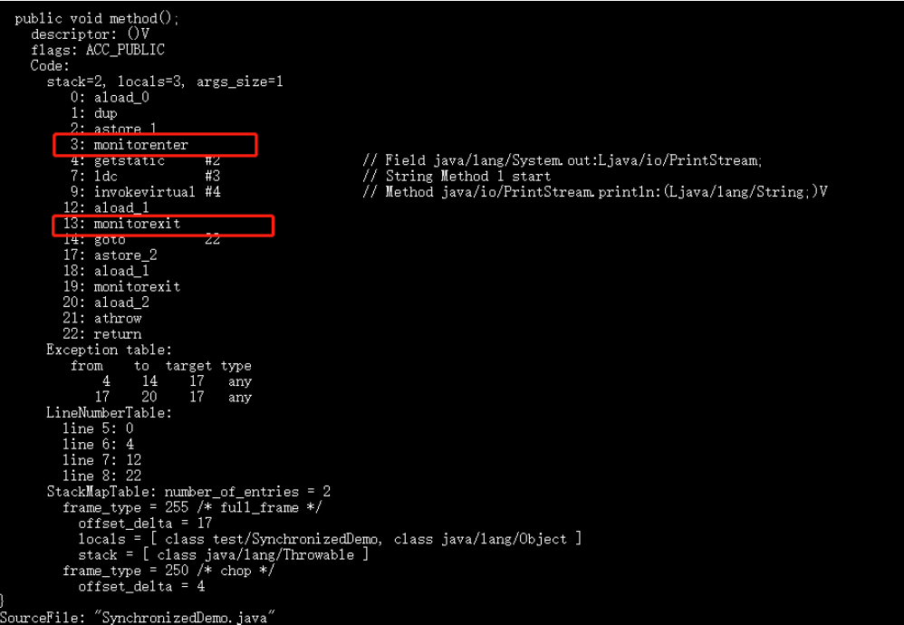

从上面我们可以看出：

synchronized 同步语句块的实现使用的是 monitorenter 和 monitorexit 指令，其中
monitorenter 指令指向同步代码块的开始位置，monitorexit
指令则指明同步代码块的结束位置。 当执行 monitorenter
指令时，线程试图获取锁也就是获取
monitor(monitor对象存在于每个Java对象的对象头中，synchronized
锁便是通过这种方式获取锁的，也是为什么Java中任意对象可以作为锁的原因)
的持有权.当计数器为0则可以成功获取，获取后将锁计数器设为1也就是加1。相应的在执行
monitorexit
指令后，将锁计数器设为0，表明锁被释放。如果获取对象锁失败，那当前线程就要阻塞等待，直到锁被另外一个线程释放为止。

1.  synchronized 修饰方法的的情况

public class SynchronizedDemo2 {

public synchronized void method() {

System.out.println("synchronized 方法");

}

}

synchronized 修饰的方法并没有 monitorenter 指令和 monitorexit
指令，取得代之的确实是ACC_SYNCHRONIZED
标识，该标识指明了该方法是一个同步方法，JVM
通过该ACC_SYNCHRONIZED访问标志来辨别一个方法是否声明为同步方法，从而执行相应的同步调用。

### 说说 JDK1.6 之后的synchronized 关键字底层做了哪些优化，可以详细介绍一下这些优化吗

JDK1.6
对锁的实现引入了大量的优化，如偏向锁、轻量级锁、自旋锁、适应性自旋锁、锁消除、锁粗化等技术来减少锁操作的开销。

锁主要存在四种状态，依次是：无锁状态、偏向锁状态、轻量级锁状态、重量级锁状态，他们会随着竞争的激烈而逐渐升级。注意锁可以升级不可降级，这种策略是为了提高获得锁和释放锁的效率。

关于这几种优化的详细信息可以查看：synchronized 关键字使用、底层原理、JDK1.6
之后的底层优化以及和ReenTrantLock 的对比

### 谈谈 synchronized和ReenTrantLock 的区别

①两者都是可重入锁

两者都是可重入锁。“可重入锁”概念是：自己可以再次获取自己的内部锁。比如一个线程获得了某个对象的锁，此时这个对象锁还没有释放，当其再次想要获取这个对象的锁的时候还是可以获取的，如果不可锁重入的话，就会造成死锁。同一个线程每次获取锁，锁的计数器都自增1，所以要等到锁的计数器下降为0时才能释放锁。

②synchronized依赖于JVM而ReenTrantLock 依赖于 API

synchronized 是依赖于 JVM 实现的，前面我们也讲到了 虚拟机团队在 JDK1.6 为
synchronized关键字进行了很多优化，但是这些优化都是在虚拟机层面实现的，并没有直接暴露给我们。ReenTrantLock是JDK
层面实现的（也就是 API
层面，需要lock()和unlock方法配合try/finally语句块来完成），所以我们可以通过查看它的源代码，来看它是如何实现的。

③ReenTrantLock比synchronized 增加了一些高级功能

相比synchronized，ReenTrantLock增加了一些高级功能。主要来说主要有三点：①等待可中断；②可实现公平锁；

1.  可实现选择性通知（锁可以绑定多个条件）

ReenTrantLock提供了一种能够中断等待锁的线程的机制，通过lock.lockInterruptibly()来实现这个机制。也就是说正在等待的线程可以选择放弃等待，改为处理其他事情。

ReenTrantLock可以指定是公平锁还是非公平锁。而synchronized只能是非公平锁。所谓的公平锁就是先等待的线程先获得锁。
ReenTrantLock默认情况是非公平的，可以通过 ReenTrantLock类的ReentrantLock(boolean
fair) 构造方法来制定是否是公平的。

synchronized关键字与wait()和notify/notifyAll()方法相结合可以实现等待/通知机制，ReentrantLock类当然也可以实现，但是需要借助于Condition接口与newCondition()
方法。Condition是JDK1.5之后才有的，它具有很好的灵活性，比如可以实现多路通知功能也就是在一个Lock对象中可以创建多个Condition实例（即对象监视器），线程对象可以注册在指定的Condition中，从而可以有选择性的进行线程通知，在调度线程上更加灵活。
在使用notify/notifyAll()方法进行通知时，被通知的线程是由 JVM
选择的，用ReentrantLock类结合Condition实例可以实现“选择性通知”
，这个功能非常重要，而且是Condition接口默认提供的。而synchronized关键字就相当于整个Lock对象中只有一个Condition实例，所有的线程都注册在它一个身上。如果执行notifyAll()方法的话就会通知所有处于等待状态的线程这样会造成很大的效率问题，而Condition实例的signalAll()方法
只会唤醒注册在该Condition实例中的所有等待线程。

如果你想使用上述功能，那么选择ReenTrantLock是一个不错的选择。

1.  性能已不是选择标准

### 说说 synchronized 关键字和 volatile 关键字的区别

synchronized关键字和volatile关键字比较

volatile关键字是线程同步的轻量级实现，所以volatile性能肯定比synchronized关键字要好。但是volatile关键字只能用于变量而synchronized关键字可以修饰方法以及代码块。synchronized关键字在JavaSE1.6之后进行了主要包括为了减少获得锁和释放锁带来的性能消耗而引入的偏向锁和轻量级锁以及其它各种优化之后执行效率有了显著提升，实际开发中使用synchronized
关键字的场景还是更多一些。

多线程访问volatile关键字不会发生阻塞，而synchronized关键字可能会发生阻塞

volatile关键字能保证数据的可见性，但不能保证数据的原子性。synchronized关键字两者都能保证。

volatile关键字主要用于解决变量在多个线程之间的可见性，而
synchronized关键字解决的是多个线程之间访问资源的同步性。

### synchronized和java.util.concurrent.locks.Lock的异同？

syn自动上锁，代码执行完毕后自动解锁。

lock手动上锁解锁。

**Lock接口可以尝试非阻塞地获取锁
当前线程尝试获取锁。如果这一时刻锁没有被其他线程获取到，则成功获取并持有锁。**

**Lock接口能被中断地获取锁 与 synchronized
不同，获取到锁的线程能够响应中断，当获取到的锁的线程被中断时，中断异常将会被抛出，同时锁会被释放。**

**Lock接口在指定的截止时间之前获取锁，如果截止时间到了依旧无法获取锁，则返回。**

主要相同点：Lock能完成synchronized所实现的所有功能

主要不同点：Lock有比synchronized更精确的线程语义和更好的性能。synchronized会自动释放锁，而Lock一定要求程序员手工释放，并且必须在finally从句中释放。

Lock还有更强大的功能，例如，它的tryLock方法可以非阻塞方式去拿锁。

线程池
------

### 什么是线程池？

线程池是指在初始化一个多线程应用程序过程中创建一个线程集合，然后在需要执行新的任务时重用这些线程而不是新建一个线程。线程池中线程的数量通常完全取决于可用内存数量和应用程序的需求。然而，增加可用线程数量是可能的。线程池中的每个线程都有被分配一个任务，一旦任务已经完成了，线程回到池子中并等待下一次分配任务。

利用线程池节约线程创建，销毁占用的资源。

### 为什么要使用线程池

线程池提供了一种限制和管理资源（包括一个任务）。每个线程池还维护一些基本信息，例如已完成任务数量。

-   降低资源消耗：通过重复利用已创建的线程降低线程的创建和销毁造成的消耗。

-   提高响应速度：当任务到达时，任务可以不需要等到线程创建就能立即执行。

-   提高线程的可管理性：线程是稀缺资源，如果无限制的创建，不仅会消耗系统资源，还会降低系统稳定性，使用线程池可以进行统一的分配，调优和监控。

### 讲讲线程池的实现原理

主要是ThreadPoolExecutor的实现原理

[Java并发编程：线程池的使用](https://link.jianshu.com/?t=http%3A%2F%2Fwww.cnblogs.com%2Fdolphin0520%2Fp%2F3932921.html)

### 实现Runnable接口和Callable接口的区别

如果想让线程池执行任务的话需要实现的Runnable接口或Callable接口。
Runnable接口或Callable接口实现类都可以被ThreadPoolExecutor或ScheduledThreadPoolExecutor执行。两者的区别在于
Runnable 接口不会返回结果但是 Callable 接口可以返回结果。

备注： 工具类 Executors 可以实现 Runnable 对象和 Callable 对象之间的相互转换。

（ Executors.callable（Runnable task） 或 Executors.callable（Runnable
task，Object resule） ）。

### 执行execute()方法和submit()方法的区别是什么呢？

1) execute()
方法用于提交不需要返回值的任务，所以无法判断任务是否被线程池执行成功与否；

2)submit()方法用于提交需要返回值的任务。线程池会返回一个future类型的对象，通过这个future对象可以判断任务是否执行成功，并且可以通过future的get()方法来获取返回值，get()方法会阻塞当前线程直到任务完成，而使用get（long
timeout，TimeUnit unit）
方法则会阻塞当前线程一段时间后立即返回，这时候有可能任务没有执行完。

### 如何创建线程池

《阿里巴巴Java开发手册》中强制线程池不允许使用 Executors 去创建，而是通过
ThreadPoolExecutor
的方式，这样的处理方式让写的同学更加明确线程池的运行规则，规避资源耗尽的风险

Executors 返回线程池对象的弊端如下：

FixedThreadPool 和 SingleThreadExecutor ： 允许请求的队列长度为
Integer.MAX_VALUE,可能堆积大量的请求，从而导致OOM。

CachedThreadPool 和 ScheduledThreadPool ： 允许创建的线程数量为
Integer.MAX_VALUE ，可能会创建大量线程，从而导致OOM。

方式一：通过构造方法实现

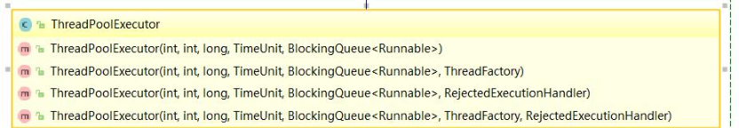

方式二：通过Executor 框架的工具类Executors来实现
我们可以创建三种类型的ThreadPoolExecutor：

FixedThreadPool ：
该方法返回一个固定线程数量的线程池。该线程池中的线程数量始终不变。当有一个新的任务提交时，线程池中若有空闲线程，则立即执行。若没有，则新的任务会被暂存在一个任务队列中，待有线程空闲时，便处理在任务队列中的任务。

SingleThreadExecutor：
方法返回一个只有一个线程的线程池。若多余一个任务被提交到该线程池，任务会被保存在一个任务队列中，待线程空闲，按先入先出的顺序执行队列中的任务。

CachedThreadPool：
该方法返回一个可根据实际情况调整线程数量的线程池。线程池的线程数量不确定，但若有空闲线程可以复用，则会优先使用可复用的线程。若所有线程均在工作，又有新的任务提交，则会创建新的线程处理任务。所有线程在当前任务执行完毕后，将返回线程池进行复用。

对应Executors工具类中的方法如图所示：

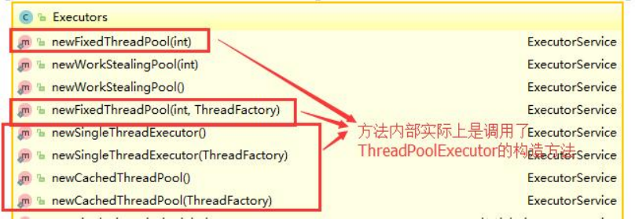

### 线程池的几种方式

newFixedThreadPool(intnThreads)

创建一个固定长度的线程池，每当提交一个任务就创建一个线程，直到达到线程池的最大数量，这时线程规模将不再变化，当线程发生未预期的错误而结束时，线程池会补充一个新的线程

**newCachedThreadPool()**

创建一个可缓存的线程池，如果线程池的规模超过了处理需求，将自动回收空闲线程，而当需求增加时，则可以自动添加新线程，线程池的规模不存在任何限制

**newSingleThreadExecutor()**

这是一个单线程的Executor，它创建单个工作线程来执行任务，如果这个线程异常结束，会创建一个新的来替代它；它的特点是能确保依照任务在队列中的顺序来串行执行

**newScheduledThreadPool(intcorePoolSize)**

创建了一个固定长度的线程池，而且以延迟或定时的方式来执行任务，类似于Timer。

举个栗子

1.  privatestaticfinalExecutorexec=Executors.newFixedThreadPool(50);

2.  Runnablerunnable=newRunnable(){

3.  publicvoidrun(){

4.  ...

5.  }

6.  }

7.  exec.execute(runnable);

8.  Callable\<Object\>callable=newCallable\<Object\>(){

9.  publicObjectcall()throwsException{

10. returnnull;

11. }

12. };

13. Futurefuture=executorService.submit(callable);

14. future.get();*//等待计算完成后，获取结果*

15. future.isDone();*//如果任务已完成，则返回true*

16. future.isCancelled();*//如果在任务正常完成前将其取消，则返回true*

17. future.cancel(true);*//试图取消对此任务的执行，true中断运行的任务，false允许正在运行的任务运行完成*

参考：

[创建线程池的几种方式](https://link.jianshu.com/?t=http%3A%2F%2Fblog.csdn.net%2Fcyantide%2Farticle%2Fdetails%2F50880211)

### 线程池四种创建方式，区别和使用场景。

Java通过Executors（jdk1.5并发包）提供四种线程池，分别为：

newCachedThreadPool创建一个可缓存线程池，如果线程池长度超过处理需要，可灵活回收空闲线程，若无可回收，则新建线程。

newFixedThreadPool
创建一个定长线程池，可控制线程最大并发数，超出的线程会在队列中等待。

newScheduledThreadPool 创建一个定长线程池，支持定时及周期性任务执行。

newSingleThreadExecutor
创建一个单线程化的线程池，它只会用唯一的工作线程来执行任务，保证所有任务按照指定顺序(FIFO,
LIFO, 优先级)执行。

Atomic 原子类的 4 连击
----------------------

### 介绍一下Atomic 原子类

Atomic
翻译成中文是原子的意思。在化学上，我们知道原子是构成一般物质的最小单位，在化学反应中是不可分割的。在我们这里
Atomic
是指一个操作是不可中断的。即使是在多个线程一起执行的时候，一个操作一旦开始，就不会被其他线程干扰。

所以，所谓原子类说简单点就是具有原子/原子操作特征的类。

并发包 java.util.concurrent 的原子类都存放在 java.util.concurrent.atomic
下,如下图所示。

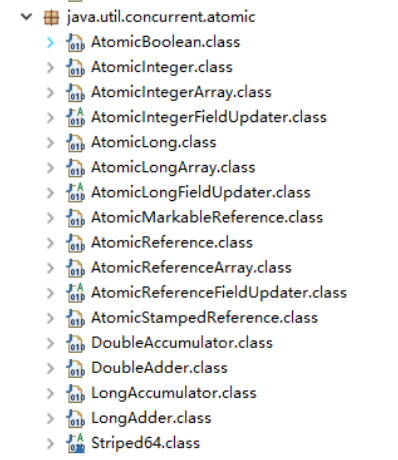

### JUC 包中的原子类是哪4类?

基本类型

使用原子的方式更新基本类型

AtomicInteger：整形原子类

AtomicLong：长整型原子类

AtomicBoolean ：布尔型原子类

数组类型

使用原子的方式更新数组里的某个元素

AtomicIntegerArray：整形数组原子类

AtomicLongArray：长整形数组原子类

AtomicReferenceArray ：引用类型数组原子类

引用类型

AtomicReference：引用类型原子类

AtomicStampedRerence：原子更新引用类型里的字段原子类

AtomicMarkableReference ：原子更新带有标记位的引用类型

对象的属性修改类型

AtomicIntegerFieldUpdater:原子更新整形字段的更新器

AtomicLongFieldUpdater：原子更新长整形字段的更新器

AtomicStampedReference
：原子更新带有版本号的引用类型。该类将整数值与引用关联起来，可用于解决原子的更新数据和数据的版本号，可以解决使用
CAS 进行原子更新时可能出现的 ABA 问题。

### 讲讲 AtomicInteger 的使用

AtomicInteger 类常用方法

public final int get() //获取当前的值

public final int getAndSet(int newValue)//获取当前的值，并设置新的值

public final int getAndIncrement()//获取当前的值，并自增

public final int getAndDecrement() //获取当前的值，并自减

public final int getAndAdd(int delta) //获取当前的值，并加上预期的值

boolean compareAndSet(int expect, int update)
//如果输入的数值等于预期值，则以原子方式将该值设置

为输入值（update）

public final void lazySet(int newValue)//最终设置为newValue,使用 lazySet
设置之后可能导致其他线

程在之后的一小段时间内还是可以读到旧的值。

AtomicInteger 类的使用示例

使用 AtomicInteger 之后，不用对 increment() 方法加锁也可以保证线程安全。

class AtomicIntegerTest {

private AtomicInteger count = new AtomicInteger();

//使用AtomicInteger之后，不需要对该方法加锁，也可以实现线程安全。

public void increment() {

count.incrementAndGet();

}

public int getCount() {

return count.get();

}

}

### 介绍一下 AtomicInteger 类的原理

AtomicInteger 线程安全原理简单分析

AtomicInteger 类的部分源码：

// setup to use Unsafe.compareAndSwapInt for
updates（更新操作时提供“比较并替换”的作用）

private static final Unsafe unsafe = Unsafe.getUnsafe();

private static final long valueOffset;

static {

try {

valueOffset = unsafe.objectFieldOffset

(AtomicInteger.class.getDeclaredField("value"));

} catch (Exception ex) { throw new Error(ex); }

}

private volatile int value;

AtomicInteger 类主要利用 CAS (compare and swap) + volatile 和 native
方法来保证原子操作，从而避免synchronized 的高开销，执行效率大为提升。

CAS的原理是拿期望的值和原本的一个值作比较，如果相同则更新成新的值。UnSafe 类的
objectFieldOffset()
方法是一个本地方法，这个方法是用来拿到“原来的值”的内存地址，返回值是
valueOffset。另外 value 是一个volatile变量，在内存中可见，因此 JVM
可以保证任何时刻任何线程总能拿到该变量的最新值。

关于 Atomic 原子类这部分更多内容可以查看我的这篇文章：并发编程面试必备：JUC 中的
Atomic 原子类总结

AQS
---

### AQS 介绍

AQS的全称为（AbstractQueuedSynchronizer），这个类在java.util.concurrent.locks包下面。

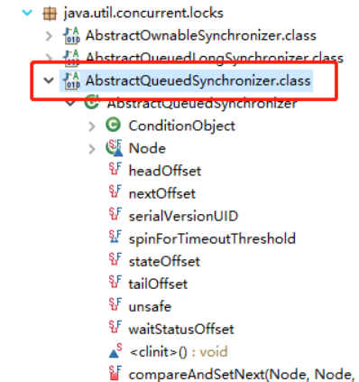

AQS是一个用来构建锁和同步器的框架，使用AQS能简单且高效地构造出应用广泛的大量的同步器，比如我们提到的

ReentrantLock，Semaphore，其他的诸如ReentrantReadWriteLock，SynchronousQueue，FutureTask等等皆是

基于AQS的。当然，我们自己也能利用AQS非常轻松容易地构造出符合我们自己需求的同步器。

### AQS 原理分析

AQS 原理这部分参考了部分博客，在5.2节末尾放了链接。

在面试中被问到并发知识的时候，大多都会被问到“请你说一下自己对于AQS原理的理解”。下面给大家一个示例供大家参加，面试不是背题，大家一定要假如自己的思想，即使加入不了自己的思想也要保证自己能够通俗的讲出来而不是背出来。

下面大部分内容其实在AQS类注释上已经给出了，不过是英语看着比较吃力一点，感兴趣的话可以看看源码。

AQS 原理概览

AQS核心思想是，如果被请求的共享资源空闲，则将当前请求资源的线程设置为有效的工作线程，并且将共享资源设置为锁定状态。如果被请求的共享资源被占用，那么就需要一套线程阻塞等待以及被唤醒时锁分配的机制，这个机制AQS是用CLH队列锁实现的，即将暂时获取不到锁的线程加入到队列中。

CLH(Craig,Landin,and
Hagersten)队列是一个虚拟的双向队列（虚拟的双向队列即不存在队列实例，仅存在结点之间的关联关系）。AQS是将每条请求共享资源的线程封装成一个CLH锁队列的一个结点（Node）来实现锁的分配。

看个AQS(AbstractQueuedSynchronizer)原理图：

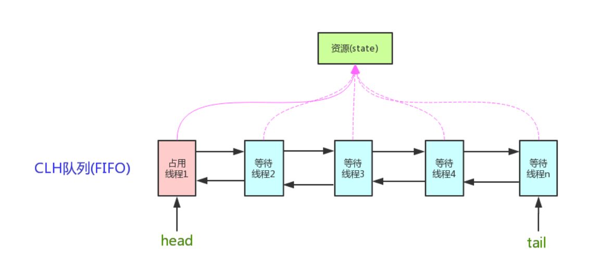

AQS使用一个int成员变量来表示同步状态，通过内置的FIFO队列来完成获取资源线程的排队工作。AQS使用CAS对该

同步状态进行原子操作实现对其值的修改。

private volatile int state;//共享变量，使用volatile修饰保证线程可见性

状态信息通过procted类型的getState，setState，compareAndSetState进行操作

//返回同步状态的当前值

protected final int getState() {

return state;

}

// 设置同步状态的值

protected final void setState(int newState) {

state = newState;

}

//原子地（CAS操作）将同步状态值设置为给定值update如果当前同步状态的值等于expect（期望值）

protected final boolean compareAndSetState(int expect, int update) {

return unsafe.compareAndSwapInt(this, stateOffset, expect, update);

}

### AQS 对资源的共享方式

AQS定义两种资源共享方式

Exclusive（独占）：只有一个线程能执行，如ReentrantLock。又可分为公平锁和非公平锁：

公平锁：按照线程在队列中的排队顺序，先到者先拿到锁

非公平锁：当线程要获取锁时，无视队列顺序直接去抢锁，谁抢到就是谁的

Share（共享）：多个线程可同时执行，如Semaphore/CountDownLatch。Semaphore、

CountDownLatCh、 CyclicBarrier、ReadWriteLock 我们都会在后面讲到。

ReentrantReadWriteLock
可以看成是组合式，因为ReentrantReadWriteLock也就是读写锁允许多个线程同时对某

一资源进行读。

不同的自定义同步器争用共享资源的方式也不同。自定义同步器在实现时只需要实现共享资源
state 的获取与释放方

式即可，至于具体线程等待队列的维护（如获取资源失败入队/唤醒出队等），AQS已经在顶层实现好了。

5.2.3 AQS底层使用了模板方法模式

同步器的设计是基于模板方法模式的，如果需要自定义同步器一般的方式是这样（模板方法模式很经典的一个应

用）：

1.
使用者继承AbstractQueuedSynchronizer并重写指定的方法。（这些重写方法很简单，无非是对于共享资源

state的获取和释放）

2.
将AQS组合在自定义同步组件的实现中，并调用其模板方法，而这些模板方法会调用使用者重写的方法。

这和我们以往通过实现接口的方式有很大区别，这是模板方法模式很经典的一个运用。

AQS使用了模板方法模式，自定义同步器时需要重写下面几个AQS提供的模板方法：

isHeldExclusively()//该线程是否正在独占资源。只有用到condition才需要去实现它。

tryAcquire(int)//独占方式。尝试获取资源，成功则返回true，失败则返回false。

tryRelease(int)//独占方式。尝试释放资源，成功则返回true，失败则返回false。

tryAcquireShared(int)//共享方式。尝试获取资源。负数表示失败；0表示成功，但没有剩余可用资源；正数表示成

功，且有剩余资源。

tryReleaseShared(int)//共享方式。尝试释放资源，成功则返回true，失败则返回false。

默认情况下，每个方法都抛出 UnsupportedOperationException 。
这些方法的实现必须是内部线程安全的，并且

通常应该简短而不是阻塞。AQS类中的其他方法都是final
，所以无法被其他类使用，只有这几个方法可以被其他类

使用。

以ReentrantLock为例，state初始化为0，表示未锁定状态。A线程lock()时，会调用tryAcquire()独占该锁并将

state+1。此后，其他线程再tryAcquire()时就会失败，直到A线程unlock()到state=0（即释放锁）为止，其它线程才

有机会获取该锁。当然，释放锁之前，A线程自己是可以重复获取此锁的（state会累加），这就是可重入的概念。但

要注意，获取多少次就要释放多么次，这样才能保证state是能回到零态的。

再以CountDownLatch以例，任务分为N个子线程去执行，state也初始化为N（注意N要与线程个数一致）。这N个

子线程是并行执行的，每个子线程执行完后countDown()一次，state会CAS(Compare and
Swap)减1。等到所有子

线程都执行完后(即state=0)，会unpark()主调用线程，然后主调用线程就会从await()函数返回，继续后余动作。

一般来说，自定义同步器要么是独占方法，要么是共享方式，他们也只需实现
tryAcquire-tryRelease 、tryAcquireShared-tryReleaseShared
中的一种即可。但AQS也支持自定义同步器同时实现独占和共享两种方式，

如 ReentrantReadWriteLock 。

推荐两篇 AQS 原理和相关源码分析的文章：

http://www.cnblogs.com/waterystone/p/4920797.html

https://www.cnblogs.com/chengxiao/archive/2017/07/24/7141160.html

### 5.3 AQS 组件总结

Semaphore(信号量)-允许多个线程同时访问： synchronized 和 ReentrantLock
都是一次只允许一个线程访问

某个资源，Semaphore(信号量)可以指定多个线程同时访问某个资源。

CountDownLatch （倒计时器）：
CountDownLatch是一个同步工具类，用来协调多个线程之间的同步。这个工具通常用来控制线程等待，它可以让某一个线程等待直到倒计时结束，再开始执行。

CyclicBarrier(循环栅栏)： CyclicBarrier 和 CountDownLatch
非常类似，它也可以实现线程间的技术等待，但是它的功能比 CountDownLatch
更加复杂和强大。主要应用场景和 CountDownLatch
类似。CyclicBarrier的字面意思是可循环使用（Cyclic）的屏障（Barrier）。它要做的事情是，让一组线程到达一个屏障（也可以叫同步点）时被阻塞，直到最后一个线程到达屏障时，屏障才会开门，所有被屏障拦截的线程才会继续干活。

CyclicBarrier默认的构造方法是 CyclicBarrier(int
parties)，其参数表示屏障拦截的线程数量，每个线程调用await方法告诉 CyclicBarrier
我已经到达了屏障，然后当前线程被阻塞。

关于AQS这部分的更多内容可以查看我的这篇文章:并发编程面试必备：AQS 原理以及 AQS
同步组件总结

写几个线程安全类，不安全的，支持排序的类名？【软通动力面试题】
--------------------------------------------------------------

-   线程安全类：Vector、Hashtable、Stack。

-   线程不安全的类：ArrayList、Linkedlist、HashSet、TreeSet、HashMap、TreeMap等。

-   支持排序的类有HashSet、LinkedHashSet、TreeSet等（Set接口下的实现都支持排序）

此题主要考查集合框架的知识。在集合框架中Collection接口为集合的根类型，提供集合操作的常用API方法，该接口下派生出两个子接口，一个是不支持排序的List接口，一个是有自身排序的Set接口，所以回答排序与不排序分别从两接口的实现中在作答。线程安全上来说，Vector类比同属于List接口的ArrayList要早，是一个线程安全的类，在JDK1.2以后才推出一个异步的ArrayList类，比Vector类效率高。同理Stack继承自Vector也线程安全的类，另外在在Map接口的实现在Hashtable也是个线程安全的类。静态变量和实例变量的区别？

在语法定义上的区别：静态变量前要加static关键字，而实例变量前则不加,类中的成员变量也属于实例变量.

在程序运行时的区别：实例变量属于某个对象的属性，必须创建了实例对象，其中的实例变量才会被分配空间，才能使用这个实例变量。静态变量不属于某个实例对象，而是属于类，所以也称为类变量，只要程序加载了类的字节码，不用创建任何实例对象，静态变量就会被分配空间，静态变量就可以被使用了。总之，实例变量必须创建对象后才可以通过这个对象来使用，静态变量则可以直接使用类名来引用。

例如，对于下面的程序，无论创建多少个实例对象，永远都只分配了一个staticVar变量，并且每创建一个实例对象，这个staticVar就会加1；但是，每创建一个实例对象，就会分配一个instanceVar，即可能分配多个instanceVar，并且每个instanceVar的值都只自加了1次。

publicclassVariantTest

{

publicstaticintstaticVar=0;

publicintinstanceVar=0;

publicVariantTest()

{

staticVar++;

instanceVar++;

System.out.println(“staticVar=”+staticVar+”,instanceVar=”+instanceVar);

}

}

备注：这个解答除了说清楚两者的区别外，最后还用一个具体的应用例子来说明两者的差异，体现了自己有很好的解说问题和设计案例的能力，思维敏捷，超过一般程序员，有写作能力！

进程与线程的区别？
------------------

>   答:进程是所有线程的集合，每一个线程是进程中的一条执行路径，线程只是一条执行路径。

你在哪里用到了多线程？
----------------------

主要能体现到多线程提高程序效率、异步、GC线程、主线程、文件上传。

分批发送短信、迅雷多线程下载等。

什么是多线程安全？
------------------

要先谈到java内存模型，JMM。

当多个线程同时共享，同一个**全局变量或静态变量**，做写的操作时，可能会发生数据冲突问题，也就是线程安全问题。做读操作是不会发生数据冲突问题。

说说线程安全问题
----------------

线程安全是指要控制多个线程对某个资源的有序访问或修改，而在这些线程之间没有产生冲突。

在Java里，线程安全一般体现在两个方面：

1、多个thread对同一个java实例的访问（read和modify）不会相互干扰，它主要体现在关键字synchronized。如ArrayList和Vector，HashMap和Hashtable（后者每个方法前都有synchronized关键字）。如果你在interator一个List对象时，其它线程remove一个element，问题就出现了。

2、每个线程都有自己的字段，而不会在多个线程之间共享。它主要体现在java.lang.ThreadLocal类，而没有Java关键字支持，如像static、transient那样。

如何解决多线程之间线程安全问题?
-------------------------------

答:使用多线程之间同步或使用锁(lock)。

为什么使用线程同步或使用锁能解决线程安全问题呢？
------------------------------------------------

答:将可能会发生数据冲突问题(线程不安全问题)，只能让当前一个线程进行执行。被包裹的代码执行完成后释放锁，让后才能让其他线程进行执行。这样的话就可以解决线程不安全问题。

什么是多线程之间同步？
----------------------

答:当多个线程共享同一个资源,不会受到其他线程的干扰。

什么是同步代码块？
------------------

答:就是将可能会发生线程安全问题的代码，给包括起来。只能让当前一个线程进行执行，被包裹的代码执行完成之后才能释放所，让后才能让其他线程进行执行。

多线程同步的分类？
------------------

### 使用同步代码块？

**synchronized(同一个数据){**

**可能会发生线程冲突问题**

**}**

| public void sale() { synchronized (mutex) { if (trainCount \> 0) { try { Thread.sleep(10); } catch (Exception e) { } System.out.println(Thread.currentThread().getName() + ",出售 第" + (100 - trainCount + 1) + "张票."); trainCount--; } } } |
|------------------------------------------------------------------------------------------------------------------------------------------------------------------------------------------------------------------------------------------------|

### 使用同步函数

在方法上修饰synchronized 称为同步函数

| public synchronized void sale() { if (trainCount \> 0) { try { Thread.sleep(40); } catch (Exception e) { } System.out.println(Thread.currentThread().getName() + ",出售 第" + (100 - trainCount + 1) + "张票."); trainCount--; } } |
|------------------------------------------------------------------------------------------------------------------------------------------------------------------------------------------------------------------------------------|

### 静态同步函数

方法上加上static关键字，使用synchronized 关键字修饰 为静态同步函数

静态的同步函数使用的锁是 该函数所属字节码文件对象

同步代码块与同步函数区别？
--------------------------

同步代码使用自定锁(明锁)

同步函数使用this锁

什么是多线程死锁?
-----------------

答：

同步中嵌套同步,无法释放锁的资源。

解决办法:同步中尽量不要嵌套同步

同步函数与静态同步函数区别?
---------------------------

注意:有些面试会这样问：例如现在一个静态方法和一个非静态静态怎么实现同步？

同步函数使用this锁

静态同步函数使用字节码文件，也就是类.class

Condition用法
-------------

Condition的功能类似于在传统的线程技术中的,Object.wait()和Object.notify()的功能,

**代码:**

| Condition condition = lock.newCondition(); res. condition.await(); 类似wait res. Condition. Signal() 类似notify **Signalall notifyALL** |
|-----------------------------------------------------------------------------------------------------------------------------------------|

如何停止线程？
--------------

1.  使用退出标志，使线程正常退出，也就是当run方法完成后线程终止。

2. 
使用stop方法强行终止线程（这个方法不推荐使用，因为stop和suspend、resume一样，也可能发生不可预料的结果）。

3.  使用interrupt方法中断线程。 线程在阻塞状态

什么是守护线程
--------------

Java中有两种线程，一种是用户线程，另一种是守护线程。

当进程不存在或主线程停止，守护线程也会被停止。

用setDaemon(true)方法设置为守护线程

join()方法作用
--------------

join作用是让其他线程变为等待，只有当前线程执行完毕后，等待的线程才会被释放。

线程三大特性
------------

多线程有三大特性，原子性、可见性、有序性

原子性:保证数据一致性，线程安全。

可见性:对另一个线程是否课件

有序性:线程之间执行有顺序

线程之间怎么通讯
----------------

wait方法，让当前线程上完锁之后进行等待。

notify ，拿到锁之后唤醒。

线程的调度过程
--------------

a.当线程池小于corePoolSize时，新提交的任务会创建一个新的线程执行，技术此线程池中有空闲线程。

b．当线程池达到corePoolSize时，新提交的任务将被放入workQueue，等待线程池中的任务调度执行。

c．当workQueue已满，并且maximunPoolSize\>corePoolSize时，新提交的任务会创建新的线程执行。

d、当提交的任务书超过maximunPoolSize时，新提交的任务被拒绝；

e、当线程池中超过corePoolSize线程，空闲时间达到keepAliveTime时，关闭空闲线程。

f．当线程池中设置allowCoreThreadTimeOut=true时，线程池中corePoolSize线程超过keepAliveTime时也将被关闭。

说说Java内存模型
----------------

共享内存模型指的就是Java内存模型(简称JMM)，JMM决定一个线程对共享变量的写入时,能对另一个线程可见。从抽象的角度来看，JMM定义了线程和主内存之间的抽象关系：线程之间的共享变量存储在主内存（main
memory）中，每个线程都有一个私有的本地内存（local
memory），本地内存中存储了该线程以读/写共享变量的副本。本地内存是JMM的一个抽象概念，并不真实存在。它涵盖了缓存，写缓冲区，寄存器以及其他的硬件和编译器优化。

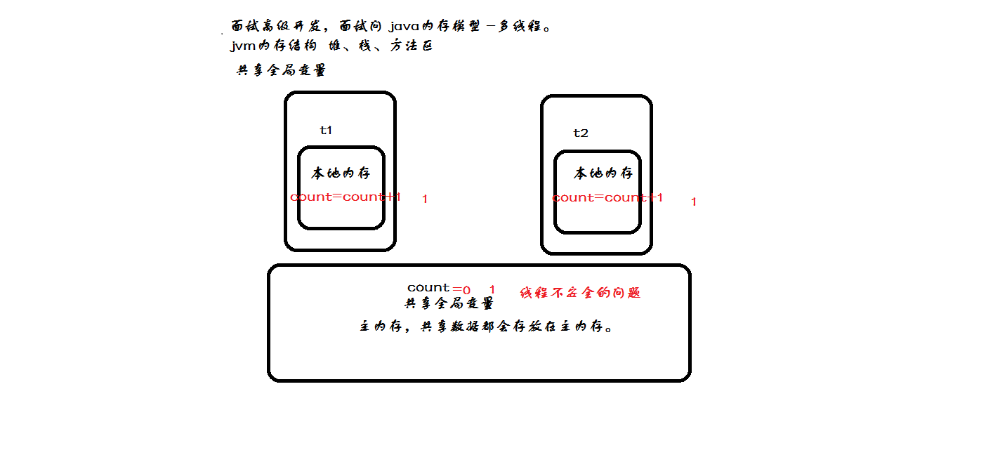

★什么是Volatile作用
-------------------

Volatile 关键字的作用 是变量在多个线程之间可见。

什么是AtomicInteger
-------------------

AtomicInteger原子类

ThreadLocal原理分析
-------------------

map集合

[Java并发编程：深入剖析ThreadLocal](https://link.jianshu.com/?t=https%3A%2F%2Fwww.cnblogs.com%2Fdolphin0520%2Fp%2F3920407.html)

线程池作用
----------

基于以下几个原因在多线程应用程序中使用线程是必须的：

1.
线程池改进了一个应用程序的响应时间。由于线程池中的线程已经准备好且等待被分配任务，应用程序可以直接拿来使用而不用新建一个线程。

2. 线程池节省了CLR
为每个短生存周期任务创建一个完整的线程的开销并可以在任务完成后回收资源。

3. 线程池根据当前在系统中运行的进程来优化线程时间片。

4. 线程池允许我们开启多个任务而不用为每个线程设置属性。

5. 线程池允许我们为正在执行的任务的程序参数传递一个包含状态信息的对象引用。

6. 线程池可以用来解决处理一个特定请求最大线程数量限制问题。

说说JDK1.5并发包
----------------

| 名称              | 作用                                                                            |
|-------------------|---------------------------------------------------------------------------------|
| Lock              | 锁                                                                              |
| Executors         | 线程池                                                                          |
| ReentrantLock     | 一个可重入的互斥锁定 Lock，功能类似synchronized，但要强大的多。                 |
| Condition         | Condition的功能类似于在传统的线程技术中的,Object.wait()和Object.notify()的功能, |
| ConcurrentHashMap | 分段HasMap                                                                      |
| AtomicInteger     | 原子类                                                                          |
| BlockingQueue     | BlockingQueue 通常用于一个线程生产对象，而另外一个线程消费这些对象的场景        |
| ExecutorService   | 执行器服务                                                                      |

锁的种类
--------

### 分布式锁

### 自旋锁

自旋锁是采用让当前线程不停地的在循环体内执行实现的，当循环的条件被其他线程改变时
才能进入临界区。如下

| import java.util.concurrent.atomic.AtomicReference; public class SpinLock { private AtomicReference\<Thread\> sign = new AtomicReference\<\>(); public void lock() { Thread current = Thread.currentThread(); while (!sign.compareAndSet(null, current)) { } } public void unlock() { Thread current = Thread.currentThread(); sign.compareAndSet(current, null); } } |
|-----------------------------------------------------------------------------------------------------------------------------------------------------------------------------------------------------------------------------------------------------------------------------------------------------------------------------------------------------------------------|

### 互斥锁

所谓互斥锁, 指的是一次最多只能有一个线程持有的锁. 在jdk1.5之前,
我们通常使用synchronized机制控制多个线程对共享资源**Lock接口及其实现类ReentrantLock**

### 可重入锁

可重入锁，也叫做递归锁，指的是同一线程 外层函数获得锁之后
，内层递归函数仍然有获取该锁的代码，但不受影响。

在JAVA环境下 ReentrantLock 和synchronized 都是 可重入锁

### 悲观锁

悲观锁，正如其名，它指的是对数据被外界（包括本系统当前的其他事务，以及来自外部系统的事务处理）修改持保守态度，因此，在整个数据处理过程中，将数据处于锁定状态。悲观锁的实现，往往依靠数据库提供的锁机制（也只有数据库层提供的锁机制才能真正保证数据访问的排他性，否则，即使在本系统中实现了加锁机制，也无法保证外部系统不会修改数据）。

### 乐观锁

相对悲观锁而言，乐观锁机制采取了更加宽松的加锁机制。悲观锁大多数情况下依靠数据库的锁机制实现，以保证操作最大程度的独占性。但随之而来的就是数据库
性能的大量开销，特别是对长事务而言，这样的开销往往无法承受。
而乐观锁机制在一定程度上解决了这个问题。乐观锁，大多是基于数据版本（ Version
）记录机制实现。何谓数据版本？即为数据增加一个版本标识，在基于数据库表的版本解决方案中，一般是通过为数据库表增加一个
“version”
字段来实现。读取出数据时，将此版本号一同读出，之后更新时，对此版本号加一。此时，将提交数据的版本数据与数据库表对应记录的当前版本信息进行比对，如
果提交的数据版本号大于数据库表当前版本号，则予以更新，否则认为是过期数据。

### CAS乐观锁

乐观锁是一种思想，即认为读多写少，遇到并发写的可能性比较低，所以采取在写时先读出当前版本号，然后加锁操作（比较跟上一次的版本号，如果一样则更新），如果失败则要重复读-比较-写的操作。

CAS是一种更新的原子操作，比较当前值跟传入值是否一样，一样则更新，否则失败。

CAS顶多算是乐观锁写那一步操作的一种实现方式罢了，不用CAS自己加锁也是可以的。

### 悲观锁乐观锁

乐观锁悲观锁

是一种思想。可以用在很多方面。

比如数据库方面。

悲观锁就是forupdate（锁定查询的行）

乐观锁就是version字段（比较跟上一次的版本号，如果一样则更新，如果失败则要重复读-比较-写的操作。）

JDK方面：

悲观锁就是sync

乐观锁就是原子类（内部使用CAS实现）

本质来说，就是悲观锁认为总会有人抢我的。

乐观锁就认为，基本没人抢。

信号量
------

信号量(Semaphore)，有时被称为信号灯，是在多线程环境下使用的一种设施,
它负责协调各个线程, 以保证它们能够正确、合理的使用公共资源。 

同步和异步有何异同
------------------

同步(synchronized)和异步(asynchronized)是对于多线程(multi-threading)而言的

同步可防止并发主要出于数据安全的考虑

如果数据将在线程间共享。例如正在写的数据以后可能被另一个线程读到，或者正在读的数据可能已经被另一个线程写过了，那么这些数据就是共享数据，必须进行同步存取。

异步允许并发

ajax技术通常都是异步实现的，异步主要使用在当应用程序在对象上调用了一个需要花费很长时间来执行的方法，并且不希望让程序等待方法的返回时，就应该使用异步编程，在很多情况下采用异步途径往往更有效率。

STOP()和SUSPEND()不推荐使用的原因？
-----------------------------------

**stop()是因为它不安全。它会解除由线程获取的所有锁定，当在一个线程对象上调用stop()方法时，这个线程对象所运行的线程就会立即停止**，假如一个线程正在执行：synchronizedvoid{x=3;y=4;}　由于方法是同步的，多个线程访问时总能保证x,y被同时赋值，而如果一个线程正在执行到x=3;时，被调用了stop()方法，即使在同步块中，它也干脆地stop了，这样就产生了不完整的残废数据。而多线程编程中最最基础的条件要保证数据的完整性，所以请忘记线程的stop方法，以后我们再也不要说“停止线程”了。而且如果对象处于一种不连贯状态，那么其他线程能在那种状态下检查和修改它们。

**suspend()方法容易发生死锁。调用suspend()的时候，目标线程会停下来，但却仍然持有在这之前获得的锁定。**此时，其他任何线程都不能访问锁定的资源，除非被"挂起"的线程恢复运行。对任何线程来说，如果它们想恢复目标线程，同时又试图使用任何一个锁定的资源，就会造成死锁。所以不应该使用suspend()，而应在自己的Thread类中置入一个标志，指出线程应该活动还是挂起。若标志指出线程应该挂起，便用wait()命其进入等待状态。若标志指出线程应当恢复，则用一个notify()重新启动线程。

实现Runnable接口和Callable接口的区别
------------------------------------

如果想让线程池执行任务的需要实现Runnable接口或者Callable接口。

Runnable接口或Callable接口都可以被ThreadPoolEexcutor或者ScheduledThreadPoolExecutor执行。

两者的区别在于Runable接口不会返回结果。

备注：工具类Executors可以实现Runable独享和Callable对象之间的相互转换。（Executors.callable（Runable
task）或Executors.callable(Runable task,Object resule)）

执行execute方法和submit方法的区别

方法用于提交不需要返回值的任务，所以无法判断任务是否被线程池执行成功与否。

讲一下java 的内存模型
---------------------

在 JDK1.2
之前，Java的内存模型实现总是从主存（即共享内存）读取变量，是不需要进行特别的注意的。而在当前的
Java
内存模型下，线程可以把变量保存本地内存（比如机器的寄存器）中，而不是直接在主存中进行读写。这就可能造成一个线程在主存中修改了一个变量的值，而另外一个线程还继续使用它在寄存器中的变量值的拷贝，造成数据的不一致。

要解决这个问题，就需要把变量声明为 volatile，这就指示
JVM，这个变量是不稳定的，每次使用它都到主存中进行读取。

说白了， volatile
关键字的主要作用就是保证变量的可见性然后还有一个作用是防止指令重排序。

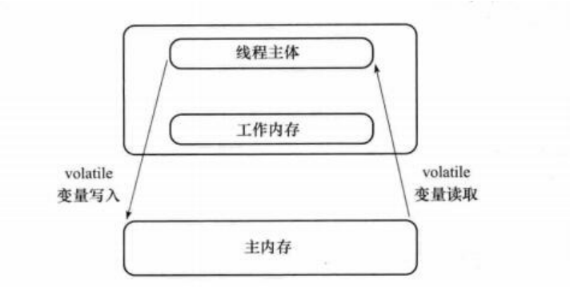

什么是ThreadLocal
-----------------

ThreadLocal提高一个线程的局部变量，访问某个线程拥有自己局部变量。

当使用ThreadLocal维护变量时，ThreadLocal为每个使用该变量的线程提供独立的变量副本，所以每一个线程都可以独立地改变自己的副本，而不会影响其它线程所对应的副本。

ThreadLocal的接口方法

ThreadLocal类接口很简单，只有4个方法，我们先来了解一下：

void set(Object value)设置当前线程的线程局部变量的值。

public Object get()该方法返回当前线程所对应的线程局部变量。

public void
remove()将当前线程局部变量的值删除，目的是为了减少内存的占用，该方法是JDK
5.0新增的方法。需要指出的是，当线程结束后，对应该线程的局部变量将自动被垃圾回收，所以显式调用该方法清除线程的局部变量并不是必须的操作，但它可以加快内存回收的速度。

protected Object
initialValue()返回该线程局部变量的初始值，该方法是一个protected的方法，显然是为了让子类覆盖而设计的。这个方法是一个延迟调用方法，在线程第1次调用get()或set(Object)时才执行，并且仅执行1次。ThreadLocal中的缺省实现直接返回一个null。

Tread和Threadlocal的作用及区别？
--------------------------------

threadlocal是线程局部变量（threadlocalvariable），为每一个使用该线程的线程都提供一个变量值的副本，使每一个线程都可以独立地改变自己的副本，而不会和其他线程的副本产生冲突。

sleep()、join（）、yield（）有什么区别
--------------------------------------

1、sleep()方法

在指定的毫秒数内让当前正在执行的线程休眠（暂停执行），此操作受到系统计时器和调度程序精度和准确性的影响。让其他线程有机会继续执行，但它并不释放对象锁。也就是如果有Synchronized同步块，其他线程仍然不能访问共享数据。注意该方法要捕获异常

比如有两个线程同时执行(没有Synchronized)，一个线程优先级为MAX_PRIORITY，另一个为MIN_PRIORITY，如果没有Sleep()方法，只有高优先级的线程执行完成后，低优先级的线程才能执行；但当高优先级的线程sleep(5000)后，低优先级就有机会执行了。

总之，sleep()可以使低优先级的线程得到执行的机会，当然也可以让同优先级、高优先级的线程有执行的机会。

2、yield()方法

yield()方法和sleep()方法类似，也不会释放“锁标志”，区别在于，它没有参数，即yield()方法只是使当前线程重新回到可执行状态，所以执行yield()的线程有可能在进入到可执行状态后马上又被执行，另外yield()方法只能使同优先级或者高优先级的线程得到执行机会，这也和sleep()方法不同。

3、join()方法

Thread的非静态方法join()让一个线程B“加入”到另外一个线程A的尾部。在A执行完毕之前，B不能工作。

Threadt=newMyThread();t.start();t.join();

保证当前线程停止执行，直到该线程所加入的线程完成为止。然而，如果它加入的线程没有存活，则当前线程不需要停止。

说说CountDownLatch原理
----------------------

参考：

[分析CountDownLatch的实现原理](https://www.jianshu.com/p/7c7a5df5bda6?ref=myread)

[什么时候使用CountDownLatch](https://link.jianshu.com/?t=http%3A%2F%2Fwww.importnew.com%2F15731.html)

[Java并发编程：CountDownLatch、CyclicBarrier和Semaphore](https://link.jianshu.com/?t=http%3A%2F%2Fwww.cnblogs.com%2Fdolphin0520%2Fp%2F3920397.html)

说说CyclicBarrier原理
---------------------

参考：

[JUC回顾之-CyclicBarrier底层实现和原理](https://link.jianshu.com/?t=http%3A%2F%2Fwww.cnblogs.com%2F200911%2Fp%2F6060195.html)

说说Semaphore原理
-----------------

[JAVA多线程–信号量(Semaphore)](https://link.jianshu.com/?t=https%3A%2F%2Fmy.oschina.net%2Fcloudcoder%2Fblog%2F362974)

[JUC回顾之-Semaphore底层实现和原理](https://link.jianshu.com/?t=https%3A%2F%2Fwww.cnblogs.com%2F200911%2Fp%2F6060359.html)

说说Exchanger原理
-----------------

[java.util.concurrent.Exchanger应用范例与原理浅析](https://link.jianshu.com/?t=http%3A%2F%2Flixuanbin.iteye.com%2Fblog%2F2166772)

说说CountDownLatch与CyclicBarrier区别
-------------------------------------

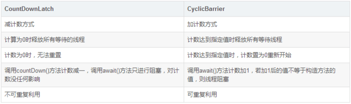

[尽量把CyclicBarrier和CountDownLatch的区别说通俗点](https://link.jianshu.com/?t=http%3A%2F%2Faaron-han.iteye.com%2Fblog%2F1591755)

线程的生命周期
--------------

**新建**(New)、**就绪**（Runnable）、**运行**（Running）、**阻塞**(Blocked)和**死亡**(Dead)**5种状态**

(1)生命周期的五种状态

**新建（newThread）**

当创建Thread类的一个实例（对象）时，此线程进入新建状态（未被启动）。

例如：Threadt1=newThread();

**就绪（runnable）**

线程已经被启动，正在等待被分配给CPU时间片，也就是说此时线程正在就绪队列中排队等候得到CPU资源。例如：**t1.start();**

**运行（running）**

线程获得CPU资源正在执行任务（run()方法），此时除非此线程自动放弃CPU资源或者有优先级更高的线程进入，线程将一直运行到结束。

**死亡（dead）**

当线程执行完毕或被其它线程杀死，线程就进入死亡状态，这时线程不可能再进入就绪状态等待执行。

自然终止：正常运行run()方法后终止

异常终止：调用**stop()**方法让一个线程终止运行

**堵塞（blocked）**

由于某种原因导致正在运行的线程让出CPU并暂停自己的执行，即进入堵塞状态。

正在睡眠：用sleep(longt)方法可使线程进入睡眠方式。一个睡眠着的线程在指定的时间过去可进入就绪状态。

正在等待：调用wait()方法。（调用motify()方法回到就绪状态）

被另一个线程所阻塞：调用suspend()方法。（调用resume()方法恢复）

参考：

[线程的生命周期](https://link.jianshu.com/?t=https%3A%2F%2Fwww.cnblogs.com%2Flangjunnan%2Fp%2F6444718.html)

锁机制
------

volatile实现原理
----------------

[聊聊并发（一）——深入分析Volatile的实现原理](https://link.jianshu.com/?t=http%3A%2F%2Fwww.infoq.com%2Fcn%2Farticles%2Fftf-java-volatile)

ABA问题
-------

ABA：如果另一个线程修改V值假设原来是A，先修改成B，再修改回成A，当前线程的CAS操作无法分辨当前V值是否发生过变化。

参考：

[JavaCAS和ABA问题](https://link.jianshu.com/?t=https%3A%2F%2Fwww.cnblogs.com%2F549294286%2Fp%2F3766717.html)

乐观锁的业务场景及实现方式
--------------------------

乐观锁（OptimisticLock）：

每次获取数据的时候，都不会担心数据被修改，所以每次获取数据的时候都不会进行加锁，但是在更新数据的时候需要判断该数据是否被别人修改过。如果数据被其他线程修改，则不进行数据更新，如果数据没有被其他线程修改，则进行数据更新。由于数据没有进行加锁，期间该数据可以被其他线程进行读写操作。

乐观锁：比较适合读取操作比较频繁的场景，如果出现大量的写入操作，数据发生冲突的可能性就会增大，为了保证数据的一致性，应用层需要不断的重新获取数据，这样会增加大量的查询操作，降低了系统的吞吐量。

线程的基本概念、线程的基本状态以及状态之间的关系
------------------------------------------------

一个程序中可以有多条执行线索同时执行，一个线程就是程序中的一条执行线索，每个线程上都关联有要执行的代码，即可以有多段程序代码同时运行，每个程序至少都有一个线程，即main方法执行的那个线程。如果只是一个cpu，它怎么能够同时执行多段程序呢？这是从宏观上来看的，cpu一会执行a线索，一会执行b线索，切换时间很快，给人的感觉是a,b在同时执行，好比大家在同一个办公室上网，只有一条链接到外部网线，其实，这条网线一会为a传数据，一会为b传数据，由于切换时间很短暂，所以，大家感觉都在同时上网。

状态：就绪，运行，synchronize阻塞，wait和sleep挂起，结束。wait必须在synchronized内部调用。

调用线程的start方法后线程进入就绪状态，线程调度系统将就绪状态的线程转为运行状态，遇到synchronized语句时，由运行状态转为阻塞，当synchronized获得锁后，由阻塞转为运行，在这种情况可以调用wait方法转为挂起状态，当线程关联的代码执行完后，线程变为结束状态。

同步和异步有何异同，在什么情况下分别使用他们？举例说明。（参考105题答案）
-------------------------------------------------------------------------

如果数据将在线程间共享。例如正在写的数据以后可能被另一个线程读到，或者正在读的数据可能已经被另一个线程写过了，那么这些数据就是共享数据，必须进行同步存取。

当应用程序在对象上调用了一个需要花费很长时间来执行的方法，并且不希望让程序等待方法的返回时，就应该使用异步编程，在很多情况下采用异步途径往往更有效率。

当一个线程进入一个对象的一个synchronized方法后，其它线程是否可进入此对象的其它方法？
------------------------------------------------------------------------------------

分几种情况：

>   1.其他方法前是否加了synchronized关键字，如果没加，则能。

>   2.如果这个方法内部调用了wait，则可以进入其他synchronized方法。

>   3.如果其他个方法都加了synchronized关键字，并且内部没有调用wait，则不能。

>   4.如果其他方法是static，它用的同步锁是当前类的字节码，与非静态的方法不能同步，因为非静态的方法用的是this。

网络编程
========

HTTP协议
--------

### 什么是http协议

http协议： 对浏览器客户端 和 服务器端 之间数据传输的格式规范

### Http格式的分类

请求行

请求头

请求内容

响应行

响应头

响应内容

### https与http区别

虽然说 HTTPS 有很大的优势，但其相对来说，还是存在不足之处的：

（1）HTTPS 协议握手阶段比较费时，会使页面的加载时间延长近 50%，增加 10% 到 20%
的耗电；

（2）HTTPS 连接缓存不如 HTTP
高效，会增加数据开销和功耗，甚至已有的安全措施也会因此而受到影响；

（3）SSL
证书需要钱，功能越强大的证书费用越高，个人网站、小网站没有必要一般不会用。

（4）SSL 证书通常需要绑定 IP，不能在同一 IP 上绑定多个域名，IPv4
资源不可能支撑这个消耗。

（5）HTTPS
协议的加密范围也比较有限，在黑客攻击、拒绝服务攻击、服务器劫持等方面几乎起不到什么作用。最关键的，SSL
证书的信用链体系并不安全，特别是在某些国家可以控制 CA
根证书的情况下，中间人攻击一样可行。

### 同步与异步

### https请求方式

常见的请求方式： GET 、 POST、 HEAD、 TRACE、 PUT、 CONNECT 、DELETE

常用的请求方式： GET 和 POST

表单提交：

\<form action="提交地址" method="GET/POST"\>

\<form\>

GET vs POST 区别

1）GET方式提交

a）地址栏（URI）会跟上参数数据。以？开头，多个参数之间以&分割。

| GET /day09/testMethod.html?name=eric&password=123456 HTTP/1.1 Host: localhost:8080 User-Agent: Mozilla/5.0 (Windows NT 6.1; WOW64; rv:35.0) Gecko/20100101 Firefox/35.0 Accept: text/html,application/xhtml+xml,application/xml;q=0.9,\*/\*;q=0.8 Accept-Language: zh-cn,en-us;q=0.8,zh;q=0.5,en;q=0.3 Accept-Encoding: gzip, deflate Referer: http://localhost:8080/day09/testMethod.html Connection: keep-alive |
|-------------------------------------------------------------------------------------------------------------------------------------------------------------------------------------------------------------------------------------------------------------------------------------------------------------------------------------------------------------------------------------------------------------------|

b）GET提交参数数据有限制，不超过1KB。

c）GET方式不适合提交敏感密码。

d）注意： 浏览器直接访问的请求，默认提交方式是GET方式

2）POST方式提交

a）参数不会跟着URI后面。参数而是跟在请求的实体内容中。没有？开头，多个参数之间以&分割。

| POST /day09/testMethod.html HTTP/1.1 Host: localhost:8080 User-Agent: Mozilla/5.0 (Windows NT 6.1; WOW64; rv:35.0) Gecko/20100101 Firefox/35.0 Accept: text/html,application/xhtml+xml,application/xml;q=0.9,\*/\*;q=0.8 Accept-Language: zh-cn,en-us;q=0.8,zh;q=0.5,en;q=0.3 Accept-Encoding: gzip, deflate Referer: http://localhost:8080/day09/testMethod.html Connection: keep-alive name=eric&password=123456 |
|--------------------------------------------------------------------------------------------------------------------------------------------------------------------------------------------------------------------------------------------------------------------------------------------------------------------------------------------------------------------------------------------------------------------|

b）POST提交的参数数据没有限制。

c）POST方式提交敏感数据。

3.2 请求头

| Accept: text/html,image/\* -- 浏览器接受的数据类型 Accept-Charset: ISO-8859-1 -- 浏览器接受的编码格式 Accept-Encoding: gzip,compress --浏览器接受的数据压缩格式 Accept-Language: en-us,zh- --浏览器接受的语言 Host: www.it315.org:80 --（必须的）当前请求访问的目标地址（主机:端口） If-Modified-Since: Tue, 11 Jul 2000 18:23:51 GMT --浏览器最后的缓存时间 Referer: http://www.it315.org/index.jsp -- 当前请求来自于哪里 User-Agent: Mozilla/4.0 (compatible; MSIE 5.5; Windows NT 5.0) --浏览器类型 Cookie:name=eric -- 浏览器保存的cookie信息 Connection: close/Keep-Alive -- 浏览器跟服务器连接状态。close: 连接关闭 keep-alive：保存连接。 Date: Tue, 11 Jul 2000 18:23:51 GMT -- 请求发出的时间 |
|--------------------------------------------------------------------------------------------------------------------------------------------------------------------------------------------------------------------------------------------------------------------------------------------------------------------------------------------------------------------------------------------------------------------------------------------------------------------------------------------------------------------------------------------------------------------------------------------------------------------------------------------------------------------------------------------------------|

### 客户端模拟http请求工具

Postmen(谷歌插件)、RestClient

### 服务器模拟http请求工具

httpclient、HttpURLConnection

### 前端ajax请求

| \$.ajax({ type : 'post', dataType : "text", url : "http://a.a.com/a/FromUserServlet", data : "userName=YaoSiyuan&userAge=19", success : **function**(msg) { alert(msg); } }); |
|-------------------------------------------------------------------------------------------------------------------------------------------------------------------------------|

### 什么是Socket？

**Socket就是为网络服务提供的一种机制。**

**通讯的两端都有Sokcet**

**网络通讯其实就是Sokcet间的通讯**

**数据在两个Sokcet间通过IO传输。**

同步异步
--------

同步：请求+响应

TCP和UDP的区别？
----------------

TCP/IP的运输层有两个不同的协议：

1.  用户数据报协议UDP

2.  传输控制协议TCP

二者最大区别:

TCP是面向连接的,而UDP是无连接的.区别大致如下:

>   1）UDP传送的数据单位协议是UDP报文或用户数据报,TCP传送的数据单位协议是TCP报文段。

>   2）UDP发送数据之前不需要建立连接,因此减少了开销和发送之前的时延。TCP提供面向连接的服务,不提供广播或多播服务。

>   3）对方的运输层在收到UDP报文后,不需要给出任何确认。TCP则需要确认。

>   4）UDP没有拥塞控制,因此网络出现的拥塞不会使源主机的发送速率降低,也不保证可靠交付,因此主机不需要维持具有许多参数的、复杂的连接状态表。TCP要提供可靠的、面向连接的运输服务,因此不可避免地增加了许多的开销,这不仅使协议数据单元的首部增大很多,还要占用许多的处理机资源。

>   5）UDP用户数据报只有8个字节的首部开销,比TCP的20个字节的首部要短。

**udp:**

>   **a、是面向无连接, 将数据及源的封装成数据包中,不需要建立建立连接**

>   **b、每个数据报的大小在限制64k内**

>   **c、因无连接,是不可靠协议**

>   **d、不需要建立连接,速度快**

**tcp：**

>   **a、建议连接，形成传输数据的通道.**

>   **b、在连接中进行大数据量传输，以字节流方式**

>   **c 通过三次握手完成连接,是可靠协议**

>   **d 必须建立连接m效率会稍低**

JVM
===

jvm结构原理
-----------

gc工作机制详解
--------------

JVM 特性
--------

平台无关性. Java 语言的一个非常重要的特点就是与平台的无关性。而使用 Java
虚拟机是实现这一特点
的关键。一般的高级语言如果要在不同的平台上运行，至少需要编译成不同的目标代码。而

引入 Java 语言虚拟机后，Java 语言在不同平台上运行时不需要重新编译。Java
语言使用模 式 Java 虚拟机屏蔽了与具体平台相关的信息，使得 Java
语言编译程序只需生成在 Java 虚拟
机上运行的目标代码（字节码），就可以在多种平台上不加修改地运行。Java
虚拟机在执行 字节码时，把字节码解释成具体平台上的机器指令执行。

简单解释一下类加载器
--------------------

有关类加载器一般会问你四种类加载器的应用场景以及双亲委派模型,

简述堆和栈的区别
----------------

VM 中堆和栈属于不同的内存区域，使用目的也不同。栈常用于保存方法帧和局部变量，而
对象总是在堆上分配。栈通常都比堆小，也不会在多个线程之间共享，而堆被整个
所有线程共享。

简述 JVM 内存分配
-----------------

基本数据类型比变量和对象的引用都是在栈分配的。

堆内存用来存放由 new 创建的对象和数组。

类变量（static 修饰的变量），程序在一加载的时候就在堆中为类变量分配内存，堆
中的内存地址存放在栈中。

局部变量: 由声明在某方法，或某代码段里（比如 for 循环），执行到它的时候在栈
中开辟内存，当局部变量一但脱离作用域，内存立即释放。

JVM参数调优
-----------

### Java虚拟机原理

所谓虚拟机，就是一台虚拟的机器。他是一款软件，用来执行一系列虚拟计算指令，大体上虚拟机可以分为系统虚拟机和程序虚拟机，
大名鼎鼎的Visual
Box、Vmare就属于系统虚拟机，他们完全是对物理计算的仿真，提供了一个可以运行完整操作系统的软件平台。

程序虚拟机典型代码就是Java虚拟机，它专门为执行单个计算程序而计算，在Java虚拟机中执行的指令我们成为Java自己码指令。无论是系统虚拟机还是程序虚拟机，在上面运行的软件都被限制于虚拟机提供的资源中。

Java发展至今，出现过很多虚拟机，做初Sun使用的一款叫ClassIc的Java虚拟机，到现在引用最广泛的是HotSpot虚拟机，除了Sum意外，还有BEA的Jrockit，目前Jrockit和HostSopt都被oralce收入旗下，大有整合的趋势。

### Java内存结构

类加载子系统:负责从文件系统或者网络加载Class信息，加载的信息存放在一块称之方法区的内存空间。

方法区:就是存放类的信息、常量信息、常量池信息、包括字符串字面量和数字常量等。

Java堆：在Java虚拟机启动的时候建立Java堆，它是Java程序最主要的内存工作区域，几乎所有的对象实例都存放到

Java堆中，堆空间是所有线程共享。

直接内存：JavaNio库允许Java程序直接内存，从而提高性能，通常直接内存速度会优于Java堆。读写频繁的场合可能会考虑使用。

每个虚拟机线程都有一个私有栈，一个线程的Java栈在线程创建的时候被创建，Java栈保存着局部变量、方法参数、同事Java的方法调用、

返回值等。

本地方法栈，最大不同为本地方法栈用于本地方法调用。Java虚拟机允许Java直接调用本地方法（通过使用C语言写）

垃圾收集系统是Java的核心，也是不可少的，Java有一套自己进行垃圾清理的机制，开发人员无需手工清理，下一节课详细讲。

PC（Program Couneter）寄存器也是每个线程私有的空间，
Java虚拟机会为每个线程创建PC寄存器，在任意时刻，

一个Java线程总是在执行一个方法，这个方法称为当前方法，如果当前方法不是本地方法，PC寄存器总会执行当前正在被执行的指令，

如果是本地方法，则PC寄存器值为Underfined，寄存器存放如果当前执行环境指针、程序技术器、操作栈指针、计算的变量指针等信息。

虚拟机核心的组件就是执行引擎，它负责执行虚拟机的字节码，一般户先进行编译成机器码后执行。

堆、栈、方法区概念区别
----------------------

### Java堆

堆内存用于存放由new创建的对象和数组。在堆中分配的内存，由java虚拟机自动垃圾回收器来管理。在堆中产生了一个数组或者对象后，还可以在栈中定义一个特殊的变量，这个变量的取值等于数组或者对象在堆内存中的首地址，在栈中的这个特殊的变量就变成了数组或者对象的引用变量，以后就可以在程序中使用栈内存中的引用变量来访问堆中的数组或者对象，引用变量相当于为数组或者对象起的一个别名，或者代号。

根据垃圾回收机制的不同，Java堆有可能拥有不同的结构，最为常见的就是将整个Java堆分为新生代和老年代。其中新声带存放新生的对象或者年龄不大的对象，老年代则存放老年对象。

新生代分为den区、s0区、s1区，s0和s1也被称为from和to区域，他们是两块大小相等并且可以互相角色的空间。

绝大多数情况下，对象首先分配在eden区，在新生代回收后，如果对象还存活，则进入s0或s1区，之后每经过一次新生代回收，如果对象存活则它的年龄就加1，对象达到一定的年龄后，则进入老年代。

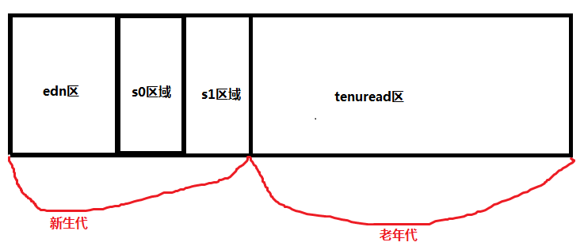

### Java栈

Java栈是一块线程私有的空间，一个栈，一般由三部分组成:局部变量表、操作数据栈和帧数据区

局部变量表：用于报错函数的参数及局部变量

操作数栈：主要保存计算过程的中间结果，同时作为计算过程中的变量临时的存储空间。

帧数据区:除了局部变量表和操作数据栈以外，栈还需要一些数据来支持常量池的解析，这里帧数据区保存着

访问常量池的指针，方便计程序访问常量池，另外当函数返回或出现异常时卖虚拟机子必须有一个异常处理表，方便发送异常

的时候找到异常的代码，因此异常处理表也是帧数据区的一部分。

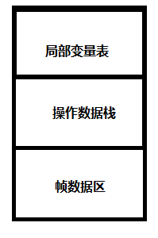

### Java方法区

Java方法区和堆一样，方法区是一块所有线程共享的内存区域，他保存系统的类信息。

比如类的字段、方法、常量池等。方法区的大小决定系统可以保存多少个类。如果系统

定义太多的类，导致方法区溢出。虚拟机同样会抛出内存溢出的错误。方法区可以理解

为永久区。

虚拟机参数配置
--------------

### 什么是虚拟机参数配置

在虚拟机运行的过程中，如果可以跟踪系统的运行状态，那么对于问题的故障排查会有一定的帮助，为此，在虚拟机提供了一些跟踪系统状态的参数，使用给定的参数执行Java虚拟机，就可以在系统运行时打印相关日志，用于分析实际问题。我们进行虚拟机参数配置，其实就是围绕着堆、栈、方法区、进行配置。

你说下 你熟悉那些jvm参数调优

### 堆的参数配置

**-XX:+PrintGC    每次触发GC的时候打印相关日志**

**-XX:+UseSerialGC 串行回收**

**-XX:+PrintGCDetails  更详细的GC日志**

**-Xms    堆初始值**

**-Xmx    堆最大可用值**

**-Xmn    新生代堆最大可用值**

**-XX:SurvivorRatio 用来设置新生代中eden空间和from/to空间的比例.**

**含以-XX:SurvivorRatio=eden/from=den/to**

**总结:在实际工作中，我们可以直接将初始的堆大小与最大堆大小相等，**

**这样的好处是可以减少程序运行时垃圾回收次数，从而提高效率。**

**-XX:SurvivorRatio 用来设置新生代中eden空间和from/to空间的比例.**

### 设置最大堆内存

**参数: -Xms5m -Xmx20m -XX:+PrintGCDetails -XX:+UseSerialGC
-XX:+PrintCommandLineFlags**

| /\*\* \* *jvm*参数设置 \* \* \@author Administrator \* \*/ public class JvmDemo01 { public static void main(String[] args) throws InterruptedException { byte[] *b1* = new byte[1 \* 1024 \* 1024]; System.*out*.println("分配了1m"); *jvmInfo*(); Thread.*sleep*(3000); byte[] *b2* = new byte[4 \* 1024 \* 1024]; System.*out*.println("分配了4m"); Thread.*sleep*(3000); *jvmInfo*(); } /\*\* \* 转换为m \* \* \@param maxMemory \* \@return \*/ static private String toM(long maxMemory) { float num = (float) maxMemory / (1024 \* 1024); DecimalFormat df = new DecimalFormat("0.00");// 格式化小数 String s = df.format(num);// 返回的是String类型 return s; } static private void jvmInfo() { // 最大内存 long maxMemory = Runtime.*getRuntime*().maxMemory(); System.*out*.println("maxMemory:" + maxMemory + ",转换为M:" + *toM*(maxMemory)); // 当前空闲内存 long freeMemory = Runtime.*getRuntime*().freeMemory(); System.*out*.println("freeMemory:" +freeMemory+",转换为M:"+*toM*(freeMemory)); // 已经使用内存 long totalMemory = Runtime.*getRuntime*().totalMemory(); System.*out*.println("totalMemory:" +totalMemory+",转换为M"+*toM*(totalMemory)); } } |
|------------------------------------------------------------------------------------------------------------------------------------------------------------------------------------------------------------------------------------------------------------------------------------------------------------------------------------------------------------------------------------------------------------------------------------------------------------------------------------------------------------------------------------------------------------------------------------------------------------------------------------------------------------------------------------------------------------------------------------------------------------------------------------------------------------------------------------------------------------------------------------------------------------------------------------------------------------------------------------------------------------------------------------------------------------------------------------------------------------------------------------------------------------------------------|

设置新生代与老年代优化参数
--------------------------

**-Xmn    新生代大小，一般设为整个堆的1/3到1/4左右**

**-XX:SurvivorRatio    设置新生代中eden区和from/to空间的比例关系n/1**

### 设置新生代比例参数

**参数: -Xms20m -Xmx20m -Xmn1m -XX:SurvivorRatio=2 -XX:+PrintGCDetails
-XX:+UseSerialGC**

| public class JvmDemo02 { public static void main(String[] args) { //-Xms20m -Xmx20m -Xmn1m -XX:SurvivorRatio=2 -XX:+PrintGCDetails -XX:+UseSerialGC byte [] *b* = null; for (int i = 0; i \< 10; i++) { b =new byte[1\*1024\*1024]; } } } |
|-------------------------------------------------------------------------------------------------------------------------------------------------------------------------------------------------------------------------------------------|

### 设置新生与老年代代参数

\-Xms20m -Xmx20m -XX:SurvivorRatio=2 -XX:+PrintGCDetails -XX:+UseSerialGC

\-Xms20m -Xmx20m -XX:SurvivorRatio=2 -XX:+PrintGCDetails -XX:+UseSerialGC

**-XX:NewRatio=2**

**总结:不同的堆分布情况，对系统执行会产生一定的影响，在实际工作中，**

**应该根据系统的特点做出合理的配置，基本策略：尽可能将对象预留在新生代，**

**减少老年代的GC次数。**

**除了可以设置新生代的绝对大小(-Xmn),可以使用(-XX:NewRatio)设置新生代和老年**

**代的比例:-XX:NewRatio=老年代/新生代**

内存溢出解决办法
----------------

### 设置堆内存大小

错误原因: java.lang.OutOfMemoryError: Java heap space

解决办法:设置堆内存大小 -Xms1m -Xmx70m -XX:+HeapDumpOnOutOfMemoryError

| public static void main(String[] args) throws InterruptedException { List\<Object\> list = new ArrayList\<\>(); Thread.*sleep*(3000); *jvmInfo*(); for (int i = 0; i \< 10; i++) { System.*out*.println("i:"+i); Byte [] bytes= new Byte[1\*1024\*1024]; list.add(bytes); *jvmInfo*(); } System.*out*.println("添加成功..."); } |
|---------------------------------------------------------------------------------------------------------------------------------------------------------------------------------------------------------------------------------------------------------------------------------------------------------------------------------|

### 设置栈内存大小

错误原因: java.lang.StackOverflowError

栈溢出 产生于递归调用，循环遍历是不会的，但是循环方法里面产生递归调用， 也会发生栈溢出。

解决办法:设置线程最大调用深度

**-Xss5m 设置最大调用深度**

| public class JvmDemo04 { private static int *count*; public static void count(){ try { *count*++; *count*(); } catch (Throwable e) { System.*out*.println("最大深度:"+*count*); e.printStackTrace(); } } public static void main(String[] args) { *count*(); } } |
|------------------------------------------------------------------------------------------------------------------------------------------------------------------------------------------------------------------------------------------------------------------|

Tomcat内存溢出在catalina.sh 修改JVM堆内存大
-------------------------------------------

JAVA_OPTS="-server -Xms800m -Xmx800m -XX:PermSize=256m -XX:MaxPermSize=512m
-XX:MaxNewSize=512m"

内存溢出与内存泄露的区别
------------------------

内存溢出 out of
memory，是指程序在申请内存时，没有足够的内存空间供其使用，出现out of
memory；比如申请了一个integer,但给它存了long才能存下的数，那就是内存溢出。

内存泄露 memory
leak，是指程序在申请内存后，无法释放已申请的内存空间，一次内存泄露危害可以忽略，但内存泄露堆积后果很严重，无论多少内存,迟早会被占光。

memory leak会最终会导致out of memory！

内存溢出就是你要求分配的内存超出了系统能给你的，系统不能满足需求，于是产生溢出。 

 内存泄漏是指你向系统申请分配内存进行使用(new)，可是使用完了以后却不归还(delete)，结果你申请到的那块内存你自己也不能再访问（也许你把它的地址给弄丢了），而系统也不能再次将它分配给需要的程序。一个盘子用尽各种方法只能装4个果子，你装了5个，结果掉倒地上不能吃了。这就是溢出！比方说栈，栈满时再做进栈必定产生空间溢出，叫上溢，栈空时再做退栈也产生空间溢出，称为下溢。就是分配的内存不足以放下数据项序列,称为内存溢出. 

以发生的方式来分类，内存泄漏可以分为4类： 

1.
常发性内存泄漏。发生内存泄漏的代码会被多次执行到，每次被执行的时候都会导致一块内存泄漏。 

2.
偶发性内存泄漏。发生内存泄漏的代码只有在某些特定环境或操作过程下才会发生。常发性和偶发性是相对的。对于特定的环境，偶发性的也许就变成了常发性的。所以测试环境和测试方法对检测内存泄漏至关重要。 

3.
一次性内存泄漏。发生内存泄漏的代码只会被执行一次，或者由于算法上的缺陷，导致总会有一块仅且一块内存发生泄漏。比如，在类的构造函数中分配内存，在析构函数中却没有释放该内存，所以内存泄漏只会发生一次。 

4.
隐式内存泄漏。程序在运行过程中不停的分配内存，但是直到结束的时候才释放内存。严格的说这里并没有发生内存泄漏，因为最终程序释放了所有申请的内存。但是对于一个服务器程序，需要运行几天，几周甚至几个月，不及时释放内存也可能导致最终耗尽系统的所有内存。所以，我们称这类内存泄漏为隐式内存泄漏。 

从用户使用程序的角度来看，内存泄漏本身不会产生什么危害，作为一般的用户，根本感觉不到内存泄漏的存在。真正有危害的是内存泄漏的堆积，这会最终消耗尽系统所有的内存。从这个角度来说，一次性内存泄漏并没有什么危害，因为它不会堆积，而隐式内存泄漏危害性则非常大，因为较之于常发性和偶发性内存泄漏它更难被检测到 

JVM参数调优总结
---------------

在JVM启动参数中，可以设置跟内存、垃圾回收相关的一些参数设置，默认情况不做任何设置JVM会工作的很好，但对一些配置很好的Server和具体的应用必须仔细调优才能获得最佳性能。通过设置我们希望达到一些目标：

GC的时间足够的小

GC的次数足够的少

发生Full GC的周期足够的长

前两个目前是相悖的，要想GC时间小必须要一个更小的堆，要保证GC次数足够少，必须保证一个更大的堆，我们只能取其平衡。

（1）针对JVM堆的设置，一般可以通过-Xms
-Xmx限定其最小、最大值，为了防止垃圾收集器在最小、最大之间收缩堆而产生额外的时间，我们通常把最大、最小设置为相同的值

 
（2）年轻代和年老代将根据默认的比例（1：2）分配堆内存，可以通过调整二者之间的比率NewRadio来调整二者之间的大小，也可以针对回收代，比如年轻代，通过
-XX:newSize
-XX:MaxNewSize来设置其绝对大小。同样，为了防止年轻代的堆收缩，我们通常会把-XX:newSize
-XX:MaxNewSize设置为同样大小

（3）年轻代和年老代设置多大才算合理？这个我问题毫无疑问是没有答案的，否则也就不会有调优。我们观察一下二者大小变化有哪些影响

-   更大的年轻代必然导致更小的年老代，大的年轻代会延长普通GC的周期，但会增加每次GC的时间；小的年老代会导致更频繁的Full
    GC

-   更小的年轻代必然导致更大年老代，小的年轻代会导致普通GC很频繁，但每次的GC时间会更短；大的年老代会减少Full
    GC的频率

-   如何选择应该依赖应用程序对象生命周期的分布情况：如果应用存在大量的临时对象，应该选择更大的年轻代；如果存在相对较多的持久对象，年老代应该适当增大。但很多应用都没有这样明显的特性，在抉择时应该根据以下两点：（A）本着Full
    GC尽量少的原则，让年老代尽量缓存常用对象，JVM的默认比例1：2也是这个道理
    （B）通过观察应用一段时间，看其他在峰值时年老代会占多少内存，在不影响Full
    GC的前提下，根据实际情况加大年轻代，比如可以把比例控制在1：1。但应该给年老代至少预留1/3的增长空间

注解
====

什么是注解？
------------

**Jdk1.5新增新技术，注解。很多框架为了简化代码，都会提供有些注解。可以理解为插件，是代码级别的插件，在类的方法上写：\@XXX，就是在代码上插入了一个插件。**

**注解不会也不能影响代码的实际逻辑，仅仅起到辅助性的作用。**

**注解分类：内置注解(也成为元注解 jdk 自带注解)、自定义注解（Spring框架）**

如何定义一个注解？
------------------

**代码:**

**使用\@interface 定义注解。**

| \@Target(value = { ElementType.*METHOD*, ElementType.*TYPE* }) \@Retention(RetentionPolicy.*RUNTIME*) **public \@interface** OneAnnotation { **int** beanId() **default** 0; String className() **default** ""; String[]arrays(); } |
|-------------------------------------------------------------------------------------------------------------------------------------------------------------------------------------------------------------------------------------|

说说自定义注解的场景及实现
--------------------------

（此题自由发挥，就看你对注解的理解了!==）登陆、权限拦截、日志处理，以及各种Java框架，如Spring，Hibernate，JUnit提到注解就不能不说反射，Java自定义注解是通过运行时靠反射获取注解。实际开发中，例如我们要获取某个方法的调用日志，可以通过AOP（动态代理机制）给方法添加切面，通过反射来获取方法包含的注解，如果包含日志注解，就进行日志记录。

GC
==

你知道哪些垃圾回收算法?
-----------------------

垃圾回收从理论上非常容易理解,具体的方法有以下几种:

1. 标记-清除

2. 标记-复制

3. 标记-整理

4. 分代回收

如何判断一个对象是否应该被回收
------------------------------

这就是所谓的对象存活性判断，常用的方法有两种：1.引用计数法; 2.对象可达性分析。由
于引用计数法存在互相引用导致无法进行 GC 的问题，所以目前 JVM
虚拟机多使用对象可达性分析算法。

简单的解释一下垃圾回收
----------------------

Java 垃圾回收机制最基本的做法是分代回收。内存中的区域被划分成不同的世代，对象根
据其存活的时间被保存在对应世代的区域中。一般的实现是划分成 3
个世代：年轻、年老和
永久。内存的分配是发生在年轻世代中的。当一个对象存活时间足够长的时候，它就会被复
制到年老世代中。对于不同的世代可以使用不同的垃圾回收算法。进行世代划分的出发点是
对应用中对象存活时间进行研究之后得出的统计规律。一般来说，一个应用中的大部分对象
的存活时间都很短。比如局部变量的存活时间就只在方法的执行过程中。基于这一点，对于年轻世代的垃圾回收算法就可以很有针对性。

java 当中的四种引用
-------------------

强引用，软引用，弱引用，虚引用。不同的引用类型主要体现在 GC 上:

强引用：如果一个对象具有强引用，它就不会被垃圾回收器回收。即使当前内存空
间不足，JVM 也不会回收它，而是抛出 OutOfMemoryError 错误，使程序异常终止。
如果想中断强引用和某个对象之间的关联，可以显式地将引用赋值为 null，这样一
来的话，JVM 在合适的时间就会回收该对象。

软引用：在使用软引用时，如果内存的空间足够，软引用就能继续被使用，而不会
被垃圾回收器回收，只有在内存不足时，软引用才会被垃圾回收器回收。

虚引用：顾名思义，就是形同虚设，如果一个对象仅持有虚引用，那么它相当于没
有引用，在任何时候都可能被垃圾回收器回收。

调用 System.gc()会发生什么?
---------------------------

通知 GC 开始工作，但是 GC 真正开始的时间不确定。

GC是什么，为什么要使用它？【阿斯拓】
------------------------------------

**GC是垃圾收集的意思（GabageCollection）**,内存处理是编程人员容易出现问题的地方，忘记或者错误的内存回收会导致程序或系统的不稳定甚至崩溃，Java提供的GC功能**可以自动监测对象是否超过作用域，从而达到自动回收内存的目的，**Java语言没有提供释放已分配内存的显示操作方法。

说一下垃圾回收的原理，可以直接从内存中回收吗?
---------------------------------------------

**Java语言中一个显著的特点就是引入了垃圾回收机制**，使c++程序员最头疼的内存管理的问题迎刃而解，它**使得Java程序员在编写程序的时候不再需要考虑内存管理。垃圾回收可以有效的防止内存泄露，有效的使用可以使用的内存。垃圾回收器通常是作为一个单独的低级别的线程运行**，不可预知的情况下对内存堆中已经死亡的或者长时间没有使用的对象进行清除和回收，程序员不能实时的调用垃圾回收器对某个对象或所有对象进行垃圾回收,因为Java语言规范并不保证GC一定会执行。回收机制有分代复制垃圾回收和标记垃圾回收，增量垃圾回收。

垃圾回收机制概述
----------------

Java语言中一个显著的特点就是引入了垃圾回收机制，使c++程序员最头疼的内存管理的问题迎刃而解，它使得Java程序员在编写程序的时候不再需要考虑内存管理。由于有个垃圾回收机制，Java中的对象不再有“作用域”的概念，只有对象的引用才有“作用域”。垃圾回收可以有效的防止内存泄露，有效的使用空闲的内存。

ps:内存泄露是指该内存空间使用完毕之后未回收，在不涉及复杂数据结构的一般情况下，Java
的内存泄露表现为一个内存对象的生命周期超出了程序需要它的时间长度，我们有时也将其称为“对象游离”。

垃圾回收简要过程
----------------

这里必须点出一个很重要的误区：不可达的对象并不会马上就会被直接回收，而是至少要经过两次标记的过程。** **

**       **第一次被标记过的对象，会检查该对象是否重写了finalize()方法。如果重写了该方法，则将其放入一个F-Query队列中，否则，直接将对象加入“即将回收”集合。在第二次标记之前，F-Query队列中的所有对象会逐个执行finalize()方法，但是不保证该队列中所有对象的finalize()方法都能被执行，这是因为JVM创建一个低优先级的线程去运行此队列中的方法，很可能在没有遍历完之前，就已经被剥夺了运行的权利。那么运行finalize()方法的意义何在呢？这是对象避免自己被清理的最后手段：如果在执行finalize()方法的过程中，使得此对象重新与GC
Roots引用链相连，则会在第二次标记过程中将此对象从F-Query队列中清除，避免在这次回收中被清除，恢复成了一个“正常”的对象。但显然这种好事不能无限的发生，对于曾经执行过一次finalize()的对象来说，之后如果再被标记，则不会再执行finalize()方法，只能等待被清除的命运。** **

**       **之后，GC将对F-Queue中的对象进行第二次小规模的标记，将队列中重新与GC
Roots引用链恢复连接的对象清除出“即将回收”集合。所有此集合中的内容将被回收。

手动GC回收
----------

| **public class** JVMDemo05 { **public static void** main(String[] args) { JVMDemo05 *jvmDemo05* = **new** JVMDemo05(); //jvmDemo05 = null; System.*gc*(); } **protected void** finalize() **throws** Throwable { System.*out*.println("gc在回收对象..."); } } |
|---------------------------------------------------------------------------------------------------------------------------------------------------------------------------------------------------------------------------------------------------------------|

finalize作用
------------

Java技术使用finalize()方法在垃圾收集器将对象从内存中清除出去前，做必要的清理工作。这个方法是由垃圾收集器在确定这个对象没有被引用时对这个对象调用的。它是在Object类中定义的，因此所有的类都继承了它。子类覆盖finalize()方法以整理系统资源或者执行其他清理工作。finalize()方法是在垃圾收集器删除对象之前对这个对象调用的。

垃圾回收机制算法
----------------

### 引用计数法

##### 概述

给对象中添加一个引用计数器，每当有一个地方引用它时，计数器值就加1；当引用失效时，计数器值就减1；任何时刻计数器都为0的对象就是不再被使用的，垃圾收集器将回收该对象使用的内存。

##### 优缺点

优点：

引用计数收集器可以很快的执行，交织在程序运行中。对程序需要不被长时间打断的实时环境比较有利。

缺点：

无法检测出循环引用。如父对象有一个对子对象的引用，子对象反过来引用父对象。这样，他们的引用计数永远不可能为0.而且每次加减非常浪费内存。

### 标记清除算法

标记-清除（Mark-Sweep）算法顾名思义，主要就是两个动作，一个是标记，另一个就是清除。

标记就是根据特定的算法（如：引用计数算法，可达性分析算法等）标出内存中哪些对象可以回收，哪些对象还要继续用。

标记指示回收，那就直接收掉；标记指示对象还能用，那就原地不动留下。

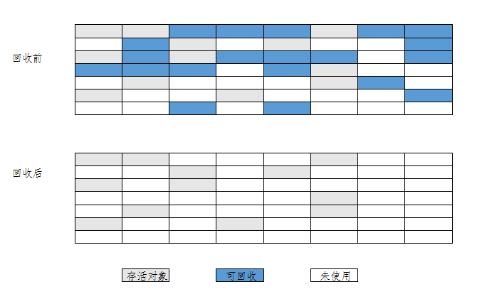

**缺点**

标记与清除效率低;

清除之后内存会产生大量碎片；

所以碎片这个问题还得处理，怎么处理，看标记-整理算法。

### 复制算法

S0和s1将可用内存按容量分成大小相等的两块，每次只使用其中一块，当这块内存使用完了，就将还存活的对象复制到另一块内存上去，然后把使用过的内存空间一次清理掉。这样使得每次都是对其中一块内存进行回收，内存分配时不用考虑内存碎片等复杂情况，只需要移动堆顶指针，按顺序分配内存即可，实现简单，运行高效。

复制算法的缺点显而易见，可使用的内存降为原来一半。

**复制算法用于在新生代垃圾回收**

### 标记-压缩算法

标记压缩法在标记清除基础之上做了优化，把存活的对象压缩到内存一端,而后进行垃圾清理。(java中老年代使用的就是标记压缩法)

### 分代收集算法

根据内存中对象的存活周期不同，将内存划分为几块，java的虚拟机中一般把内存划分为新生代和年老代，当新创建对象时一般在新生代中分配内存空间，当新生代垃圾收集器回收几次之后仍然存活的对象会被移动到年老代内存中，当大对象在新生代中无法找到足够的连续内存时也直接在年老代中创建。

对于新生代和老年代来说,新生代回收频率很高,但是每次回收耗时很短,而老年代回收频率较低,但是耗时会相对较长,所以应该尽量减少老年代的GC.

### 为什么老年代使用标记压缩、新生代使用复制算法。

### 垃圾回收时的停顿现象

垃圾回收的任务是识别和回收垃圾对象进行内存清理，为了让垃圾回收器可以更高效的执行，大部分情况下，会要求系统进如一个停顿的状态。停顿的目的是为了终止所有的应用线程，只有这样的系统才不会有新垃圾的产生。同时停顿保证了系统状态在某一个瞬间的一致性，也有利于更好的标记垃圾对象。因此在垃圾回收时，都会产生应用程序的停顿。

垃圾收集器
----------

### 什么是Java垃圾回收器

Java垃圾回收器是Java虚拟机(JVM)的三个重要模块(另外两个是解释器和多线程机制)之一，为应用程序提供内存的**自动分配(Memory
Allocation)、自动回收(Garbage
Collect)**功能，这两个操作都发生在Java堆上(一段内存快)。某一个时点，一个对象如果有一个以上的引用(Rreference)指向它，那么该对象就为活着的(Live)，否则死亡(Dead)，视为垃圾，可被垃圾回收器回收再利用。**垃圾回收操作需要消耗CPU、线程、时间等资源**，所以容易理解的是**垃圾回收操作不是实时的发生**(对象死亡马上释放)，当内存消耗完或者是达到某一个指标(Threshold,使用内存占总内存的比列，比如0.75)时，触发垃圾回收操作。有一个对象死亡的例外，java.lang.Thread类型的对象即使没有引用，只要线程还在运行，就不会被回收。

### 串行回收器(Serial Collector)

单线程执行回收操作，回收期间暂停所有应用线程的执行，client模式下的默认回收器，通过-XX:+UseSerialGC命令行可选项强制指定。**参数可以设置使用新生代串行和老年代串行回收器**

年轻代的回收算法(Minor Collection)

把Eden区的存活对象移到To区，To区装不下直接移到年老代，把From区的移到To区，To区装不下直接移到年老代，From区里面年龄很大的升级到年老代。
回收结束之后，Eden和From区都为空，此时把From和To的功能互换，From变To，To变From，每一轮回收之前To都是空的。设计的选型为复制。

年老代的回收算法(Full Collection)

年老代的回收分为三个步骤，标记(Mark)、清除(Sweep)、合并(Compact)。标记阶段把所有存活的对象标记出来，清除阶段释放所有死亡的对象，合并阶段
把所有活着的对象合并到年老代的前部分，把空闲的片段都留到后面。设计的选型为合并，减少内存的碎片。

### 并行回收

##### 并行回收器(ParNew回收器)

并行回收器在串行回收器基础上做了改进，他可以使用多个线程同时进行垃

圾回收，对于计算能力强的计算机而言，可以有效的缩短垃圾回收所需的尖

际时间。

**ParNew回收器是一个工作在新生代的垃圾收集器**，他只是简单的将串行回收

器多线程快他的回收策略和算法和串行回收器一样。

使用**XX:+UseParNewGC 新生代ParNew回收器**，老年代则使用市行回收器

ParNew回收器工作时的线程数量可以使用**XX:ParaleiGCThreads**参数指

定，一般最好和计算机的CPU相当，避免过多的栽程影响性能。

##### 并行回收集器(ParallelGC)

老年代ParallelOldGC回收器也是一种多线程的回收器，和新生代的ParallelGC回收器一样，也是一种关往吞吐量的回收器，他使用了标记压缩算法进行实现。

\-XX:+UseParallelOldGC 进行设置

\-XX:+ParallelCThread也可以设置垃圾收集时的线程教量。

### 串行并行回收区别

串行单核，并行多核，后者效率高。

### 并CMS(并发GC)收集器

CMS(Concurrent Mark
Sweep)收集器是一种以获取最短回收停顿时间为目标的收集器。CMS收集器是基于“标记-清除”算法实现的，整个收集过程大致分为4个步骤：

①.初始标记(CMS initial mark)

②.并发标记(CMS concurrenr mark)

③.重新标记(CMS remark)

④.并发清除(CMS concurrent sweep)

 
 其中初始标记、重新标记这两个步骤任然需要停顿其他用户线程。初始标记仅仅只是标记出GC
ROOTS能直接关联到的对象，速度很快，并发标记阶段是进行GC ROOTS
根搜索算法阶段，会判定对象是否存活。而重新标记阶段则是为了修正并发标记期间，因用户程序继续运行而导致标记产生变动的那一部分对象的标记记录，这个阶段的停顿时间会被初始标记阶段稍长，但比并发标记阶段要短。

 
 由于整个过程中耗时最长的并发标记和并发清除过程中，收集器线程都可以与用户线程一起工作，所以整体来说，CMS收集器的内存回收过程是与用户线程一起并发执行的。

CMS收集器的优点：并发收集、低停顿，但是CMS还远远达不到完美，器主要有三个显著缺点：

CMS收集器对CPU资源非常敏感。在并发阶段，虽然不会导致用户线程停顿，但是会占用CPU资源而导致引用程序变慢，总吞吐量下降。CMS默认启动的回收线程数是：(CPU数量+3)
/ 4。

CMS收集器无法处理浮动垃圾，可能出现“Concurrent Mode
Failure“，失败后而导致另一次Full
 GC的产生。由于CMS并发清理阶段用户线程还在运行，伴随程序的运行自热会有新的垃圾不断产生，这一部分垃圾出现在标记过程之后，CMS无法在本次收集中处理它们，只好留待下一次GC时将其清理掉。这一部分垃圾称为“浮动垃圾”。也是由于在垃圾收集阶段用户线程还需要运行，

即需要预留足够的内存空间给用户线程使用，因此CMS收集器不能像其他收集器那样等到老年代几乎完全被填满了再进行收集，需要预留一部分内存空间提供并发收集时的程序运作使用。在默认设置下，CMS收集器在老年代使用了68%的空间时就会被激活，也可以通过参数-XX:CMSInitiatingOccupancyFraction的值来提供触发百分比，以降低内存回收次数提高性能。要是CMS运行期间预留的内存无法满足程序其他线程需要，就会出现“Concurrent
Mode Failure”失败，这时候虚拟机将启动后备预案：临时启用Serial
Old收集器来重新进行老年代的垃圾收集，这样停顿时间就很长了。所以说参数-XX:CMSInitiatingOccupancyFraction设置的过高将会很容易导致“Concurrent
Mode Failure”失败，性能反而降低。

最后一个缺点，CMS是基于“标记-清除”算法实现的收集器，使用“标记-清除”算法收集后，会产生大量碎片。空间碎片太多时，将会给对象分配带来很多麻烦，比如说大对象，内存空间找不到连续的空间来分配不得不提前触发一次Full
 GC。为了解决这个问题，CMS收集器提供了一个-XX:UseCMSCompactAtFullCollection开关参数，用于在Full
 GC之后增加一个碎片整理过程，还可通过-XX:CMSFullGCBeforeCompaction参数设置执行多少次不压缩的Full
 GC之后，跟着来一次碎片整理过程。

### G1回收器

G1回收器(Garbage-First)实在]dk1.7中提出的垃圾回收器，从长期目标来看是为了取

代CMS回收器，G1回收器拥有独特的垃圾回收策略，G1属于分代垃圾回收器，区分

新生代和老年代，依然有eden和from/to区,它并不要求整个eden区或者新生代、老

年代的空间都连续，它使用了分区算法。

并行性: G1回收期间可多线程同时工作。

井发性G1拥有与应用程序交替执行能力，部分工作可与应用程序同时执行，在整个

GC期间不会完全阻塞应用程序。

分代GC:G1依然是一个分代的收集器，但是它是非两新生代和老年代一杯政的杂尊。

空间基理，G1在国收过程中，不会微CMS那样在若千tacAy 要进行碎片整理。

G1

来用了有效复制对象的方式，减少空间碎片。

利得程，用于分区的原因，G可以贝造取都分区城进行回收，帽小了国收的格想，

提升了性能。

使用.XXX:+UseG1GC 应用G1收集器，

Mills指定最大停顿时间

使用-XX:MaxGCPausel

设置并行回收的线程数量

使用-XX:ParallelGCThreads

调优总结
--------

初始堆值和最大堆内存内存越大，吞吐量就越高。

最好使用并行收集器,因为并行手机器速度比串行吞吐量高，速度快。

设置堆内存新生代的比例和老年代的比例最好为1:2或者1:3。

减少GC对老年代的回收。

### JVM工作原理？

运行jvm字符码的工作是由解释器来完成的。解释执行过程分三步进行：

代码的装入、代码的校验、和代码的执行。

装入代码的工作由“类装载器classloader”完成。类装载器负责装入运行一个程序需要的所有代码，这也包括程序代码中的类所继承的类和被调用的类。当类装载器装入一个类时，该类被放在自己的名字空间中。除了通过符号引用自己名字空间以外的类，类之间没有其他办法可以影响其他类。在本台计算机的所有类都在同一地址空间中，而所有从外部引进的类，都有一个自己独立的名字空间。这使得本地类通过共享相同的名字空间获得较高的运行效率，同时又保证它们与从外部引进的类不会相互影响。当装入了运行程序需要的所有类后，解释器便可确定整个可执行程序的内存布局。解释器为符号引用与特定的地址空间建立对应关系及查询表。通过在这一阶段确定代码的内布局，java很好地解决了由超类改变而使子类

崩溃的问题，同时也防止了代码的非法访问。随后，被装入的代码由字节码校验器进行检查。校验器可以发现操作数栈益处、非法数据类型转化等多种错误。通过校验后，代码便开始执行了。

Java字节码的执行有两种方式：

1）即时编译方式：解释器先将字节编译成机器码，然后再执行该机器码。

2）解释执行方式：解释器通过每次解释并执行一小段代码来完成java字节。

码程序的所有操作。

### JVM加载class文件原理？

所谓装载就是寻找一个类或是一个接口的二进制形式并用该二进制形式来构造代表这个类或是这个接口的class对象的过程.

在Java中，类装载器把一个类装入Java虚拟机中，要经过三个步骤来完成：装载、链接和初始化,其中链接又可以分成校验、准备、解析

装载：查找和导入类或接口的二进制数据；

链接：执行下面的校验、准备和解析步骤，其中解析步骤是可以选择的；

校验：检查导入类或接口的二进制数据的正确性；

准备：给类的静态变量分配并初始化存储空间；

解析：将符号引用转成直接引用；

初始化：激活类的静态变量的初始化Java代码和静态Java代码块

JVM中类的装载是由ClassLoader和它的子类来实现的,JavaClassLoader是一个重要的Java运行时系统组件。它负责在运行时查找和装入类文件的类

一个Java应用程序使用两种类型的类装载器：根装载器(bootstrap)和用户定义的装载器(user-defined)。

根装载器以某种默认的方式将类装入，包括那些JavaAPI的类。在运行期间一个Java程序能安装用户自己定义的类装载器。根装载器是虚拟机固有的一部分，而用户定义的类装载器则不是，它是用Java语言写的，被编译成class文件之后然后再被装入到虚拟机，并像其它的任何对象一样可以被实例化。Java类装载器的体系结构如下所示：

Bootstrap(根装载器)

\|

Extension(扩展装载器)

\|

System

\|

UserDefine1

/\\

UserDefine2UserDefine3

\|

UserDefine4

Java的类装载模型是一种代理(delegation)模型。当JVM要求类装载器CL(ClassLoader)装载一个类时,CL首先将这个类装载请求转发给他的父装载器。只有当父装载器没有装载并无法装载这个类时,CL才获得装载这个类的机会。这样,所有类装载器的代理关系构成了一种树状的关系。树的根是类的根装载器(bootstrapClassLoader),在JVM中它以"null"表示。除根装载器以外的类装载器有且仅有一个父装载器。在创建一个装载器时,如果没有显式地给出父装载器,那么JVM将默认系统装载器为其父装载器

下面针对各种类装载器分别进行详细的说明：

根(Bootstrap)装载器:该装载器没有父装载器，它是JVM实现的一部分，从sun.boot.class.path装载运行时库的核心代码。

扩展(Extension)装载器:继承的父装载器为根装载器，不像根装载器可能与运行时的操作系统有关，这个类装载器是用纯Java代码实现的，它从java.ext.dirs(扩展目录)中装载代码。

系统(SystemorApplication)装载器:装载器为扩展装载器，我们都知道在安装JDK的时候要设置环境变量(CLASSPATH)，这个类装载器就是从java.class.path(CLASSPATH环境变量)中装载代码的，它也是用纯Java代码实现的，同时还是用户自定义类装载器的缺省父装载器。

小应用程序(Applet)装载器:装载器为系统装载器，它从用户指定的网络上的特定目录装载小应用程序代码。

### 说说Java中的内存分配?

Java把内存分成两种，一种叫做栈内存，一种叫做堆内存

在函数中定义的一些基本类型的变量和对象的引用变量都是在函数的栈内存中分配。当在一段代码块中定义一个变量时，java就在栈中为这个变量分配内存空间，当超过变量的作用域后，java会自动释放掉为该变量分配的内存空间，该内存空间可以立刻被另作它用。

堆内存用于存放由new创建的对象和数组。在堆中分配的内存，由java虚拟机自动垃圾回收器来管理。在堆中产生了一个数组或者对象后，还可以在栈中定义一个特殊的变量，这个变量的取值等于数组或者对象在堆内存中的首地址，在栈中的这个特殊的变量就变成了数组或者对象的引用变量，以后就可以在程序中使用栈内存中的引用变量来访问堆中的数组或者对象，引用变量相当于为数组或者对象起的一个别名，或者代号。

引用变量是普通变量，定义时在栈中分配内存，引用变量在程序运行到作用域外释放。而数组＆对象本身在堆中分配，即使程序运行到使用new产生数组和对象的语句所在地代码块之外，数组和对象本身占用的堆内存也不会被释放，数组和对象在没有引用变量指向它的时候，才变成垃圾，不能再被使用，但是仍然占着内存，在随后的一个不确定的时间被垃圾回收器释放掉。这个也是java比较占内存的主要原因。但是在写程序的时候，可以人为的控制。

### GC经常回收好不好

不好，GC在回收线程的时候，其他线程全部等待。时间很短，速度快，看不到效果。

### 为什么老年代使用标记压缩、新生代使用复制算法。

### 说下你熟悉那些jvm参数调优

\-XX:+UseSerialGC 设置使用新生代串行和老年代串行回收器

XX:+UseParNewGC新生代并行回收器

### 串行回收和并行回收的区别

串行是单线程回收，效率较慢

并行回收是多线程回收，效率快。

cms也是并行。

### ClassLoader如何加载class。

jvm里有多个类加载，每个类加载可以负责加载特定位置的类，例如，bootstrap类加载负责加载jre/lib/rt.jar中的类，我们平时用的jdk中的类都位于rt.jar中。extclassloader负责加载jar/lib/ext/\*.jar中的类，appclassloader负责classpath指定的目录或jar中的类。除了bootstrap之外，其他的类加载器本身也都是java类，它们的父类是ClassLoader。

新特性
======

JDK 1.7 特性
------------

然 JDK 1.7 不 像 JDK 5 和 8 一 样 的 大 版 本 ， 但 是 ， 还 是 有 很 多 新 的
特 性 ， 如 try-with-resource
语句，这样你在使用流或者资源的时候，就不需要手动关闭，Java 会自动
关闭。Fork-Join 池某种程度上实现 Java 版的 Map-reduce。允许 Switch 中有 String
变量
和文本。菱形操作符(\<\>)用于类型推断，不再需要在变量声明的右边申明泛型，因此可以写
出可读写更强、更简洁的代码。

JDK 1.8 特性
------------

java 8 在 Java 历史上是一个开创新的版本，下面 JDK 8 中 5 个主要的特性：
Lambda表达式，允许像对象一样传递匿名函数 Stream API，充分利用现代多核
CPU，可以写出很简洁的代码 Date 与 Time
API，最终，有一个稳定、简单的日期和时间库可供你使用
扩展方法，现在，接口中可以有静态、默认方法。

重复注解，现在你可以将相同的注解在同一类型上使用多次。

JDK6的新特性？
--------------

1、在JDK6中AWT新增加了两个类:Desktop和SystemTray。前者可以用来打开系统默认浏览器浏览指定的URL,打开系统默认邮件客户端给指定的邮箱发邮件,用默认应用程序打开或编辑文件(比如,用记事本打开以txt为后缀名的文件),用系统默认的打印机打印文档;后者可以用来在系统托盘区创建一个托盘程序。

2、轻量级HttpServer。

JDK6提供了一个简单的HttpServerAPI,据此我们可以构建自己的嵌入式HttpServer,它支持Http和Https协议,提供了HTTP1.1的部分实现，没有被实现的那部分可以通过扩展已有的HttpServerAPI来实现,程序员必须自己实现HttpHandler接口。

3、嵌入式数据库Derby。Derby并不是一个新的数据库产品,它是由IBM捐献给Apache的DB项目的一个纯Java数据库,JDK6.0里面带的这个Derby的版本是10.2.1.7,支持存储过程和触发器;有两种运行模式,一种是作为嵌入式数据库,另一种是作为网络数据库,前者的数据库服务器和客户端都在同一个JVM里面运行。

4、使用CompilerAPI。动态编译Java源文件，CompilerAPI结合反射功能就可以实现动态的产生Java代码并编译执行这些代码，有点动态语言的特征。这个特性对于某些需要用到动态编译的应用程序相当有用，比如JSPWebServer，当我们手动修改JSP后，是不希望需要重启WebServer才可以看到效果的，这时候我们就可以用CompilerAPI来实现动态编译JSP文件，当然，现在的JSPWebServer也是支持JSP热部署的，现在的JSPWebServer通过在运行期间通过Runtime.exec或ProcessBuilder来调用javac来编译代码，这种方式需要我们产生另一个进程去做编译工作，不够优雅而且容易使代码依赖与特定的操作系统；CompilerAPI通过一套易用的标准的API提供了更加丰富的方式去做动态编译,而且是跨平台的。

其它略........像还有用Console开发控制台程序、JTable的排序和过滤、插入式注解等。。。。

Jdk1.5的新特性？
----------------

JDK1.5的一个重要主题就是通过新增一些特性来简化开发，这些特性主要包括：**泛型、ForEach循环、自动装包/拆包、枚举、可变参数、静态导入这些。**

反射
====

**反射  **

**反射技术：**其实就是动态加载一个指定的类，并获取该类中的所有的内容。而且将字节

码文件封装成对象，并将字节码文件中的内容都封装成对象，这样便于操作这些成员。

**简单说：反射技术可以对一个类进行解剖。 反射的好处：大大的增强了程序的扩展性。**

**反射的基本步骤： **

获得Class对象，就是获取到指定的名称的字节码文件对象。

实例化对象，获得类的属性、方法或构造函数。

访问属性、调用方法、调用构造函数创建对象。

**获取这个Class对象，有三种方式： **

1：通过每个对象都具备的方法getClass来获取。弊端：必须要创建该类对象，才可以调用getClass方法。 

2：每一个数据类型(基本数据类型和引用数据类型)都有一个静态的属性class。弊端：必须要先明确该类。 

前两种方式不利于程序的扩展，因为都需要在程序使用具体的类来完成。 

3：使用的Class类中的方法，静态的forName方法。 

指定什么类名，就获取什么类字节码文件对象，这种方式的扩展性最强，只要将类名的字符串传入即可。 

**// 1. 根据给定的类名来获得  用于类加载 **

String classname = "cn.itcast.reflect.Person";// 来自配置文件

Class clazz = Class.forName(classname);// 此对象代表Person.class

**// 2. 如果拿到了对象，不知道是什么类型   用于获得对象的类型 **

Object obj = new Person(); 

Class clazz1 = obj.getClass();// 获得对象具体的类型 

**// 3. 如果是明确地获得某个类的Class对象  主要用于传参**

Class clazz2 = Person.class; 

**反射的用法：** 

**1）、需要获得java类的各个组成部分，首先需要获得类的Class对象，获得Class对象的三种方式： **

Class.forName(classname) 用于做类加载 

obj.getClass() 用于获得对象的类型 

类名.class     用于获得指定的类型，传参用 

**2)、反射类的成员方法：** 

Class clazz = Person.class; 

Method method = clazz.getMethod(methodName, new Class[]{paramClazz1, paramClazz2}); 

method.invoke(); 

**3)、反射类的构造函数：** 

Constructor con = clazz.getConstructor(new Class[]{paramClazz1, paramClazz2,...}) con.newInstance(params...)

**4)、反射类的属性：** 

Field field = clazz.getField(fieldName); 

field.setAccessible(true);

field.setObject(value); 

**获取了字节码文件对象后，最终都需要创建指定类的对象：** 

**创建对象的两种方式(其实就是对象在进行实例化时的初始化方式)：** 

1，调用空参数的构造函数：使用了Class类中的**newInstance()**方法。 

2，调用带参数的构造函数：先要获取指定参数列表的构造函数对象，然后通过该构造函数的**对象的newInstance(实际参数) **进行对象的初始化。 

综上所述，第二种方式，必须要先明确具体的构造函数的参数类型，不便于扩展。

**所以一般情况下，被反射的类，内部通常都会提供一个公有的空参数的构造函数。**

\------------------------------------------------------

**// 如何生成获取到字节码文件对象的实例对象。** 

Class clazz = Class.**forName**("cn.itcast.bean.Person");//类加载 

>   // 直接获得指定的类型 

clazz = Person.class; 

>   // 根据对象获得类型 

Object obj = new Person("zhangsan", 19); 

clazz = obj.getClass(); 

Object obj = clazz**.new
Instance()**;//该实例化对象的方法调用就是指定类中的空参数构造函数，给创建对象进行初始化。当指定类中没有空参数构造函数时，该如何创建该类对象呢？请看method_2(); 

public static void method_2() throws Exception { 

Class clazz = Class.forName("cn.itcast.bean.Person"); 

//既然类中没有空参数的构造函数,那么只有获取指定参数的构造函数,用该函数来进行实例化。 

**//获取一个带参数的构造器。** 

Constructor constructor = clazz.getConstructor(String.class,int.class);

//想要对对象进行初始化，使用构造器的方法newInstance(); 

Object obj = constructor.newInstance("zhagnsan",30);

**//获取所有构造器。 **

**Constructor[] constructors = clazz.getConstructors();//只包含公共的 **

**constructors = clazz.getDeclaredConstructors();//包含私有的 **

**for(Constructor con : constructors) { System.out.println(con); **

**} **

**} **

**反射指定类中的方法：** 

**//获取类中所有的方法。** 

public static void method_1() throws Exception { 

Class clazz = Class.forName("cn.itcast.bean.Person"); 

Method[] methods = clazz.getMethods();//获取的是该类中的公有方法和父类中的公有方法。 

methods = clazz.getDeclaredMethods();//获取本类中的方法，包含私有方法。

for(Method method : methods) { System.out.println(method); 

} 

} 

**//获取指定方法；** 

public static void method_2() throws Exception { 

Class clazz = Class.forName("cn.itcast.bean.Person"); 

**//获取指定名称的方法。 **

Method method = clazz.getMethod("show", int.class,String.class); 

**//想要运行指定方法，当然是方法对象最清楚，为了让方法运行，调用方法对象的invoke方法即可，但是方法运行必须要明确所属的对象和具体的实际参数。 **

Object obj = clazz.newInstance(); 

method.invoke(obj, 39,"hehehe");//执行一个方法 } 

**//想要运行私有方法。** 

public static void method_3() throws Exception { 

Class clazz = Class.forName("cn.itcast.bean.Person");

**//想要获取私有方法。必须用getDeclearMethod(); **

Method method = clazz.getDeclaredMethod("method", null); 

**// 私有方法不能直接访问，因为权限不够。非要访问，可以通过暴力的方式。 **

**method.setAccessible(true);**//一般很少用，因为私有就是隐藏起来，所以尽量不要访问。 } 

**//反射静态方法。** 

public static void method_4() throws Exception { 

Class clazz = Class.forName("cn.itcast.bean.Person"); 

Method method = clazz.getMethod("function",null);

method.invoke(null,null); 

} 

什么是Java反射
--------------

Reflection是Java程序开发语言的特征之一，它允许运行中的Java程序对自身进行检查，或者说"自审"，并能直接操作程序的内部属性。

就是正在运行，动态获取这个类的所有信息。

Java反射的主要功能：
--------------------

1，反编译：.class--\>.java

  2．通过反射机制访问java对象的属性，方法，构造方法等；

Java反射机制主要提供了以下功能：在运行时构造一个类的对象；判断一个类所具有的成员变量和方法；调用一个对象的方法；生成动态代理。

>   确定一个对象的类

>   取出类的modifiers,数据成员,方法,构造器,和超类.

>   找出某个接口里定义的常量和方法说明.

>   创建一个类实例,这个实例在运行时刻才有名字(运行时间才生成的对象).

>   取得和设定对象数据成员的值,如果数据成员名是运行时刻确定的也能做到.

>   在运行时刻调用动态对象的方法.

>   创建数组,数组大小和类型在运行时刻才确定,也能更改数组成员的值.

反射的应用场景
--------------

反射最大的应用就是框架

Spring ioc

框架

spring的ioc/di也是反射….

javaBean和jsp之间调用也是反射….

struts的FormBean和页面之间…也是通过反射调用….

JDBC的classForName()也是反射…..

hibernate的find(Classclazz)也是反射….

反射还有一个不得不说的问题，就是性能问题，大量使用反射系统性能大打折扣。怎么使用使你的系统达到最优就看你系统架构和综合使用问题啦，这里就不多说了。

来源：[http://uule.iteye.com/blog/1423512](https://link.jianshu.com/?t=http%3A%2F%2Fuule.iteye.com%2Fblog%2F1423512)

反射的原理
----------

java反射机制是在运行当中，对任何一个类，能够知道它的所有属性和方法，都能调用他的任何一个属性和方法。

概述反射和序列化
----------------

Reflection:是Java被视为动态语言的一个关键性质。这个机制允许程序在运行时透过ReflectionAPIs取得任何一个已知名称的class的内部信息，包括其modifiers（诸如public,static等等）、superclass（例如Object）、实现之interfaces（例如Cloneable），也包括fields和methods的所有信息，并可于运行时改变fields内容或唤起methods。

序列化:就是一种用来处理对象流的机制，所谓对象流也就是将对象的内容进行流化。可以对流化后的对象进行读写操作，也可将流化后的对象传输于网络之间。序列化是为了解决在对对象流进行读写操作时的问题。

反射机制的作用
--------------

反射机制获取类有三种方法
------------------------

| //第一种方式： *Classc1* = Class.*forName*("Employee"); //第二种方式： //java中每个类型都有class 属性. *Classc2* = *Employee*.class; //第三种方式： //java语言中任何一个java对象都有getClass 方法 *Employeee* = new *Employee*(); *Classc3* = *e*.getClass(); //c3是运行时类 (e的运行时类是Employee) |
|------------------------------------------------------------------------------------------------------------------------------------------------------------------------------------------------------------------------------------------------------------------------------------------------------|

反射创建对象的方式
------------------

| Class\<?\> forName = Class.forName("com.itmayiedu.entity.User"); // 创建此Class 对象所表示的类的一个新实例 调用了User的无参数构造方法. Object newInstance = forName.newInstance(); |
|------------------------------------------------------------------------------------------------------------------------------------------------------------------------------------|

实例化有参构造函数

| Class\<?\> forName = Class.*forName*("com.itmayiedu.entity.User"); Constructor\<?\> constructor = forName.getConstructor(String.class, String.class); User *newInstance* = (User) constructor.newInstance("123", "123"); |
|--------------------------------------------------------------------------------------------------------------------------------------------------------------------------------------------------------------------------|

### Class.forName和ClassLoader的区别

java 类的加载过程包括：加载，验证，准备，解析，初始化，使用，卸载。

而初始化就是激活java类中的静态变量初始化代码和静态代码块，并初始化程序设置的变量值。

Class.forName会执行类的初始化，而ClassLoader不会执行类的初始化。

反射创建api
-----------

| 方法名称              | 作用               |
|-----------------------|--------------------|
| getDeclaredMethods [] | 获取该类的所有方法 |
| getReturnType()       | 获取该类的返回值   |
| getParameterTypes()   | 获取传入参数       |
| getDeclaredFields()   | 获取该类的所有字段 |
| setAccessible         | 允许访问私有成员   |

Class.forName的作用?为什么要用?
-------------------------------

按参数中指定的字符串形式的类名去搜索并加载相应的类，如果该类字节码已经被加载过，则返回代表该字节码的Class实例对象，否则，按类加载器的委托机制去搜索和加载该类，如果所有的类加载器都无法加载到该类，则抛出ClassNotFoundException。加载完这个Class字节码后，接着就可以使用Class字节码的newInstance方法去创建该类的实例对象了。有时候，我们程序中所有使用的具体类名在设计时（即开发时）无法确定，只有程序运行时才能确定，这时候就需要使用Class.forName去动态加载该类，这个类名通常是在配置文件中配置的，例如，spring的ioc中每次依赖注入的具体类就是这样配置的，jdbc的驱动类名通常也是通过配置文件来配置的，以便在产品交付使用后不用修改源程序就可以更换驱动类名。

使用反射为类私有属性赋值
------------------------

| // 获取当前类class地址 Class\<?\> forName = Class.*forName*("com.itmayiedu.entity.User"); // 使用反射实例化对象 无参数构造函数 Object newInstance = forName.newInstance(); // 获取当前类的 userId字段 Field declaredField = forName.getDeclaredField("userId"); // 允许操作私有成员 declaredField.setAccessible(true); // 设置值 declaredField.set(newInstance, "123"); User user = (User) newInstance; System.*out*.println(user.getUserId()); |
|-------------------------------------------------------------------------------------------------------------------------------------------------------------------------------------------------------------------------------------------------------------------------------------------------------------------------------------------------------------------------------------------------------------------------------------------------|

EJB与WebServices
================

EBJ是基于哪些技术实现的和JavaBean的区别？
-----------------------------------------

EJB包括SessionBean、EntityBean、MessageDrivenBean，基于JNDI、RMI、JAT等技术实现EJB是一个关于用JAVA语言开发的可部署的服务器端组件的组件体系结构。它是一个技术协议，能使组件运行于任何应用服务器,专门用来解决商务问题JAVABEANS是JAVA类，是由属性、事件和方法组成的JAVA组件，它们可以用来组成JAVA应用程序

JavaBean是可复用的组件，对JavaBean并没有严格的规范，理论上讲，任何一个Java类都可以是一个Bean。但通常情况下，由于JavaBean是被容器所创建（如Tomcat）的，所以JavaBean应具有一个无参的构造器，另外，通常JavaBean还要实现Serializable接口用于实现Bean的持久性。JavaBean实际上相当于微软COM模型中的本地进程内COM组件，它是不能被跨进程访问的。EnterpriseJavaBean相当于DCOM，即分布式组件。它是基于Java的远程方法调用（RMI）技术的，所以EJB可以被远程访问（跨进程、跨计算机）。但EJB必须被布署在诸如Webspere、WebLogic这样的容器中，EJB客户从不直接访问真正的EJB组件，而是通过其容器访问。EJB容器是EJB组件的代理，EJB组件由容器所创建和管理，客户通过容器来访问真正的EJB组件。

Webservice有什么好处?
---------------------

跨平台的可互操作性跨防火墙的通信应用程序集成软件和数据重用。

什么是事物处理，J2EE提供哪两种事物处理方式
------------------------------------------

>   事务（Transaction）是数据库管理系统提供的基本功能之一，可以把完成用户一个特定工作的一组操作看作是一个不可拆分的工作单元，所以事务也就是作业或任务。

>   JDBC：支持单一数据库连接事务

>   JTA：支持分布式事务

WEBSERVICE的理解【大唐动力面试题】
----------------------------------

WebService主要是为了使原来各孤立的站点之间的信息能够相互通信、共享而提出的一种接口。WebService所使用的是Internet上统一、开放的标准，如HTTP、XML、SOAP（简单对象访问协议）、WSDL等，所以WebService可以在任何支持这些标准的环境（Windows,Linux）中使用。注：SOAP协议（SimpleObjectAccessProtocal,简单对象访问协议）,它是一个用于分散和分布式环境下网络信息交换的基于XML的通讯协议。在此协议下，软件组件或应用程序能够通过标准的HTTP协议进行通讯。它的设计目标就是简单性和扩展性，这有助于大量异构程序和平台之间的互操作性，从而使存在的应用程序能够被广泛的用户访问。

J2EE系统访问速度慢.从哪些方面可以优化
-------------------------------------

J2EE性能的优化包括很多方面的，要达到一个性能优良的系统，除了关注代码之外，还应该根据系统实际的运行情况，从服务器软硬件环境、集群技术、系统构架设计、系统部署环境、数据结构、算法设计等方面综合考虑来优化。一般程序级别的优化首先考虑做数据缓存，数据库方面全做表的切割、数据分区、索引等这些方面来加快对数据的访问。

说说你所知道的应用服务器？
--------------------------

>   BEAWebLogicServer，IBMWebSphereApplicationServer，Oracle9iApplicationServer，jBoss

什么是J2EE？J2EE是技术还是平台还是框架？什么是J2EE
--------------------------------------------------

Je22是Sun公司提出的多层(multi-diered),分布式(distributed),基于组件(component-base)的企业级应用模型(enterprieseapplicationmodel).在这样的一个应用系统中，可按照功能划分为不同的组件，这些组件又可在不同计算机上，并且处于相应的层次(tier)中。所属层次包括客户层(clietntier)组件,web层和组件,Business层和组件,企业信息系统(EIS)层。

J2EE本身是一个标准，一个为企业分布式应用的开发提供的标准平台。

J2EE也是一个框架，包括JDBC、JNDI、RMI、JMS、EJB、JTA等技术。

请对以下在J2EE中常用的名词进行解释(或简单描述)
----------------------------------------------

>   web容器：给处于其中的应用程序组件（JSP，SERVLET）提供一个环境，使JSP,SERVLET直接更容器中的环境变量接口交互，不必关注其它系统问题。主要有WEB服务器来实现。例如：TOMCAT,WEBLOGIC,WEBSPHERE等。该容器提供的接口严格遵守J2EE规范中的WEBAPPLICATION标准。我们把遵守以上标准的WEB服务器就叫做J2EE中的WEB容器。

>   EJB容器：Enterprisejavabean容器。更具有行业领域特色。他提供给运行在其中的组件EJB各种管理功能。只要满足J2EE规范的EJB放入该容器，马上就会被容器进行高效率的管理。并且可以通过现成的接口来获得系统级别的服务。例如邮件服务、事务管理。

>   JNDI：（JavaNaming&DirectoryInterface）JAVA命名目录服务。主要提供的功能是：提供一个目录系统，让其它各地的应用程序在其上面留下自己的索引，从而满足快速查找和定位分布式应用程序的功能。

>   JMS：（JavaMessageService）JAVA消息服务。主要实现各个应用程序之间的通讯。包括点对点和广播。

>   JTA：（JavaTransactionAPI）JAVA事务服务。提供各种分布式事务服务。应用程序只需调用其提供的接口即可。

>   JAF：（JavaActionFrameWork）JAVA安全认证框架。提供一些安全控制方面的框架。让开发者通过各种部署和自定义实现自己的个性安全控制策略。

RMI/IIOP:（RemoteMethodInvocation/internet对象请求中介协议）他们主要用于通过远程调用服务。例如，远程有一台计算机上运行一个程序，它提供股票分析服务，我们可以在本地计算机上实现对其直接调用。当然这是要通过一定的规范才能在异构的系统之间进行通信。RMI是JAVA特有的。

如何给weblogic指定大小的内存?
-----------------------------

>   在启动Weblogic的脚本中（位于所在Domian对应服务器目录下的startServerName），增加setMEM_ARGS=-Xms32m-Xmx200m，可以调整最小内存为32M，最大200M

如何在weblogic中进行ssl配置与客户端的认证配置或说说j2ee(标准)进行ssl的配置?
---------------------------------------------------------------------------

缺省安装中使用DemoIdentity.jks和DemoTrust.jksKeyStore实现SSL，需要配置服务器使用EnableSSL，配置其端口，在产品模式下需要从CA获取私有密钥和数字证书，创建identity和trustkeystore，装载获得的密钥和数字证书。可以配置此SSL连接是单向还是双向的。

EJB是基于哪些技术实现的？并说出SessionBean和EntityBean的区别，StatefulBean和StatelessBean的区别？
-------------------------------------------------------------------------------------------------

EJB包括SessionBean、EntityBean、MessageDrivenBean，基于JNDI、RMI、JAT等技术实现。

SessionBean在J2EE应用程序中被用来完成一些服务器端的业务操作，例如访问数据库、调用其他EJB组件。EntityBean被用来代表应用系统中用到的数据。

对于客户机，SessionBean是一种非持久性对象，它实现某些在服务器上运行的业务逻辑。

对于客户机，EntityBean是一种持久性对象，它代表一个存储在持久性存储器中的实体的对象视图，或是一个由现有企业应用程序实现的实体。

SessionBean还可以再细分为StatefulSessionBean与StatelessSessionBean，这两种的SessionBean都可以将系统逻辑放在method之中执行，不同的是StatefulSessionBean可以记录呼叫者的状态，因此通常来说，一个使用者会有一个相对应的StatefulSessionBean的实体。StatelessSessionBean虽然也是逻辑组件，但是他却不负责记录使用者状态，也就是说当使用者呼叫StatelessSessionBean的时候，EJBContainer并不会找寻特定的StatelessSessionBean的实体来执行这个method。换言之，很可能数个使用者在执行某个StatelessSessionBean的methods时，会是同一个Bean的Instance在执行。从内存方面来看，StatefulSessionBean与StatelessSessionBean比较，StatefulSessionBean会消耗J2EEServer较多的内存，然而StatefulSessionBean的优势却在于他可以维持使用者的状态。

EJB包括（SessionBean,EntityBean）说出他们的生命周期，及如何管理事务的？
-----------------------------------------------------------------------

>   SessionBean：StatelessSessionBean的生命周期是由容器决定的，当客户机发出请求要建立一个Bean的实例时，EJB容器不一定要创建一个新的Bean的实例供客户机调用，而是随便找一个现有的实例提供给客户机。当客户机第一次调用一个StatefulSessionBean时，容器必须立即在服务器中创建一个新的Bean实例，并关联到客户机上，以后此客户机调用StatefulSessionBean的方法时容器会把调用分派到与此客户机相关联的Bean实例。

>   EntityBean：EntityBeans能存活相对较长的时间，并且状态是持续的。只要数据库中的数据存在，Entitybeans就一直存活。而不是按照应用程序或者服务进程来说的。即使EJB容器崩溃了，Entitybeans也是存活的。EntityBeans生命周期能够被容器或者Beans自己管理。

>   EJB通过以下技术管理实务：对象管理组织（OMG）的对象实务服务（OTS），SunMicrosystems的TransactionService（JTS）、JavaTransactionAPI（JTA），开发组（X/Open）的XA接口。

EJB的几种类型
-------------

会话（SessionBean）Bean，实体（EntityBean）Bean消息驱动的（MessageDrivenBean）Bean

会话Bean又可分为有状态（Stateful）和无状态（Stateless）两种。

实体Bean可分为Bean管理的持续性（BMP）和容器管理的持续性（CMP）两种。

Tomcat和WebLogic的区别？【杭州网阙科技】
----------------------------------------

1.  WLS全面支持J2EE的标准规范和其他标准规范（WebService,SSL,xml等），同时BEA为众多规范组织的制定者之一，积极参与规范的制定；Tomcat只支持部分J2EE标准，应用局限性强,不能够安全稳定的支持大并发

2.  WLS：集群机制，支持分布式的应用；Tomcat：不支持

3.  WLS：开发模式下，不用重起部署新Web,EJB应用；Tomcat：不支持

4.  WLS收费的应用服务器，支持EJB容器。Tomat开源，但只实现了Web容器，不支持企业级应用。
