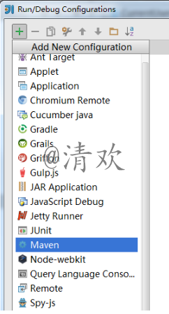
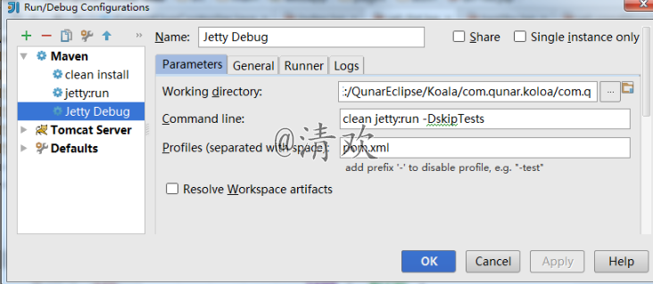
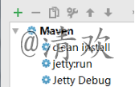

步骤如下：
----------

（1）找到选项卡中的 –Run– 然后找到 –Edit Configurations

（2）点击下图中绿色的plus–找到Maven点进去   

（3）按照下边的方式在Command line和Profiles中填入下边固定的值，然后在Working
Directory中填入自己项目的路径   
命令为：clean jetty:run -DskipTests   
名字随意，这里叫做**JettyDebug**

（4）还可以按照相同的方式，设置mvn clean install和mvn jetty:run这两个命令   

（5）这样的话，我们就有三个“快捷键”了   

（6）在进行调试的时候，只要选择刚才（3）中创建的JettyDebug   
然后再点击后边的绿色三角按钮，打好断点之后 运行就可以进入断点进行调试。
