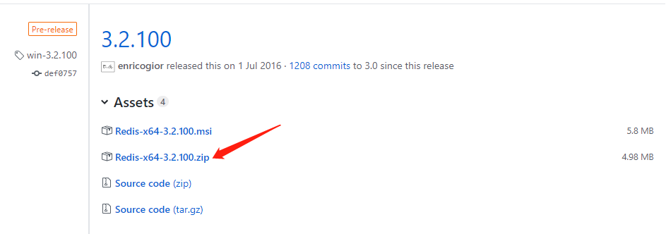
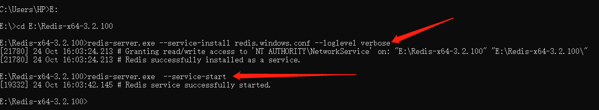
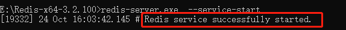
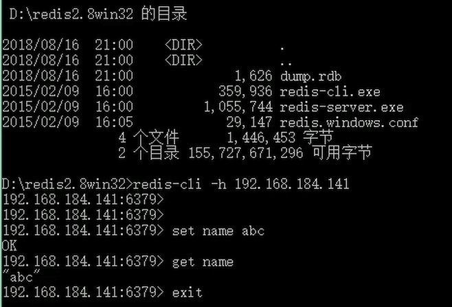
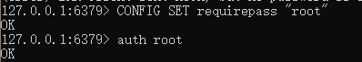
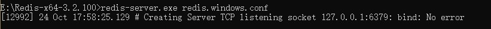
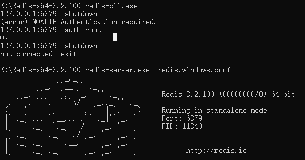

- 


# Windows中redis的下载及安装、设置

## 一、下载：

下载地址： https://github.com/MicrosoftArchive/redis/releases

根据系统下载的版本：以（64位为例）



下载后一般解压到根目录下：如（E:\Redis-x64-3.2.100）

## 二、安装：

打开cmd命令窗口，使用命令进行安装和注册redis到window服务

```bash
# 安装命令：
redis-server.exe --service-install redis.windows.conf --loglevel verbose

# 启动服务命令：
redis-server.exe  --service-start

# 关闭服务命令：
redis-server.exe  --service-stop
```



最后返回的successfully表示安装成功。



也可以通过任务管理器中查看后台中是否有redis-service来判断是否启动成功。

我们重新打开一个cmd ,作为一个客户端调用redis服务，如下图所示，调用命令是：redis-cli.exe -h 127.0.0.1 -p 6379，如下图显示地址和端口，说明调用成功

然后我们使用set 和get 命令进行测试一下，set uname "abc",然后使用get uname可以获取到对应set的值，说明调用成功

## 三、客户端使用redis：

我们重新打开一个cmd ,作为一个客户端调用redis服务，如下图所示，

调用命令是：redis-cli.exe -h 127.0.0.1 -p 6379，如下图显示地址和端口，说明调用成功

然后我们使用set 和get 命令进行测试一下，set uname "abc",然后使用get uname可以获取到对应set的值，说明调用成功




## 四、设置密码：



```
还可以通过将字符串设置为空来清空密码：
CONFIG SET requirepass ""错误：
1、 Creating Server TCP listening socket 127.0.0.1:6379: bind: No error
```



解决办法：

```bash
E:\Redis-x64-3.2.100>redis-cli.exe
127.0.0.1:6379> shutdown
(error) NOAUTH Authentication required.
127.0.0.1:6379> auth root　　　　　　　　　　　　
## 登录
OK
127.0.0.1:6379> shutdown
not connected> exit
```

E:\Redis-x64-3.2.100>redis-server.exe redis.windows.conf




## 参考

- https://www.cnblogs.com/wxjnew/p/9160855.html