转载自 https://blog.csdn.net/q_0718/article/details/80996943
## Jmeter简介

    -   Jmeter的基本概念

>   百度百科：

>   Apache
>   JMeter是Apache组织开发的基于Java的压力测试工具。用于对软件做压力测试，它最初被设计用于Web应用测试，但后来扩展到其他测试领域。
>   它可以用于测试静态和动态资源，例如静态文件、Java 小服务程序、CGI 脚本、Java
>   对象、数据库、FTP 服务器， 等等。JMeter
>   可以用于对服务器、网络或对象模拟巨大的负载，来自不同压力类别下测试它们的强度和分析整体性能。另外，JMeter能够对应用程序做功能/回归测试，通过创建带有断言的脚本来验证你的程序返回了你期望的结果。为了最大限度的灵活性，JMeter允许使用正则表达式创建断言

-   我们为什么使用Jmeter

    -   开源免费，基于Java编写，可集成到其他系统可拓展各个功能插件

        -   支持接口测试，压力测试等多种功能，支持录制回放，入门简单

        -   相较于自己编写框架或其他开源工具，有较为完善的UI界面，便于接口调试

        -   多平台支持，可在Linux，Windows，Mac上运行

-   Jmeter安装配置

    -   Windows下Jmeter下载安装

        -   登录 <http://jmeter.apache.org/download_jmeter.cgi> ，根据自己平台，下载对应文件

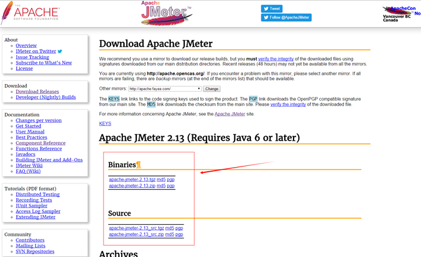

-   安装JDK，配置环境变量（具体步骤不做介绍）

-   将下载Jmeter文件解压，打开/bin/jmeter.bat


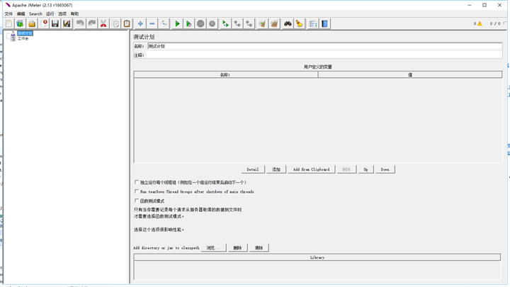

-   其他平台安装Jmeter

    -   与Windows平台一致，除入口文件不同，例如linux平台下为/bin/jmeter.sh

-   Jmeter的目录结构

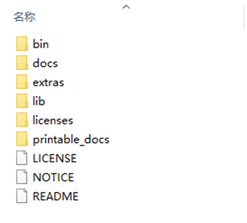

-   /bin 目录（常用文件介绍）
```shell
examples：目录下包含Jmeter使用实例
   ApacheJMeter.jar：JMeter源码包
 jmeter.bat：windows下启动文件
  jmeter.sh：Linux下启动文件
 jmeter.log：Jmeter运行日志文件
jmeter.properties：Jmeter配置文件
  jmeter-server.bat：windows下启动负载生成器服务文件
  jmeter-server：Linux下启动负载生成器文件
  /docs目录——Jmeter帮助文档
  /extras目录——提供了对Ant的支持文件，可也用于持续集成
   /lib目录——存放Jmeter依赖的jar包，同时安装插件也放于此目录
 /licenses目录——软件许可文件，不用管
   /printable_docs目录——Jmeter用户手册
```

-   Jmeter相关插件安装：

    -   插件安装：

>   Jmeter的插件安装很简单，只需要下载对应插件解压即可。

-   下载地址：http://jmeter-plugins.org/downloads/all/

-   下载后解压放入：apache-jmeter-2.12\\lib\\ext\\目录下

-   重启jmeter

>   ps：数据库链接驱动如果需要需要专门下载，例如mysql需要jdbc的jar包，地址：http://dev.mysql.com/downloads/file/?id=462850

>   使用注意事项：添加第三方插件并使用后保存的jmx文件在未添加该插件的运行环境下会导致无法打开该文件并报错，请保持环境一致性。

-   用例生成与导出：

>   Jmeter的用例格式为jmx文件，实际为xml格式，感兴趣可以学习下自己定制生成想要的jmx文件。

-   生成原则：

    -   每个功能模块为一个独立的jmx文件。增加可维护性。（尽量不要将一个jmx文件放入太多功能，后期维护成本会很高。）

    -   模块的私有变量保存在模块中，多模块共有的（例如服务器ip端口等）可以考虑存在单独的文件中读取。

    -   接口测试不要放太多线程，毕竟不是做压力测试，意义也不大。

-   导出方法：

    -   编写测试用例

    -   文件——保存为——确定：

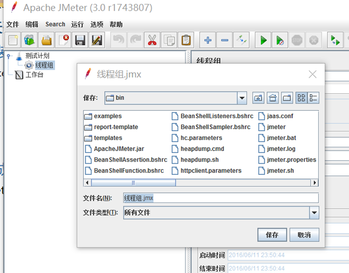

-   Jmeter常用文件类型

    -   Jmx文件

        -   文件的实际类型：xml

        -   文件样本：

```
<jmeterTestPlan version="1.2" properties="1.8">

<hashTree>

<TestPlan guiclass="TestPlanGui" testclass="TestPlan" testname="Test" enabled="true">

<elementProp name="TestPlan.user_defined_variables" elementType="Arguments" guiclass="ArgumentsPanel" testclass="Arguments" testname="User Defined Variables" enabled="true">

<collectionProp name="Arguments.arguments"/>

</elementProp>

<stringProp name="TestPlan.user_define_classpath"></stringProp>

<boolProp name="TestPlan.serialize_threadgroups">false</boolProp>

<boolProp name="TestPlan.functional_mode">false</boolProp>

<stringProp name="TestPlan.comments">Sample test for demonstrating JMeter Ant build script and Schematic stylesheet</stringProp>

</TestPlan>

<hashTree>

<ThreadGroup guiclass="ThreadGroupGui" testclass="ThreadGroup" testname="Thread Group" enabled="true">

<longProp name="ThreadGroup.start_time">1143889321000</longProp>

<stringProp name="ThreadGroup.delay"></stringProp>

<stringProp name="ThreadGroup.duration"></stringProp>

<stringProp name="ThreadGroup.num_threads">3</stringProp>

<boolProp name="ThreadGroup.scheduler">false</boolProp>

<elementProp name="ThreadGroup.main_controller" elementType="LoopController" guiclass="LoopControlPanel" testclass="LoopController" testname="Loop Controller" enabled="true">

<stringProp name="LoopController.loops">5</stringProp>

<boolProp name="LoopController.continue_forever">false</boolProp>

</elementProp>

<longProp name="ThreadGroup.end_time">1143889321000</longProp>

<stringProp name="ThreadGroup.on_sample_error">continue</stringProp>

<stringProp name="ThreadGroup.ramp_time">1</stringProp>

</ThreadGroup>

<hashTree>

<CounterConfig guiclass="CounterConfigGui" testclass="CounterConfig" testname="Counter" enabled="true">

<stringProp name="CounterConfig.start">1</stringProp>

<stringProp name="CounterConfig.incr">1000</stringProp>

<stringProp name="CounterConfig.name">C</stringProp>

<boolProp name="CounterConfig.per_user">false</boolProp>

<stringProp name="CounterConfig.end">1000000</stringProp>

</CounterConfig>

<hashTree/>

<JavaSampler guiclass="JavaTestSamplerGui" testclass="JavaSampler" testname="Sample 1" enabled="true">

<elementProp name="arguments" elementType="Arguments" guiclass="ArgumentsPanel" testclass="Arguments" enabled="true">

<collectionProp name="Arguments.arguments">

<elementProp name="Sleep_Time" elementType="Argument">

<stringProp name="Argument.metadata">=</stringProp>

<stringProp name="Argument.value">100</stringProp>

<stringProp name="Argument.name">Sleep_Time</stringProp>

</elementProp>

<elementProp name="Sleep_Mask" elementType="Argument">

<stringProp name="Argument.metadata">=</stringProp>

<stringProp name="Argument.value">0xFF</stringProp>

<stringProp name="Argument.name">Sleep_Mask</stringProp>

</elementProp>

<elementProp name="Label" elementType="Argument">

<stringProp name="Argument.metadata">=</stringProp>

<stringProp name="Argument.value"></stringProp>

<stringProp name="Argument.name">Label</stringProp>

</elementProp>

<elementProp name="ResponseCode" elementType="Argument">

<stringProp name="Argument.metadata">=</stringProp>

<stringProp name="Argument.value">200</stringProp>

<stringProp name="Argument.name">ResponseCode</stringProp>

</elementProp>

<elementProp name="ResponseMessage" elementType="Argument">

<stringProp name="Argument.metadata">=</stringProp>

<stringProp name="Argument.value">OK</stringProp>

<stringProp name="Argument.name">ResponseMessage</stringProp>

</elementProp>

<elementProp name="Status" elementType="Argument">

<stringProp name="Argument.metadata">=</stringProp>

<stringProp name="Argument.value">OK</stringProp>

<stringProp name="Argument.name">Status</stringProp>

</elementProp>

<elementProp name="SamplerData" elementType="Argument">

<stringProp name="Argument.metadata">=</stringProp>

<stringProp name="Argument.value">Request</stringProp>

<stringProp name="Argument.name">SamplerData</stringProp>

</elementProp>

<elementProp name="ResultData" elementType="Argument">

<stringProp name="Argument.metadata">=</stringProp>

<stringProp name="Argument.value">Response C=${C}</stringProp>

<stringProp name="Argument.name">ResultData</stringProp>

</elementProp>

</collectionProp>

</elementProp>

<stringProp name="classname">org.apache.jmeter.protocol.java.test.JavaTest</stringProp>

</JavaSampler>

<hashTree>

<ResponseAssertion guiclass="AssertionGui" testclass="ResponseAssertion" testname="Response Assertion" enabled="true">

<collectionProp name="Asserion.test_strings">

<stringProp name="51">3</stringProp>

</collectionProp>

<stringProp name="Assertion.test_field">Assertion.response_data</stringProp>

<intProp name="Assertion.test_type">6</intProp>

<stringProp name="Assertion.assume_success">false</stringProp>

</ResponseAssertion>

<hashTree/>

</hashTree>

<JavaSampler guiclass="JavaTestSamplerGui" testclass="JavaSampler" testname="Sample 2" enabled="true">

<elementProp name="arguments" elementType="Arguments" guiclass="ArgumentsPanel" testclass="Arguments" enabled="true">

<collectionProp name="Arguments.arguments">

<elementProp name="Sleep_Time" elementType="Argument">

<stringProp name="Argument.metadata">=</stringProp>

<stringProp name="Argument.value">100</stringProp>

<stringProp name="Argument.name">Sleep_Time</stringProp>

</elementProp>

<elementProp name="Sleep_Mask" elementType="Argument">

<stringProp name="Argument.metadata">=</stringProp>

<stringProp name="Argument.value">0xFF</stringProp>

<stringProp name="Argument.name">Sleep_Mask</stringProp>

</elementProp>

<elementProp name="Label" elementType="Argument">

<stringProp name="Argument.metadata">=</stringProp>

<stringProp name="Argument.value"></stringProp>

<stringProp name="Argument.name">Label</stringProp>

</elementProp>

<elementProp name="ResponseCode" elementType="Argument">

<stringProp name="Argument.metadata">=</stringProp>

<stringProp name="Argument.value">200</stringProp>

<stringProp name="Argument.name">ResponseCode</stringProp>

</elementProp>

<elementProp name="ResponseMessage" elementType="Argument">

<stringProp name="Argument.metadata">=</stringProp>

<stringProp name="Argument.value">OK</stringProp>

<stringProp name="Argument.name">ResponseMessage</stringProp>

</elementProp>

<elementProp name="Status" elementType="Argument">

<stringProp name="Argument.metadata">=</stringProp>

<stringProp name="Argument.value">OK</stringProp>

<stringProp name="Argument.name">Status</stringProp>

</elementProp>

<elementProp name="SamplerData" elementType="Argument">

<stringProp name="Argument.metadata">=</stringProp>

<stringProp name="Argument.value">Request</stringProp>

<stringProp name="Argument.name">SamplerData</stringProp>

</elementProp>

<elementProp name="ResultData" elementType="Argument">

<stringProp name="Argument.metadata">=</stringProp>

<stringProp name="Argument.value">Response C=${C} Tn=${__threadNum}</stringProp>

<stringProp name="Argument.name">ResultData</stringProp>

</elementProp>

</collectionProp>

</elementProp>

<stringProp name="classname">org.apache.jmeter.protocol.java.test.JavaTest</stringProp>

</JavaSampler>

<hashTree/>

</hashTree>

</hashTree>

</hashTree>

</jmeterTestPlan>
```


-   Jtl文件

    -   文件的实际类型：自定义

    -   定义方法：

>   修改{jmeterhome}/bin/jmeter.profile,可选择格式：csv，xml，db

| \# legitimate values: xml, csv, db. Only xml and csv are currently supported. \#jmeter.save.saveservice.output_format=csv |
|---------------------------------------------------------------------------------------------------------------------------|


-   Jmeter运行模式及参数

    -   GUI模式

>   打开已有的jmx文件（文件——打开）

>   点击启动按钮运行

>   由于GUI模式本身就是带界面的，也有中文版，就不在此详细介绍了。

-   命令行模式

    -   依赖：

        -   配置jmeter环境变量（windows下为将\${jmeterhome}/bin加入Path变量）

        -   如果未加入环境变量，在执行的时候可以直接给出全路径或在\${jmeterhome}/bin下执行

    -   命令：

>   jmeter -n -t \<testplan filename\> -l \<listener filename\>

-   参数：

    -   \-h 帮助 -\> 打印出有用的信息并退出

    -   \-n 非 GUI 模式 -\> 在非 GUI 模式下运行 JMeter

    -   \-t 测试文件 -\> 要运行的 JMeter 测试脚本文件

    -   \-l jtl文件 -\> 记录结果的文件

    -   \-r 远程执行 -\> 启动远程服务

    -   \-H 代理主机 -\> 设置 JMeter 使用的代理主机

    -   \-P 代理端口 -\> 设置 JMeter 使用的代理主机的端口号

    -   \-j 日志文件-\>设置JMeter日志文件的名称

-   实例：

>   JMeter -n -t my_test.jmx -l log.jtl -H my.proxy.server -P 8000

-   执行步骤：

>   JMeter 默认去当前目录寻找脚本文件，并把日志记录在当前目录。比如你在 C:\\tools\\apache-jmeter-2.11\\bin 目录下执行以上命令，JMeter 会去该目录下寻找 test.jmx 脚本并把执行结果放在该目录。如果你的脚本在其他目录，而且想要把执行结果放在另外文件夹，可以使用绝对路径告诉 JMeter。

-   执行过程查看：

| D:\\apache-jmeter-3.0\\bin\>jmeter -n -t D:\\共享\\bpintocpin.jmx -l D:\\共享\\test.jtl Writing log file to: D:\\apache-jmeter-3.0\\bin\\jmeter.log Creating summariser \<summary\> Created the tree successfully using D:\\共享\\bpintocpin.jmx Starting the test \@ Fri Jun 17 15:12:21 CST 2016 (1466147541295) Waiting for possible Shutdown/StopTestNow/Heapdump message on port 4445 summary = 1 in 00:00:01 = 0.8/s Avg: 1178 Min: 1178 Max: 1178 Err: 0 (0.00%) Tidying up ... \@ Fri Jun 17 15:12:22 CST 2016 (1466147542649) ... end of run |
|-------------------------------------------------------------------------------------------------------------------------------------------------------------------------------------------------------------------------------------------------------------------------------------------------------------------------------------------------------------------------------------------------------------------------------------------------------------------------------------------------------------------------------------------------------|


-   执行结果查看：

    -   GUI界面打开聚合报告

        -   在GUI界面创建一个聚合报告

        -   聚合报告界面点击浏览，选中生成的.jtl文件，打开


-   执行过程中查看

| summary = 1 in 00:00:01 = 0.8/s Avg: 1178 Min: 1178 Max: 1178 Err: 0 (0.00%) |
|------------------------------------------------------------------------------|


-   jtl文件转化成html格式查看

    -   通过xslt工具转化成html格式（保存格式必须为xml格式）

-   Jmeter常用控件

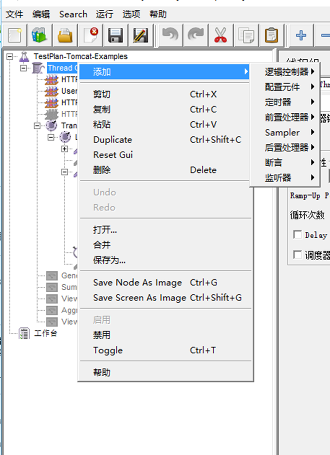

-   测试计划（Test Plan）

>   控件截图：

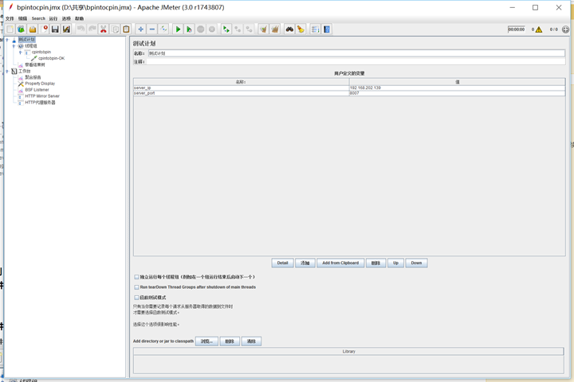

>   理解：包含一个测试的所有内容，包含所有的控件，属性，变量。所以一个jmx文件中只有有一个测试计划。测试计划中可以定义变量，引入jar包，编辑测试模式等。

>   注意事项：

>   可将一些不常变化的数据存入测试计划的变量，方便在测试计划内调用（例如服务器ip，端口，数据库ip等）。

>   函数测试模式会记录来每个请求到服务器的取样结果，如果在监听器中定义了数据写入文件，会将这些输入写入到该文件中。同时，该模式会严重影响性能。

-   工作台

>   控件截图：

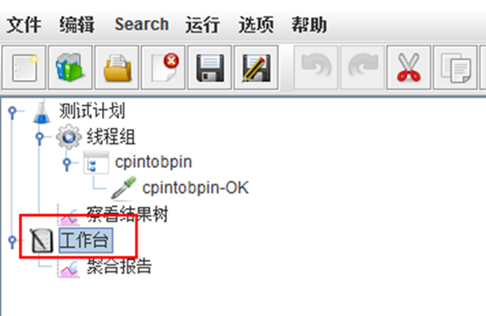

>   理解：控件的暂存区域，在测试过程中可以把暂时不用的控件放入其中，待测试完成后放回原来的位置。

>   注意事项：工作台中的控件不会保存在jmx文件中，所以，如果关闭jmeter，工作台中的控件会丢失。

>   常用控件：

-   Property Display

    -   创建方式：右键点击工作台，添加——非测试元件——Property Display

    -   截图：

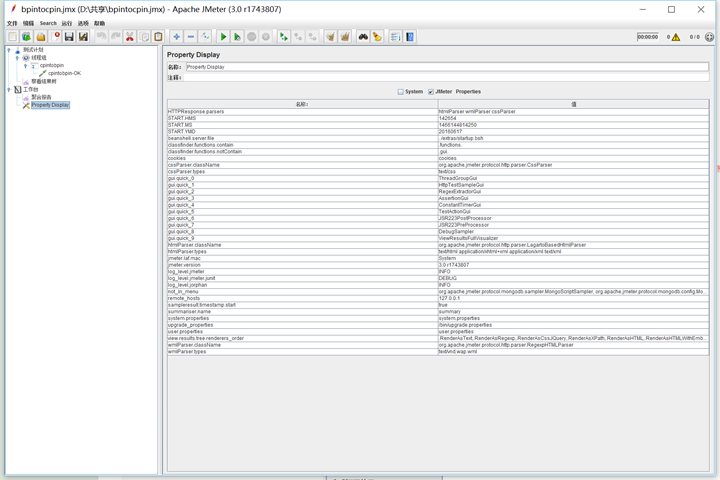

-   功能：查看当前测试计划中的属性以及系统中的属性

-   线程组（ Threads （Users））

>   理解：一个虚拟用户组，线程组内线程数量在运行过程中不会发生改变。

>   注意事项：线程间变量相互独立。一个测试计划内可以包含多个线程组。

>   可定义内容：

>   取样器错误后执行的操作：继续执行，启动下一个线程，停止线程，停止测试，立刻停止

>   线程属性：线程数量，线程启动间隔时间（0为立刻启动所有线程），单线程循环次数，线程执行顺序，是否使用调度器。

>   调度器配置：持续时间，启动延迟，启动时间，结束时间

-   线程组（Thread Group）：

>   控件截图：

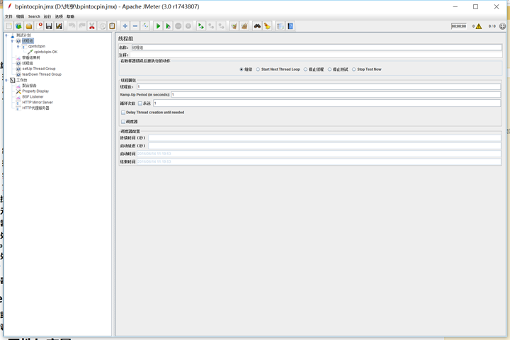

>   理解：常规意义上的线程组，即虚拟用户组。

-   SetUp Thread Group：

>   控件截图：

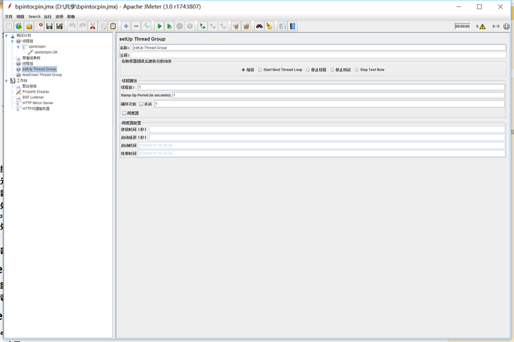

>   理解：测试初始化操作，即线程组开始之前执行的内容。

>   实际使用：可用于初始化测试环境，测试数据准备等。

-   TearDown Thread Group：

>   控件截图：

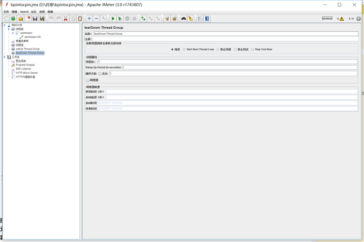

>   理解：测试执行后操作，即线程组执行完成后执行的内容。

>   实际使用：可用于清理测试环境，清空测试数据等。

-   测试片段（Test Fragment）

    -   理解：与线程组同级别，但是默认不会执行。只有当他被模块控制器引用的时候才会被执行。

    -   控件截图：

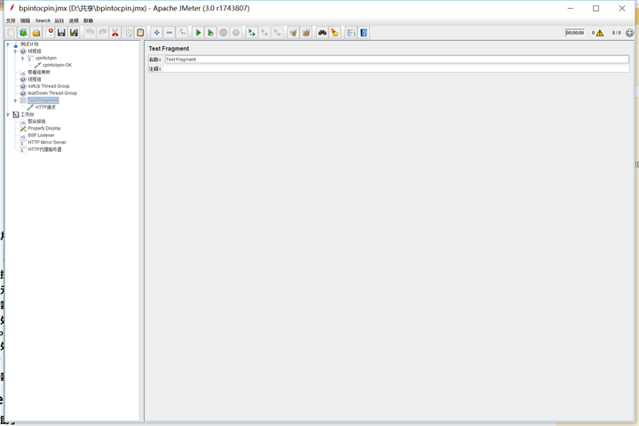

-   逻辑控制器（Logic Controller）

    -   理解：用来控制采样器的执行顺序

    -   分类：

        -   控制采样器的逻辑执行顺序，如Loop Controller、If Controller等

        -   对采样器进行分组，方便控制的，如Throughput Controller、Transaction
            Controller

    -   控件截图：

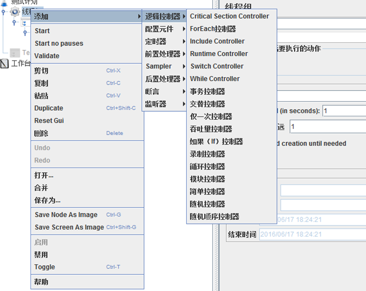

-   常用控件：

    -   简单控制器（Simple Controller）：

>   作用：这是Jmeter里最简单的一个控制器，它可以让我们组织我们的采样器和其它的逻辑控制器（分组功能），提供一个块的结构和控制，并不具有任何的逻辑控制或运行时的功能。 

-   循环控制器（Loop Controller）：

>   作用：指定其子节点运行的次数，可以使用具体的数值（如下图，设置为5次），也可以使用变量

>   1、Forever选项：勾选上这一项表示一直循环下去

>   2、如果同时设置了线程组的循环次数和循环控制器的循环次数，那循环控制器的子节点运行的次数为两个数值相乘的结果。

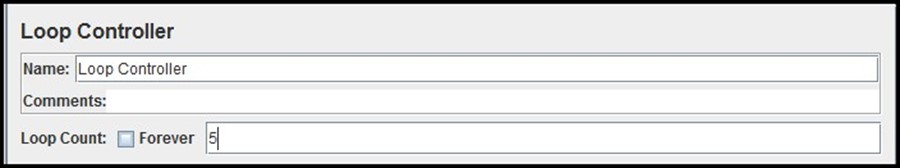

-   仅一次控制器（Once Only Controller）：

>   作用：在测试计划执行期间，该控制器下的子结点对每个线程只执行一次，登录场景经常会使用到这个控制器。

>   注意：将Once Only Controller作为Loop Controller的子节点，Once Only
>   Controller在每次循环的第一次迭代时均会被执行。 

-   ForEach控制器（ForEach Controller）：

>    　　作用：ForEach控制器一般和用户自定义变量一起使用，其在用户自定义变量中读取一系列相关的变量。该控制器下的采样器或控制器都会被执行一次或多次，每次读取不同的变量值。如下图：

>   参数:

-   Input Variable Prefix：输入变量前缀

-   Output variable name：输出变量名称

-   Start index for
    loop(exclusive)：循环开始的索引（这里如果不填写，默认从1开始，如果没有1开始的变量，执行时会报错）

-   End index for loop(inclusive)：循环结束的索引

-   Add"_"before number：输入变量名称中是否使用"_"进行间隔。

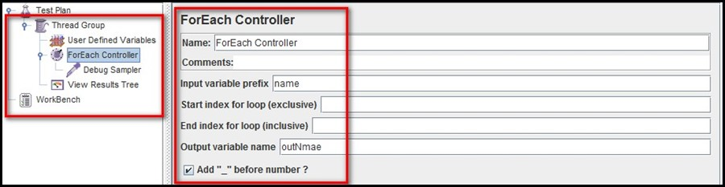

>   用户自定义变量：

>   变量名前缀为ForEach Controller中Input variable prefix定义的name
>   + 下划线（上图中我们勾选了下划线）+数字编号

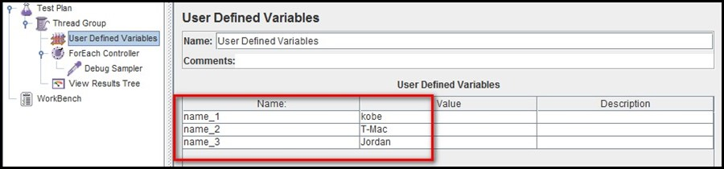

>   执行结果：

>   总共执行了3次，每次执行时会把获取到的变量值赋值给输出变量outNmae，其它地方可以通过\${outNmae}进行调用。

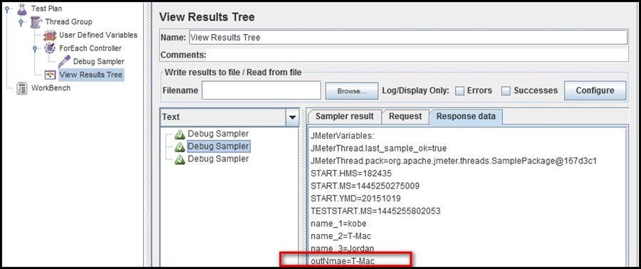

-   事务控制器（Transaction Controller）：

>   作用： 事务控制器会生产一个额外的采样器，用来统计该控制器子结点的所有时间。

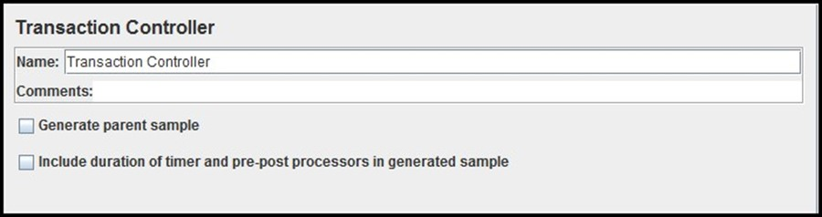

>   参数：

-   Generate parent sample：(选中这个参数结果展示如下图红框，否则显示为下图蓝框)

-   Include duration of timer and pre-post processors in generated
    sample：选中这一项会统计定时器(timer)的时间，否则只统计采样器(sample)的时间

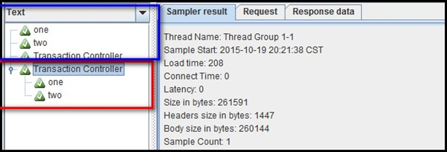

-   If 控制器（If Controller）：

>    　　作用：根据给定表达式的值决定是否执行该节点下的子节点，默认使用javascript的语法进行判断(如下图红框内的文字)。

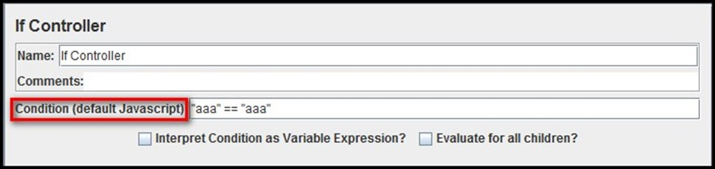

>   参数：

-   Interpret Condition as Variable
    Expression?：选中这一项时表示：判断变量值是否等于字符串true（不区分大小写）

-   Evaluate for all children：如果选中这一项，在每个子结点执行前都会计算表达式 

>   示例一：使用变量的方式进行判断：

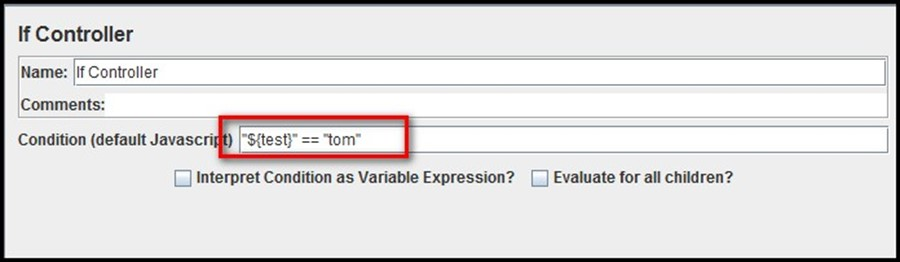

>   示例二：选中Interpret Condition as Variable Expression？

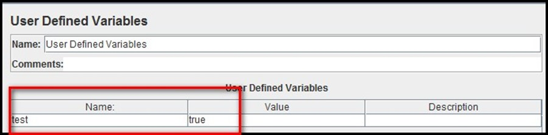

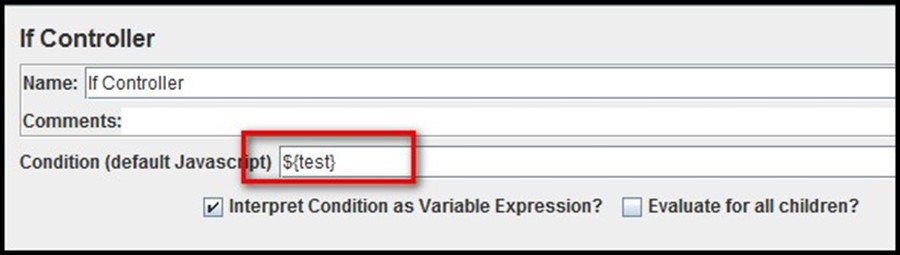

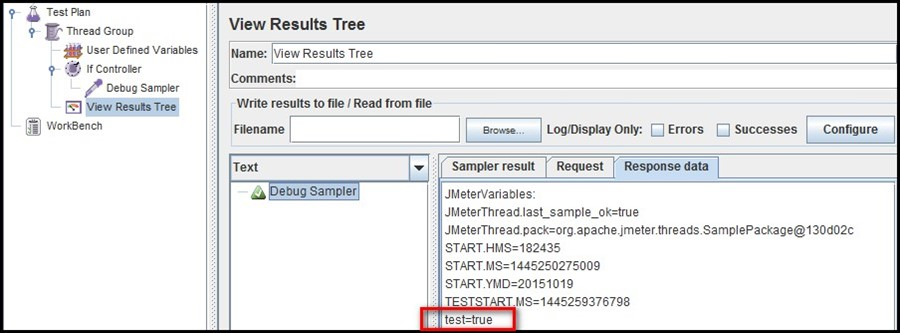

-   Switch控制器（Switch Controller）：

>   作用：Switch控制器通过给该控制器中的Value赋值，来指定运行哪个采样器。有两种赋值方式：

-   第一种是数值，Switch控制器下的子节点从0开始计数，通过指定子节点所在的数值来确定执行哪个元素。

-   第二种是直接指定子元素的名称，比如采样器的Name来进行匹配。当指定的名称不存在时，不执行任何元素。

>   当Value为空时，默认执行第1个子节点元素。 

>   示例：

>   1、Switch Controller选择的值为login page

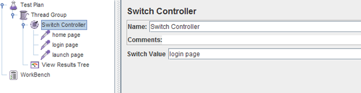

>   2、执行结果：

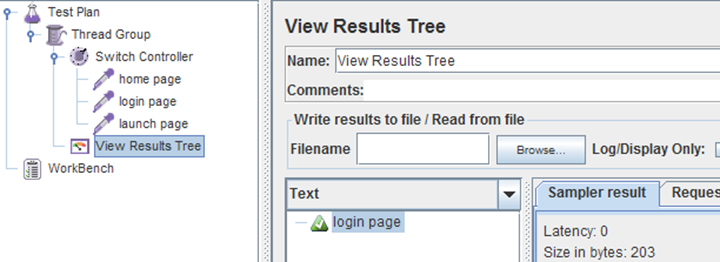

-   吞吐量控制器(Throughput Controller):

>    　　作用：控制其下的子节点的执行次数与负载比例分配，也有两种方式：

-   Total Executions：设置运行次数

-   Percent Executions：设置运行比例(1\~100之间)


>   示例：

>   1、设置线程组循环5次：

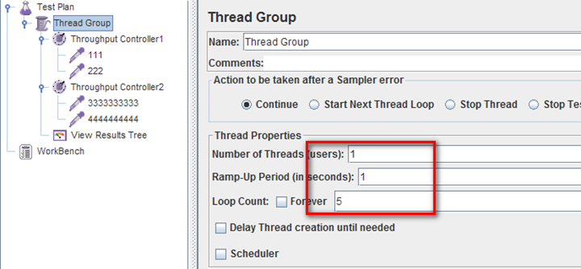

>   2、Throughput Controller1的子结点执行3次：

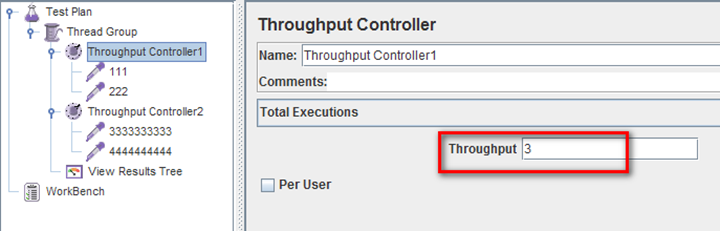

>   3、Throughput Controller2的子结点执行（40% \* 线程组循环次数5）= 2次：

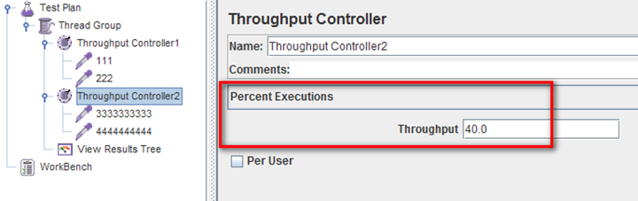

>   执行结果：

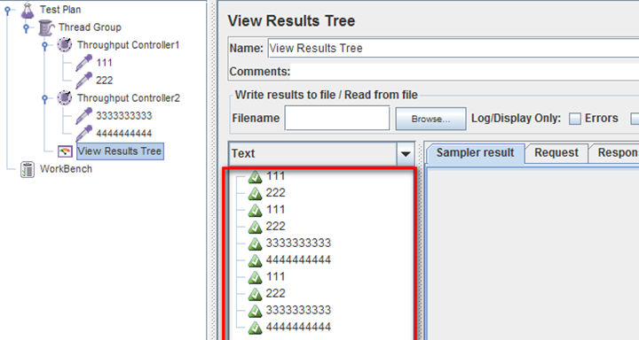

-   随机控制器(Random Controller):

>    　　作用：随机执行其下的所某个子结点

-   随机顺序控制器(Random Order Controller):

>    　　作用：随机执行其下的所有子结点

-   配置元件（Config Element）

    -   理解：为测试提供数据支持的控件

    -   控件截图：

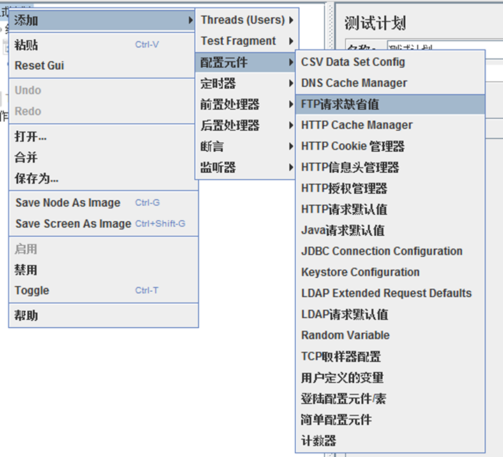

-   常用控件：

    -   CSV Data Set Config

>   理解：读取txt，csv格式的测试数据

>   使用说明：

-   新建一个txt文件

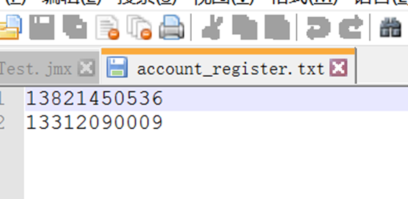

>    

-   设置CVS 配置参数

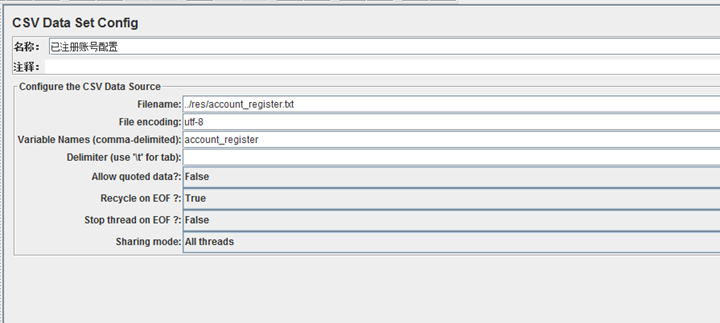

>    

-   CSV Data Set Config各个参数的简要说明:

>   FileName:csv文件或txt文件路径，可用相对路径

>   File Encoding: 文件编码格式设置

>   Varible
>   Names: 定义文本文件中的参数名,可设置多个参数，参数之间逗号分隔.定义后可在脚本中引用，引用方式\${name}

>   Delimiter（use "\\t" for tab）:指定参数分隔符号

>   Allow Quoated data: 是否允许引用数据

>   Recycle on EOF: 是否循环取值

>   Stop Thread on EOF: 当Recycle on EOF为false并且Stop Thread on
>   EOF为true,则读完csv文件中的记录后,停止运行

>   Sharing Mode: 设置是否线程共享

>   使用场景：可用于多个jmx模块情况下读取服务器配置，或存储id，账号等测试数据。

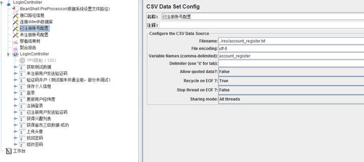

-   HTTP Cookie管理器

>   特性：

>   1，象浏览器一样的存储和发送Cookie。如果你请求一个站点，然后他的Response中包含Cookie，Cookie
>   Manager就会自动地保存这些Cookie并在所有后来发送到该站点的请求中使用这些Cookie的值。（在View
>   Results Tree的Request界面可以看到被发送的Cookie Data， 同时每个线程的Cookie
>   Manager是相互独立的）

>   接受到的Cookie的值能被存储到JMeter 线程变量中（2.3.2版本后的JMeter不自动做这个事情）。要把Cookies保存到线程变量中，要定义属性"CookieManager.save.cookies=true"。

>   线程变量名为COOKIE\_ +
>   Cookie名。属性CookieManager.name.prefix= 可以用来修改默认的COOKIE_的值。

>   2，手动添加Cookie到Cookie
>   Manager，需求注意的是这些Cookie的值被会所有线程共享

>   定义：属性"CookieManager.save.cookies=true"

>   在jmeter.properties文件中增加CookieManager.save.cookies=true，然后在Debug
>   Sampler中就能看到COOKIE_xxx这样的变量，或者也可以使用正则表达式来提取Cookie的值

>   实例截图：

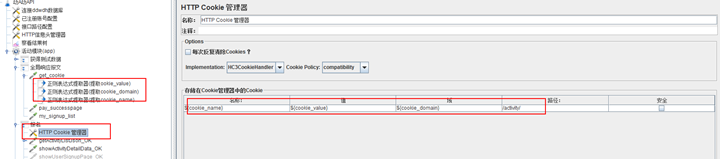

>   使用注意事项：

>   路径必须填写，否则会导致nocookie

>   路径和域组成完整的访问地址，谁访问谁就用对应的cookie

>   Cookie不是跨域的

>   不同的逻辑控制器中要分别放cookie管理器，或放在该cookie逻辑控制器同级，否则会不生效

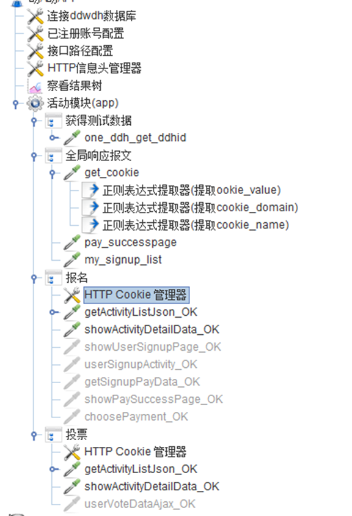

-   HTTP信息头管理器

>   理解：定义信息头，在其覆盖下的所有元件都会使用该信息头。例如定义在测试计划中的信息头，即该测试计划所有请求的信息头。

>   实例截图：

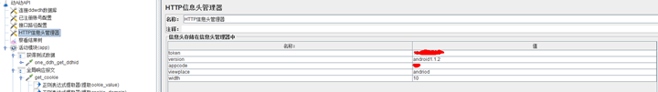

-   JDBC Connection Configuration

>   理解：数据库连接控件，不会进行的具体的数据库操作。

>   实例截图：

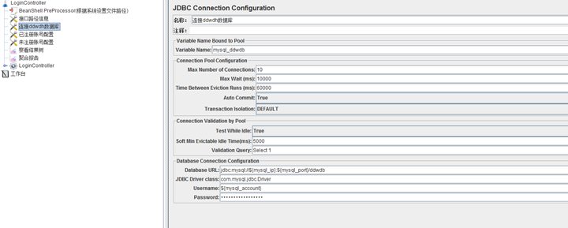

>   注意事项：

>   需要和JDBC Request配合使用

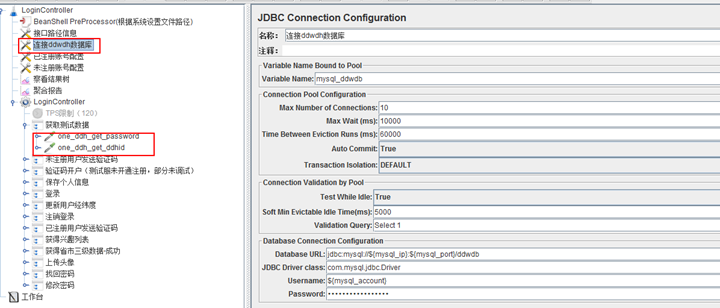

>   需要安装jdbc驱动，否则无法连接数据库

-   用户定义的变量

>   理解：用户自定义的变量，可用于存储接口路径等信息

>   实例截图：

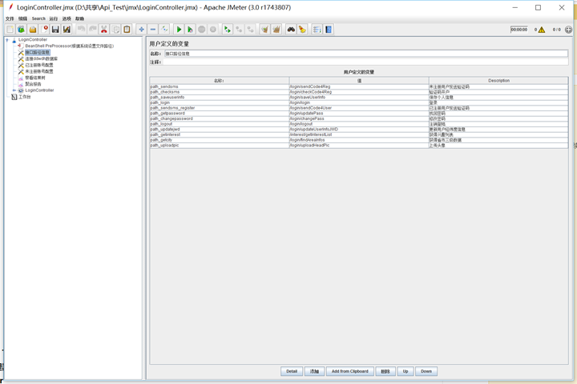

>   注意事项：

>   注意变量的作用域，不同线程间变量不共享

-   定时器（Timer）

>   理解：sampler（采样器）之前执行；如果只想应用于部分sampler，需要将定时器加入子节点；简单理解类似于loadrunner中的思考时间，控制sampler的间隔时间。

>   控件截图：

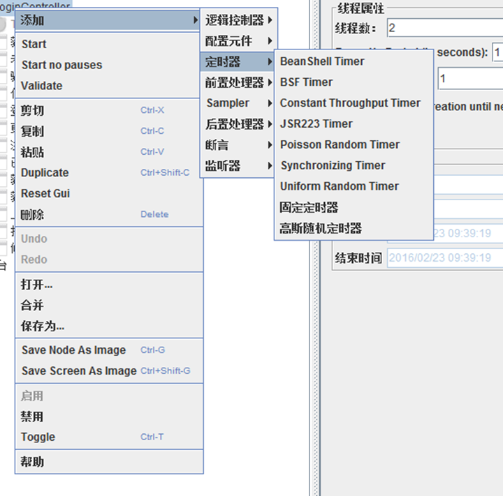

>   常用控件：

-   Constant Throughput Timer 

>   理解：设置目标吞吐量，限定QPS的控件

>   实例截图：

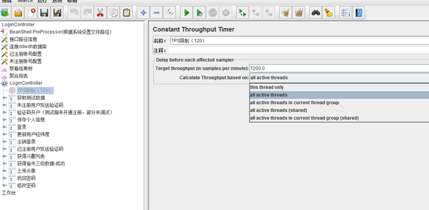

>   配置选项：

>   Target throughput（in samples per minute）：目标吞吐量。注意这里是每分钟发送的请求数，因此，对应测试需求中所要求的20 QPS ，这里的值应该是1200 。

>   Calculate Throughput based on ：有5个选项，分别是：

>   This thread only ：控制每个线程的吞吐量，选择这种模式时，总的吞吐量为设置的 target Throughput 乘以矣线程的数量。

>   All active threads ： 设置的target Throughput 将分配在每个活跃线程上，每个活跃线程在上一次运行结束后等待合理的时间后再次运行。活跃线程指同一时刻同时运行的线程。

>   All active threads in current thread group ：设置的target Throughput将分配在当前线程组的每一个活跃线程上，当测试计划中只有一个线程组时，该选项和All active threads选项的效果完全相同。

>   All active threads （shared ）：与All active threads 的选项基本相同，唯一的区别是，每个活跃线程都会在所有活跃线程上一次运行结束后等待合理的时间后再次运行。

>   All cative threads in current thread group （shared ）：与All active threads in current thread group 基本相同，唯一的区别是，每个活跃线程都会在所有活跃线程的上一次运行结束后等待合理的时间后再次运行。

>   注意事项：

>   Constant Throughput Timer只有在线程组中的线程产生足够多的request 的情况下才有意义，因此，即使设置了Constant Throughput Timer的值，也可能由于线程组中的线程数量不够，或是定时器设置不合理等原因导致总体的QPS不能达到预期目标。

-   固定定时器

>   理解：请求间隔时间

>   实例截图：

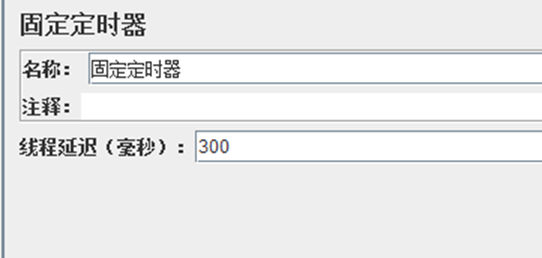

>   注意事项：

>   需要注意的是，固定定时器的延时不会计入单个sampler的响应时间，但会计入事务控制器的时间。

>   对于一个sampler来说，定时器相当于loadrunner中的pacing（理解就是一组请求操作的等待时间）；对于"事务控制器"来说，定时器相当于loadrunner中的think
>   time（单次操作的等待时间或间隔时间）

-   高斯随机定时器

>   理解：与固定定时器差不多，只不过时间范围可以设置一个指定范围随机。

>   实例截图：

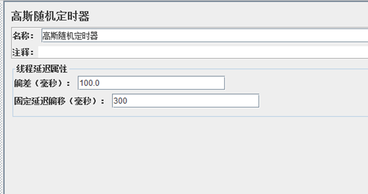

-   Synchronizing Timer

>   理解：LR中的集合点，也就是说，sampler到这里会暂停，达到指定线程数后并发

>   实例截图：

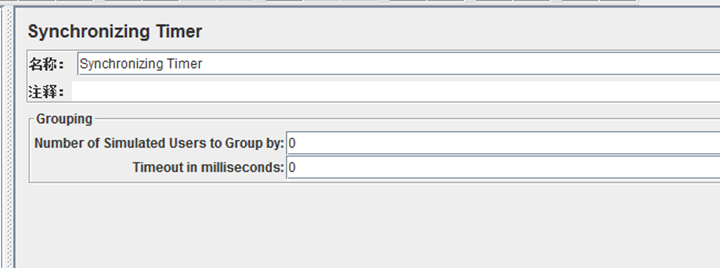

>   配置参数：

>   Number of Simulated Users to Group by:线程数量设置

>   Timeout in milliseconds:响应时间设置，单位毫秒

>   注意事项：

>   集合点需要设置在Sampler前，否则不会生效

-   前置处理器（Per Processors）

>   理解：sampler请求前执行的操作，可以是获取测试数据，修改参数等

>   控件截图：

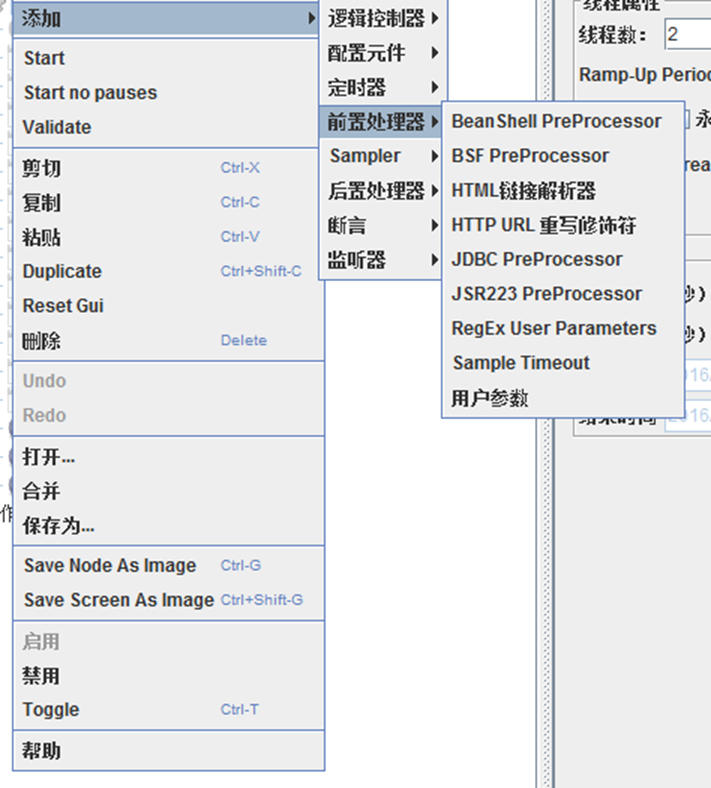

>   常用控件：

-   Bean Shell PreProcessor

>   理解：Bean Shell编程设置

>   实例截图：

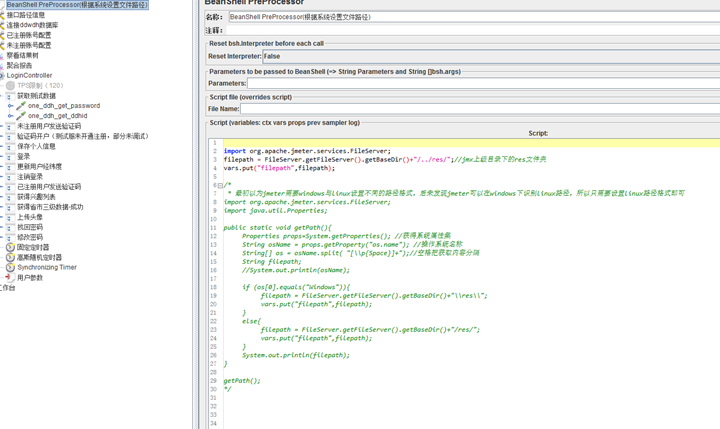

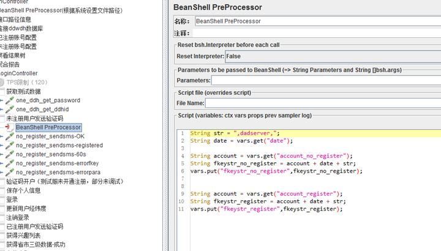

-   Simpler Timeout:

>   理解：设置simple的最大响应时间，与直接在Sampler中设置的区别就是，作用域不同

>   控件截图：

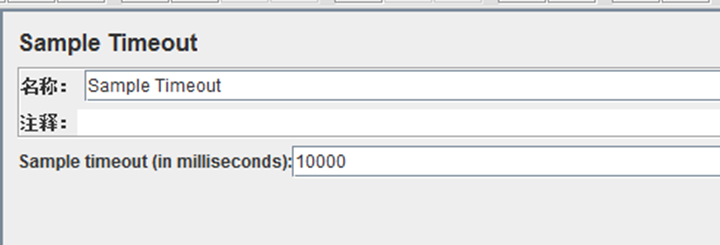

-   Sampler

>   理解：请求，设置不同的request

>   控件截图：

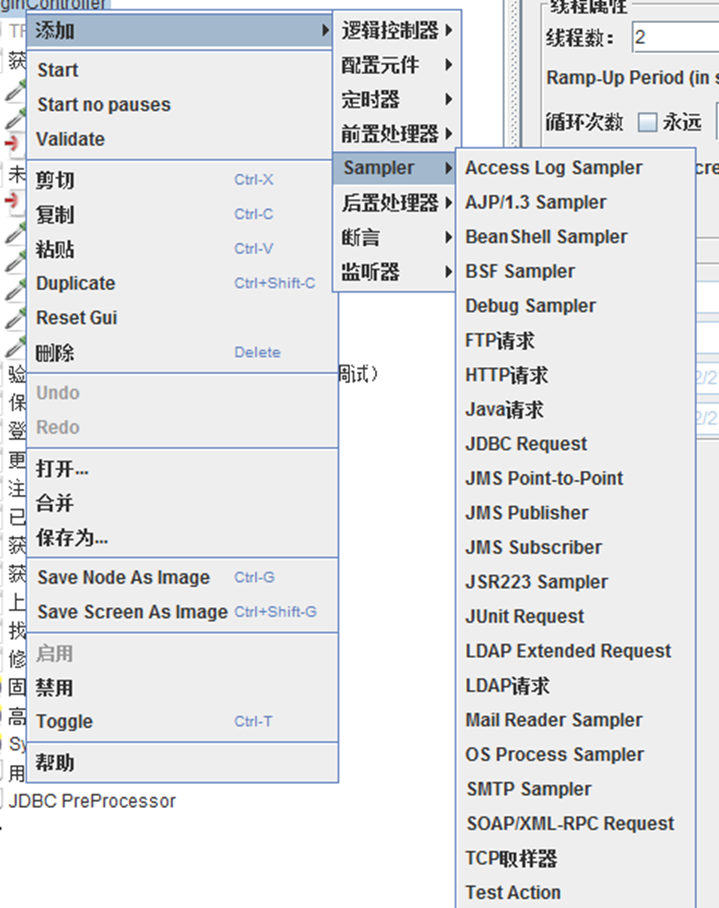

>   常用控件：

-   HTTP请求

>   理解：就是一次HTTP请求

>   实例截图：

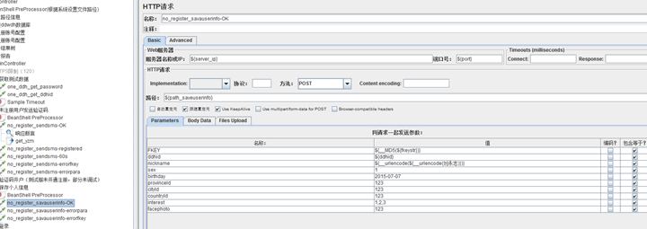

-   Test Action

>   理解：请求的执行动作，可放在Sampler后定义，即执行某一个请求后暂停等操作

>   控件截图：

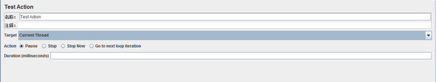

-   后置处理器（Post Processors）

>   理解：请求执行后的处理，与前置处理器相反

>   控件截图：

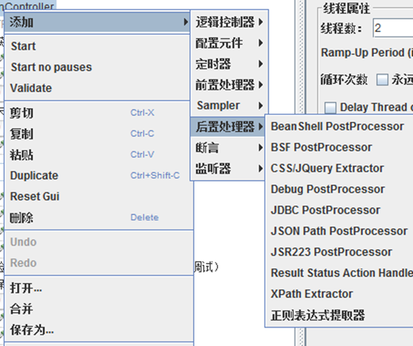

>   常用控件：

-   正则表达式提取器

>   理解：当一个Sampler的Reponse中包含我们需要的参数的时候，我们可以通过该控件将参数提取出来

>   实例截图：


>   参数含义：

>   引用名称：将提取的参数转化为变量，该字段定义变量名称

>   正则表达式：匹配的正则，测试可用搜索引擎搜索在线正则验证测试结果

-   断言（Assertions）

>   理解：判断请求响应值的正确性的控件

>   控件截图：

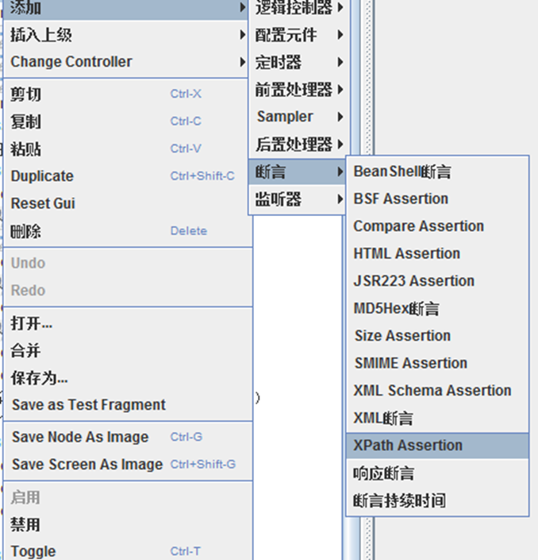

>   常用控件：

-   响应断言：

>   理解：判断Reponse是否正确

>   实例截图：

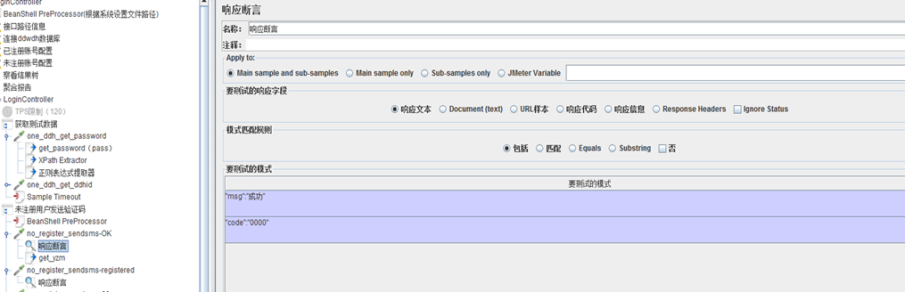

>   注意事项：

>   断言要放在请求内

-   监听器（Listener）

>   理解：查看请求执行结果的控件

>   控件截图：

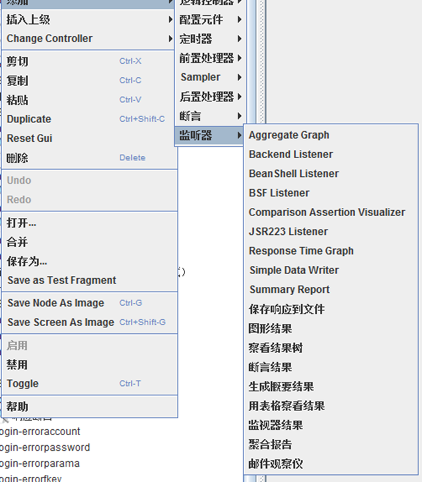

>   常用控件：

-   图形结果

>   控件截图：

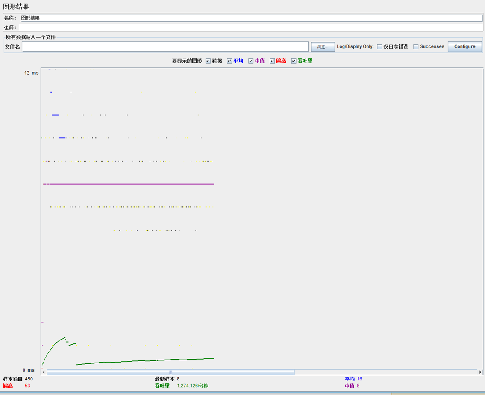

>   参数含义：

>   样本数目：总共发送到服务器的请求数。

>   最新样本：代表时间的数字,是服务器响应最后一个请求的时间。

>   吞吐量：服务器每分钟处理的请求数。 

>   平均值：总运行时间除以发送到服务器的请求数。 

>   中间值：代表时间的数字，有一半的服务器响应时间低于该值而另一半高于该值。 

>   偏离：服务器响应时间变化、离散程度测量值的大小，或者，换句话说，就是数据的分布。

>   注意事项：图形结果本身会影响Jmeter的性能

-   查看结果树

>   应用：可用于调试，查看请求响应的数据，测试的结果，请求的内容。

>   控件截图：


>   参数含义：

>   取样器结果实例：

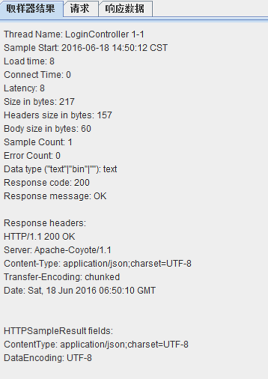

>   请求实例截图：

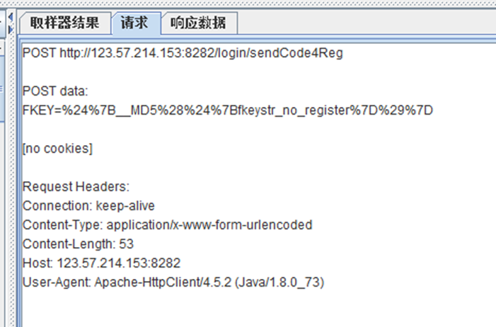

>   响应数据实例截图：

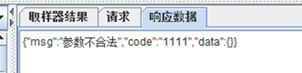

-   聚合报告

>   理解：

>   控件截图：

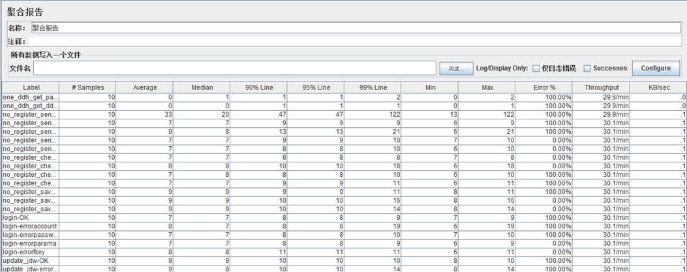

>   参数含义：

>   Label：每个 JMeter 的 element（例如 HTTP
>   Request）都有一个 Name 属性，这里显示的就是 Name 属性的值

>   \#Samples：表示你这次测试中一共发出了多少个请求，如果模拟10个用户，每个用户迭代10次，那么这里显示100

>   Average：平均响应时间——默认情况下是单个 Request 的平均响应时间，当使用了 Transaction
>   Controller 时，也可以以Transaction 为单位显示平均响应时间

>   ../n：中位数，也就是 50％ 用户的响应时间

>   90% Line：90％ 用户的响应时间

>   Min：最小响应时间

>   Max：最大响应时间

>   Error%：本次测试中出现错误的请求的数量/请求的总数

>   Throughput：吞吐量——默认情况下表示每秒完成的请求数（Request per
>   Second），当使用了 Transaction
>   Controller 时，也可以表示类似 LoadRunner 的 Transaction per Second 数

>   KB/Sec：每秒从服务器端接收到的数据量，相当于LoadRunner中的Throughput/Sec

-   Jmeter函数

    -   函数助手

>   打开位置：选项——函数助手

>   控件截图：

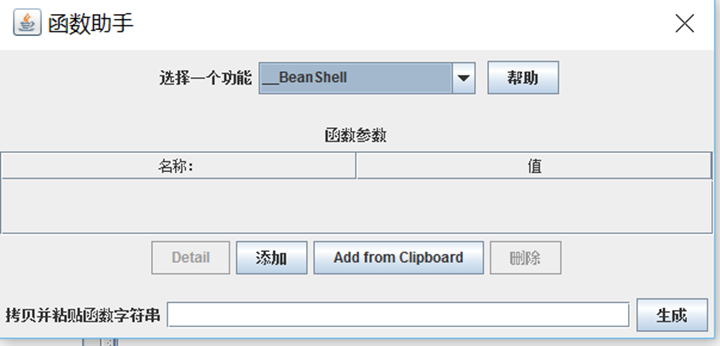

>   函数实例：

>   \${__time(YMD)}：当前日期函数

>   \${__time(YMDHMS)}：当前四件函数

>   \${__MD5(\${fkeystr_no_register})}：MD5加密函数

>   更多可查看函数助手的帮助页面

-   函数调用

>   选择想要使用的函数

>   输入想要使用函数的值

>   点击生成

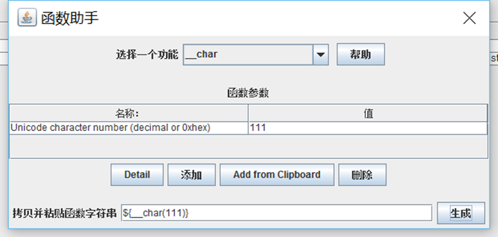

>   将所得字符串复制到要使用的位置

-   Jmeter属性与变量

>   一、Jmeter中的属性：

>   1、JMeter属性统一定义在jmeter.properties文件中，我们可以在该文件中添加自定义的属性

>   2、JMeter属性在测试脚本的任何地方都是可见的（全局），通常被用来定义一些JMeter使用的默认值，可以用于在线程间传递信息。

>   3、JMeter属性可以在测试计划中通过函数 _P 进行引用，但是不能作为特定线程的变量值。

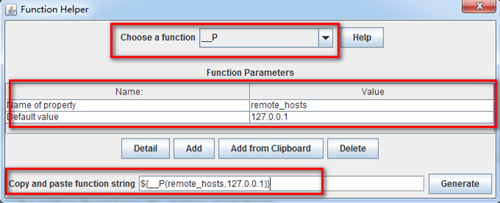

>   4、JMeter属性可以通过_setProperty 函数来定义JMeter属性

>   5、JMeter属性是大小写敏感的

>   6、WorkBench中的属性查看组件：

>   WorkBench右键---\>Add---\>Non Test Elements---\>Property Display

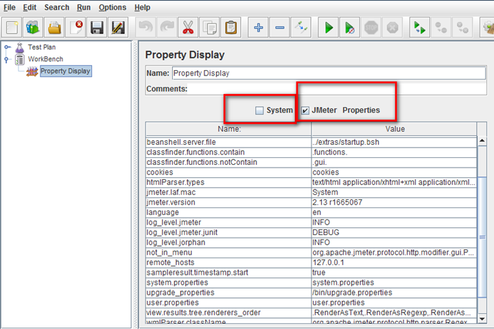

>   二、Jmeter中的变量：

>   1、JMeter变量对于测试线程而言是局部变量。

>   2、在不同测试线程中，JMeter变量既可以是完全相同的，也可以是不同的。

>   3、JMeter变量引用方法：\${name} 

>   4、JMeter变量是大小写敏感的

>   5、如果有某个线程更新了变量，那么仅仅是更新了变量在该线程中复制的值

>   6、Jmeter中定义变量的地方：

>   a) 测试计划(Test plan)，在右边的面板上添加User Defined Variables

>   b) 线程组，右键选择 配置元件( config element)--\>User Defined Variables

>   c) 通过前置或后置处理器生成的变量

>   d)使用csv参数化的变量

>   注意：通过 a 和 b 两种方式定义的变量，在JMeter启动时对这个测试计划都是可见的。如果同一个变量在多个 b 中被定义，那么只有最后一个定义会生效。一旦某个线程启动后，那么整个变量集合的初始值就会被复制到该线程中。其他测试元件，例如 c 或者 d 可以被用来重新定义变量，这些重定义仅仅影响当前线程

-   Jmeter录制回放

    -   BadBoy录制回放

        -   打开badboy，点击录制按钮

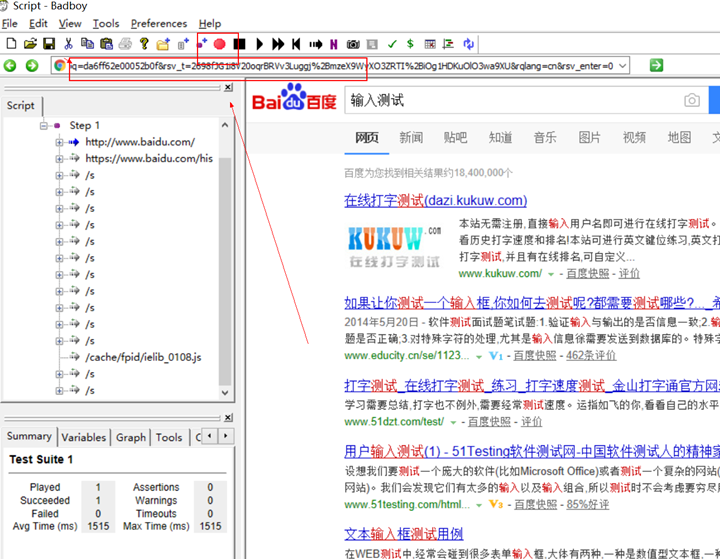

-   输入网址，在网页中操作

-   导出脚本（File——Export to Jmeter）

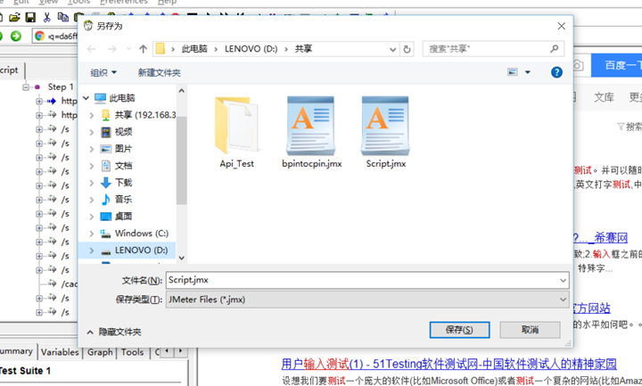

-   用Jmeter打开对应脚本

-   Jmeter使用

    -   Jmeter创建接口测试计划实例

>   测试用例应该作为测试的基础内容，而用例的结构可能划分，则是用例的基础（忽然在这里想说一下，用例仅仅是一项测试活动的纲要，有最好，没有的话能保证质量也OK。更不用说用例的格式问题，无论是表格还是导图，其实都无所谓！本文的用例是指jmx文件中的控件结构）。

>   笔者在网上并没有找到这方面的相关资料，所以没有准确的定义说笔者的划分是否是正确的或者合适的。笔者会阐明如此划分的理由，但是大家实际使用过程中，仅仅作为抛砖引玉的一个砖头而已。

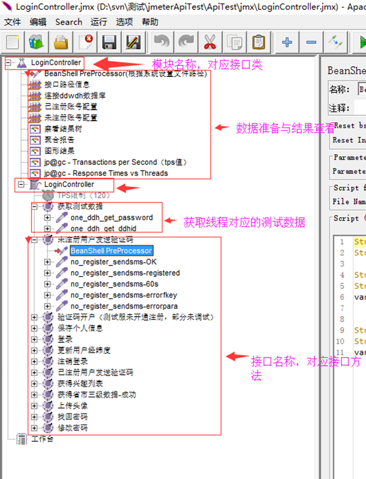

-   模块名称（测试计划）：每个模块独立划分为一个jmx文件（例如登陆模块），最好与接口类一一对应。对应的服务器信息，数据库信息等可存在这里。

-   数据准备：用于测试数据的准备（例如账号信息）。

-   结果查看：用于放置需要查看结果的控件（例如结果树）。

-   线程组：所有的接口测试用例放在线程组下，集中定义线程等信息

-   获取线程对应测试数据：用于获取针对独立线程的测试数据，例如在数据准备里面获得了账号信息，在这里根据账号信息去数据库获取对应的名称，ID等信息。

-   请求名称：用简单控制器为文件夹，内有不同的请求。简单控制器为一个独立的接口，不同请求对应不同的代码路径（例如成功请求，失败请求等）。建议请求名称最好用英文形式，否则后期持续集成或许会出现问题（no zuo
    no die！）。

-   在每条请求内放置正则匹配（用于应对需要返回值作为下次请求的参数的情况）以及断言。

-   Jmeter使用注意事项

    -   变量问题

>   使用过程中，一定要注意控件的执行顺序以及变量的作用域。

-   路径问题

>   Windows下支持"/""\\"并存模式，推荐使用"/"，方便跨平台使用。

>   在linux格式下支持"/"格式。

-   Jmeter自身性能问题

>   命令行模式：命令相同。

>   UI模式：操作方式相同，但会存在windows下能打开linux下打不开的情况，暂不知道原因。

-   致谢

>   本文部分内容引用自互联网上的优秀文章，感谢网络中愿意分享的作者。可能本文中还涉及其他作者的文章未在下边列出，如果有请联系我。

-   转发自：博客（测试散人：http://www.cnblogs.com/ceshisanren/p/5639895.html）
