RabbitMQ 研究
-------------

1 介绍
------

### RabbitMQ

MQ全称为Message Queue，即消息队列，
RabbitMQ是由erlang语言开发，基于AMQP（Advanced Message Queue
高级消息队列协议）协议实现的消息队列，它是一种应用程序之间的通信方法，消息队列在分布式系统开发中应用非常广泛。RabbitMQ官方地址：<http://www.rabbitmq.com/>

-   RabbitMQ 是实现
    AMQP（高级消息队列协议）的消息中间件的一种，最初起源于金融系统，用于在分布式系统中存储转发消息，在易用性、扩展性、高可用性等方面表现不俗。消息中间件主要用于组件之间的解耦，消息的发送者无需知道消息使用者的存在，反之亦然。

-   RabbitMQ 是由 Erlang 语言开发，安装 RabbitMQ 服务需要先安装 Erlang
    语言包。三

#### 开发中消息队列通常有如下应用场景：

1、任务异步处理。

将不需要同步处理的并且耗时长的操作由消息队列通知消息接收方进行异步处理。提高了应用程序的响应时间。

2、应用程序解耦合

MQ相当于一个中介，生产方通过MQ与消费方交互，它将应用程序进行解耦合。

#### 市场上还有哪些消息队列？

ActiveMQ，RabbitMQ，ZeroMQ，Kafka，MetaMQ，RocketMQ、Redis。

#### 为什么使用RabbitMQ呢？

1、使得简单，功能强大。

2、基于AMQP协议。

3、社区活跃，文档完善。

4、高并发性能好，这主要得益于Erlang语言。

5、Spring Boot默认已集成RabbitMQ

可靠性（Reliability）

RabbitMQ 使用一些机制来保证可靠性，如持久化、传输确认、发布确认。

灵活的路由（Flexible Routing）

在消息进入队列之前，通过 Exchange 来路由消息的。对于典型的路由功能，RabbitMQ
已经提供了一些内置的 Exchange 来实现。针对更复杂的路由功能，可以将多个 Exchange
绑定在一起，也通过插件机制实现自己的 Exchange 。

消息集群（Clustering）

多个 RabbitMQ 服务器可以组成一个集群，形成一个逻辑 Broker 。

高可用（Highly Available Queues）

队列可以在集群中的机器上进行镜像，使得在部分节点出问题的情况下队列仍然可用。

多种协议（Multi-protocol）

RabbitMQ 支持多种消息队列协议，比如 STOMP、MQTT 等等。

多语言客户端（Many Clients）

RabbitMQ 几乎支持所有常用语言，比如 Java、.NET、Ruby 等等。

管理界面（Management UI）

RabbitMQ 提供了一个易用的用户界面，使得用户可以监控和管理消息 Broker
的许多方面。

跟踪机制（Tracing）

如果消息异常，RabbitMQ 提供了消息跟踪机制，使用者可以找出发生了什么。

插件机制（Plugin System）

RabbitMQ 提供了许多插件，来从多方面进行扩展，也可以编写自己的插件

其它相关知识
------------

AMQP是什么 ？

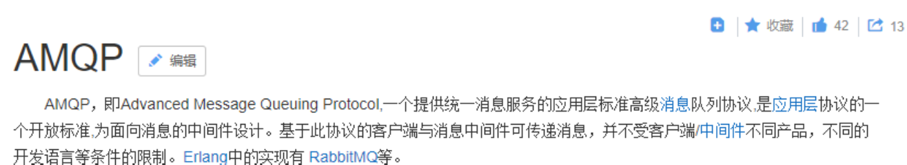

总结：
AMQP是一套公开的消息队列协议，最早在2003年被提出，它旨在从协议层定义消息通信数据的标准格式，

为的就是解决MQ市场上协议不统一的问题。RabbitMQ就是遵循AMQP标准协议开发的MQ服务。

官方：http://www.amqp.org/

#### JMS是什么 ？

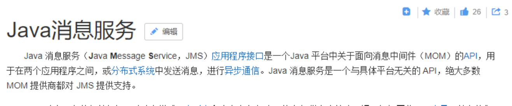

#### 总结：

JMS是java提供的一套消息服务API标准，其目的是为所有的java应用程序提供统一的消息通信的标准，类似java的

jdbc，只要遵循jms标准的应用程序之间都可以进行消息通信。它和AMQP有什么
不同，jms是java语言专属的消

息服务标准，它是在api层定义标准，并且只能用于java应用；而AMQP是在协议层定义的标准，是跨语言的
。

快速入门
--------

#### RabbitMQ 的工作原理

下图是RabbitMQ的基本结构：

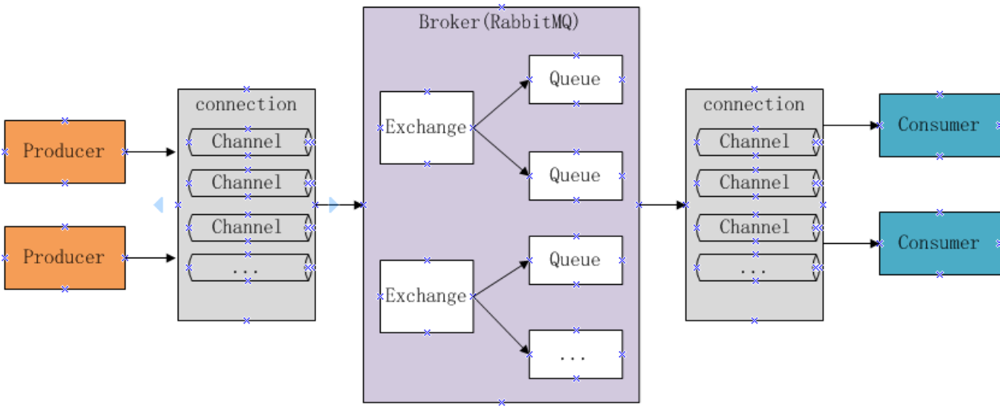

组成部分说明如下：

Broker ：消息队列服务进程，此进程包括两个部分：Exchange和Queue。

Exchange
：消息队列交换机，按一定的规则将消息路由转发到某个队列，对消息进行过虑。

Queue ：消息队列，存储消息的队列，消息到达队列并转发给指定的消费方。

Producer ：消息生产者，即生产方客户端，生产方客户端将消息发送到MQ。

Consumer ：消息消费者，即消费方客户端，接收MQ转发的消息。

消息发布接收流程：

\-----发送消息-----

1、生产者和Broker建立TCP连接。

2、生产者和Broker建立通道。

3、生产者通过通道消息发送给Broker，由Exchange将消息进行转发。

4、Exchange将消息转发到指定的Queue（队列）

\----接收消息-----

1、消费者和Broker建立TCP连接

2、消费者和Broker建立通道

3、消费者监听指定的Queue（队列）

4、当有消息到达Queue时Broker默认将消息推送给消费者。

5、消费者接收到消息。

RabbitMQ 基本概念
-----------------

Message

消息，消息是不具名的，它由消息头和消息体组成。消息体是不透明的，而消息头则由一系列的可选属性组成，这些属性包括routing-key（路由键）、priority（相对于其他消息的优先权）、delivery-mode（指出该消息可能需要持久性存储）等。

Publisher

消息的生产者，也是一个向交换器发布消息的客户端应用程序。

Exchange

交换器，用来接收生产者发送的消息并将这些消息路由给服务器中的队列。

Binding

绑定，用于消息队列和交换器之间的关联。一个绑定就是基于路由键将交换器和消息队列连接起来的路由规则，所以可以将交换器理解成一个由绑定构成的路由表。

Queue

消息队列，用来保存消息直到发送给消费者。它是消息的容器，也是消息的终点。一个消息可投入一个或多个队列。消息一直在队列里面，等待消费者连接到这个队列将其取走。

Connection

网络连接，比如一个TCP连接。

Channel

信道，多路复用连接中的一条独立的双向数据流通道。信道是建立在真实的TCP连接内地虚拟连接，AMQP
命令都是通过信道发出去的，不管是发布消息、订阅队列还是接收消息，这些动作都是通过信道完成。因为对于操作系统来说建立和销毁
TCP 都是非常昂贵的开销，所以引入了信道的概念，以复用一条 TCP 连接。

Consumer

消息的消费者，表示一个从消息队列中取得消息的客户端应用程序。

Virtual Host

虚拟主机，表示一批交换器、消息队列和相关对象。虚拟主机是共享相同的身份认证和加密环境的独立服务器域。每个
vhost 本质上就是一个 mini 版的 RabbitMQ
服务器，拥有自己的队列、交换器、绑定和权限机制。vhost 是 AMQP
概念的基础，必须在连接时指定，RabbitMQ 默认的 vhost 是 / 。

Broker

表示消息队列服务器实体。

### 下载安装

#### 下载安装

RabbitMQ由Erlang语言开发，Erlang语言用于并发及分布式系统的开发，在电信领域应用广泛，OTP（Open

Telecom
Platform）作为Erlang语言的一部分，包含了很多基于Erlang开发的中间件及工具库，安装RabbitMQ需

要安装Erlang/OTP，并保持版本匹配，如下图：

RabbitMQ的下载地址：http://www.rabbitmq.com/download.html

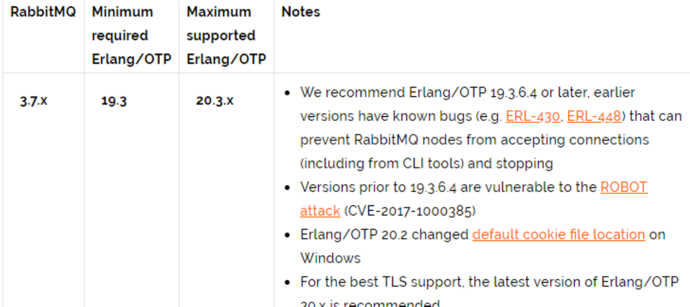

本项目使用Erlang/OTP 20.3版本和RabbitMQ3.7.3版本。

1）下载erlang

地址如下：

http://erlang.org/download/otp_win64_20.3.exe

或去老师提供的软件包中找到 otp_win64_20.3.exe，以管理员方式运行此文件，安装。

erlang安装完成需要配置erlang环境变量： ERLANG_HOME=D:\\Program Files\\erl9.3
在path中添

加%ERLANG_HOME%\\bin;

2）安装RabbitMQ

https://github.com/rabbitmq/rabbitmq-server/releases/tag/v3.7.3

或去老师提供的软件包中找到
rabbitmq-server-3.7.3.exe，以管理员方式运行此文件，安装。

2.2.2启动

安装成功后会自动创建RabbitMQ服务并且启动。

1）从开始菜单启动RabbitMQ

完成在开始菜单找到RabbitMQ的菜单：

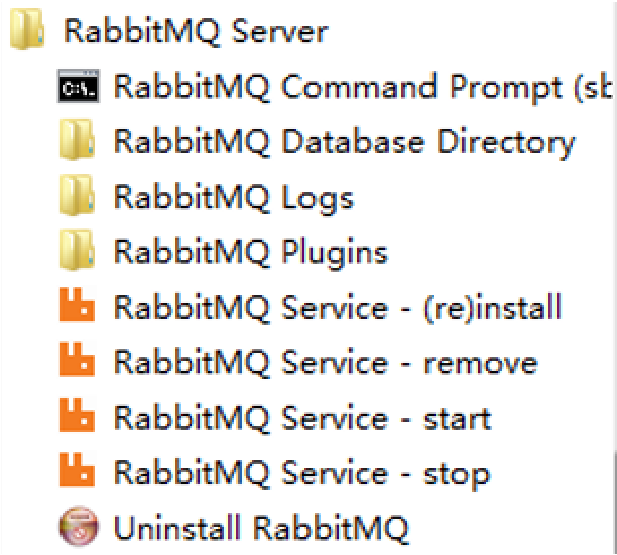

RabbitMQ Service-install :安装服务

RabbitMQ Service-remove 删除服务

RabbitMQ Service-start 启动

RabbitMQ Service-stop 启动

2）如果没有开始菜单则进入安装目录下sbin目录手动启动：

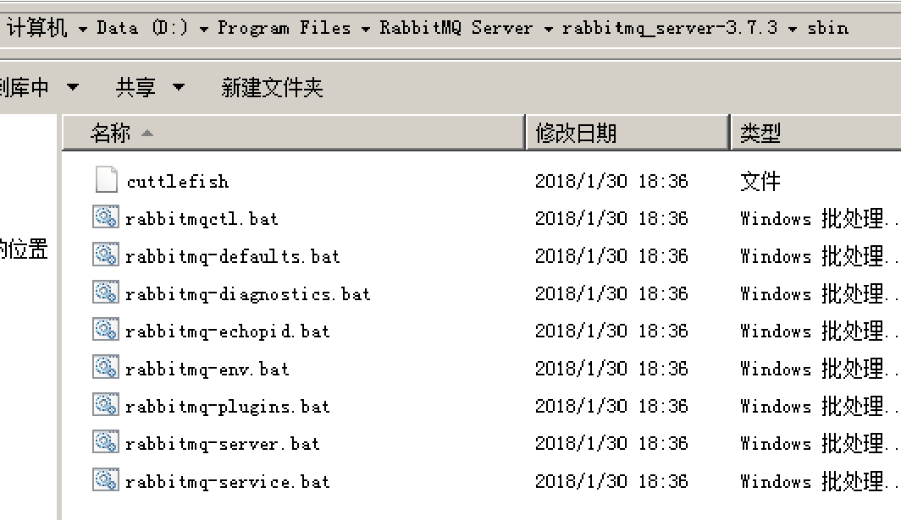

1）安装并运行服务

rabbitmq-service.bat install 安装服务

-   rabbitmq-service start 开始服务

-   Rabbitmq-service stop 停止服务

-   插件启动和停止

-   rabbitmq-plugins enable rabbitmq_management 启动

-   rabbitmq-plugins disable rabbitmq_management 关闭

-   在浏览器输入 http:localhost(ip):15672进入控制台

2）安装管理插件

安装rabbitMQ的管理插件，方便在浏览器端管理RabbitMQ

管理员身份运行 rabbitmq-plugins.bat enable rabbitmq_management

3、启动成功 登录RabbitMQ

进入浏览器，输入：http://localhost:15672

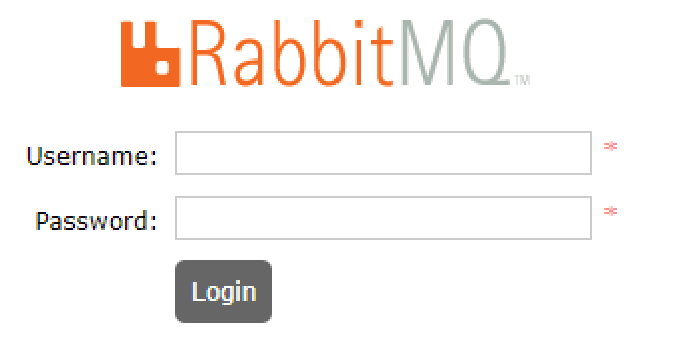

初始账号和密码：guest/guest

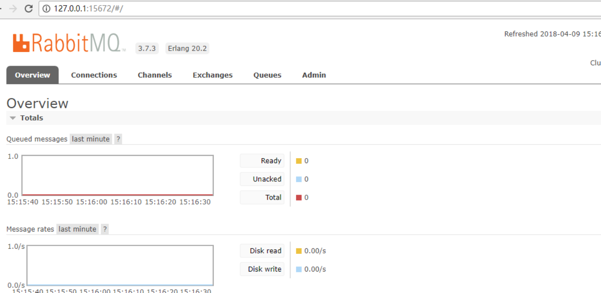

.2.3 注意事项

1、安装erlang和rabbitMQ以管理员身份运行。

2、当卸载重新安装时会出现RabbitMQ服务注册失败，此时需要进入注册表清理erlang

搜索RabbitMQ、ErlSrv，将对应的项全部删除。

### Hello World

按照官方教程(http://www.rabbitmq.com/getstarted.html) 测试hello world:

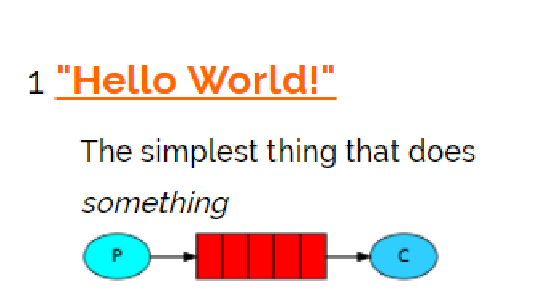

#### 搭建环境

1）java client

生产者和消费者都属于客户端，rabbitMQ的java客户端如下：

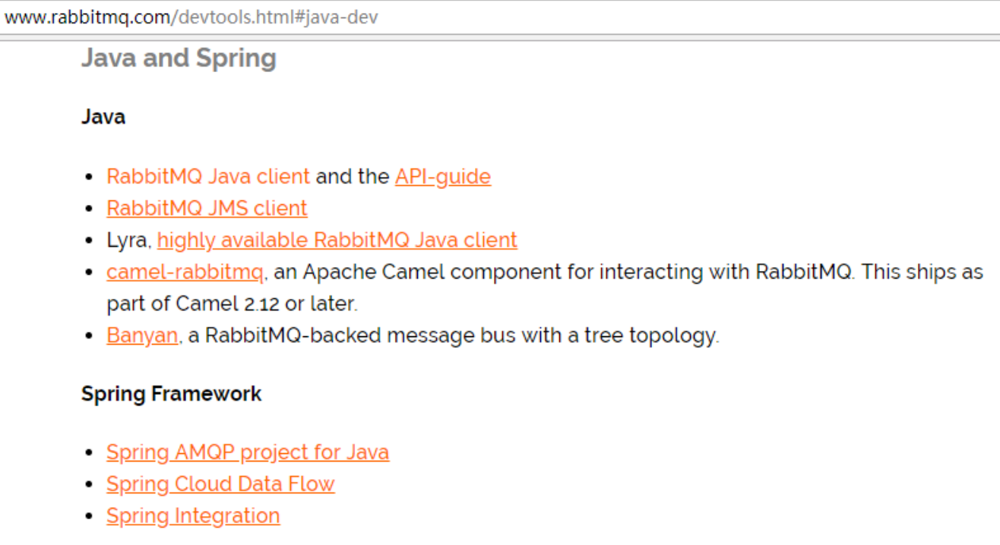

我们先用 rabbitMQ官方提供的java
client测试，目的是对RabbitMQ的交互过程有个清晰的认识。

参考 ：https://github.com/rabbitmq/rabbitmq-java-client/

2 ）创建maven工程

创建生产者工程和消费者工程，分别加入RabbitMQ java client的依赖。

test-rabbitmq-producer：生产者工程

test-rabbitmq-consumer：消费者工程

| \<dependencies\> \<dependency\> \<groupId\>com.rabbitmq\</groupId\> \<artifactId\>amqp‐client\</artifactId\> \<!--此版本与spring boot 1.5.9版本匹配--\> \<version\>4.0.3\</version\> \</dependency\> \<dependency\> \<groupId\>org.springframework.boot\</groupId\> \<artifactId\>spring‐boot‐starter‐logging\</artifactId\> \</dependency\> \</dependencies\> |
|----------------------------------------------------------------------------------------------------------------------------------------------------------------------------------------------------------------------------------------------------------------------------------------------------------------------------------------------------------------|

#### 生产者

在生产者工程下的test中创建测试类如下：

| public class Producer01 { //队列名称 private static final String QUEUE = "helloworld"; public static void main(String[] args) throws IOException, TimeoutException { Connection connection = null; Channel channel = null; try { ConnectionFactory factory = new ConnectionFactory(); factory.setHost("localhost"); factory.setPort(5672); factory.setUsername("guest"); factory.setPassword("guest"); factory.setVirtualHost("/");//rabbitmq默认虚拟机名称为“/”，虚拟机相当于一个独立的mq服务 器 //创建与RabbitMQ服务的TCP连接 connection = factory.newConnection(); //创建与Exchange的通道，每个连接可以创建多个通道，每个通道代表一个会话任务 channel = connection.createChannel(); /\*\* \* 声明队列，如果Rabbit中没有此队列将自动创建 \* param1:队列名称 \* param2:是否持久化 \* param3:队列是否独占此连接 \* param4:队列不再使用时是否自动删除此队列 \* param5:队列参数 \*/ channel.queueDeclare(QUEUE, true, false, false, null); String message = "helloworld小明"+System.currentTimeMillis(); /\*\* \* 消息发布方法 \* param1：Exchange的名称，如果没有指定，则使用Default Exchange \* param2:routingKey,消息的路由Key，是用于Exchange（交换机）将消息转发到指定的消息队列 \* param3:消息包含的属性 \* param4：消息体 \*/ /\*\* \* 这里没有指定交换机，消息将发送给默认交换机，每个队列也会绑定那个默认的交换机，但是不能显 示绑定或解除绑定 \* 默认的交换机，routingKey等于队列名称 \*/ channel.basicPublish("", QUEUE, null, message.getBytes()); System.out.println("Send Message is:'" + message + "'"); } catch(Exception ex) { ex.printStackTrace(); } finally { if(channel != null) { channel.close(); } if(connection != null) { connection.close(); } } } } |
|-------------------------------------------------------------------------------------------------------------------------------------------------------------------------------------------------------------------------------------------------------------------------------------------------------------------------------------------------------------------------------------------------------------------------------------------------------------------------------------------------------------------------------------------------------------------------------------------------------------------------------------------------------------------------------------------------------------------------------------------------------------------------------------------------------------------------------------------------------------------------------------------------------------------------------------------------------------------------------------------------------------------------------------------------------------------------------------------------------------------------------------------------------------------------------------------------------------------------------------------------------------------------------------------------------------------------------------------------------------------------------------------------------------------------------------------------------------------------------------------------------------------------------------------------------------------------------------------------------------------------------------------------------------------------------|

#### 消费者

在消费者工程下的test中创建测试类如下：

| public class Consumer01 { private static final String QUEUE = "helloworld"; public static void main(String[] args) throws IOException, TimeoutException { ConnectionFactory factory = new ConnectionFactory(); //设置MabbitMQ所在服务器的ip和端口 factory.setHost("127.0.0.1"); factory.setPort(5672); Connection connection = factory.newConnection(); Channel channel = connection.createChannel(); //声明队列 channel.queueDeclare(QUEUE, true, false, false, null); //定义消费方法 DefaultConsumer consumer = new DefaultConsumer(channel) { /\*\* \* 消费者接收消息调用此方法 \* \@param consumerTag 消费者的标签，在channel.basicConsume()去指定 \* \@param envelope 消息包的内容，可从中获取消息id，消息routingkey，交换机，消息和重传标志 (收到消息失败后是否需要重新发送) \* \@param properties \* \@param body \* \@throws IOException \*/ \@Override public void handleDelivery(String consumerTag, Envelope envelope, AMQP.BasicProperties properties, byte[] body) throws IOException { //交换机 String exchange = envelope.getExchange(); //路由key String routingKey = envelope.getRoutingKey(); //消息id long deliveryTag = envelope.getDeliveryTag(); //消息内容 String msg = new String(body,"utf‐8"); System.out.println("receive message.." + msg); } }; /\*\* \* 监听队列String queue, boolean autoAck,Consumer callback \* 参数明细 \* 1、队列名称 \* 2、是否自动回复，设置为true为表示消息接收到自动向mq回复接收到了，mq接收到回复会删除消息，设置 为false则需要手动回复 \* 3、消费消息的方法，消费者接收到消息后调用此方法 \*/ channel.basicConsume(QUEUE, true, consumer); } } |
|---------------------------------------------------------------------------------------------------------------------------------------------------------------------------------------------------------------------------------------------------------------------------------------------------------------------------------------------------------------------------------------------------------------------------------------------------------------------------------------------------------------------------------------------------------------------------------------------------------------------------------------------------------------------------------------------------------------------------------------------------------------------------------------------------------------------------------------------------------------------------------------------------------------------------------------------------------------------------------------------------------------------------------------------------------------------------------------------------------------------------------------------------------------------------------------------------------------------------------------------------------------------------------------------------------------------------------------------------------------------------------------------------------------------------------------------------------------------------------------------------------------------------------------------------------------------------------------------------------|

#### 总结

1、发送端操作流程

>   1）创建连接

>   2）创建通道

>   3）声明队列

>   4）发送消息

2、接收端

>   1）创建连接

>   2）创建通道

>   3）声明队列

>   4）监听队列

>   5）接收消息

>   6 ）ack回复

demo1
-----

### 依赖

\<dependency\>

\<groupId\>com.rabbitmq\</groupId\>

\<artifactId\>amqp-client\</artifactId\>

\<version\>4.1.0\</version\>

\</dependency\>

### Producer.java

| import com.rabbitmq.client.Channel; import com.rabbitmq.client.Connection; import com.rabbitmq.client.ConnectionFactory; import java.io.IOException; import java.util.concurrent.TimeoutException; public class Producer { public static void main(String[] args) throws IOException, TimeoutException { //创建连接工厂 ConnectionFactory factory = new ConnectionFactory(); factory.setUsername("guest"); factory.setPassword("guest"); //设置 RabbitMQ 地址 factory.setHost("localhost"); //建立到代理服务器到连接 Connection conn = factory.newConnection(); //获得信道 Channel channel = conn.createChannel(); //声明交换器 String exchangeName = "hello-exchange"; channel.exchangeDeclare(exchangeName, "direct", true); String routingKey = "hola"; //发布消息 byte[] messageBodyBytes = "quit".getBytes(); channel.basicPublish(exchangeName, routingKey, null, messageBodyBytes); channel.close(); conn.close(); } } |
|-------------------------------------------------------------------------------------------------------------------------------------------------------------------------------------------------------------------------------------------------------------------------------------------------------------------------------------------------------------------------------------------------------------------------------------------------------------------------------------------------------------------------------------------------------------------------------------------------------------------------------------------------------------------------------------------------------------------------------------------------------------------------------------------------------------------------------------------------------------------------------------------------------------------------------|

### Consumer.java

| import com.rabbitmq.client.\*; import java.io.IOException; import java.util.concurrent.TimeoutException; public class Consumer { public static void main(String[] args) throws IOException, TimeoutException { ConnectionFactory factory = new ConnectionFactory(); factory.setUsername("guest"); factory.setPassword("guest"); factory.setHost("localhost"); //建立到代理服务器到连接 Connection conn = factory.newConnection(); //获得信道 final Channel channel = conn.createChannel(); //声明交换器 String exchangeName = "hello-exchange"; channel.exchangeDeclare(exchangeName, "direct", true); //声明队列 String queueName = channel.queueDeclare().getQueue(); String routingKey = "hola"; //绑定队列，通过键 hola 将队列和交换器绑定起来 channel.queueBind(queueName, exchangeName, routingKey); while(true) { //消费消息 boolean autoAck = false; String consumerTag = ""; channel.basicConsume(queueName, autoAck, consumerTag, new DefaultConsumer(channel) { \@Override public void handleDelivery(String consumerTag, Envelope envelope, AMQP.BasicProperties properties, byte[] body) throws IOException { String routingKey = envelope.getRoutingKey(); String contentType = properties.getContentType(); System.out.println("消费的路由键：" + routingKey); System.out.println("消费的内容类型：" + contentType); long deliveryTag = envelope.getDeliveryTag(); //确认消息 channel.basicAck(deliveryTag, false); System.out.println("消费的消息体内容："); String bodyStr = new String(body, "UTF-8"); System.out.println(bodyStr); } }); } } } |
|-------------------------------------------------------------------------------------------------------------------------------------------------------------------------------------------------------------------------------------------------------------------------------------------------------------------------------------------------------------------------------------------------------------------------------------------------------------------------------------------------------------------------------------------------------------------------------------------------------------------------------------------------------------------------------------------------------------------------------------------------------------------------------------------------------------------------------------------------------------------------------------------------------------------------------------------------------------------------------------------------------------------------------------------------------------------------------------------------------------------------------------------------------------------------------------------------------------------------------------------------------------------------------------------------------------------------------------------------------------------------------------------------------------------------------------------------------------------------------------------------------------------------------------------------------------------|

Spring整合
----------

### maven

| \<!-- RabbitMQ --\> \<dependency\> \<groupId\>com.rabbitmq\</groupId\> \<artifactId\>amqp-client\</artifactId\> \<version\>3.5.1\</version\> \</dependency\> \<dependency\> \<groupId\>org.springframework.amqp\</groupId\> \<artifactId\>spring-rabbit\</artifactId\> \<version\>1.4.5.RELEASE\</version\> \</dependency\> \<dependency\> \<groupId\>org.springframework\</groupId\> \<artifactId\>spring-context\</artifactId\> \<version\>4.2.0.RELEASE\</version\> \</dependency\> \<dependency\> \<groupId\>javassist\</groupId\> \<artifactId\>javassist\</artifactId\> \<version\>3.11.0.GA\</version\> \</dependency\> \<dependency\> \<groupId\>org.springframework\</groupId\> \<artifactId\>spring-webmvc\</artifactId\> \<version\>4.2.0.RELEASE\</version\> \</dependency\> \<dependency\> \<groupId\>org.springframework\</groupId\> \<artifactId\>spring-core\</artifactId\> \<version\>4.2.0.RELEASE\</version\> \</dependency\> \<dependency\> \<groupId\>org.springframework\</groupId\> \<artifactId\>spring-context-support\</artifactId\> \<version\>4.2.0.RELEASE\</version\> \</dependency\> \<dependency\> \<groupId\>org.springframework\</groupId\> \<artifactId\>spring-core\</artifactId\> \<version\>4.2.0.RELEASE\</version\> \</dependency\> |
|-----------------------------------------------------------------------------------------------------------------------------------------------------------------------------------------------------------------------------------------------------------------------------------------------------------------------------------------------------------------------------------------------------------------------------------------------------------------------------------------------------------------------------------------------------------------------------------------------------------------------------------------------------------------------------------------------------------------------------------------------------------------------------------------------------------------------------------------------------------------------------------------------------------------------------------------------------------------------------------------------------------------------------------------------------------------------------------------------------------------------------------------------------------------------------------------------------------------------------------------------------------------------------|

### Producer.java

| import org.springframework.amqp.core.AmqpTemplate; import org.springframework.beans.factory.annotation.Autowired; import org.springframework.stereotype.Service; /\*\* \* \@Description: 消息队列发送者 \* \@Author: \* \@CreateTime: \*/ \@Service public class Producer { \@Autowired private AmqpTemplate amqpTemplate; public void sendQueue(String exchange_key, String queue_key, Object object) { // convertAndSend 将Java对象转换为消息发送至匹配key的交换机中Exchange amqpTemplate.convertAndSend(exchange_key, queue_key, object); } } |
|--------------------------------------------------------------------------------------------------------------------------------------------------------------------------------------------------------------------------------------------------------------------------------------------------------------------------------------------------------------------------------------------------------------------------------------------------------------------------------------------------------------------------------------------------|

### RabbitmqService.java

| import org.springframework.amqp.core.Message; import org.springframework.amqp.core.MessageListener; public class RabbitmqService implements MessageListener { public void onMessage(Message message) { System.out.println("消息消费者 = " + message.toString()); } } |
|----------------------------------------------------------------------------------------------------------------------------------------------------------------------------------------------------------------------------------------------------------------------|

### Test.java

| import java.util.HashMap; import java.util.Map; import org.springframework.context.ApplicationContext; import org.springframework.context.support.ClassPathXmlApplicationContext; public class Test { public static void main(String[] args) { ApplicationContext context = new ClassPathXmlApplicationContext("application-context.xml"); Producer messageProducer = (Producer) context.getBean("producer"); Map\<String, Object\> map = new HashMap\<String, Object\>(); map.put("data", "hello rabbitmq"); // 注意：第二个属性是 Queue 与 交换机绑定的路由 messageProducer.sendQueue("test_mq_exchange", "test_mq_patt", map); } } |
|---------------------------------------------------------------------------------------------------------------------------------------------------------------------------------------------------------------------------------------------------------------------------------------------------------------------------------------------------------------------------------------------------------------------------------------------------------------------------------------------------------------------------------------------------------------------------------------------------------------------------------------|

### application.properties

| mq.host=127.0.0.1 mq.username=guest mq.password=guest mq.port=5672 mq.queue=test_mq |
|-------------------------------------------------------------------------------------|

### application-context.xml

| \<?xml version="1.0" encoding="UTF-8"?\> \<beans xmlns="http://www.springframework.org/schema/beans" xmlns:xsi="http://www.w3.org/2001/XMLSchema-instance" xmlns:context="http://www.springframework.org/schema/context" xmlns:util="http://www.springframework.org/schema/util" xmlns:aop="http://www.springframework.org/schema/aop" xmlns:tx="http://www.springframework.org/schema/tx" xmlns:rabbit="http://www.springframework.org/schema/rabbit" xmlns:p="http://www.springframework.org/schema/p" xsi:schemaLocation=" http://www.springframework.org/schema/context http://www.springframework.org/schema/context/spring-context-3.0.xsd http://www.springframework.org/schema/beans http://www.springframework.org/schema/beans/spring-beans-3.0.xsd http://www.springframework.org/schema/util http://www.springframework.org/schema/util/spring-util-3.0.xsd http://www.springframework.org/schema/aop http://www.springframework.org/schema/aop/spring-aop-3.0.xsd http://www.springframework.org/schema/tx http://www.springframework.org/schema/tx/spring-tx-3.0.xsd http://www.springframework.org/schema/rabbit http://www.springframework.org/schema/rabbit/spring-rabbit-1.0.xsd"\> \<context:component-scan base-package="rabbitmq.\*\*"/\> \<context:property-placeholder location="classpath:application.properties"/\> \<util:properties id="appConfig" location="classpath:application.properties"\>\</util:properties\> \<!-- RabbitMQ start --\> \<!-- 连接配置 --\> \<rabbit:connection-factory id="connectionFactory" host="\${mq.host}" username="\${mq.username}" password="\${mq.password}" port="\${mq.port}" /\> \<rabbit:admin connection-factory="connectionFactory"/\> \<!-- 消息队列客户端 --\> \<rabbit:template id="amqpTemplate" exchange="\${mq.queue}_exchange" connection-factory="connectionFactory" /\> \<!-- queue 队列声明 --\> \<!-- durable 是否持久化 exclusive 仅创建者可以使用的私有队列，断开后自动删除 auto-delete 当所有消费端连接断开后，是否自动删除队列 --\> \<rabbit:queue id="test_queue" name="\${mq.queue}_testQueue" durable="true" auto-delete="false" exclusive="false" /\> \<!-- 交换机定义 --\> \<!-- 交换机：一个交换机可以绑定多个队列，一个队列也可以绑定到多个交换机上。 如果没有队列绑定到交换机上，则发送到该交换机上的信息则会丢失。 direct模式:消息与一个特定的路由器完全匹配，才会转发 topic模式:按模式匹配 --\> \<rabbit:topic-exchange name="\${mq.queue}_exchange" durable="true" auto-delete="false"\> \<rabbit:bindings\> \<!-- 设置消息Queue匹配的pattern (direct模式为key) --\> \<rabbit:binding queue="test_queue" pattern="\${mq.queue}_patt"/\> \</rabbit:bindings\> \</rabbit:topic-exchange\> \<bean name="rabbitmqService" class="RabbitmqService"\>\</bean\> \<!-- 配置监听 消费者 --\> \<rabbit:listener-container connection-factory="connectionFactory" acknowledge="auto"\> \<!-- queues 监听队列，多个用逗号分隔 ref 监听器 --\> \<rabbit:listener queues="test_queue" ref="rabbitmqService"/\> \</rabbit:listener-container\> \</beans\> |
|-----------------------------------------------------------------------------------------------------------------------------------------------------------------------------------------------------------------------------------------------------------------------------------------------------------------------------------------------------------------------------------------------------------------------------------------------------------------------------------------------------------------------------------------------------------------------------------------------------------------------------------------------------------------------------------------------------------------------------------------------------------------------------------------------------------------------------------------------------------------------------------------------------------------------------------------------------------------------------------------------------------------------------------------------------------------------------------------------------------------------------------------------------------------------------------------------------------------------------------------------------------------------------------------------------------------------------------------------------------------------------------------------------------------------------------------------------------------------------------------------------------------------------------------------------------------------------------------------------------------------------------------------------------------------------------------------------------------------------------------------------------------------------------------------------------------------------------------------------------------------------------------------------------------------------------------------------------------------------------------------------------------------------------------------------------------------------------------------------------------------------------------------------------------------------------------------------------------------------------------------------------------------------------------------------------------------------------------------------------------------------------------------------------------------------------------------------------------------------------------------------------------------------------------------------------------------------------------------------------------------------------------------------------------------------------------------------------------------------------------------------------------------------------------------------------------------------------------------------------------------------------------------------------------------------------------------------------------------------------------------------------------------------------------|

### log4j.properties

| \#\#\# \\u8BBE\\u7F6E\#\#\# log4j.rootLogger = info,stdout,D,E \#\#\# \\u8F93\\u51FA\\u4FE1\\u606F\\u5230\\u63A7\\u5236\\u62AC \#\#\# log4j.appender.stdout = org.apache.log4j.ConsoleAppender log4j.appender.stdout.Target = System.out log4j.appender.stdout.layout = org.apache.log4j.PatternLayout log4j.appender.stdout.layout.ConversionPattern = [%-5p] %d{yyyy-MM-dd HH:mm:ss,SSS} method:%l%n%m%n \#\#\# \\u8F93\\u51FADEBUG \\u7EA7\\u522B\\u4EE5\\u4E0A\\u7684\\u65E5\\u5FD7\\u5230=E://logs/error.log \#\#\# log4j.appender.D = org.apache.log4j.DailyRollingFileAppender log4j.appender.D.File = E://logs/log.log log4j.appender.D.Append = true log4j.appender.D.Threshold = DEBUG log4j.appender.D.layout = org.apache.log4j.PatternLayout log4j.appender.D.layout.ConversionPattern = %-d{yyyy-MM-dd HH:mm:ss} [ %t:%r ] - [ %p ] %m%n \#\#\# \\u8F93\\u51FAERROR \\u7EA7\\u522B\\u4EE5\\u4E0A\\u7684\\u65E5\\u5FD7\\u5230=E://logs/error.log \#\#\# log4j.appender.E = org.apache.log4j.DailyRollingFileAppender log4j.appender.E.File =E://logs/error.log log4j.appender.E.Append = true log4j.appender.E.Threshold = ERROR log4j.appender.E.layout = org.apache.log4j.PatternLayout log4j.appender.E.layout.ConversionPattern = %-d{yyyy-MM-dd HH:mm:ss} [ %t:%r ] - [ %p ] %m%n |
|-----------------------------------------------------------------------------------------------------------------------------------------------------------------------------------------------------------------------------------------------------------------------------------------------------------------------------------------------------------------------------------------------------------------------------------------------------------------------------------------------------------------------------------------------------------------------------------------------------------------------------------------------------------------------------------------------------------------------------------------------------------------------------------------------------------------------------------------------------------------------------------------------------------------------------------------------------------------------------------------------------------------------------------------------------------------------------------------------------------------------------------------------------------------------------------------------------------------------------------------------------------------------------------------------------|

工作模式
--------

RabbitMQ有以下几种工作模式 ：

1、Work queues

2、Publish/Subscribe

3、Routing

4、Topics

5、Header

6、RPC

### Work queues

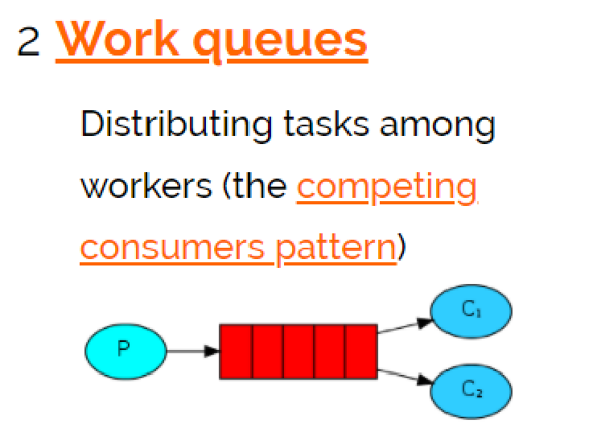

work
queues与入门程序相比，多了一个消费端，两个消费端共同消费同一个队列中的消息。

应用场景：对于 任务过重或任务较多情况使用工作队列可以提高任务处理的速度。

测试：

1、使用入门程序，启动多个消费者。

2、生产者发送多个消息。

结果：

1、一条消息只会被一个消费者接收；

2、rabbit采用轮询的方式将消息是平均发送给消费者的；

3、消费者在处理完某条消息后，才会收到下一条消息。

### Publish/subscribe

#### 工作模式

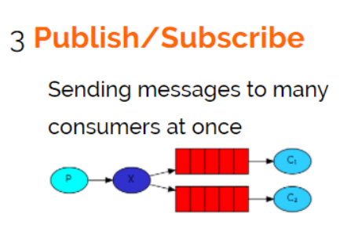

发布订阅模式：

1、每个消费者监听自己的队列。

2、生产者将消息发给broker，由交换机将消息转发到绑定此交换机的每个队列，每个绑定交换机的队列都将接收

到消息

4.2.2代码

案例：

用户通知，当用户充值成功或转账完成系统通知用户，通知方式有短信、邮件多种方法 。

1、生产者

声明Exchange_fanout_inform交换机。

声明两个队列并且绑定到此交换机，绑定时不需要指定routingkey

发送消息时不需要指定routingkey

| package com.xuecheng.test.rabbitmq; import com.rabbitmq.client.\*; import java.io.IOException; import java.util.concurrent.TimeoutException; public class Producer02_publish { //队列名称 private static final String QUEUE_INFORM_EMAIL = "queue_inform_email"; private static final String QUEUE_INFORM_SMS = "queue_inform_sms"; private static final String EXCHANGE_FANOUT_INFORM="exchange_fanout_inform"; public static void main(String[] args) { Connection connection = null; Channel channel = null; try { //创建一个与MQ的连接 ConnectionFactory factory = new ConnectionFactory(); factory.setHost("127.0.0.1"); factory.setPort(5672); factory.setUsername("guest"); factory.setPassword("guest"); factory.setVirtualHost("/");//rabbitmq默认虚拟机名称为“/”，虚拟机相当于一个独立的mq服务 器 //创建一个连接 connection = factory.newConnection(); //创建与交换机的通道，每个通道代表一个会话 channel = connection.createChannel(); //声明交换机 String exchange, BuiltinExchangeType type /\*\* \* 参数明细 \* 1、交换机名称 \* 2、交换机类型，fanout、topic、direct、headers \*/ channel.exchangeDeclare(EXCHANGE_FANOUT_INFORM, BuiltinExchangeType.FANOUT); //声明队列 // (String queue, boolean durable, boolean exclusive, boolean autoDelete, Map\<String, Object\> arguments) /\*\* \* 参数明细： \* 1、队列名称 \* 2、是否持久化 \* 3、是否独占此队列 \* 4、队列不用是否自动删除 \* 5、参数 \*/ channel.queueDeclare(QUEUE_INFORM_EMAIL, true, false, false, null); channel.queueDeclare(QUEUE_INFORM_SMS, true, false, false, null); //交换机和队列绑定String queue, String exchange, String routingKey /\*\* \* 参数明细 \* 1、队列名称 \* 2、交换机名称 \* 3、路由key \*/ channel.queueBind(QUEUE_INFORM_EMAIL,EXCHANGE_FANOUT_INFORM,""); channel.queueBind(QUEUE_INFORM_SMS,EXCHANGE_FANOUT_INFORM,""); //发送消息 for (int i=0;i\<10;i++){ String message = "inform to user"+i; //向交换机发送消息 String exchange, String routingKey, BasicProperties props, byte[] body /\*\* \* 参数明细 \* 1、交换机名称，不指令使用默认交换机名称 Default Exchange \* 2、routingKey（路由key），根据key名称将消息转发到具体的队列，这里填写队列名称表示消 息将发到此队列 \* 3、消息属性 \* 4、消息内容 \*/ channel.basicPublish(EXCHANGE_FANOUT_INFORM, "", null, message.getBytes()); System.out.println("Send Message is:'" + message + "'"); } } catch (IOException e) { e.printStackTrace(); } catch (TimeoutException e) { e.printStackTrace(); }finally{ if(channel!=null){ try { channel.close(); } catch (IOException e) { e.printStackTrace(); } catch (TimeoutException e) { e.printStackTrace(); } } if(connection!=null){ try { connection.close(); } catch (IOException e) { e.printStackTrace(); } } } } } |
|--------------------------------------------------------------------------------------------------------------------------------------------------------------------------------------------------------------------------------------------------------------------------------------------------------------------------------------------------------------------------------------------------------------------------------------------------------------------------------------------------------------------------------------------------------------------------------------------------------------------------------------------------------------------------------------------------------------------------------------------------------------------------------------------------------------------------------------------------------------------------------------------------------------------------------------------------------------------------------------------------------------------------------------------------------------------------------------------------------------------------------------------------------------------------------------------------------------------------------------------------------------------------------------------------------------------------------------------------------------------------------------------------------------------------------------------------------------------------------------------------------------------------------------------------------------------------------------------------------------------------------------------------------------------------------------------------------------------------------------------------------------------------------------------------------------------------------------------------------------------------------------------------------------------------------------------------------------------------------------------------------------------------------------------------------------------------------------------------------------------------------------------------------------------------------------------------------------------------------------------------------------------------------------------------------------------------------------------------------------------------------------------------------------------------------------------------------------------------------------------------------------------------------------------------------------------------------------------------------------------------------------------------------------------------------------------------------------------------------------------|

2、邮件发送消费者

| package com.xuecheng.test.rabbitmq; import com.rabbitmq.client.\*; import java.io.IOException; import java.util.concurrent.TimeoutException; /\*\* \* \@author Administrator \* \@version 1.0 \* \@create 2018‐06‐14 10:32 \*\*/ public class Consumer02_subscribe_email { //队列名称 private static final String QUEUE_INFORM_EMAIL = "inform_queue_email"; private static final String EXCHANGE_FANOUT_INFORM="inform_exchange_fanout"; public static void main(String[] args) throws IOException, TimeoutException { //创建一个与MQ的连接 ConnectionFactory factory = new ConnectionFactory(); factory.setHost("127.0.0.1"); factory.setPort(5672); factory.setUsername("guest"); factory.setPassword("guest"); factory.setVirtualHost("/");//rabbitmq默认虚拟机名称为“/”，虚拟机相当于一个独立的mq服务器 //创建一个连接 Connection connection = factory.newConnection(); //创建与交换机的通道，每个通道代表一个会话 Channel channel = connection.createChannel(); //声明交换机 String exchange, BuiltinExchangeType type /\*\* \* 参数明细 \* 1、交换机名称 \* 2、交换机类型，fanout、topic、direct、headers \*/ channel.exchangeDeclare(EXCHANGE_FANOUT_INFORM, BuiltinExchangeType.FANOUT); //声明队列 // channel.queueDeclare(String queue, boolean durable, boolean exclusive, boolean autoDelete, Map\<String, Object\> arguments) /\*\* \* 参数明细： \* 1、队列名称 \* 2、是否持久化 \* 3、是否独占此队列 \* 4、队列不用是否自动删除 \* 5、参数 \*/ channel.queueDeclare(QUEUE_INFORM_EMAIL, true, false, false, null); //交换机和队列绑定String queue, String exchange, String routingKey /\*\* \* 参数明细 \* 1、队列名称 \* 2、交换机名称 \* 3、路由key \*/ channel.queueBind(QUEUE_INFORM_EMAIL,EXCHANGE_FANOUT_INFORM,""); //定义消费方法 DefaultConsumer defaultConsumer = new DefaultConsumer(channel) { \@Override public void handleDelivery(String consumerTag, Envelope envelope, AMQP.BasicProperties properties, byte[] body) throws IOException { long deliveryTag = envelope.getDeliveryTag(); String exchange = envelope.getExchange(); //消息内容 String message = new String(body, "utf‐8"); System.out.println(message); } }; /\*\* \* 监听队列String queue, boolean autoAck,Consumer callback \* 参数明细 \* 1、队列名称 \* 2、是否自动回复，设置为true为表示消息接收到自动向mq回复接收到了，mq接收到回复会删除消息，设置 为false则需要手动回复 \* 3、消费消息的方法，消费者接收到消息后调用此方法 \*/ channel.basicConsume(QUEUE_INFORM_EMAIL, true, defaultConsumer); } } |
|------------------------------------------------------------------------------------------------------------------------------------------------------------------------------------------------------------------------------------------------------------------------------------------------------------------------------------------------------------------------------------------------------------------------------------------------------------------------------------------------------------------------------------------------------------------------------------------------------------------------------------------------------------------------------------------------------------------------------------------------------------------------------------------------------------------------------------------------------------------------------------------------------------------------------------------------------------------------------------------------------------------------------------------------------------------------------------------------------------------------------------------------------------------------------------------------------------------------------------------------------------------------------------------------------------------------------------------------------------------------------------------------------------------------------------------------------------------------------------------------------------------------------------------------------------------------------------------------------------------------------------------------------------------------------------------------------------------------------------------------------------------------------------------------------------------------------------------------------------------------------------------------------------------------------------------------------------------------------------------------------------------------------------------------------------------------------------------------------------------------------------------------------------------------------------------------------------------------------------------------------------------------------------------------------------------------------------------------------------------------------------------------------------------------------------------------------------------------------------------------------------|

按照上边的代码，编写邮件通知的消费代码。

3、短信发送消费者

参考上边的邮件发送消费者代码编写。

#### 测试

打开RabbitMQ的管理界面，观察交换机绑定情况：

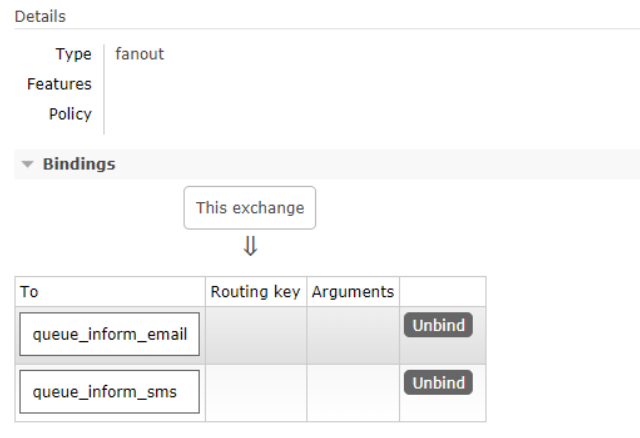

使用生产者发送若干条消息，每条消息都转发到各各队列，每消费者都接收到了消息。

4.2.4 思考

1、publish/subscribe与work queues有什么区别。

区别：

1）work queues不用定义交换机，而publish/subscribe需要定义交换机。

2）publish/subscribe的生产方是面向交换机发送消息，work
queues的生产方是面向队列发送消息(底层使用默认

交换机)。

3）publish/subscribe需要设置队列和交换机的绑定，work
queues不需要设置，实质上work queues会将队列绑

定到默认的交换机 。

相同点：

所以两者实现的发布/订阅的效果是一样的，多个消费端监听同一个队列不会重复消费消息。

2、实质工作用什么 publish/subscribe还是work queues。

建议使用
publish/subscribe，发布订阅模式比工作队列模式更强大，并且发布订阅模式可以指定自己专用的交换

机。

### Routing

#### 工作模式

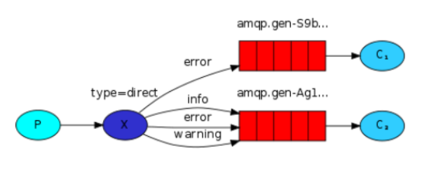

路由模式：

1、每个消费者监听自己的队列，并且设置routingkey。

2、生产者将消息发给交换机，由交换机根据routingkey来转发消息到指定的队列。

#### 代码

1、生产者

声明exchange_routing_inform交换机。

声明两个队列并且绑定到此交换机，绑定时需要指定routingkey

发送消息时需要指定routingkey

| package com.xuecheng.test.rabbitmq; import com.rabbitmq.client.BuiltinExchangeType; import com.rabbitmq.client.Channel; import com.rabbitmq.client.Connection; import com.rabbitmq.client.ConnectionFactory; import java.io.IOException; import java.util.concurrent.TimeoutException; public class Producer03_routing { //队列名称 private static final String QUEUE_INFORM_EMAIL = "queue_inform_email"; private static final String QUEUE_INFORM_SMS = "queue_inform_sms"; private static final String EXCHANGE_ROUTING_INFORM="exchange_routing_inform"; public static void main(String[] args) { Connection connection = null; Channel channel = null; try { //创建一个与MQ的连接 ConnectionFactory factory = new ConnectionFactory(); factory.setHost("127.0.0.1"); factory.setPort(5672); factory.setUsername("guest"); factory.setPassword("guest"); factory.setVirtualHost("/");//rabbitmq默认虚拟机名称为“/”，虚拟机相当于一个独立的mq服务 器 //创建一个连接 connection = factory.newConnection(); //创建与交换机的通道，每个通道代表一个会话 channel = connection.createChannel(); //声明交换机 String exchange, BuiltinExchangeType type /\*\* \* 参数明细 \* 1、交换机名称 \* 2、交换机类型，fanout、topic、direct、headers \*/ channel.exchangeDeclare(EXCHANGE_ROUTING_INFORM, BuiltinExchangeType.DIRECT); //声明队列 // channel.queueDeclare(String queue, boolean durable, boolean exclusive, boolean autoDelete, Map\<String, Object\> arguments) /\*\* \* 参数明细： \* 1、队列名称 \* 2、是否持久化 \* 3、是否独占此队列 \* 4、队列不用是否自动删除 \* 5、参数 \*/ channel.queueDeclare(QUEUE_INFORM_EMAIL, true, false, false, null); channel.queueDeclare(QUEUE_INFORM_SMS, true, false, false, null); //交换机和队列绑定String queue, String exchange, String routingKey /\*\* \* 参数明细 \* 1、队列名称 \* 2、交换机名称 \* 3、路由key \*/ channel.queueBind(QUEUE_INFORM_EMAIL,EXCHANGE_ROUTING_INFORM,QUEUE_INFORM_EMAIL); channel.queueBind(QUEUE_INFORM_SMS,EXCHANGE_ROUTING_INFORM,QUEUE_INFORM_SMS); //发送邮件消息 for (int i=0;i\<10;i++){ String message = "email inform to user"+i; //向交换机发送消息 String exchange, String routingKey, BasicProperties props, byte[] body /\*\* \* 参数明细 \* 1、交换机名称，不指令使用默认交换机名称 Default Exchange \* 2、routingKey（路由key），根据key名称将消息转发到具体的队列，这里填写队列名称表示消 息将发到此队列 \* 3、消息属性 \* 4、消息内容 \*/ channel.basicPublish(EXCHANGE_ROUTING_INFORM, QUEUE_INFORM_EMAIL, null, message.getBytes()); System.out.println("Send Message is:'" + message + "'"); } //发送短信消息 for (int i=0;i\<10;i++){ String message = "sms inform to user"+i; //向交换机发送消息 String exchange, String routingKey, BasicProperties props, byte[] body channel.basicPublish(EXCHANGE_ROUTING_INFORM, QUEUE_INFORM_SMS, null, message.getBytes()); System.out.println("Send Message is:'" + message + "'"); } } catch (IOException e) { e.printStackTrace(); } catch (TimeoutException e) { e.printStackTrace(); }finally{ if(channel!=null){ try { channel.close(); } catch (IOException e) { e.printStackTrace(); } catch (TimeoutException e) { e.printStackTrace(); } } if(connection!=null){ try { connection.close(); } catch (IOException e) { e.printStackTrace(); } } } } } |
|---------------------------------------------------------------------------------------------------------------------------------------------------------------------------------------------------------------------------------------------------------------------------------------------------------------------------------------------------------------------------------------------------------------------------------------------------------------------------------------------------------------------------------------------------------------------------------------------------------------------------------------------------------------------------------------------------------------------------------------------------------------------------------------------------------------------------------------------------------------------------------------------------------------------------------------------------------------------------------------------------------------------------------------------------------------------------------------------------------------------------------------------------------------------------------------------------------------------------------------------------------------------------------------------------------------------------------------------------------------------------------------------------------------------------------------------------------------------------------------------------------------------------------------------------------------------------------------------------------------------------------------------------------------------------------------------------------------------------------------------------------------------------------------------------------------------------------------------------------------------------------------------------------------------------------------------------------------------------------------------------------------------------------------------------------------------------------------------------------------------------------------------------------------------------------------------------------------------------------------------------------------------------------------------------------------------------------------------------------------------------------------------------------------------------------------------------------------------------------------------------------------------------------------------------------------------------------------------------------------------------------------------------------------------------------------------------------------------------------------------------------------------------------------------------------------------------------------------------------------------------------------------------------------------------------------------------------------------------------------------------------------------------------------------------------------------------------------------------------------------------------------------------------------------------------------------------------------------------------------------------------------------------------------------------------|

2、邮件发送消费者

| package com.xuecheng.test.rabbitmq; import com.rabbitmq.client.\*; import java.io.IOException; import java.util.concurrent.TimeoutException; public class Consumer03_routing_email { //队列名称 private static final String QUEUE_INFORM_EMAIL = "inform_queue_email"; private static final String EXCHANGE_ROUTING_INFORM="inform_exchange_routing"; public static void main(String[] args) throws IOException, TimeoutException { //创建一个与MQ的连接 ConnectionFactory factory = new ConnectionFactory(); factory.setHost("127.0.0.1"); factory.setPort(5672); factory.setUsername("guest"); factory.setPassword("guest"); factory.setVirtualHost("/");//rabbitmq默认虚拟机名称为“/”，虚拟机相当于一个独立的mq服务器 //创建一个连接 Connection connection = factory.newConnection(); //创建与交换机的通道，每个通道代表一个会话 Channel channel = connection.createChannel(); //声明交换机 String exchange, BuiltinExchangeType type /\*\* \* 参数明细 \* 1、交换机名称 \* 2、交换机类型，fanout、topic、direct、headers \*/ channel.exchangeDeclare(EXCHANGE_ROUTING_INFORM, BuiltinExchangeType.DIRECT); //声明队列 // channel.queueDeclare(String queue, boolean durable, boolean exclusive, boolean autoDelete, Map\<String, Object\> arguments) /\*\* \* 参数明细： \* 1、队列名称 \* 2、是否持久化 \* 3、是否独占此队列 \* 4、队列不用是否自动删除 \* 5、参数 \*/ channel.queueDeclare(QUEUE_INFORM_EMAIL, true, false, false, null); //交换机和队列绑定String queue, String exchange, String routingKey /\*\* \* 参数明细 \* 1、队列名称 \* 2、交换机名称 \* 3、路由key \*/ channel.queueBind(QUEUE_INFORM_EMAIL,EXCHANGE_ROUTING_INFORM,QUEUE_INFORM_EMAIL); //定义消费方法 DefaultConsumer defaultConsumer = new DefaultConsumer(channel) { \@Override public void handleDelivery(String consumerTag, Envelope envelope, AMQP.BasicProperties properties, byte[] body) throws IOException { long deliveryTag = envelope.getDeliveryTag(); String exchange = envelope.getExchange(); //消息内容 String message = new String(body, "utf‐8"); System.out.println(message); } }; /\*\* \* 监听队列String queue, boolean autoAck,Consumer callback \* 参数明细 \* 1、队列名称 \* 2、是否自动回复，设置为true为表示消息接收到自动向mq回复接收到了，mq接收到回复会删除消息，设置 为false则需要手动回复 \* 3、消费消息的方法，消费者接收到消息后调用此方法 \*/ channel.basicConsume(QUEUE_INFORM_EMAIL, true, defaultConsumer); } } |
|------------------------------------------------------------------------------------------------------------------------------------------------------------------------------------------------------------------------------------------------------------------------------------------------------------------------------------------------------------------------------------------------------------------------------------------------------------------------------------------------------------------------------------------------------------------------------------------------------------------------------------------------------------------------------------------------------------------------------------------------------------------------------------------------------------------------------------------------------------------------------------------------------------------------------------------------------------------------------------------------------------------------------------------------------------------------------------------------------------------------------------------------------------------------------------------------------------------------------------------------------------------------------------------------------------------------------------------------------------------------------------------------------------------------------------------------------------------------------------------------------------------------------------------------------------------------------------------------------------------------------------------------------------------------------------------------------------------------------------------------------------------------------------------------------------------------------------------------------------------------------------------------------------------------------------------------------------------------------------------------------------------------------------------------------------------------------------------------------------------------------------------------------------------------------------------------------------------------------------------------------------------------------------------------------------------------------------------------------------------------------------------------------------------------------------------|

3 、短信发送消费者

参考邮件发送消费者的代码流程，编写短信通知的代码。

#### 测试

打开RabbitMQ的管理界面，观察交换机绑定情况：

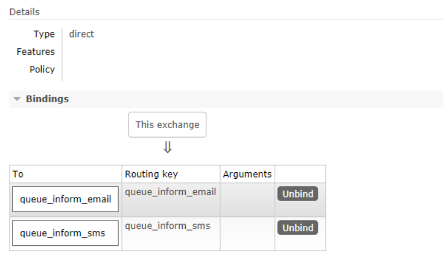

使用生产者发送若干条消息，交换机根据routingkey转发消息到指定的队列。

#### 思考

1、Routing模式和Publish/subscibe有啥区别？

Routing模式要求队列在绑定交换机时要指定routingkey，消息会转发到符合routingkey的队列。

### Topics

#### 工作模式

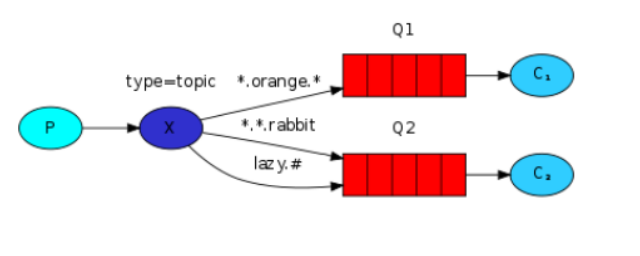

路由模式：

1、每个消费者监听自己的队列，并且设置带统配符的routingkey。

2、生产者将消息发给broker，由交换机根据routingkey来转发消息到指定的队列。

4.4.2代码

案例：

根据用户的通知设置去通知用户，设置接收Email的用户只接收Email，设置接收sms的用户只接收sms，设置两种

通知类型都接收的则两种通知都有效。

1、生产者

声明交换机，指定topic类型：

| /\*\* \* 声明交换机 \* param1：交换机名称 \* param2:交换机类型 四种交换机类型：direct、fanout、topic、headers \*/ channel.exchangeDeclare(EXCHANGE_TOPICS_INFORM, BuiltinExchangeType.TOPIC); //Email通知 channel.basicPublish(EXCHANGE_TOPICS_INFORM, "inform.email", null, message.getBytes()); //sms通知 channel.basicPublish(EXCHANGE_TOPICS_INFORM, "inform.sms", null, message.getBytes()); //两种都通知 channel.basicPublish(EXCHANGE_TOPICS_INFORM, "inform.sms.email", null, message.getBytes()); |
|------------------------------------------------------------------------------------------------------------------------------------------------------------------------------------------------------------------------------------------------------------------------------------------------------------------------------------------------------------------------------------------------------------------------------------------------------------------------------------------------------------|

完整代码：

| package com.xuecheng.test.rabbitmq; import com.rabbitmq.client.BuiltinExchangeType; import com.rabbitmq.client.Channel; import com.rabbitmq.client.Connection; import com.rabbitmq.client.ConnectionFactory; import java.io.IOException; import java.util.concurrent.TimeoutException; public class Producer04_topics { //队列名称 private static final String QUEUE_INFORM_EMAIL = "queue_inform_email"; private static final String QUEUE_INFORM_SMS = "queue_inform_sms"; private static final String EXCHANGE_TOPICS_INFORM="exchange_topics_inform"; public static void main(String[] args) { Connection connection = null; Channel channel = null; try { //创建一个与MQ的连接 ConnectionFactory factory = new ConnectionFactory(); factory.setHost("127.0.0.1"); factory.setPort(5672); factory.setUsername("guest"); factory.setPassword("guest"); factory.setVirtualHost("/");//rabbitmq默认虚拟机名称为“/”，虚拟机相当于一个独立的mq服务 器 //创建一个连接 connection = factory.newConnection(); //创建与交换机的通道，每个通道代表一个会话 channel = connection.createChannel(); //声明交换机 String exchange, BuiltinExchangeType type /\*\* \* 参数明细 \* 1、交换机名称 \* 2、交换机类型，fanout、topic、direct、headers \*/ channel.exchangeDeclare(EXCHANGE_TOPICS_INFORM, BuiltinExchangeType.TOPIC); //声明队列 /\*\* \* 参数明细： \* 1、队列名称 \* 2、是否持久化 \* 3、是否独占此队列 \* 4、队列不用是否自动删除 \* 5、参数 \*/ channel.queueDeclare(QUEUE_INFORM_EMAIL, true, false, false, null); channel.queueDeclare(QUEUE_INFORM_SMS, true, false, false, null); //发送邮件消息 for (int i=0;i\<10;i++){ String message = "email inform to user"+i; //向交换机发送消息 String exchange, String routingKey, BasicProperties props, byte[] body /\*\* \* 参数明细 \* 1、交换机名称，不指令使用默认交换机名称 Default Exchange \* 2、routingKey（路由key），根据key名称将消息转发到具体的队列，这里填写队列名称表示消息将发到此队列 \* 3、消息属性 \* 4、消息内容 \*/ channel.basicPublish(EXCHANGE_TOPICS_INFORM, "inform.email", null, message.getBytes()); System.out.println("Send Message is:'" + message + "'"); } //发送短信消息 for (int i=0;i\<10;i++){ String message = "sms inform to user"+i; channel.basicPublish(EXCHANGE_TOPICS_INFORM, "inform.sms", null, message.getBytes()); System.out.println("Send Message is:'" + message + "'"); } //发送短信和邮件消息 for (int i=0;i\<10;i++){ String message = "sms and email inform to user"+i; channel.basicPublish(EXCHANGE_TOPICS_INFORM, "inform.sms.email", null, message.getBytes()); System.out.println("Send Message is:'" + message + "'"); } } catch (IOException e) { e.printStackTrace(); } catch (TimeoutException e) { e.printStackTrace(); }finally{ if(channel!=null){ try { channel.close(); } catch (IOException e) { e.printStackTrace(); } catch (TimeoutException e) { e.printStackTrace(); } } if(connection!=null){ try { connection.close(); } catch (IOException e) { e.printStackTrace(); } } } } } |
|-----------------------------------------------------------------------------------------------------------------------------------------------------------------------------------------------------------------------------------------------------------------------------------------------------------------------------------------------------------------------------------------------------------------------------------------------------------------------------------------------------------------------------------------------------------------------------------------------------------------------------------------------------------------------------------------------------------------------------------------------------------------------------------------------------------------------------------------------------------------------------------------------------------------------------------------------------------------------------------------------------------------------------------------------------------------------------------------------------------------------------------------------------------------------------------------------------------------------------------------------------------------------------------------------------------------------------------------------------------------------------------------------------------------------------------------------------------------------------------------------------------------------------------------------------------------------------------------------------------------------------------------------------------------------------------------------------------------------------------------------------------------------------------------------------------------------------------------------------------------------------------------------------------------------------------------------------------------------------------------------------------------------------------------------------------------------------------------------------------------------------------------------------------------------------------------------------------------------------------------------------------------------------------------------------------------------------------------------------------------------------------------------------------------------------------------------------------------------------------------------------------------------------------------------------------------------------------------------------------------------------------------------------------------------------------------------------------------------------------------------------------------------------------------------------------------------------------------------------------------------------------------------------------------------------------------------------------------------------------------------------------------|

2、消费端

队列绑定交换机指定通配符：

统配符规则：

中间以“.”分隔。

符号\#可以匹配多个词，符号\*可以匹配一个词语。

| //声明队列 channel.queueDeclare(QUEUE_INFORM_EMAIL, true, false, false, null); channel.queueDeclare(QUEUE_INFORM_SMS, true, false, false, null); //声明交换机 channel.exchangeDeclare(EXCHANGE_TOPICS_INFORM, BuiltinExchangeType.TOPIC); //绑定email通知队列 channel.queueBind(QUEUE_INFORM_EMAIL,EXCHANGE_TOPICS_INFORM,"inform.\#.email.\#"); //绑定sms通知队列 channel.queueBind(QUEUE_INFORM_SMS,EXCHANGE_TOPICS_INFORM,"inform.\#.sms.\#"); |
|---------------------------------------------------------------------------------------------------------------------------------------------------------------------------------------------------------------------------------------------------------------------------------------------------------------------------------------------------------------------------------------------------------------------------------------------------|

4.4.3测试

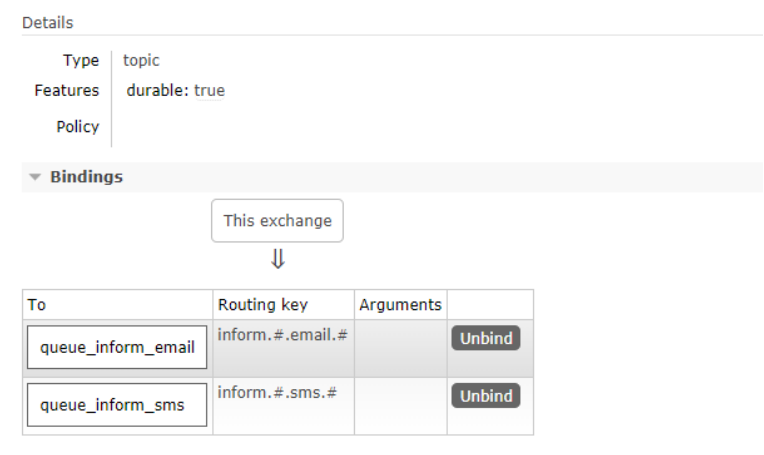

使用生产者发送若干条消息，交换机根据routingkey统配符匹配并转发消息到指定的队列。

4.4.4思考

1、本案例的需求使用Routing工作模式能否实现？

使用Routing模式也可以实现本案例，共设置三个
routingkey，分别是email、sms、all，email队列绑定email和

all，sms队列绑定sms和all，这样就可以实现上边案例的功能，实现过程比topics复杂。

Topic模式更多加强大，它可以实现Routing、publish/subscirbe模式的功能。

4.5 Header 模式

header模式与routing不同的地方在于，header模式取消routingkey，使用header中的
key/value（键值对）匹配

队列。

案例：

根据用户的通知设置去通知用户，设置接收Email的用户只接收Email，设置接收sms的用户只接收sms，设置两种

通知类型都接收的则两种通知都有效。

代码：

1）生产者

队列与交换机绑定的代码与之前不同，如下：

| Map\<String, Object\> headers_email = new Hashtable\<String, Object\>(); headers_email.put("inform_type", "email"); Map\<String, Object\> headers_sms = new Hashtable\<String, Object\>(); headers_sms.put("inform_type", "sms"); channel.queueBind(QUEUE_INFORM_EMAIL,EXCHANGE_HEADERS_INFORM,"",headers_email); channel.queueBind(QUEUE_INFORM_SMS,EXCHANGE_HEADERS_INFORM,"",headers_sms); |
|-----------------------------------------------------------------------------------------------------------------------------------------------------------------------------------------------------------------------------------------------------------------------------------------------------------------------------------------------------------------------------------------------|

通知：

| String message = "email inform to user"+i; Map\<String,Object\> headers = new Hashtable\<String, Object\>(); headers.put("inform_type", "email");//匹配email通知消费者绑定的header //headers.put("inform_type", "sms");//匹配sms通知消费者绑定的header AMQP.BasicProperties.Builder properties = new AMQP.BasicProperties.Builder(); properties.headers(headers); //Email通知 channel.basicPublish(EXCHANGE_HEADERS_INFORM, "", properties.build(), message.getBytes()); |
|--------------------------------------------------------------------------------------------------------------------------------------------------------------------------------------------------------------------------------------------------------------------------------------------------------------------------------------------------------------------------------------------------------------------------------------------------------------------------|

2）发送邮件消费者

| channel.exchangeDeclare(EXCHANGE_HEADERS_INFORM, BuiltinExchangeType.HEADERS); Map\<String, Object\> headers_email = new Hashtable\<String, Object\>(); headers_email.put("inform_email", "email"); //交换机和队列绑定 channel.queueBind(QUEUE_INFORM_EMAIL,EXCHANGE_HEADERS_INFORM,"",headers_email); //指定消费队列 channel.basicConsume(QUEUE_INFORM_EMAIL, true, consumer); |
|---------------------------------------------------------------------------------------------------------------------------------------------------------------------------------------------------------------------------------------------------------------------------------------------------------------------------------------------------------------------------------|

3)测试

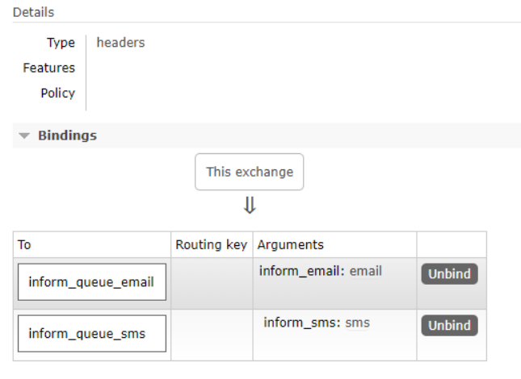

### RPC

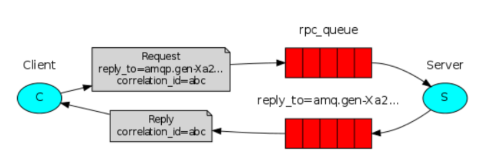

| RPC即客户端远程调用服务端的方法 ，使用MQ可以实现RPC的异步调用，基于Direct交换机实现，流程如下： 1、客户端即是生产者就是消费者，向RPC请求队列发送RPC调用消息，同时监听RPC响应队列。 2、服务端监听RPC请求队列的消息，收到消息后执行服务端的方法，得到方法返回的结果 3、服务端将RPC方法 的结果发送到RPC响应队列 4、客户端（RPC调用方）监听RPC响应队列，接收到RPC调用结果。 |
|-------------------------------------------------------------------------------------------------------------------------------------------------------------------------------------------------------------------------------------------------------------------------------------------------------------------------------------------------------------------------|

SpringBoot整合RibbitMQ
----------------------

### 搭建SpringBoot环境

我们选择基于Spring-Rabbit去操作RabbitMQ

https://github.com/spring-projects/spring-amqp

使用 spring-boot-starter-amqp会自动添加spring-rabbit依赖，如下：

| \<?xml version="1.0" encoding="UTF-8"?\> \<project xmlns="http://maven.apache.org/POM/4.0.0" xmlns:xsi="http://www.w3.org/2001/XMLSchema-instance" xsi:schemaLocation="http://maven.apache.org/POM/4.0.0 http://maven.apache.org/xsd/maven-4.0.0.xsd"\> \<modelVersion\>4.0.0\</modelVersion\> \<parent\> \<artifactId\>xc-framework-parent\</artifactId\> \<groupId\>com.xuecheng\</groupId\> \<version\>1.0-SNAPSHOT\</version\> \<relativePath\>../xc-framework-parent/pom.xml\</relativePath\> \</parent\> \<groupId\>com.xuecheng\</groupId\> \<artifactId\>test-rabbitmq-consumer\</artifactId\> \<version\>1.0-SNAPSHOT\</version\> \<dependencies\> \<dependency\> \<groupId\>org.springframework.boot\</groupId\> \<artifactId\>spring-boot-starter-amqp\</artifactId\> \</dependency\> \<dependency\> \<groupId\>org.springframework.boot\</groupId\> \<artifactId\>spring-boot-starter-test\</artifactId\> \</dependency\> \<dependency\> \<groupId\>com.rabbitmq\</groupId\> \<artifactId\>amqp-client\</artifactId\> \<version\>4.0.3\</version\> \</dependency\> \<dependency\> \<groupId\>org.springframework.boot\</groupId\> \<artifactId\>spring-boot-starter-logging\</artifactId\> \</dependency\> \</dependencies\> \</project\> |
|-------------------------------------------------------------------------------------------------------------------------------------------------------------------------------------------------------------------------------------------------------------------------------------------------------------------------------------------------------------------------------------------------------------------------------------------------------------------------------------------------------------------------------------------------------------------------------------------------------------------------------------------------------------------------------------------------------------------------------------------------------------------------------------------------------------------------------------------------------------------------------------------------------------------------------------------------------------------------------------------------------------------------------------------------------------------------------------------------------------------------------------------------------------------------------------------------------------------------------------------------------|

### 配置

1、配置application.yml

配置连接rabbitmq的参数

| server: port: 44000 spring: application: name: test‐rabbitmq‐producer rabbitmq: host: 127.0.0.1 port: 5672 username: guest password: guest virtualHost: / |
|-----------------------------------------------------------------------------------------------------------------------------------------------------------|

2、定义RabbitConfig类，配置Exchange、Queue、及绑定交换机。

本例配置Topic交换机。

| package rabbitmq.config; import org.springframework.amqp.core.\*; import org.springframework.beans.factory.annotation.Qualifier; import org.springframework.context.annotation.Bean; import org.springframework.context.annotation.Configuration; /\*\* \* \@ClassName RabbitmqConfig \* \@Description TODO \* \@Author yaosiyuan \* \@Date 2019/4/7 11:15 \* \@Version 1.0 \*\*/ \@Configuration public class RabbitmqConfig { public static final String QUEUE_INFORM_EMAIL = "queue_inform_email"; public static final String QUEUE_INFORM_SMS = "queue_inform_sms"; public static final String EXCHANGE_TOPICS_INFORM = "exchange_topics_inform"; public static final String ROUTINGKEY_EMAIL = "inform.\#.email.\#"; public static final String ROUTINGKEY_SMS = "inform.\#.sms.\#"; //声明交换机 \@Bean(EXCHANGE_TOPICS_INFORM) public Exchange EXCHANGE_TOPICS_INFORM() { //durable（持久化为true）,mq重启后交换机还在 return ExchangeBuilder.topicExchange(EXCHANGE_TOPICS_INFORM).durable(true).build(); } //声明队列，QUEUE_INFORM_EMAIL \@Bean(QUEUE_INFORM_EMAIL) public Queue QUEUE_INFORM_EMAIL(){ return new Queue(QUEUE_INFORM_EMAIL); } //声明队列，QUEUE_INFORM_SMS \@Bean(QUEUE_INFORM_SMS) public Queue QUEUE_INFORM_SMS(){ return new Queue(QUEUE_INFORM_SMS); } //绑定交换机和队列QUEUE_INFORM_EMAIL \@Bean public Binding BINDING_INFORM_EMAIL(\@Qualifier(QUEUE_INFORM_EMAIL) Queue queue, \@Qualifier(EXCHANGE_TOPICS_INFORM) Exchange exchange){ return BindingBuilder.bind(queue).to(exchange).with(ROUTINGKEY_EMAIL).noargs(); } //绑定交换机和队列QUEUE_INFORM_SMS \@Bean public Binding BINDING_INFORM_SMS(\@Qualifier(QUEUE_INFORM_SMS) Queue queue, \@Qualifier(EXCHANGE_TOPICS_INFORM) Exchange exchange){ return BindingBuilder.bind(queue).to(exchange).with(ROUTINGKEY_SMS).noargs(); } } |
|-------------------------------------------------------------------------------------------------------------------------------------------------------------------------------------------------------------------------------------------------------------------------------------------------------------------------------------------------------------------------------------------------------------------------------------------------------------------------------------------------------------------------------------------------------------------------------------------------------------------------------------------------------------------------------------------------------------------------------------------------------------------------------------------------------------------------------------------------------------------------------------------------------------------------------------------------------------------------------------------------------------------------------------------------------------------------------------------------------------------------------------------------------------------------------------------------------------------------------------------------------------------------------------------------------------------------------------------------------------------------------------------------------------------------------------------------------------------------------------------------------------------------------------------------------------------------------------------------------------------------------------------------------------------------------------------------------------------------------------------------------------------------------------------------------------------------------|

### 生产端

使用RarbbitTemplate发送消息

| package com.xuecheng.test.rabbitmq; import com.xuecheng.test.rabbitmq.config.RabbitmqConfig; import org.junit.Test; import org.junit.runner.RunWith; import org.springframework.amqp.rabbit.core.RabbitTemplate; import org.springframework.beans.factory.annotation.Autowired; import org.springframework.boot.test.context.SpringBootTest; import org.springframework.test.context.junit4.SpringRunner; \@SpringBootTest \@RunWith(SpringRunner.class) public class Producer05_topics_springboot { \@Autowired RabbitTemplate rabbitTemplate; \@Test public void testSendByTopics(){ for (int i=0;i\<5;i++){ String message = "sms email inform to user"+i; rabbitTemplate.convertAndSend(RabbitmqConfig.EXCHANGE_TOPICS_INFORM,"inform.sms.email",message); System.out.println("Send Message is:'" + message + "'"); } } } |
|-------------------------------------------------------------------------------------------------------------------------------------------------------------------------------------------------------------------------------------------------------------------------------------------------------------------------------------------------------------------------------------------------------------------------------------------------------------------------------------------------------------------------------------------------------------------------------------------------------------------------------------------------------------------------------------------------------------------------------------------------------------------------------------------------------------------------------|

### 消费端

创建消费端工程，添加依赖：

| \<?xml version="1.0" encoding="UTF-8"?\> \<project xmlns="http://maven.apache.org/POM/4.0.0" xmlns:xsi="http://www.w3.org/2001/XMLSchema-instance" xsi:schemaLocation="http://maven.apache.org/POM/4.0.0 http://maven.apache.org/xsd/maven-4.0.0.xsd"\> \<modelVersion\>4.0.0\</modelVersion\> \<parent\> \<artifactId\>xc-framework-parent\</artifactId\> \<groupId\>com.xuecheng\</groupId\> \<version\>1.0-SNAPSHOT\</version\> \<relativePath\>../xc-framework-parent/pom.xml\</relativePath\> \</parent\> \<groupId\>com.xuecheng\</groupId\> \<artifactId\>test-rabbitmq-consumer\</artifactId\> \<version\>1.0-SNAPSHOT\</version\> \<dependencies\> \<dependency\> \<groupId\>org.springframework.boot\</groupId\> \<artifactId\>spring-boot-starter-amqp\</artifactId\> \</dependency\> \<dependency\> \<groupId\>org.springframework.boot\</groupId\> \<artifactId\>spring-boot-starter-test\</artifactId\> \</dependency\> \<dependency\> \<groupId\>com.rabbitmq\</groupId\> \<artifactId\>amqp-client\</artifactId\> \<version\>4.0.3\</version\> \</dependency\> \<dependency\> \<groupId\>org.springframework.boot\</groupId\> \<artifactId\>spring-boot-starter-logging\</artifactId\> \</dependency\> \</dependencies\> \</project\> |
|-------------------------------------------------------------------------------------------------------------------------------------------------------------------------------------------------------------------------------------------------------------------------------------------------------------------------------------------------------------------------------------------------------------------------------------------------------------------------------------------------------------------------------------------------------------------------------------------------------------------------------------------------------------------------------------------------------------------------------------------------------------------------------------------------------------------------------------------------------------------------------------------------------------------------------------------------------------------------------------------------------------------------------------------------------------------------------------------------------------------------------------------------------------------------------------------------------------------------------------------------------|

使用\@RabbitListener注解监听队列。

| package rabbitmq.mq; import com.rabbitmq.client.Channel; import org.springframework.amqp.core.Message; import org.springframework.amqp.rabbit.annotation.RabbitListener; import org.springframework.stereotype.Component; import rabbitmq.config.RabbitmqConfig; /\*\* \* \@ClassName ReceiveHandler \* \@Description TODO \* \@Author yaosiyuan \* \@Date 2019/4/7 16:17 \* \@Version 1.0 \*\*/ \@Component public class ReceiveHandler { \@RabbitListener(queues = {RabbitmqConfig.QUEUE_INFORM_EMAIL}) public void send_email(String msg, Message message , Channel channel){ System.out.println("receive message"+msg); } } |
|---------------------------------------------------------------------------------------------------------------------------------------------------------------------------------------------------------------------------------------------------------------------------------------------------------------------------------------------------------------------------------------------------------------------------------------------------------------------------------------------------------------------------------------------------------------------------------------------------------------------------------|

