[TOC]

# 需求

目前的三个项目,其中两个jdk1.8的,一个jdk1.6的,放到一个容器中运行

需要启一个redis和memcached

配置文件能够拉出来一起配置

不需要一个个项目进去改resources了

更进一步的就是能够通过命令一键拉取最新分支

打包并部署

可以的话容器里还得放一个.net

那三个项目加上这个.net才是一套能跑起来的项目

 

## Docker的应用场景

Web 应用的自动化打包和发布。

自动化测试和持续集成、发布。

在服务型环境中部署和调整数据库或其他的后台应用。

从头编译或者扩展现有的 OpenShift 或 Cloud Foundry 平台来搭建自己的 PaaS 环境。

## **Docker 的优点**

1、简化程序：

Docker 让开发者可以打包他们的应用以及依赖包到一个可移植的容器中，然后发布到任何流行的 Linux 机器上，便可以实现虚拟化。Docker改变了虚拟化的方式，使开发者可以直接将自己的成果放入Docker中进行管理。方便快捷已经是 Docker的最大优势，过去需要用数天乃至数周的	任务，在Docker容器的处理下，只需要数秒就能完成。

2、避免选择恐惧症：

如果你有选择恐惧症，还是资深患者。那么你可以使用 Docker 打包你的纠结！比如 Docker 镜像；Docker 镜像中包含了运行环境和配置，所以 Docker 可以简化部署多种应用实例工作。比如 Web 应用、后台应用、数据库应用、大数据应用比如 Hadoop 集群、消息队列等等都可以打包成一个镜像部署。

3、节省开支：

一方面，云计算时代到来，使开发者不必为了追求效果而配置高额的硬件，Docker 改变了高性能必然高价格的思维定势。Docker 与云的结合，让云空间得到更充分的利用。不仅解决了硬件管理的问题，也改变了虚拟化的方式。


## 虚拟化


## **容器和虚拟机比较**

容器是在操作系统上实现虚拟化，直接复用本地主机操作系统

传统方式是在硬件方面上实现。

传统虚拟机能虚拟的系统有限。

docker调用本机灵活。


## **容器**

容器是一种基础工具，任何可以容纳其他物品的工具，可以部分或完全封闭，被用于容纳，存储。

Linx X C 二次封装加强版  有了 docker

通过镜像技术，把软件可能用到的资源提前计算好，封装成一个单个镜像文件，放到互联网上大家都能访问。


左图 是原始 一台电脑一个系统运行多个软件 共享 用户 端口 

右图是 docker  把每个软件 单独放在一个容器里，每个软件互不影响

自带调试工具，相互隔离，如果一个软件终止，装载这个软件的容器也终止。

本来调试一个软件，要ps，之类的通用，现在 要先进入单个容器，运维方面非常不方便。开发却非常方便。一次编译，到处运行。

开发软件要适配每个平台，每个平台路径不一样。 一个app需要一个好几个平台的开发团队，以后一个团队就够了。只需要一个镜像，只要有docker run，会指定自己独立的环境，目录。突破分发。部署，不管是centos unbun  windows，只要有docker 都是一样的。

Java的 jre 是统一了运行环境，只是一种开发语言。而docker 统一了系统，不管是什么语言，只要是镜像，就能运行。

运维比较困难，需要使用编排工具。

之前调试很方便，docker可能没有工具。做一个镜像需要自带调试工具，

分层构建，联合挂载。

每层是单个功能软件，组合在一起就是指定功能。 一个功能在一层上实现，最后叠在一起，形成一个统一视图。好处是镜像分发不会很庞大。

每层镜像都是只读的。不能修改，如果想修改，需要在顶层自己弄一个可读可写的新层，自己实现修改功能。

每个容器相当于一个进程

Machine+swarm（多docker当一个）+compose（单机编排）

Mesos（统一资源）+marathon

Kubernetes  》k8s


Ocf : 开放容器格式


可以创建自己的仓库 也可以用 共有仓库

仓库名就是应用名，存放多个 不同版本的镜像，通过标签区分，nginx：1.1

给了镜像没有给标签，默认最新，一个镜像可以有多个标签，

镜像和容器的关系就相当于 程序和进程的关系

镜像是静态的，容器是动态的，有声明周期，


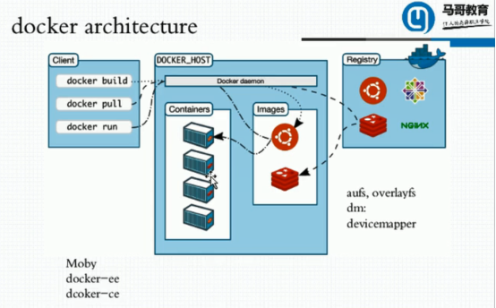

## **对象**

可以增删改查，容器增删改查对象，网络也是一个单独的。卷是给容器提供存储空间，插件。都叫对象。

通过rest风格api


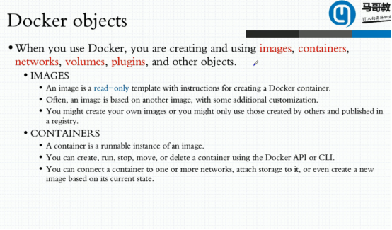


> **Docker 是世界领先的软件容器平台**，所以想要搞懂Docker的概念我们必须先从容器开始说起。

##  先从认识容器开始

### 什么是容器?

#### 先来看看容器较为官方的解释

**一句话概括容器：容器就是将软件打包成标准化单元，以用于开发、交付和部署。** 

- **容器镜像是轻量的、可执行的独立软件包** ，包含软件运行所需的所有内容：代码、运行时环境、系统工具、系统库和设置。
- **容器化软件适用于基于Linux和Windows的应用，在任何环境中都能够始终如一地运行。**
- **容器赋予了软件独立性**　，使其免受外在环境差异（例如，开发和预演环境的差异）的影响，从而有助于减少团队间在相同基础设施上运行不同软件时的冲突。

#### 再来看看容器较为通俗的解释

**如果需要通俗的描述容器的话，我觉得容器就是一个存放东西的地方，就像书包可以装各种文具、衣柜可以放各种衣服、鞋架可以放各种鞋子一样。我们现在所说的容器存放的东西可能更偏向于应用比如网站、程序甚至是系统环境。**


### 图解物理机,虚拟机与容器

关于虚拟机与容器的对比在后面会详细介绍到，这里只是通过网上的图片加深大家对于物理机、虚拟机与容器这三者的理解。

**物理机**


**虚拟机：**


**容器：**


通过上面这三张抽象图，我们可以大概可以通过类比概括出： **容器虚拟化的是操作系统而不是硬件，容器之间是共享同一套操作系统资源的。虚拟机技术是虚拟出一套硬件后，在其上运行一个完整操作系统。因此容器的隔离级别会稍低一些。**

------

> 相信通过上面的解释大家对于容器这个既陌生又熟悉的概念有了一个初步的认识，下面我们就来谈谈Docker的一些概念。

## 二 再来谈谈 Docker 的一些概念


### 2.1 什么是 Docker?

说实话关于Docker是什么并太好说，下面我通过四点向你说明Docker到底是个什么东西。

- **Docker 是世界领先的软件容器平台。** 
- **Docker** 使用 Google 公司推出的 **Go 语言**  进行开发实现，基于 **Linux 内核** 的cgroup，namespace，以及AUFS类的**UnionFS**等技术，**对进程进行封装隔离，属于操作系统层面的虚拟化技术。** 由于隔离的进程独立于宿主和其它的隔离的进
  程，因此也称其为容器。**Docke最初实现是基于 LXC.**
- **Docker 能够自动执行重复性任务，例如搭建和配置开发环境，从而解放了开发人员以便他们专注在真正重要的事情上：构建杰出的软件。**
- **用户可以方便地创建和使用容器，把自己的应用放入容器。容器还可以进行版本管理、复制、分享、修改，就像管理普通的代码一样。**

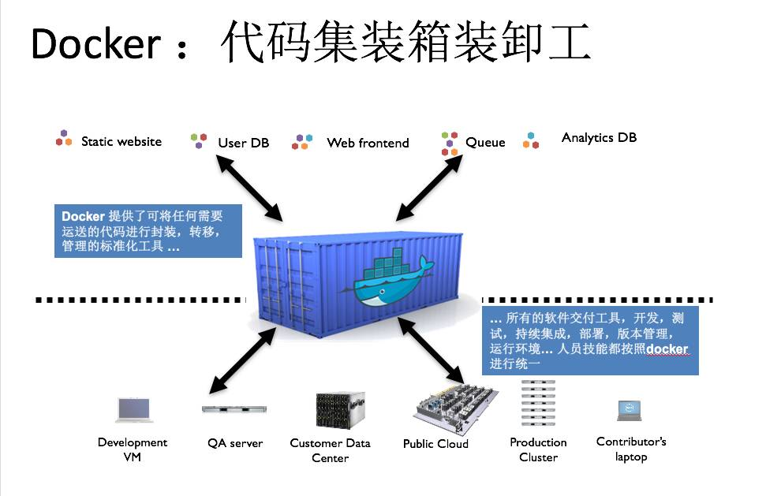

### 2.2 Docker 思想

- **集装箱**
- **标准化：** ①运输方式    ② 存储方式 ③ API接口
- **隔离**

### 2.3 Docker 容器的特点

- #### 轻量

  在一台机器上运行的多个 Docker 容器可以共享这台机器的操作系统内核；它们能够迅速启动，只需占用很少的计算和内存资源。镜像是通过文件系统层进行构造的，并共享一些公共文件。这样就能尽量降低磁盘用量，并能更快地下载镜像。

- #### 标准

  Docker 容器基于开放式标准，能够在所有主流 Linux 版本、Microsoft Windows 以及包括 VM、裸机服务器和云在内的任何基础设施上运行。

- #### 安全

  Docker 赋予应用的隔离性不仅限于彼此隔离，还独立于底层的基础设施。Docker 默认提供最强的隔离，因此应用出现问题，也只是单个容器的问题，而不会波及到整台机器。

### 2.4 为什么要用 Docker ?

- **Docker 的镜像提供了除内核外完整的运行时环境，确保了应用运行环境一致性，从而不会再出现 “这段代码在我机器上没问题啊” 这类问题；——一致的运行环境**
- **可以做到秒级、甚至毫秒级的启动时间。大大的节约了开发、测试、部署的时间。——更快速的启动时间**
- **避免公用的服务器，资源会容易受到其他用户的影响。——隔离性**
- **善于处理集中爆发的服务器使用压力；——弹性伸缩，快速扩展**
- **可以很轻易的将在一个平台上运行的应用，迁移到另一个平台上，而不用担心运行环境的变化导致应用无法正常运行的情况。——迁移方便**
- **使用 Docker 可以通过定制应用镜像来实现持续集成、持续交付、部署。——持续交付和部署**

------

> 每当说起容器，我们不得不将其与虚拟机做一个比较。就我而言，对于两者无所谓谁会取代谁，而是两者可以和谐共存。

## 三 容器 VS 虚拟机

　　简单来说： **容器和虚拟机具有相似的资源隔离和分配优势，但功能有所不同，因为容器虚拟化的是操作系统，而不是硬件，因此容器更容易移植，效率也更高。**

### 3.1 两者对比图

　　传统虚拟机技术是虚拟出一套硬件后，在其上运行一个完整操作系统，在该系统上再运行所需应用进程；而容器内的应用进程直接运行于宿主的内核，容器内没有自己的内核，而且也没有进行硬件虚拟。因此容器要比传统虚拟机更为轻便.


### 3.2 容器与虚拟机总结


- **容器是一个应用层抽象，用于将代码和依赖资源打包在一起。** **多个容器可以在同一台机器上运行，共享操作系统内核，但各自作为独立的进程在用户空间中运行** 。与虚拟机相比， **容器占用的空间较少**（容器镜像大小通常只有几十兆），**瞬间就能完成启动** 。
- **虚拟机 (VM) 是一个物理硬件层抽象，用于将一台服务器变成多台服务器。** 管理程序允许多个 VM 在一台机器上运行。每个VM都包含一整套操作系统、一个或多个应用、必要的二进制文件和库资源，因此 **占用大量空间** 。而且 VM  **启动也十分缓慢** 。

　　通过Docker官网，我们知道了这么多Docker的优势，但是大家也没有必要完全否定虚拟机技术，因为两者有不同的使用场景。**虚拟机更擅长于彻底隔离整个运行环境**。例如，云服务提供商通常采用虚拟机技术隔离不同的用户。而 **Docker通常用于隔离不同的应用** ，例如前端，后端以及数据库。

### 3.3 容器与虚拟机两者是可以共存的

就我而言，对于两者无所谓谁会取代谁，而是两者可以和谐共存。


------

> Docker中非常重要的三个基本概念，理解了这三个概念，就理解了 Docker 的整个生命周期。

## 四 Docker基本概念

Docker 包括三个基本概念

- **镜像（Image）**
- **容器（Container）**
- **仓库（Repository）**

理解了这三个概念，就理解了 Docker 的整个生命周期


### 4.1 镜像(Image):一个特殊的文件系统

　　**操作系统分为内核和用户空间**。对于 Linux 而言，内核启动后，会挂载 root 文件系统为其提供用户空间支持。而Docker 镜像（Image），就相当于是一个 root 文件系统。

　　**Docker 镜像是一个特殊的文件系统，除了提供容器运行时所需的程序、库、资源、配置等文件外，还包含了一些为运行时准备的一些配置参数（如匿名卷、环境变量、用户等）。** 镜像不包含任何动态数据，其内容在构建之后也不会被改变。

　　Docker 设计时，就充分利用 **Union FS**的技术，将其设计为 **分层存储的架构** 。 镜像实际是由多层文件系统联合组成。

　　**镜像构建时，会一层层构建，前一层是后一层的基础。每一层构建完就不会再发生改变，后一层上的任何改变只发生在自己这一层。**　比如，删除前一层文件的操作，实际不是真的删除前一层的文件，而是仅在当前层标记为该文件已删除。在最终容器运行的时候，虽然不会看到这个文件，但是实际上该文件会一直跟随镜像。因此，在构建镜像的时候，需要额外小心，每一层尽量只包含该层需要添加的东西，任何额外的东西应该在该层构建结束前清理掉。

　　分层存储的特征还使得镜像的复用、定制变的更为容易。甚至可以用之前构建好的镜像作为基础层，然后进一步添加新的层，以定制自己所需的内容，构建新的镜像。

### 4.2 容器(Container):镜像运行时的实体

　　镜像（Image）和容器（Container）的关系，就像是面向对象程序设计中的 类 和 实例 一样，镜像是静态的定义，**容器是镜像运行时的实体。容器可以被创建、启动、停止、删除、暂停等** 。

　　**容器的实质是进程，但与直接在宿主执行的进程不同，容器进程运行于属于自己的独立的 命名空间。前面讲过镜像使用的是分层存储，容器也是如此。**

　　**容器存储层的生存周期和容器一样，容器消亡时，容器存储层也随之消亡。因此，任何保存于容器存储层的信息都会随容器删除而丢失。**

　　按照 Docker 最佳实践的要求，**容器不应该向其存储层内写入任何数据** ，容器存储层要保持无状态化。**所有的文件写入操作，都应该使用数据卷（Volume）、或者绑定宿主目录**，在这些位置的读写会跳过容器存储层，直接对宿主(或网络存储)发生读写，其性能和稳定性更高。数据卷的生存周期独立于容器，容器消亡，数据卷不会消亡。因此， **使用数据卷后，容器可以随意删除、重新 run ，数据却不会丢失。**

### 4.3仓库(Repository):集中存放镜像文件的地方

　　镜像构建完成后，可以很容易的在当前宿主上运行，但是， **如果需要在其它服务器上使用这个镜像，我们就需要一个集中的存储、分发镜像的服务，Docker Registry就是这样的服务。**

　　一个 Docker Registry中可以包含多个仓库（Repository）；每个仓库可以包含多个标签（Tag）；每个标签对应一个镜像。所以说：**镜像仓库是Docker用来集中存放镜像文件的地方类似于我们之前常用的代码仓库。**

　　通常，**一个仓库会包含同一个软件不同版本的镜像**，而**标签就常用于对应该软件的各个版本** 。我们可以通过```<仓库名>:<标签>```的格式来指定具体是这个软件哪个版本的镜像。如果不给出标签，将以 latest 作为默认标签.。

**这里补充一下Docker Registry 公开服务和私有 Docker Registry的概念：**

　　**Docker Registry 公开服务** 是开放给用户使用、允许用户管理镜像的 Registry 服务。一般这类公开服务允许用户免费上传、下载公开的镜像，并可能提供收费服务供用户管理私有镜像。

　　最常使用的 Registry 公开服务是官方的 **Docker Hub** ，这也是默认的 Registry，并拥有大量的高质量的官方镜像，网址为：[https://hub.docker.com/](https://hub.docker.com/) 。在国内访问**Docker Hub** 可能会比较慢国内也有一些云服务商提供类似于 Docker Hub 的公开服务。比如 [时速云镜像库](https://hub.tenxcloud.com/)、[网易云镜像服务](https://www.163yun.com/product/repo)、[DaoCloud 镜像市场](https://www.daocloud.io/)、[阿里云镜像库](https://www.aliyun.com/product/containerservice?utm_content=se_1292836)等。

　　除了使用公开服务外，用户还可以在 **本地搭建私有 Docker Registry** 。Docker 官方提供了 Docker Registry 镜像，可以直接使用做为私有 Registry 服务。开源的 Docker Registry 镜像只提供了 Docker Registry API 的服务端实现，足以支持 docker 命令，不影响使用。但不包含图形界面，以及镜像维护、用户管理、访问控制等高级功能。

------

> Docker的概念基本上已经讲完，最后我们谈谈：Build, Ship, and Run。

## Build Ship and Run


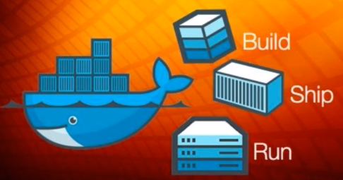

- **Build（构建镜像）** ： 镜像就像是集装箱包括文件以及运行环境等等资源。
- **Ship（运输镜像）** ：主机和仓库间运输，这里的仓库就像是超级码头一样。
- **Run （运行镜像）** ：运行的镜像就是一个容器，容器就是运行程序的地方。

**Docker 运行过程也就是去仓库把镜像拉到本地，然后用一条命令把镜像运行起来变成容器。所以，我们也常常将Docker称为码头工人或码头装卸工，这和Docker的中文翻译搬运工人如出一辙。**

# 服务器和客户端

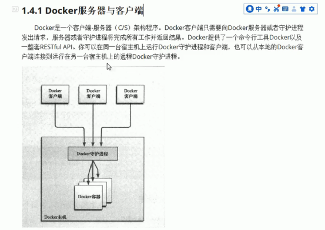

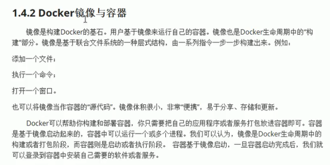

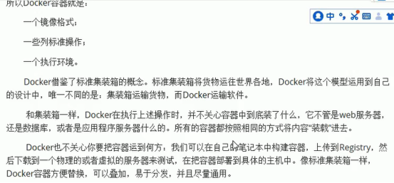

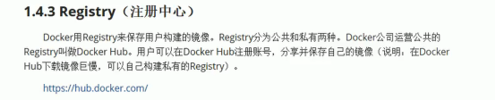

# **安装和使用**

## **依赖的基础环境**

64bits cpu

Linux kernel 3.10+

**前提：内核版本需要不小于3.10，不然docker起不来**

uname   -r   查看当前内核版本

## **安装**

### **网络方式1**

 

**2.安装docker的依赖包**

yum   install    -y   yum-utils   lvm2    device-mapper-persistent-data

**3.配置docker源**

yum-config-manager   --add-repo   https://download.docker.com/linux/centos/docker-ce.repo

 

**4.可以查看所有仓库中所有docker版本，并选择特定版本安装**

yum   list   docker-ce --showduplicates   |   sort   -r

或者

**直接yum  -y install  docker-ce （默认版本是ce的稳定版本）**

时间比较长（网速快，就越快）

**5.重启docker**

chkconfig docker on   ### 开机启动

service docker start     ###启动docker

### **网络方式****2**

1.配置docker源

yum  install  -y  epel-release

**2.安装docker**

yum  install   -y   docker-io 

**3.重启docker**

chkconfig docker on   ### 开机启动

service docker start     ###启动docker

\####这样docker服务就起来了，安装位置都属于默认

或者：

yum  list docker

yum -y install docker.x86_64

 

之后重启docker

 

### **黑马安装**

\1. yum更新到最新

sudo yum update

2.安装需要的软件包，

sudo yum install -y yum-utils device-mapper-persistent-data lvm2

\2. 设置 yum源为阿里云

sudo yum-config-manager --add-repo http://mirrors.aliyun.com/docker-ce/linux/centos/docker-ce.repo

\4. 安装docker

sudo yum install docker-ce

\5. 安装后查看docker版本

docker -v

 

设置ustc的镜像

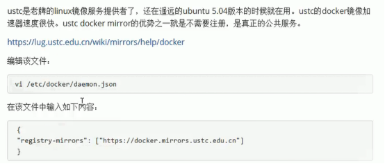

编辑文件

vi /etc/docker/daemon.json

{

  "registry-mirrors": ["https://docker.mirrors.ustc.edu.cn"]

}

 

### **马哥安装**

 

Linux kernel cgroups and namespaces

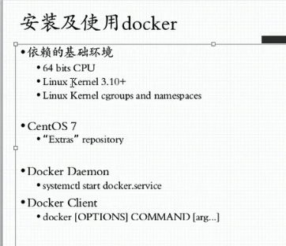

下载 repo

Wget https://mirrors.tuna.tsinghua.edu.cn/docker-ce/linux/centos/docker-ce.repo

Vim 更改域名

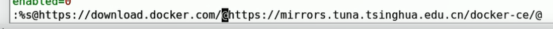

:%s@https://download.docker.com/@https://mirrors.tuna.tsinghua.edu.cn/docker-ce/@

:wq 保存

 yum replist

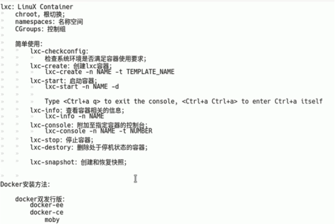

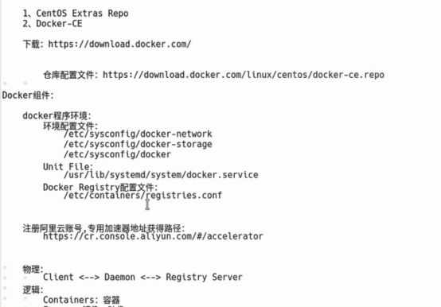

docker-ce配置文件：

/etc/docker/daemon.json

## **docker的启动和停止**

systemctl命令就是系统服务管理器指令

启动docker

```
systemctl start docker
```

停止docker

```
systemctl stop docker
```

重启docker

```
systemctl restart docker
```

 查看状态

```
systemctl status docker
```

\# 设置开机自动启动

```
systemctl enable docker
```

\# 查看帮助文档

```
docker --help
```


## **docker镜像加速**

 	docker cn

- 阿里云加速器


- 中国科技大学


```
{
  "registry-mirrors": ["https://registry.docker-cn.com"]
}
```

我们国内使用官方Docker Hub仓库实在是太慢了，很影响效率

使用命令编辑文件：

```
vim /etc/doker/daemon.json
```

加入下面的数据：

docker-cn镜像： 

```
{
  "registry-mirrors": ["https://registry.docker-cn.com"]
}
```

https://www.docker-cn.com/registry-mirror

如果你是腾讯云的服务器那么请加入：

```
{
  "registry-mirrors": ["https://mirror.ccs.tencentyun.com"]
}
```

阿里云的服务器请查看：https://yq.aliyun.com/articles/29941

 

wq保存退出：

 

执行命令生效：

 

systemctl daemon-reload

systemctl restart docker

启动

systemctl start docker.service

 

以上两个源，我都测试过，如果你是腾讯云那么肯定用腾讯云的源最好，阿里同样，速度飞快 image 秒 pull。

 

# **常见命令**

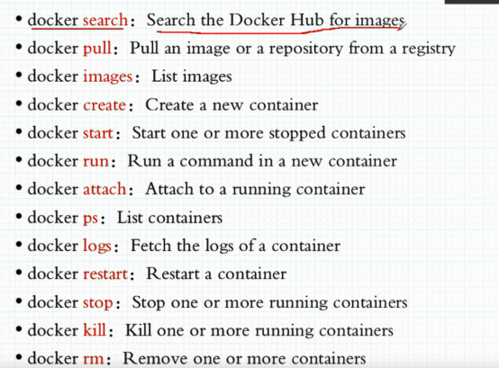

## **查看相关信息**

docker version

docker info  查看详细信息

## **镜像相关命令**

docker images search|pull|list

 

没有斜线，直接应用名叫顶级仓库，官方的，有分隔符的叫个人的项目

alpine：是一个在微型系统上构建的超小发行版，仅提供基础功能。缺少一些调试工具等

一般都是使用镜像的人自己构建仓库，存放镜像。

\# 下载镜像

docker image pull nginx:1.14-alpine

\# 列出镜像

docker image ls

 

busybox支持百种命令，链接成什么命令，就能翻译成什么，一个busybox做一个应用空间，

安卓就是linux kernal + linux busybox 在docker 环境上，组装了一个jvm，专门跑java程序，底层还是busybox

\# 下载最新版本的busybox

docker pull busybox:latest

\# 删除 images

docker rmi  remover

docker image rm

\# 列出images的时候显示完整id

docker image ls --no-trunc

** 列出所有镜像 **

 docker images

repository：镜像名称

 tag：镜像标签id

image id 镜像id 

created ：镜像创建日期

size：镜像大小

这些镜像都是存储在docker宿主机的/var/lib/docker目录下

 

### **搜索镜像**

\# 如果需要从网络中获取镜像，

docker search 镜像名

name：仓库名

description：描述

stars：用户评价

official是否官方

automated：自动构建，表示该镜像由docker hub自动构建流程创建的

### **拉镜像**

\# 从中央仓库中拉镜像

docker pull 镜像名

\# 没有指定标签 则默认为latest

docker pull tutum/centos 

 

 

### **删除镜像**

\# 按照镜像id删除镜像

docker rmi 镜像id

\# 删除所有镜像

docker rmi ‘docker images -q’

 

## **容器命令**

### **查看**

\# 列出容器

docker ps

docker 

\# 查看所有命令

docker ps -a

\# 查看最后一次运行的容器

docker ps -l

\# 查看停止的容器

docker ps -f status=exited


容器命令

```shell
docker container COMMAND
```


` top 显示哪些容器占用资源

 

### **创建启动**

\# 创建容器两种方法

docker create | docker container create

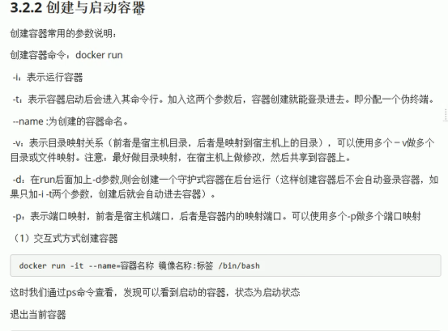

\# 以交互式方式 创建名字为mycentos 的centos镜像，标签为7， 交互的命令为/bin/bash

docker run -it --name=mycentos centos:7 /bin/bash

 

\# 退出

exit

 

（2）守护方式创建容器

docker run -di --name=容器名 镜像名：标签

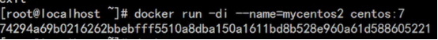

\# 登陆守护式容器

docker exec -it 容器名（容器id） /bin/bash

\# demo1

docker exec -it mycentos2 /bin/bash

两种方式区别：

守护方式 退出后，还会在后台运行。

### **停止与启动**

\# 停止

docker stop 容器名

\# 启动

docker start 容器名

 

### **文件拷贝**

如果我们需要将文件拷贝到容器内可以使用cp 命令

docker cp 需要拷贝的文件或目录 容器名称：容器目录

也可以将文件从容器内拷贝出来

 

\# docker cp 需要复制的文件或目录  容器名:路径

docker cp anaconda-ks.cfg mycentos2:/usr/local

 

\# 交互进入容器

docker exec -it mycentos2 /bin/bash

 

\# 从docker容器中 复制出来

docker cp  mycentos2:/usr/local anaconda-ks.cfg2 

### **目录挂载**

创建容器的时候，将宿主机的目录与容器内的目录进行映射，这样我们就可以通过修改宿主机某个目录的文件从而去影响容器。

创建容器添加 -v参数 后边为 宿主机目录：容器目录，例如

docker run -di -v /usr/local/myhtml:/user/local/mythml  --name=mycentos3 centos:latest

\# 进入容器查看

```
docker exec -it mycentos3 /bin/bash
```

如果共享的是多级目录可能会出现权限不足的情况。

因为centos7把权限模块selinux把权限禁调了，需要添加参数 --privileged=true来解决挂载目录没有权限的问题。

### **查看容器ip地址**

查看容器运行的各种数据

docker inspect 容器名称（容器id）

直接输出ip地址

```shell
docker inspect --format=’{{.NetworkSettings.IPAddress}}’ 容器名称（容器ID）
```

 

### **删除容器**

\# 删除容器，需要先停止

docker rm 容器名

\# 删除镜像

docker rmi 

 

\# 运行busybox 

docker run --name b1 -it busybox:latest

\# 查看内容

ls /

\# 查看bin里内容

ls /bin

# **应用部署**

##  MySQL
```bash
$ docker search mysql
$ docker pull mysql:5.6
$ docker run -p 3306:3306 --name mymysql -v $PWD/conf:/etc/mysql/conf.d -v $PWD/logs:/logs -v $PWD/data:/var/lib/mysql -e MYSQL_ROOT_PASSWORD=123456 -d mysql:5.6

# 启动参数说明
-p 3306:3306：将容器的 3306 端口映射到主机的 3306 端口。
-v -v $PWD/conf:/etc/mysql/conf.d：将主机当前目录下的 conf/my.cnf 挂载到容器的 /etc/mysql/my.cnf。
-v $PWD/logs:/logs：将主机当前目录下的 logs 目录挂载到容器的 /logs。
-v $PWD/data:/var/lib/mysql ：将主机当前目录下的data目录挂载到容器的 /var/lib/mysql 
-e MYSQL_ROOT_PASSWORD=123456：初始化 root 用户的密码。
```


## **mysql**

（1）拉取镜像

```shell
docker pull centos/mysql-57-centos7
```

（2）创建容器 -p端口映射 宿主机端口：容器端口 -e添加环境变量，root密码

``` shell
docker run -di --name=tensquare_mysql -p 33306:3306 -e MYSQL_ROOT_PASSWORD=123 centos/mysql-57-centos7
```

（3）进入docker 容器

```shell
docker exec -it tensquare_mysql /bin/bash
```

（4）远程登录mysql

宿主机的ip。端口为33306

```shell
mysql -u root -p
```


## Docker 安装 Nginx
```bash
# 查询
$ docker search nginx
# 拉取官方镜像
$ docker pull nginx
# 使用nginx镜像 运行容器
$ docker run -p 80:80 --name mynginx -v $PWD/www:/www -v $PWD/conf/nginx.conf:/etc/nginx/nginx.conf -v $PWD/logs:/wwwlogs  -d nginx  

# 启动参数说明
-p 80:80：将容器的80端口映射到主机的80端口
--name mynginx：将容器命名为mynginx
-v $PWD/www:/www：将主机中当前目录下的www挂载到容器的/www
-v $PWD/conf/nginx.conf:/etc/nginx/nginx.conf：将主机中当前目录下的nginx.conf挂载到容器的/etc/nginx/nginx.conf
-v $PWD/logs:/wwwlogs：将主机中当前目录下的logs挂载到容器的/wwwlogs
```
## Tomcat
```bash
$ docker pull tomcat
# 拉取最新版本
$ docker pull tomcat
# 使用镜像运行容器
$ docker run --name tomcat -p 8080:8080 -v $PWD/test:/usr/local/tomcat/webapps/test -d tomcat  

# 启动参数说明
-p 8080:8080：将容器的8080端口映射到主机的8080端口
-v $PWD/test:/usr/local/tomcat/webapps/test：将主机中当前目录下的test挂载到容器的/test
```


## **Tomcat**

\# 拉取镜像

docker pull tomcat:7-jre7

\# 创建容器 -p表示地址映射

docker run -di --name=mytomcat -p 9000:8080 -v /usr/local/webapps:/usr/local/tomcat/webapps tomcat:7-jre7

\# 访问

## **nginx**

\# 拉取镜像

docker pull nginx

创建nginx容器

docker run -di --name=mynginx -p 80:80 nginx

\# 命令行 交互 进入容器

docker exec -it mynginx /bin/bash

\# 进入 安装目录

cd /etc/nginx/

 

\#查看nginx配置

cat nginx.conf

: include /etc/nginx/

\# 查看默认目录

root /usr/share/nginx/html

\# 把需要运行的html文件名dist 复制成 配置文件中的目录名

 mv dist html

docker cp html mynginx:/usr/share/nginx

<!-- -d 后台运行 如果本地没有，会自动下载 -->

\# 

docker run --name web1 -d nginx:.1.14-alpine

\# 查看

docker ps

\# 显示在后台

nginx -g 'daemon ... 

一个程序就运行在一个容器内，如果在后台运行，会以为程序中止了，容器就结束了，所以启动服务类型程序一定不能在后台运行，一运行就被中止。

\# docker inspect 容器名 

docker inspect web1

查看 ipaddress

\# 查看内容 

curl 172.17.0.2

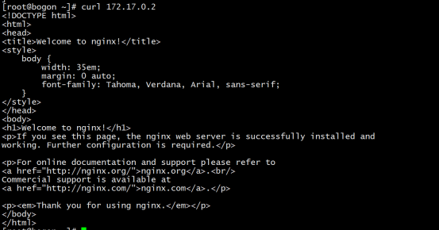

## **redis**

```bash
$ docker search  redis
$ docker pull  redis:3.2

# 启动版本1
 -p 6379:6379 : 将容器的6379端口映射到主机的6379端口
 -v $PWD/data:/data : 将主机中当前目录下的data挂载到容器的/data
 redis-server --appendonly yes : 在容器执行redis-server启动命令，并打开redis持久化配置
$ docker run -p 6379:6379 -v $PWD/data:/data  -d redis:3.2 redis-server --appendonly yes

# 启动版本2
$ docker run -di --name=myredis -p 6379:6379 redis

#进入redis命令行
$ docker exec -it 容器id redis-cli

```


------


\# 下载运行 

docker run --name kvstor1 -d redis:4-alpine

\# 查看

\#  -it 交互式命令

docker exec -it  kvstor1 /bin/sh

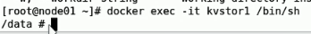

\#

ps

\# 查看网络端口

netstat -tnl

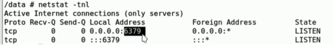

\# 链接客户端工具

redis-cli

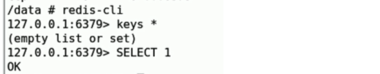

\#查看名字为 web1容器的日志

docker logs web1

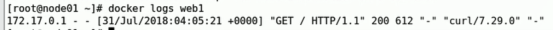


## ElasticSearch
```bash
# 使用docker安装ElasticSearch

#搜索镜像
[root@izadux3fzjykx7z ~]$ docker search elasticsearch

#拉取镜像
[root@izadux3fzjykx7z ~]$ docker pull elasticsearch:6.5.0

#启动一个ElasticSearch容器
[root@izadux3fzjykx7z ~] $ docker run --name elasticsearch -d -e ES_JAVA_OPTS="-Xms214m -Xmx214m" -p 9200:9200 -p 9300:9300 elasticsearch:6.5.0
```

# 迁移与备份

## 容器保存为镜像

将已配置容器保存为镜像，可直接恢复运行原有文件和配置。

```bash
# 容器名 镜像名
$ docker commit mynginx mynginx_i

# 运行备份后的镜像
$ docker run -di  --name=mynginx2 -p 81:80 mynginx_i
```


## 镜像备份

```bash
# 可以将镜像保存为tar文件 -o表示输出 文件名.tar 后面跟要保存的镜像
$ docker save -o mynginx.tar mynginx_i
```

## 镜像恢复

```bash
# 删除前先停止
$ docker stop mynginx2
# 删除容器
$ docker rm mynginx2
# 删除镜像
$ docker rmi mynginx_i
# 恢复镜像 -i表示输入
$ docker load -i mynginx.tar
```


# 状态转换

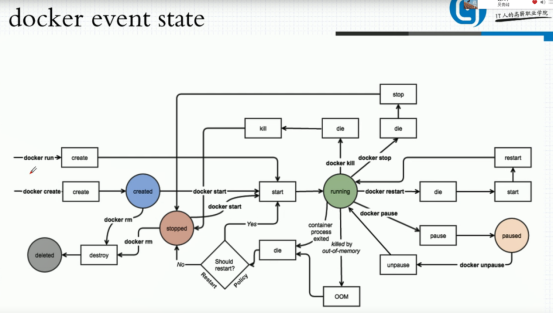

# 学习资源


书籍

- 《Docker技术入门与实战第二版》。


马哥

https://www.bilibili.com/video/av35847195/?p=1

## **黑马**

[https://pan.baidu.com/s/1O8gti5QC5LkcsWU1fMnFSg#list/path=%2Fsharelink3232509500-634459531762870%2F%E6%8F%AD%E5%BC%80Docker%E7%A5%9E%E7%A7%98%E7%9A%84%E9%9D%A2%E7%BA%B1-video&parentPath=%2Fsharelink3232509500-634459531762870](#list/path=/sharelink3232509500-634459531762870/揭开Docker神秘的面纱-video&parentPath=/sharelink3232509500-634459531762870)

## **相关链接**

Docker 官网：http://www.docker.com

Github Docker 源码：https://github.com/docker/docker

# 常见问题**

## **Failed to restart docker.service: Unit not found.**

报错：Failed to restart docker.service: Unit not found.
解决方法：
a.先卸载上个版本的相关软件
yum -y  remove  docker  docker-common  docker-selinux  docker-engine

b.安装docker

最详细最快部署docker：：https://www.jianshu.com/p/9c96ea8e6f41

## **Cannot connect to the Docker daemon at unix:///var/run/docker.sock. Is the docker daemon running?**

 

新的Centos上安装Docker-CE,后运行docker run hello-world报错Cannot connect to the Docker daemon at unix:///var/run/docker.sock. Is the docker daemon running?

解决办法

```
$ systemctl daemon-reload
$ sudo service docker restart
$ sudo service docker status (should see active (running))
$ sudo docker run hello-world
```

 

## **-bash: 未预期的符号 `(' 附近有语法错误**

【1】问题现象

-bash: 未预期的符号 `(' 附近有语法错误

【2】解决方案

给括号前面加反斜杠即可

## **docker 启动失败 Job for docker.service failed because the control process exited with error code. See "systemctl status docker.service" and "journalctl -xe" for details.**

在Liunx中使用Docker, 注: Liunx使用的是在虚拟机下的centOS7版本

在刚开始安装Docker时没有任何错误, 但是在后续的docker启动过程中, 出现以下问题:

 

Job for docker.service failed because the control process exited with error code. See "systemctl status docker.service"

刚遇到这个问题时, 在百度上找答案, 但是找到的答案都不能满足这个问题, 于是自己就慢慢摸索

 

首先查看了一下内核版本

因为使用命令: yum install docker下载时, 默认下载的是Docker的最新版本, 但是内核版本低的话可能不兼容新版本Docker, 所以有可能出现如上错误

解决方案:

步骤一:将以前下载好的Docker卸载干净, 使用如下命令:

yum remove docker-*

步骤二:更新该Liunx系统的内核版本,使用如下命令:

yum update

建议更新完之后, 重启一下系统

步骤三:继续下载安装docker(尽量使用高级管理员权限下载)使用如下命令

 

```
yum install dacker
```

步骤四:使用如下命令启动docker

systemctl start docker

问题解决!

如果这样安装完之后还报错, 按照这个步骤再来一遍即可

如果使用docker命令时出现如下错误:

Cannot connect to the Docker daemon at unix:///var/run/docker.sock. Is the docker daemon running?

第一个原因可能是因为docker没有启动

第二个原因就是因为docker出现错误

归根结底都是docker启动问题, 解决方案还是以上步骤

------

# 学习笔记2

## 概述
 - Docker 运行在 CentOS 7 上，要求系统为64位、系统内核版本为 3.10 以上。
 - Docker 运行在 CentOS-6.5 或更高的版本的 CentOS 上，要求系统为64位、系统内核版本为 2.6.32-431 或者更高版本。

## CentOS7 Docker 安装
Docker 要求 CentOS 系统的内核版本高于 3.10

```bash
# uname -r 命令查看你当前的内核版本
[root@izadux3fzjykx7z ~]# uname -r

安装一些必要的系统工具：
[root@izadux3fzjykx7z ~]# sudo yum install -y yum-utils device-mapper-persistent-data lvm2

添加软件源信息：
[root@izadux3fzjykx7z ~]# sudo yum-config-manager --add-repo http://mirrors.aliyun.com/docker-ce/linux/centos/docker-ce.repo

更新 yum 缓存：
[root@izadux3fzjykx7z ~]# sudo yum makecache fast

安装 Docker-ce：
[root@izadux3fzjykx7z ~]# sudo yum -y install docker-ce
```

## 启动 Docker 后台服务
```bash
[root@izadux3fzjykx7z ~]# sudo systemctl start docker

测试运行 hello-world
[root@izadux3fzjykx7z ~]# docker run hello-world
```
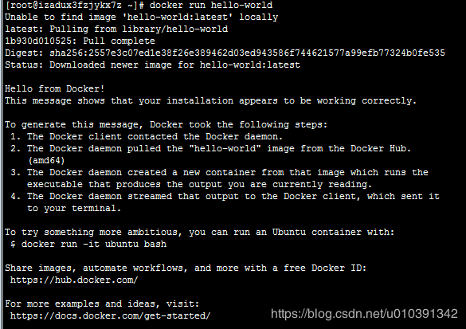
本地没有hello-world这个镜像，所以会下载一个hello-world的镜像，并在容器内运行

## 镜像加速
>鉴于国内网络问题，后续拉取 Docker 镜像十分缓慢，我们可以需要配置加速器来解决，我使用的是网易的镜像地址：http://hub-mirror.c.163.com。

新版的 Docker 使用 /etc/docker/daemon.json（Linux） 来配置 Daemon。
请在该配置文件中加入（没有该文件的话，请先建一个）：
```json
{
  "registry-mirrors": ["http://hub-mirror.c.163.com"]
}
```
> 删除 Docker CE

```bash
$ sudo yum remove docker-ce
$ sudo rm -rf /var/lib/docker
```

## Docker常用命令
列出本地镜像: docker images
```bash
docker images -a :列出本地所有的镜像（含中间映像层，默认情况下，过滤掉中间映像层）；
docker images  --digests :显示镜像的摘要信息；
docker images -f :显示满足条件的镜像；
docker images --format :指定返回值的模板文件；
docker images --no-trunc :显示完整的镜像信息；
docker images  -q :只显示镜像ID。
```
docker pull : 从镜像仓库中拉取或者更新指定镜像
```bash
docker pull -a :拉取所有 tagged 镜像
docker pull --disable-content-trust :忽略镜像的校验,默认开启
docker pull java  : 下载java最新版镜像
docker pull -a java

```
docker inspec 获取容器/镜像的详细信息
```bash
docker inspec 94errf55dter
docker inspec 镜像ID  -f :指定返回值的模板文件。
docker inspec 镜像ID -s :显示总的文件大小。
docker inspec 镜像ID  --type :为指定类型返回JSON。
```
docker search : 从Docker Hub查找镜像
```bash
docker search mysql

--automated :只列出 automated build类型的镜像；
--no-trunc :显示完整的镜像描述；
-s :列出收藏数不小于指定值的镜像。
```
docker rmi : 删除本地一个或多少镜像(容器)
```bash
docker rmi mysql

-f :强制删除；
--no-prune :不移除该镜像的过程镜像，默认移除；
```
docker ps : 列出容器
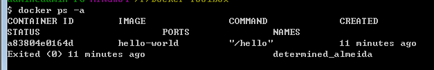

```bash
-a :显示所有的容器，包括未运行的。
-f :根据条件过滤显示的内容。
--format :指定返回值的模板文件。
-l :显示最近创建的容器。
-n :列出最近创建的n个容器。
--no-trunc :不截断输出。
-q :静默模式，只显示容器编号。
-s :显示总的文件大小。
```


## 如何创建一个镜像
>创建镜像的方法又三种：基于已有镜像的容器创建，基于本地模板导入，基于`Dockerfile`创建

`docker commit` :从容器创建一个新的镜像
```bash
docker commit [OPTIONS] CONTAINER [REPOSITORY[:TAG]]
-a :提交的镜像作者；
-c :使用Dockerfile指令来创建镜像；
-m :提交时的说明文字；
-p :在commit时，将容器暂停。
```

首先启动一个镜像 为容器重新分配一个伪输入终端 以交互模式运行容器
```bash
docker run -ti ubuntu:14.04 /bin/bash
# 运行后启动进入命令 记住容器ID
root@97cc221196d7:/#
# 创建一个test文件 并退出
root@97cc221196d7:/# touch  test
root@97cc221196d7:/# exit
# 此时容易和原来的相比已经发生改变， 可以docker commit提交一个新的镜像，提交时用ID或名称指定容器
docker commit -m "add a new file is name test" -a "qxw" 97cc221196d7 test
#成功返回新的镜像ID
sha256:342175794310960ce0b0932bb05b818fb4abc2bcc5d29824018d7783f83d76a9
# 再次查看镜像列表
[root@izadux3fzjykx7z ~]# docker images
REPOSITORY          TAG                 IMAGE ID            CREATED             SIZE
test                latest              342175794310        2 minutes ago       188MB
ubuntu              14.04               390582d83ead        5 weeks ago         188MB
hello-world         latest              fce289e99eb9        3 months ago        1.84kB
```

## 存储和载入镜像
> 可以使用`docker save`和`docker load`来存储和载入镜像

`docker save` : 将指定镜像保存成 tar 归档文件
```bash
# 保存咋当前目录下
 docker save -o test.tar test
```
`docker load`: 载入一个镜像
```bash
 docker load --input test.tar
 或
 docker load < test.tar
```
## 上传镜像
docker push : 将本地的镜像上传到镜像仓库,要先登陆到镜像仓库

```bash
# 可以先添加新的标签 user/test:latest 然后用docker push 上传
docker tag test:latest  user/test:latest
docker push  user/test:latest
## 第一次使用会提示登录信息或注册
```

##  容器的基本操作
>容器是镜像的一个实例，所不同的是，它带有额外的可写文件层
### 创建容器
`docker create` ：创建一个新的容器但不启动它

```bash
[root@izadux3fzjykx7z ~]$ docker create -it ubuntu:14.04
1140d5e5a0a6b9d79adc053fc5d359209e860bf474327a52b3a8da5337173c74
```
新建并启动容器
```bash
[root@izadux3fzjykx7z ~]$ docker run ubuntu:14.04 /bin/echo 'hello world'
hello world
```

后台启动一个容器运行
```bash
[root@izadux3fzjykx7z ~]$ docker run -d ubuntu /bin/sh -c "while true;do echo hello word;sleep 1;done"
[root@izadux3fzjykx7z ~]$ docker ps
CONTAINER ID        IMAGE                 
47168308c196        ubuntu  
   
#获取容器的输出信息
[root@izadux3fzjykx7z ~]$ docker logs 471
```
### 终止容器
* `docker stop`  命令来中止一个运行中的容器，它会向容器发送信号，等待一段时间后在发送信号终止器
* `docker kill`   命令会直接中止容器
```bash
[root@izadux3fzjykx7z ~]$ docker stop 471
471
```

查看处于中止状态的容器ID
```bash
[root@izadux3fzjykx7z ~]$ docker ps -a -q
47168308c196
97765732ff5a
```

处于中止的容器 可以用过  `docker start`  重新启动
```bash
[root@izadux3fzjykx7z ~]$ docker start 471
471
```
重启一个容器

```bash
[root@izadux3fzjykx7z ~]$ docker restart 471
471
```
### 如何进入容器
* `docker attach ` :连接到正在运行中的容器。
* 当多个窗口同时attach 到同一个容器时，所有窗口都会同步显示，如果某个窗口操作的命令阻塞了，所有的窗口都会阻塞

```bash
[root@izadux3fzjykx7z ~]$ docker attach 471
hello word
hello word
hello word
```
* docker exec：在运行的容器中执行命令。可以直接进入容器操作命令
```bash
[root@izadux3fzjykx7z ~]$ docker exec -ti 47168308c196  /bin/bash
root@47168308c196:/$ ls -l
drwxr-xr-x  2 root root 4096 Mar  7 21:01 bin
drwxr-xr-x  2 root root 4096 Apr 24  2018 boot
```
### 删除容器
* 可以使用`docker rm` 命令删除处于终止状态的容器。命令为 `docker rm`
* -f ,--force=false  强行终止并删除一个运行中的容器
* -l,--link=false  删除容器的链接 但保留容器
* -v,--volumes=false, 删除容器挂载的数据券

```bash
[root@izadux3fzjykx7z ~]$ docker ps -a
CONTAINER ID        IMAGE               COMMAND                  CREATED                      
8714bb6a3cee        hello-world         "/hello"                 4 hours ago        
[root@izadux3fzjykx7z ~]$ docker rm 8714  或  docker rm  -f 8714
8714
```
### 导入和导出容器
* `docker export` :将文件系统作为一个tar归档文件导出。不管这个容器是否处于运行状态

```bash
[root@izadux3fzjykx7z ~]$ docker export 47168 > test_stop.tar
[root@izadux3fzjykx7z ~]$ ls -l
-rw-r--r-- 1 root root  72308736 Apr 19 14:59 test_stop.tar
```
* 导出的容器可以使用`docker  import`导入成为镜像

```bash
[root@izadux3fzjykx7z ~]$ cat test_stop.tar | docker import - test/ubuntu:v1.0
sha256:c6c6209a648fd9520fb3a9b3cfcec5f9e53bf82aeffcc2e9edba01942f7c9100
[root@izadux3fzjykx7z ~]$ docker images
REPOSITORY          TAG                 IMAGE ID            CREATED             SIZE
test/ubuntu         v1.0                c6c6209a648f        5 seconds ago       69.8MB
```
* 既可以使用`docker  load`命令导入一个镜像文件。也可以使用`docker  import`导入一个容器快照到本地镜像库。两者的区别在于：快照文件将丢弃所有的历史记录和元数据信息。而镜像存储文件将保存完整记录。体积也要大。从容器快照文件导入时可以重新指定标签等元数据信息。

## 创建和使用私有仓库
* 官方提供了registry镜像来搭建一套本地私有仓库的环境
* `-v` 用户指定镜像文件存储的路径 默认路径是容器的 `/tmp/registry`目录下
```bash
# 自动下载并启动一个registry容器 创建一个本地私有仓库
[root@izadux3fzjykx7z ~]$ docker run -d -p 5000:5000 -v /opt/data/registry:/tmp/registry registry
# 此时本地将启动一个私有仓库，监听端口为5000
```
然后在本地电脑上安装一个`docker` 上传镜像到服务器
```bash
#首先使用docker命令标记一个镜像格式为
docker tag hello-world 39.108.144.143:5000/hellp-world
#使用docke  push  上传至服务器
docker push 39.108.144.143:5000/hellp-world
```
* Docker从1.3.X之后，与docker registry交互默认使用的是https，然而此处搭建的私有仓库只提供http服务，所以当与私有仓库交互时就会报上面的错误
  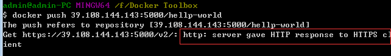
* 这个问题需要在启动docker server时增加启动参数为默认使用http访问。修改`daemon.json`文件

```json
{
  "registry-mirrors": ["http://hub-mirror.c.163.com"],
  "insecure-registries":["39.108.144.143:5000"]
}
```
> 查看镜像推送结果：`curl  http:39.108.144.143:5000/v1/search`
> 下载私有仓库镜像： `docker   pull 39.108.144.143:5000/hellp-world`

## 数据管理
* 容器中管理数据主要有两种方式： 数据卷，数据卷容器

### 数据卷
数据卷是一个可供容器使用的特许目录，它绕过文件系统，可以提供很多有用的特性
* 数据卷可以在容器之间共享和重用
* 对数据卷的修改会立即生效
* 对数据卷的更新，不会影响镜像
* 卷会一直存在，直到没有容器使用。数据卷的使用类似Linux目录下或文件mount操作。

**如何在容器中创建一个数据卷**

```bash
# 使用training/webapp创建一个web容器，并创建一个数据卷挂载到容器的/webapp目录
[root@izadux3fzjykx7z ~]$ docker run -d -P --name web -v /webapp  training/webapp python app.py

- P :只允许外部访问容器需要暴露的端口
-v :也可以指定挂载一个本地的已有目录到容器中去作为数据卷

# 加载主机的src/webapp目录到容器opt/webapp 目录下
docker run -d -P --name web -v /src/webapp:/opt/webapp   training/webapp python app.py

# docker 挂载数据默认权限是读写(rw),可以通过ro 指定为只读
docker run -d -P --name web -v /src/webapp:/opt/webapp  ro  training/webapp python app.py

# 挂载一个本地主机文件作为数据卷，记录在容器中输入过的命令历史
docker run --rm -it -v ~/.bash_history:/.bash_history ubuntu /bin/bash

```
### 数据卷容器
* 如果需要在容器之间共享一些持续更新的数据，最简单的方式是使用数据卷容器。
* 数据卷容器其实就是一个普通的容器，专门用它提供数据卷 供其它容器挂载使用

```bash
# 创建数据卷容器 ,并在其中创建一个数据卷挂载到 /dbdat
[root@izadux3fzjykx7z ~]# 
root@3266a5692131:/# ls
bin  boot  dbdata  dev  etc  home  lib  lib64  media  mnt  opt  proc  root  run  sbin  srv  sys  tmp  usr  var

# 然后,可以在其它容器中使用 --volumes-from来挂载dbdata容器中的数据卷。
# 创建db1和db2两个容器，并从dbdata 容器挂载数据卷

docker run -it --volumes-from dbdata --name db1 ubuntu
docker run -it --volumes-from dbdata --name db2 ubuntu

# 进入dbdata容器 并创建一个文件夹
[root@izadux3fzjykx7z ~]# docker run -it -v /dbdata --name 3266a ubuntu
root@74d186f5896d:/# cd /dbdata/
root@74d186f5896d:/dbdata# touch test
root@74d186f5896d:/dbdata# ls
test

# 在db1容器中查看它
[root@izadux3fzjykx7z ~]# docker run -it --volumes-from dbdata --name d822cd  ubuntu
d186f5896d:/dbdata# ls
```
* 如果删除了挂载的容器，数据卷不会自动删除，如果要删除一个数据卷，必须删除最后一个还挂着它的容器时显示使用docker rm -v命令来指定同时删除关联的容器
* 使用容器卷可以让用户在容器之间自由升级和移动数据卷

## 网络基础配置
* 使用-P标记时，Docker会随机映射一个端口

  
```bash
[root@izadux3fzjykx7z ~]# docker run -d -P --name fe9531 -v /webapp  training/webapp python app.py
4fd207fa931ff015a0c659219d1f7dcc787c353e5ab1f49afaf506472b9e82d2
[root@izadux3fzjykx7z ~]# docker logs -f 4fd20
 * Running on http://0.0.0.0:5000/ (Press CTRL+# 

# 将本地5000端口 映射到容器的5000端口
[root@izadux3fzjykx7z ~]# docker run -d -p 5000:5000 training/webapp python 

# 映射到指定地址的指定端口
[root@izadux3fzjykx7z ~]# docker run -d -p 127.0.0.1:5000:5000 training/webapp python app.py

# 查看端口映射
[root@izadux3fzjykx7z ~]# docker port ea1ecbd4dda4
5000/tcp -> 127.0.0.1:5000
```

##  Dockerfile命令语法
* Dockerfile 是由一行行命令组成，一般二言分为四部分：基础镜像信息，维护者信息，镜像操作指令和容器启动时指令

**FROM**
* 功能为指定基础镜像，并且必须是第一条指令。
* 如果不以任何镜像为基础，那么写法为：FROM scratch。
* 同时意味着接下来所写的指令将作为镜像的第一层开始
```bash
语法：
FROM <image>
FROM <image>:<tag>
FROM <image>:<digest> 
三种写法，其中<tag>和<digest> 是可选项，如果没有选择，那么默认值为latest
```
**MAINTAINER**
* 构建指令，用于将image的制作者相关的信息写入到image中

**RUN**
镜像操作指令。RUN命令有两种格式

```bash
RUN <command>
RUN ["executable", "param1", "param2"]

# 两种写法比对：
RUN /bin/bash -c 'source $HOME/.bashrc; echo $HOME
RUN ["/bin/bash", "-c", "echo hello"]
```
* 第一种后边直接跟shell命令。在linux操作系统上默认 `/bin/sh -c`
* 在windows操作系统上默认 `cmd /S /C`
* 第二种是类似于函数调用。可将`executable`理解成为可执行文件，后面就是两个参数。

**CMD**
* 容器启动时要运行的命令。语法有三种写法：

```bash
CMD ["executable","param1","param2"]
CMD ["param1","param2"]
CMD command param1 param2

# 举例说明两种写法：
CMD [ "sh", "-c", "echo $HOME" 
CMD [ "echo", "$HOME" ]
```

* 第三种比较好理解了，就时shell这种执行方式和写法
* 第一种和第二种其实都是可执行文件加上参数的形式
* 这里边包括参数的一定要用双引号，就是",不能是单引号。千万不能写成单引号。原因是参数传递后，docker解析的是一个JSON array

**LABEL**
* 功能是为镜像指定标签.。LABEL会继承基础镜像种的LABEL，如遇到key相同，则值覆盖

```bash
语法：
LABEL <key>=<value> <key>=<value> <key>=<value> ...

#一个Dockerfile种可以有多个LABEL，如下：
LABEL "com.example.vendor"="ACME Incorporated"
LABEL com.example.label-with-value="foo"
LABEL version="1.0"
LABEL description="This text illustrates \
that label-values can span multiple lines."

#但是并不建议这样写，最好就写成一行，如太长需要换行的话则使用\符号
LABEL multi.label1="value1" \
multi.label2="value2" \
other="value3"
```

## 创建支持SSh的服务镜像
**基于commit 命令创建**

```bash
# 首先创建一个容器
[root@izadux3fzjykx7z ~]# docker run -it ubuntu:14.04 /bin/bash
# 尝试使用SSHD命令 发现没有安装该服务
[root@03e74d026566:/# sshd
bash: sshd: command not found
# 更新软件源信息
root@03e74d026566:/# apt-get update
# 安装和配置SSh服务
root@03e74d026566:/# apt-get install openssh-server
#要正常启动SSH服务 需要手动创建并启动它
root@03e74d026566:/# mkdir -p /var/run/sshd
root@03e74d026566:/# /usr/sbin/sshd -D &
[1] 3848

#查看容器22的端口已经处于监听状态
root@2173083a66ec:/# netstat -tunlp
Active Internet connections (only servers)
Proto Recv-Q Send-Q Local Address           Foreign Address         State       PID/Program name
tcp        0      0 0.0.0.0:22              0.0.0.0:*               LISTEN      3026/sshd
tcp6       0      0 :::22                   :::*                    LISTEN      3026/sshd

# 修改SSH服务的安全登录配置，取消pam登录限制
root@2173083a66ec:/# sed -ri 's/session required pam_loginuid.so/#session required pam_loginuid.so/g'  /etc/pam.d/sshd
# 在用户目录下创建.ssh目录 并复制需要登录的公匙信息到authorized_keys文件中(一般为本地主机目录用户下的.ssh/id_rsa.pub文件中 可由ssh-keygen -t rsa 命令生成)
root@2173083a66ec:/# mkdir root/.ssh
root@2173083a66ec:/# vi /root/.ssh/authorized_keys
# 创建自动启动SSH服务的可执行文件 并添加可执行权限
root@2173083a66ec:/# vi /run.sh
#!/bin/bash
/usr/sbin/sshd -D

root@2173083a66ec:/# chmod +x run.sh
# 最后退出保存容器
root@2173083a66ec:/# exit
# 保存为一个新镜像
[root@izadux3fzjykx7z ~]# docker commit 217 sshd:ubuntu
sha256:043bbe1d3ca0429fa5e00e1ce35e0f3d666cc303393ca09b2776bef81be3085a
# 使用镜像启动容器 并添加端口映射 10022->22
[root@izadux3fzjykx7z ~]# docker run -p 10022:22 -d sshd:ubuntu /run.sh
0aabe835d56311abdc7ab1febf293a15b5240128a927a8638635b204203deb4b
# 在宿主机上测试连接ssh
[root@izadux3fzjykx7z ~]# ssh 172.18.83.251 -p 10022
```
**使用Dockerfile创建**

首先应创建一个sshd_ ubuntu 工作目录:
```bash
$ mkdir sshd ubuntu
# 在其中，创建Dockerfile和run.sh文件:
$ cd sshd_ ubuntu/
$ touch Dockerfile run. sh 

# 编写run.sh脚本和authorized keys文件
# 文件run.sh的内容与上-小节中致: 
#!/bin/bash
/usr/sbin/sshd -D

# 在宿主主机上生成SSH密钥对，并创建authorized keys 文件:
$ ssh-keygen -t rsa
$ cat ~/.ssh/id_ rsa. pub >authorized keys
```
编写Dockerfile文件

```bash
#设置继承镜像
FROM ubuntu:14.04
#提供一些作者的信息
MAINTAINER from blog.qinxuewu.club by qxw (870439570@qq.com)
# 下面开始运行命令，此处更改ubuntu的源为国内163的源
RUN echo "deb http:/ /mirrors.163. com/ubuntu/ trusty main restricted universe
multiverse" > /etc/apt/ sources.list
RUN echo "deb http://mirrors. 163. com/ubuntu/”trusty-security main restricted
universe multiverse" >> /etc/apt/sources.list
RUN echo
"deb http://mirrors.163. com/ubuntu/ trusty-updates main restricted
universe multiverse" >> /etc/apt/sources.list
RUN echo "deb http://mirrors. 163. com/ubuntu/ trusty-proposed main restricted
universe multiverse" >> /etc/apt/sources.list
RUN echo "deb http: //mirrors.163. com/ubuntu/ trusty-backports main restricted
universe multiverse" >> /etc/apt/sources.list
RUN apt-get update
#安装ssh服务
RUN apt-get install -y openssh-server
RUN mkdir -p /var/ run/sshd
RUN mkdir -P /root/ .ssh
#取消pam限制
RUN sed -ri 's/session required pam loginuid.so/#session required pam_ loginuid.so/g' /etc/pam.d/sshd
# 复制配置文件到相应位置，并赋予脚本可执行权限
ADD authorized keys /root/ .ssh/authorized keys
ADD run.sh /run.sh
RUN chmod 755 /run.sh
#开放端口
EXPOSE 22
普设置自启动命令
CMD ["/run. sh"]
```

创建镜像

```bash
#在sshd_ ubuntu 目录下，使用docker build 命令来创建镜像。注意一下，在最后还有一个“.”，表示使用当前目录中的Dockerfile.
$ cd sshd ubuntu
$ sudo docker build -t sshd:dockerfile .

# 启动测试
$ docker run -d -p 10012:22 sshd:dockerfile
$ ssh 172.18.83.251 -p 10012
```


## Docker三剑客一之 Compose 
* Compose 项目是 Docker 官方的开源项目，负责实现对 Docker 容器集群的快速编排

**Compose 中有两个重要的概念：**

* 服务 (service)：一个应用的容器，实际上可以包括若干运行相同镜像的容器实例。
* 项目 (project)：由一组关联的应用容器组成的一个完整业务单元，在 docker-compose.yml 文件中定义。

**安装与卸载**

* Compose 支持 Linux、macOS、Windows 10 三大平台
* Compose 可以通过 Python 的包管理工具 pip 进行安装，也可以直接下载编译好的二进制文件使用，甚至能够直接在 Docker 容器中运行。

```bash
#  二进制安装
$ sudo curl -L https://github.com/docker/compose/releases/download/1.17.1/docker-compose-`uname -s`-`uname -m` > /usr/local/bin/docker-compose
$ sudo chmod +x /usr/local/bin/docker-compose
# 卸载命令
$ sudo rm /usr/local/bin/docker-compose

# 容器中执行
$ curl -L https://github.com/docker/compose/releases/download/1.8.0/run.sh > /usr/local/bin/docker-compose
$ chmod +x /usr/local/bin/docker-compose

[root@izadux3fzjykx7z bin]# docker-compose --version
docker-compose version 1.8.0, build f3628c7
```
**常用命令**

```bash
build
格式为 docker-compose build [options] [SERVICE...]。
--force-rm 删除构建过程中的临时容器。
--no-cache 构建镜像过程中不使用 cache（这将加长构建过程）。
--pull 始终尝试通过 pull 来获取更新版本的镜像。

config:验证 Compose 文件格式是否正确，若正确则显示配置，若格式错误显示错误原因。
down:此命令将会停止 up 命令所启动的容器，并移除网络
exec :进入指定的容器
images :列出 Compose 文件中包含的镜像
help:获得一个命令的帮助
images:列出 Compose 文件中包含的镜像
kill:通过发送 SIGKILL 信号来强制停止服务容器
logs: 查看服务容器的输出
pause: 暂停一个服务容器。
port:打印某个容器端口所映射的公共端口。
ps:列出项目中目前的所有容器。
pull:拉取服务依赖的镜像
push:推送服务依赖的镜像到 Docker 镜像仓库
restart: 重启项目中的服务。
rm:删除所有（停止状态的）服务容器。推荐先执行 docker-compose stop 命令来停止容器
run: 在指定服务上执行一个命令。
scale: 设置指定服务运行的容器个数  docker-compose scale web=3 db=2 将启动 3 个容器运行 web 服务，2 个容器运行 db 服务。
start:启动已经存在的服务容器
stop:停止已经处于运行状态的容器
top:查看各个服务容器内运行的进程。
unpause:恢复处于暂停状态中的服务。
up:它将尝试自动完成包括构建镜像，（重新）创建服务，启动服务，并关联服务相关容器的一系列操作。如果使用 docker-compose up -d，将会在后台启动并运行所有的容器。一般推荐生产环境下使用该选项
version:打印版本信息。
```
**Compose 模板文件**

## 参考
* Docker安装手册：https://docs.docker-cn.com/engine/installation/
* 菜鸟教程：http://www.runoob.com/docker/centos-docker-install.html
* [Docker技术入门与实战](https://yeasy.gitbooks.io/docker_practice/content/) 


#  镜像


## 一 Docker 下载镜像

如果我们想要在本地运行容器，就必须保证本地存在对应的镜像。所以，第一步，我们需要下载镜像。当我们尝试下载镜像时，Docker 会尝试先从默认的镜像仓库（默认使用 Docker Hub 公共仓库）去下载，当然了，用户也可以自定义配置想要下载的镜像仓库。

### 1.1 下载镜像

镜像是运行容器的前提，我们可以使用 `docker pull[IMAGE_NAME]:[TAG]`命令来下载镜像，其中 `IMAGE_NAME` 表示的是镜像的名称，而 `TAG` 是镜像的标签，也就是说我们需要通过 “**镜像 + 标签**” 的方式来下载镜像。

**注意：** 您也可以不显式地指定 TAG, 它会默认下载 latest 标签，也就是下载仓库中最新版本的镜像。这里并不推荐您下载 latest 标签，因为该镜像的内容会跟踪镜像的最新版本，并随之变化，所以它是不稳定的。在生产环境中，可能会出现莫名其妙的 bug, 推荐您最好还是显示的指定具体的 TAG。

举个例子，如我们想要下载一个 Mysql 5.7 镜像，可以通过命令来下载：

```
docker pull mysql:5.7
```

会看到控制台输出内容如下：


**注意：** 由于官方 DockerHub 仓库服务器在国外，下载速度较慢，所以我将仓库的地址更改成了国内的 `docker.io` 的镜像仓库，所以在上图中，镜像前面会有 `docker.io` 出现。

当有 **Downloaded** 字符串输出的时候，说明下载成功了！！

### 1.2 验证

让我们来验证一下，本地是否存在 Mysql5.7 的镜像，运行命令：

```
docker images
```


可以看到本地的确存在该镜像，确实是下载成功了！

### 1.3 下载镜像相关细节

再说说上面下载镜像的过程：


通过下载过程，可以看到，一个镜像一般是由多个层（ `layer`） 组成，类似 `f7e2b70d04ae`这样的串表示层的唯一 ID（实际上完整的 ID 包括了 256 个 bit, 64 个十六进制字符组成）。

**您可能会想，如果多个不同的镜像中，同时包含了同一个层（ layer）,这样重复下载，岂不是导致了存储空间的浪费么?**

实际上，Docker 并不会这么傻会去下载重复的层（ `layer`）,Docker 在下载之前，会去检测本地是否会有同样 ID 的层，如果本地已经存在了，就直接使用本地的就好了。

**另一个问题，不同仓库中，可能也会存在镜像重名的情况发生, 这种情况咋办？**

严格意义上，我们在使用 `docker pull` 命令时，还需要在镜像前面指定仓库地址( `Registry`), 如果不指定，则 Docker 会使用您默认配置的仓库地址。例如上面，由于我配置的是国内 `docker.io` 的仓库地址，我在 `pull` 的时候，docker 会默认为我加上 `docker.io/library` 的前缀。

如：当我执行 `docker pull mysql:5.7` 命令时，实际上相当于 `docker pull docker.io/mysql:5.7`，如果您未自定义配置仓库，则默认在下载的时候，会在镜像前面加上 DockerHub 的地址。

Docker 通过前缀地址的不同，来保证不同仓库中，重名镜像的唯一性。

### 1.4 PULL 子命令

命令行中输入：

```
docker pull --help
```

会得到如下信息：

```
[root@iZbp1j8y1bab0djl9gdp33Z ~]# docker pull --help
Usage:  docker pull [OPTIONS] NAME[:TAG|@DIGEST]
Pull an image or a repository from a registry
Options:  -a, --all-tags                Download all tagged images in the repository      --disable-content-trust   Skip image verification (default true)      --help                    Print usage
```

我们可以看到主要支持的子命令有：

1. `-a,--all-tags=true|false`: 是否获取仓库中所有镜像，默认为否；
2. `--disable-content-trust`: 跳过镜像内容的校验，默认为 true;

## 二 Docker 查看镜像信息

### 2.1 images 命令列出镜像

通过使用如下两个命令，列出本机已有的镜像：

```
docker images
```

或：

```
docker image ls
```

如下图所示：


对上述红色标注的字段做一下解释：

- **REPOSITORY**: 来自于哪个仓库；
- **TAG**: 镜像的标签信息，比如 5.7、latest 表示不同的版本信息；
- **IMAGE ID**: 镜像的 ID, 如果您看到两个 ID 完全相同，那么实际上，它们指向的是同一个镜像，只是标签名称不同罢了；
- **CREATED**: 镜像最后的更新时间；
- **SIZE**: 镜像的大小，优秀的镜像一般体积都比较小，这也是我更倾向于使用轻量级的 alpine 版本的原因；

> 注意：图中的镜像大小信息只是逻辑上的大小信息，因为一个镜像是由多个镜像层（ `layer`）组成的，而相同的镜像层本地只会存储一份，所以，真实情况下，占用的物理存储空间大小，可能会小于逻辑大小。

### 2.2 使用 tag 命令为镜像添加标签

通常情况下，为了方便在后续工作中，快速地找到某个镜像，我们可以使用 `docker tag` 命令，为本地镜像添加一个新的标签。如下图所示：


为 `docker.io/mysql` 镜像，添加新的镜像标签 `allen_mysql:5.7`。然后使用 `docker images` 命令，查看本地镜像：


可以看到，本地多了一个 `allen_mysql:5.7` 的镜像。细心的你一定还会发现， `allen_mysql:5.7` 和 `docker.io/mysql:5.7` 的镜像 ID 是一模一样的，说明它们是同一个镜像，只是别名不同而已。

`docker tag` 命令功能更像是, 为指定镜像添加快捷方式一样。

### 2.3 使用 inspect 命令查看镜像详细信息

通过 `docker inspect` 命令，我们可以获取镜像的详细信息，其中，包括创建者，各层的数字摘要等。

```
docker inspect docker.io/mysql:5.7
```


`docker inspect` 返回的是 `JSON` 格式的信息，如果您想获取其中指定的一项内容，可以通过 `-f` 来指定，如获取镜像大小：

```
docker inspect -f {{".Size"}} docker.io/mysql:5.7
```


### 2.4 使用 history 命令查看镜像历史

前面的小节中，我们知道了，一个镜像是由多个层（layer）组成的，那么，我们要如何知道各个层的具体内容呢？

通过 `docker history` 命令，可以列出各个层（layer）的创建信息，如我们查看 `docker.io/mysql:5.7` 的各层信息：

```
docker history docker.io/mysql:5.7
```


可以看到，上面过长的信息，为了方便展示，后面都省略了，如果您想要看具体信息，可以通过添加 `--no-trunc` 选项，如下面命令：

```
docker history --no-trunc docker.io/mysql:5.7
```

## 三 Docker 搜索镜像

### 3.1 search 命令

您可以通过下面命令进行搜索：

```
docker search [option] keyword
```

比如，您想搜索仓库中 `mysql` 相关的镜像，可以输入如下命令：

```
docker search mysql
```


### 3.2 search 子命令

命令行输入 `docker search--help`, 输出如下：

```
Usage:  docker search [OPTIONS] TERM
Search the Docker Hub for images
Options:  -f, --filter filter   Filter output based on conditions provided      --help            Print usage      --limit int       Max number of search results (default 25)      --no-index        Don't truncate output      --no-trunc        Don't truncate output
```

可以看到 `search` 支持的子命令有：

- `-f,--filter filter`: 过滤输出的内容；
- `--limitint`：指定搜索内容展示个数;
- `--no-index`: 不截断输出内容；
- `--no-trunc`：不截断输出内容；

举个列子，比如我们想搜索官方提供的 mysql 镜像，命令如下：

```
docker search --filter=is-offical=true mysql
```


再比如，我们想搜索 Stars 数超过 100 的 mysql 镜像：

```
docker search --filter=stars=100 mysql
```


## 四 Docker 删除镜像

### 4.1 通过标签删除镜像

通过如下两个都可以删除镜像：

```
docker rmi [image]
```

或者：

```
docker image rm [image]
```

支持的子命令如下：

- `-f,-force`: 强制删除镜像，即便有容器引用该镜像；
- `-no-prune`: 不要删除未带标签的父镜像；

Docker 查看镜像信息

例如，我们想删除上章节创建的 `allen_mysql:5.7` 镜像，命令如下：

```shell
docker rmi allen_mysql:5.7
```


从上面章节中，我们知道 `allen_mysql:5.7` 和 `docker.io/mysql:5.7` 实际上指向的是同一个镜像，那么，您可以能会有疑问，我删除了 `allen_mysql:5.7`, 会不会将 `docker.io/mysql:5.7` 镜像也给删除了？

**实际上，当同一个镜像拥有多个标签时，执行 `docker rmi` 命令，只是会删除了该镜像众多标签中，您指定的标签而已，并不会影响原始的那个镜像文件。**

不信的话，我们可以执行 `docker images` 命令，来看下 `docker.io/mysql:5.7` 镜像还在不在：


可以看到， `docker.io/mysql:5.7` 镜像依然存在！

那么，如果某个镜像不存在多个标签，当且仅当只有一个标签时，执行删除命令时，您就要小心了，这会彻底删除镜像。

例如，这个时候，我们再执行 `docker rmi docker.io/mysql:5.7` 命令：


从上图可以看到，我们已经删除了 `docker.io/mysql:5.7` 镜像的所有文件层。该镜像在本地已不复存在了！

### 4.2 通过 ID 删除镜像

除了通过标签名称来删除镜像，我们还可以通过制定镜像 ID, 来删除镜像，如：

```
docker rmi ee7cbd482336
```

一旦制定了通过 ID 来删除镜像，它会先尝试删除所有指向该镜像的标签，然后在删除镜像本身。

### 4.3 删除镜像的限制

删除镜像很简单，但也不是我们何时何地都能删除的，它存在一些限制条件。

当通过该镜像创建的容器未被销毁时，镜像是无法被删除的。为了验证这一点，我们来做个试验。首先，我们通过 `docker pull alpine` 命令，拉取一个最新的 `alpine` 镜像, 然后启动镜像，让其输出 `hello,docker!`:


接下来，我们来删除这个镜像试试：


可以看到提示信息，无法删除该镜像，因为有容器正在引用他！同时，这段信息还告诉我们，除非通过添加 `-f` 子命令，也就是强制删除，才能移除掉该镜像！

```
docker rmi -f docker.io/alpine
```

但是，我们一般不推荐这样暴力的做法，正确的做法应该是：

1. 先删除引用这个镜像的容器；
2. 再删除这个镜像；

也就是，根据上图中提示的，引用该镜像的容器 ID ( `9d59e2278553`), 执行删除命令：

```
docker rm 9d59e2278553
```

然后，再执行删除镜像的命令：

```
docker rmi 5cb3aa00f899
```

Docker 删除镜像

这个时候，就能正常删除了！

### 4.4 清理镜像

我们在使用 Docker 一段时间后，系统一般都会残存一些临时的、没有被使用的镜像文件，可以通过以下命令进行清理：

```
docker image prune
```

它支持的子命令有：

- `-a,--all`: 删除所有没有用的镜像，而不仅仅是临时文件；
- `-f,--force`：强制删除镜像文件，无需弹出提示确认；

## 五 Docker 创建镜像

此小节中，您将学习 Docker 如何创建镜像？Docker 创建镜像主要有三种：

1. 基于已有的镜像创建；
2. 基于 Dockerfile 来创建；
3. 基于本地模板来导入；

我们将主要介绍常用的 1，2 两种。

### 5.1 基于已有的镜像创建

通过如下命令来创建：

```
docker container commit
```

支持的子命令如下：

- `-a,--author`="": 作者信息；
- `-c,--change`=[]: 可以在提交的时候执行 Dockerfile 指令，如 CMD、ENTRYPOINT、ENV、EXPOSE、LABEL、ONBUILD、USER、VOLUME、WORIR 等；
- `-m,--message`="": 提交信息；
- `-p,--pause`=true: 提交时，暂停容器运行。

接下来，基于本地已有的 Ubuntu 镜像，创建一个新的镜像：


首先，让我将它运行起来，并在其中创建一个 test.txt 文件：


命令如下：

```
docker run -it docker.io/ubuntu:latest /bin/bashroot@a0a0c8cfec3a:/# touch test.txtroot@a0a0c8cfec3a:/# exit
```

创建完 test.txt 文件后，需要记住标注的容器 ID: `a0a0c8cfec3a`, 用它来提交一个新的镜像(**PS: 你也可以通过名称来提交镜像，这里只演示通过 ID 的方式**)。

执行命令：

```
docker container commit -m "Added test.txt file" -a "Allen" a0a0c8cfec3a test:0.1
```

提交成功后，会返回新创建的镜像 ID 信息，如下图所示：


再次查看本地镜像信息，可以看到新创建的 `test:0.1` 镜像了：


### 5.2 基于 Dockerfile 创建

通过 Dockerfile 的方式来创建镜像，是最常见的一种方式了，也是比较推荐的方式。Dockerfile 是一个文本指令文件，它描述了是如何基于一个父镜像，来创建一个新镜像的过程。

下面让我们来编写一个简单的 Dockerfile 文件，它描述了基于 Ubuntu 父镜像，安装 Python3 环境的镜像：

```
FROM docker.io/ubuntu:latest
LABEL version="1.0" maintainer="Allen <weiwosuo@github>"
RUN apt-get update && \    apt-get install -y python3 && \    apt-get clean && \    rm -rf /var/lib/apt/lists/*
```

创建完成后，通过这个 Dockerfile 文件，来构建新的镜像，执行命令：

```
docker image build -t python:3 .
```

**注意：** 命令的最后有个点，如果不加的话，会构建不成功 ！


编译成功后，再次查看本地镜像信息，就可以看到新构建的 python:3 镜像了。


## 六 Docker 导出&加载镜像

此小节中，您将学习 Docker 如何导出&加载镜像。

通常我们会有下面这种需求，需要将镜像分享给别人，这个时候，我们可以将镜像导出成 tar 包，别人直接通过加载这个 tar 包，快速地将镜像引入到本地镜像库。

要想使用这两个功能，主要是通过如下两个命令：

1. `docker save`
2. `docker load`

### 6.1 导出镜像

查看本地镜像如下：


例如，我们想要将 python:3 镜像导出来，执行命令：

```
docker save -o python_3.tar python:3
```

执行成功后，查看当前目录：

Docker 导出文件

可以看到 `python_3.tar` 镜像文件已经生成。接下来，你可以将它通过复制的方式，分享给别人了！

### 6.2 加载镜像

别人拿到了这个 `tar` 包后，要如何导入到本地的镜像库呢？

通过执行如下命令：

```
docker load -i python_3.tar
```

或者：

```
docker load < python_3.tar
```

导入成功后，查看本地镜像信息，你就可以获得别人分享的镜像了！怎么样，是不是很方便呢！

## 七 Docker 上传镜像

我们将以上传到 Docker Hub 上为示例，演示 Docker 如何上传镜像。

### 7.1 获取 Docker ID

想要上传镜像到 Docker Hub 上，首先，我们需要注册 Docker Hub 账号。打开 Docker Hub 网址 https://hub.docker.com，开始注册：


填写您的 Docker ID (也就是账号)，以及密码，Email, 点击继续。

接下来，Docker Hub 会发送验证邮件，到您填写的邮箱当中：


点击验证即可，接下来，再次返回 Docker Hub 官网，用您刚刚注册的 Docker ID 和密码来登录账号！


### 7.2 创建镜像仓库

登录成功后，会出现如下页面：


选择创建一个镜像仓库：


填写**仓库名称**、**描述信息**、**是否公开后**，点击创建。

仓库镜像展示页

我们看到，仓库已经创建成功了，但是里面还没有任何镜像，接下来开始上传镜像，到此新创建的仓库中。

### 7.3 上传镜像

进入命令行，**用我们刚刚获取的 Docker ID 以及密码登录**，执行命令：

```
docker login
```

命令行登录 Docker ID

登录成功后，我们开始准备上传本地的 `python:3` 镜像：


首先，我们对其打一个新的标签，**前缀与我们新创建的 Docker ID 、仓库名保持一致**:

```
docker tag python:3 weiwosuoai1991/python:3
```


查看本地信息，可以看到，标签打成功了。接下开，开始上传！执行命令：

```
docker push weiwosuoai1991/python:3
```


上传成功！去 Docker Hub 官网，新创建的仓库的信息页面验证一下，是否真的成功了：


## 八 总结

本文中，我们着重学习了 Docker 中下载镜像,、查看镜像信息、搜索镜像、删除镜像,、创建镜像、导出&加载镜像以及向 Docker Hub 上传镜像的相关操作。