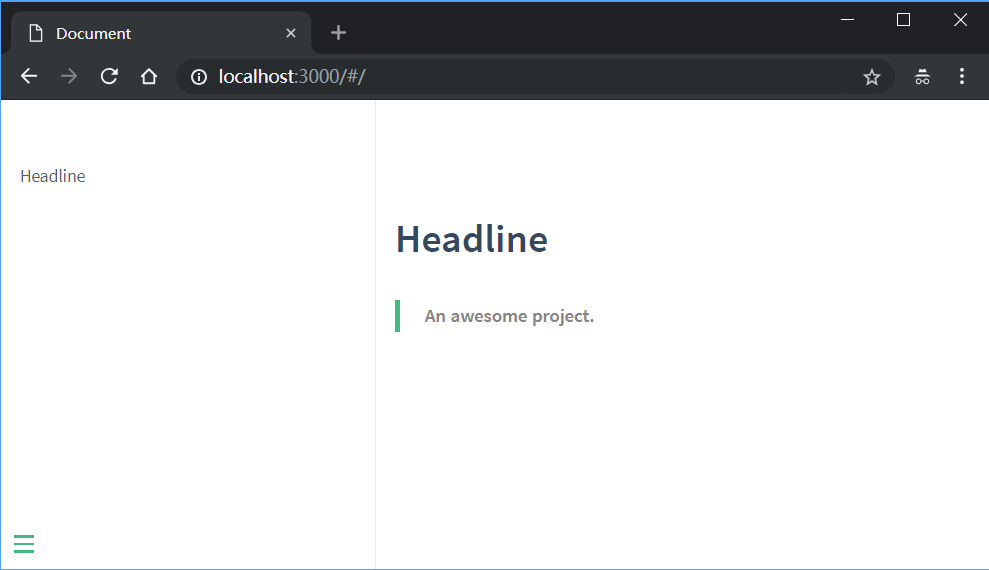
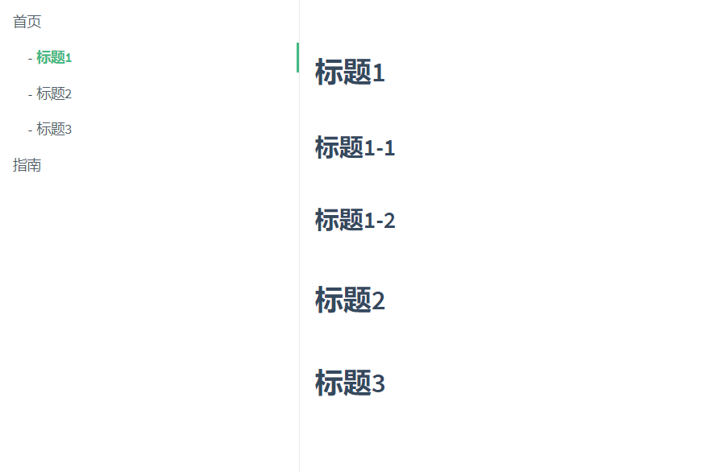

[](https://i.loli.net/2018/08/08/5b6a49c8c93fc.png)

一直以来我都习惯直接用 markdown 写一些简单的项目文档，并且通过 git 同步到 Github 或者国内的码云上，以满足备份和查看的需求，但直到我遇到了 [docsify](https://docsify.js.org/) ，在初步了解了一天后，我觉得这款工具或许可以代替我之前写文档的方式。


## 什么是 docsify

> docsify 是一个动态生成文档网站的工具。不同于 GitBook、Hexo 的地方是它不会生成将 `.md` 转成 `.html` 文件，所有转换工作都是在运行时进行。

官方的介绍其实就已经打动我了，因为 GitBook 和 Hexo ，一个有了解过，一个现在正在使用，它们的“特点”就是都需要编译，相对来说就会比较费时，而运行时编译就方便了很多，而且整个文档目录也不会被 `.html` 文件“污染”，虽然 SEO 会受到影响，但我不在乎！

预览链接：https://github.com/ysyluminous/JavaLeaning 

## 开始使用

### 安装

首先先安装好npm和nodejs,这里就不做过多介绍了 自信安装即可 

（https://blog.csdn.net/zimushuang/article/details/79715679）

官方推荐安装 [docsify-cli](https://www.npmjs.com/package/docsify-cli) 工具，可以方便创建及本地预览文档网站。

```
npm i docsify-cli -g
```

### 初始化

建议在项目的 `./docs` 目录里写文档，可以通过下面的方式初始化项目：

```
docsify init ./docs
```

这里我也可以直接创建一个纯文档项目：

```
docsify init ./
```

### 本地预览

在上一步初始化完毕后，会看到 `Initialization succeeded! Please run docsify serve ./` ，那我们接着执行 `docsify serve ./` 就可以运行起一个支持实时预览的本地网站，通过 [http://localhost:3000](http://localhost:3000/) 可以访问。

```
docsify serve ./
```

## 基本操作

[](https://i.loli.net/2018/08/08/5b6a82e9cf935.png)

运行好后看到这样的页面就代表运行成功了，在开始写文档之前，先来了解一下初始化好后的这三个文件分别是做什么的。

- `.nojekyll` 用于阻止 GitHub Pages 会忽略掉下划线开头的文件
- `index.html` 入口文件，也可以理解为项目配置文件
- `README.md` 文档默认主页

### 多页文档

现在文档默认只有一篇，也就是 `README.md` ，如果要再增加一篇，也很简单，直接在项目根目录创建一个 `.md` 文件就可以，比如新建一个 `guide.md` 文件，那么对应的路由就是 `/#/guide` 。

假设我们的文件目录结构如下：

```
docsify├ README.md├ guide.md├ zh-cn│　├ README.md│　└ guide.md
```

那么对应访问页面的地址就是：

```
docsify/README.md            ==> http://localhost:3000/#/docsify/guide.md             ==> http://localhost:3000/#/guidedocsify/zh-cn/README.md      ==> http://localhost:3000/#/zh-cn/docsify/zh-cn/guide.md       ==> http://localhost:3000/#/zh-cn/guide
```

### 侧边栏

现在项目里已经可以创建多篇文档了，但发现有个问题，因为现在是通过手动在浏览器地址栏里输入文档地址访问，这种方式肯定不够优雅。

好在 docsify 提供了侧边栏的功能，我们打开 `index.html` 文件配置 `loadSidebar` 选项：

```
window.$docsify = {    loadSidebar: true}
```

接着在根目录下创建 `_sidebar.md` 文件，内容如下：

```
* [首页](/)* [指南](guide)* [中文首页](zh-cn/)* [中文指南](zh-cn/guide)
```

需要注意的是，`_sidebar.md` 的加载逻辑是从每层目录下获取文件，如果当前目录不存在该文件则回退到上一级目录。例如当前路径为 `/zh-cn/guide` 则从 `/zh-cn/_sidebar.md` 获取文件，如果不存在则从 `/_sidebar.md` 获取。当然你也可以配置 `alias` 避免不必要的回退过程。

```
window.$docsify = {    loadSidebar: true,    alias: {        '/.*/_sidebar.md': '/_sidebar.md'    }}
```

### 文档目录

侧边栏开启的同时，通过设置 `subMaxLevel` 选项也可以开启文档目录功能。

```
window.$docsify = {    loadSidebar: true,    subMaxLevel: 2}
```

这会我们打开 `README.md` 文件，随便写几个标题，保存一下看看效果。

```
## 标题1### 标题1-1### 标题1-2## 标题2## 标题3
```

[](https://i.loli.net/2018/08/08/5b6a9ab29079d.png)

可以看到`标题1`下面的`标题1-1`和`标题1-2`并没有显示出来，因为我们设置了 `subMaxLevel` 为 2 ，如果需要显示，则修改为 3 即可。

侧边栏一级为页面，从二级开始才是目录，所以 `subMaxLevel: 2` 只显示了一级目录，如果要显示二级目录，则应该设置为 `subMaxLevel: 3` 。如果还是不理解，那就动手多试几遍，就明白了。

如果文档里有特定的标题不想展示到目录中，可以添加 `{docsify-ignore}` 或 `{docsify-ignore-all}` 。

```
## 标题1### 标题1-1 {docsify-ignore}### 标题1-2## 标题2 {docsify-ignore-all}### 标题2-1## 标题3
```

### 导航栏

打开 `index.html` 文件配置 `loadNavbar` 选项：

```
window.$docsify = {    loadNavbar: true}
```

接着在根目录下创建 `_navbar.md` 文件，内容如下：

```
* [En](/)* [中文](/zh-cn/)
```

如果导航内容很多，也可以使用嵌套的方式：

```
* En  * [Index](/)  * [Guide](guide)* 中文  * [首页](/zh-cn/)  * [指南](/zh-cn/guide)
```

- 导航嵌套支持多层，但官方的样式处理上似乎有点 bug ，多层嵌套展示不理想，所以建议最多就两层嵌套最好。
- 导航的加载逻辑与侧边栏一致。

### 封面

打开 `index.html` 文件配置 `coverpage` 选项：

```
window.$docsify = {    coverpage: true}
```

接着在根目录下创建 `_coverpage.md` 文件，内容就是标准的 markdown 语法，可以参考一下官方的封面：

```
# docsify> A magical documentation site generator.* Simple and lightweight (~12kb gzipped)* Multiple themes* Not build static html files[GitHub](https://github.com/docsifyjs/docsify/)[Get Started](#quick-start)
```

封面的背景是随机生成的渐变色，我们也可以指定一个背景色或者背景图，只要放在文档末尾就可以，同时设定只生效第一个。

```
<!-- 自定义背景色 --><!-- 自定义背景图 -->
```

如果我们的文档是多语言的，那可不可以设置多个封面？当然也是可以的。首先确定文档目录结构如下：

```
docsify├ README.md├ guide.md├ _coverpage.md├ zh-cn│　├ README.md│　├ guide.md│　└ _coverpage.md
```

然后修改 `coverpage` 选项：

```
window.$docsify = {    coverpage: ['/', '/zh-cn/']}// 或者具体指明文件名window.$docsify = {    coverpage: {        '/': '_coverpage.md',        '/zh-cn/': '_coverpage.md'    }}
```

## 个性定制

### 配置项

在上面已经介绍了一些配置项，比如侧边栏 `loadSidebar` 、导航栏 `loadNavbar` 、封面 `coverpage` ，关于 `window.$docsify` 完整配置说明，可以查看[官方配置项文档](https://docsify.js.org/#/zh-cn/configuration)参考。

### 主题

直接打开 index.html 修改替换 css 地址即可切换主题，官方目前提供了 4 套主题，分别是：

```
<link rel="stylesheet" href="//unpkg.com/docsify/themes/vue.css"><link rel="stylesheet" href="//unpkg.com/docsify/themes/buble.css"><link rel="stylesheet" href="//unpkg.com/docsify/themes/dark.css"><link rel="stylesheet" href="//unpkg.com/docsify/themes/pure.css"><!-- 压缩文件位于 /lib/themes/ --><link rel="stylesheet" href="//unpkg.com/docsify/lib/themes/vue.css"><link rel="stylesheet" href="//unpkg.com/docsify/lib/themes/buble.css"><link rel="stylesheet" href="//unpkg.com/docsify/lib/themes/dark.css"><link rel="stylesheet" href="//unpkg.com/docsify/lib/themes/pure.css">
```

### 插件


#### 主题

https://jhildenbiddle.github.io/docsify-themeable/#/themes?id=simple-dark


插件配置很简单，基本大部分插件只要复制对应的 js 引用代码复制到 index.html 页面里就可以。以下介绍几个我在测试中用到感觉还不错的插件，更[完整的插件列表](https://docsify.js.org/#/zh-cn/plugins)还请查看官方文档。

#### emoji

docsify 默认是支持 emoji 表情的，但它不够精准，因为没有处理非 emoji 的字符串。如果你需要正确解析 emoji 字符串，可以引入这个插件。

```
<script src="//unpkg.com/docsify/lib/plugins/emoji.js"></script>
```

这里我还找到一份 github 的完整 emoji 表情代码：[去看看](https://gist.github.com/rxaviers/7360908)

#### 复制代码

在用 markdown 展示代码片段的时候，可能需要一键复制代码到本地运行，这时候就可以引入这个插件。

```
<script src="//unpkg.com/docsify-copy-code"></script>
```

#### 分页

在文档底部出现上一页和下一页按钮。

```
<script src="//unpkg.com/docsify-pagination/dist/docsify-pagination.min.js"></script>
```

#### 代码高亮

docsify 内置的代码高亮工具是 Prism ，默认支持 CSS 、JavaScript 和 HTML 。如果需要其它语言，可以手动引入。

```
<!-- 引入 PHP 代码高亮插件 --><script src="//unpkg.com/prismjs/components/prism-php.js"></script>
```

其它语言高亮插件可以查看 [Prims](https://github.com/PrismJS/prism/tree/gh-pages/components) 仓库。

## 文档助手

docsify 扩展了一些 markdown 的语法，但由于这篇文章是在 Hexo 里编写，无法通过 Hexo 直接展示出效果，建议查看[官方文档](https://docsify.js.org/#/zh-cn/helpers)了解详情。

## 最后

最后把整个项目上传到 GitHub Pages 上，一份在线文档就大功告成了。

整体使用下来还是挺顺畅的，基本和原来写文档的流程一样，如果不会用到 docsify 提供的 markdown 扩展语法，那就可以继续使用原有的 markdown 编辑器进行编写，加上现在大部分 markdown 编辑器都会提供同步预览，所以也不一定非得使用 docsify 提供的本地预览方案。

关于离线模式（PWA）和服务端渲染（SSR），因为目前用不上，所以就没有尝试。


> https://hooray.github.io/posts/ed9dc49e/


# 常见问题

1、当使用如下命令本地运行服务器的时候：
docsify serve
会报如下错误:
Run npm config delete prefix or nvm use --delete-prefix v8.9.4 --silent to unset it.
解决办法1,使用以下命令，但是每次都需要使用：
nvm use v8.9.4
解决办法2，使用以下办法，一劳永逸，解决问题根本：
sudo rm -rf /usr/local/{lib/node{,/.npm,_modules},bin,share/man}/{npm*,node*,man1/node*}


------


## 快速开始


安装docsify 推荐安装 docsify-cli 工具，可以方便创建及本地预览文档网站。

npm i docsify-cli -g
初始化项目

进入指定文件目录 如下：F:\ideWork\githubWork\test_docs
运行 docsify init ./docs
在这里插入图片描述
初始化成功后，可以看到 ./docs 目录下创建的几个文件

index.html 入口文件
[README.md](http://readme.md/) 会做为主页内容渲染
.nojekyll 用于阻止 GitHub Pages 会忽略掉下划线开头的文件
在这里插入图片描述

本地预览网站
运行一个本地服务器通过 docsify serve 可以方便的预览效果，而且提供 LiveReload 功能，可以让实时的预览。默认访问http://localhost:3000/#/。

docsify serve docs
一个基本的文档网站就搭建好了，docsify还可以自定义导航栏，自定义侧边栏以及背景图和一些开发插件等等
更多配置请参考官方文档 https://docsify.js.org/#/zh-cn/quickstart

下面介绍docsify如何部署到Github 使用免费的站点
和 GitBook 生成的文档一样，我们可以直接把文档网站部署到 GitHub Pages 或者 VPS 上

GitHub Pages
GitHub Pages 支持从三个地方读取文件

docs/ 目录
master 分支
gh-pages 分支
上传文件至Github仓库 官方推荐直接将文档放在 docs/ 目录下，在设置页面开启 GitHub Pages 功能并选择 master branch /docs folder 选项。
在这里插入图片描述

此时等待几秒钟 就可以访问了 我这里使用了自定义域名

Github如何配置自定义域名
在根目录下创建CNAME文件 并配置你的阿里云或其它网站购买的域名
在这里插入图片描述

设置页面 Custom domain 更改域名
在这里插入图片描述

进入域名平台 进行解析 添加继续记录 ；类型为CNAME
在这里插入图片描述

解析后 等待十分钟既可开启了

官方文档 https://docsify.js.org/#/zh-cn/quickstart

预览链接：https://github.com/ysyluminous/JavaLeaning

有了 docsify我们就可以编写和下图一样的文档了，方便文档的查阅与长期维护。

通过 github 进行项目管理，随时随地都可以对文档查阅于修改更新。
首先我们需要先安装 npm（我有一篇文章介绍了 npm，如果遇到问题可以参考） 才能继续后续的安装
首先安装 docsify-cli（命令行界面）：
npm i docsify-cli -g

接下来就开始使用了，这里我以我正在整理的公司一个云平台文档（cloud-doc）为例介绍如何使用。
首先在 Desktop 创建一个文件夹：cloud-doc
cd 到当前目录
以上步骤推荐使用命令行操作，操作步骤截图如下：

初始化项目
如果想在项目的 ./docs 目录里写文档，直接通过 init 初始化项目。
docsify init ./docs

解释：./docs 目录开始是没有的，初始化之后才会出现。为什么说“想在./docs 目录里写文档”？
初始化之后如下图：

## 开始写文档

初始化成功后，可以看到 ./docs 目录下创建的几个文件
index.html 入口文件
[README.md](http://readme.md/) 会做为主页内容渲染
.nojekyll 用于阻止 GitHub Pages 会忽略掉下划线开头的文件
上面这句话是docsify 文档上描述的，但是我们在 ./docs目录下却只看到两个文件,如下图

我们以后编辑文档，就使用 VSCode。
本地预览网站
运行一个本地服务器通过 docsify serve 可以方便的预览效果，而且提供 LiveReload 功能，可以让实时的预览。默认访问 [http://localhost:3000](http://localhost:3000/) 。

```
 docsify serve docs
```

Loading提示
初始化时会显示 Loading… 内容，你可以自定义提示信息。
这个东西可有可无，顺带讲一下，在修改上图中所示的 index.html 文件。我们将默认的提示内容“Loding…”改为“正在加载，请稍候。。。”，如下图：
多页文档
如果需要创建多个页面，或者需要多级路由的网站，在 docsify 里也能很容易的实现。例如创建一个 [guide.md](http://guide.md/) 文件，那么对应的路由就是 /#/guide。
假设你的目录结构如下：

```shell
-| docs/
  -| README.md
  -| guide.md
  -| zh-cn/
    -| README.md
    -| guide.md
```

那么对应的访问页面将是:

```
docs/README.md        => http://domain.com
docs/guide.md         => http://domain.com/guide
docs/zh-cn/README.md  => http://domain.com/zh-cn/
docs/zh-cn/guide.md   => http://domain.com/zh-cn/guide
```

这个就比较重要了，要看明白，她决定着我们能否正确的定制侧边栏。
定制侧边栏
默认情况下，侧边栏会根据当前文档的标题生成目录。也可以设置文档链接，通过 Markdown 文件生成，效果如当前的文档的侧边栏。
首先配置 loadSidebar 选项,这一步也是修改index.html文件的配置：

```
<script>
  window.$docsify = {
    loadSidebar: true
  }
</script>
<script src="//unpkg.com/docsify"></script>
```

##  _sidebar.md

这个文件是干嘛用的呢？他可厉害了，我们想让侧边栏显示什么就在这个文件里写什么：
每一节显示什么内容，当然就需要另外创建每一个目录对应的文件，然后在这个文件里写内容了，注意每一个文件都必须以.md结尾。对于同一章节的内容我们又可以把他们放到一个文件夹里。
编辑好的内容要记得提交：

```
git add .
git commit -m “创建文档目录”
git push
```


